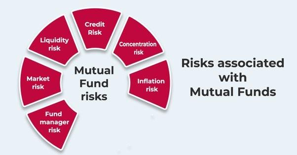

## Table of Contents

## What is mutual fund risk and why is it important to assess?

Mutual fund risk refers to the possibility that you might lose money when you invest in a mutual fund. This risk comes from different places, like changes in the market, the type of investments the fund holds, or even the decisions made by the fund manager. Every mutual fund has some level of risk, and it can be higher or lower depending on what the fund invests in. For example, a fund that invests in stocks is usually riskier than one that invests in bonds.

It's important to assess mutual fund risk because it helps you understand how much money you could lose and whether you're comfortable with that possibility. Knowing the risk level can help you pick the right mutual fund that matches your goals and how much risk you're willing to take. If you don't assess the risk, you might end up investing in a fund that's too risky for you, which could lead to big losses and a lot of stress. By understanding the risk, you can make smarter choices and feel more confident about your investments.

## What are the basic types of risks associated with mutual funds?

Mutual funds come with different types of risks that investors should know about. One type is market risk, which means the value of the fund can go down if the overall market goes down. This can happen because of economic changes, political events, or other big news that affects the market. Another type of risk is interest rate risk, which is important for funds that invest in bonds. If interest rates go up, the value of the bonds in the fund can go down, which means the fund's value can drop too.

There's also credit risk, which happens when the companies or governments that issued the bonds in the fund might not be able to pay back their debts. If they can't pay, the value of the fund can fall. Another risk is [liquidity](/wiki/liquidity-risk-premium) risk, which means it might be hard to sell the investments in the fund quickly without losing money. This can be a problem if a lot of people want to take their money out of the fund at the same time.

Lastly, there's management risk, which comes from the decisions made by the fund manager. If the manager makes bad choices about what to invest in, the fund might not do well. Understanding these risks can help you pick a mutual fund that fits your comfort level with risk and your investment goals.

## How can beginners start assessing the risk of a mutual fund?

Beginners can start assessing the risk of a mutual fund by first looking at the fund's investment objective and strategy. This information is usually found in the fund's prospectus, which is a document that explains what the fund aims to achieve and how it plans to do so. If the fund invests mostly in stocks, it's likely to be riskier than a fund that invests in bonds. You can also check the fund's historical performance, but remember that past performance doesn't guarantee future results. It can give you an idea of how the fund has handled different market conditions in the past.

Another way to assess risk is by looking at the fund's beta, which measures how much the fund's value moves compared to the market as a whole. A beta higher than 1 means the fund is more volatile than the market, while a beta lower than 1 means it's less volatile. You can also look at the fund's standard deviation, which shows how much the fund's returns have varied over time. A higher standard deviation means more risk. Lastly, consider the fund's expense ratio, because higher fees can eat into your returns and add to the overall risk of the investment. By understanding these factors, beginners can get a better sense of the risks involved and choose a mutual fund that fits their comfort level.

## What is standard deviation and how is it used to measure mutual fund risk?

Standard deviation is a way to measure how much the returns of a mutual fund can change over time. Imagine you have a bunch of numbers that show how much money the fund made or lost each year. Standard deviation looks at these numbers and tells you how spread out they are. If the numbers are all over the place, with some years showing big gains and others showing big losses, the standard deviation will be high. This means the fund is pretty risky because its returns can vary a lot.

On the other hand, if the numbers are pretty close together, with the fund making or losing about the same amount each year, the standard deviation will be low. This means the fund is less risky because its returns don't change as much. By looking at the standard deviation, you can get a good idea of how much risk you're taking on when you invest in a mutual fund. A higher standard deviation means more risk, while a lower one means less risk.

## Can you explain beta and its role in evaluating mutual fund risk?

Beta is a number that tells you how much a mutual fund moves up or down compared to the overall market. If a fund has a beta of 1, it means the fund goes up or down at the same rate as the market. But if the beta is higher than 1, like 1.5, the fund will go up or down more than the market. So, if the market goes up by 10%, a fund with a beta of 1.5 might go up by 15%. On the other hand, if the beta is less than 1, like 0.5, the fund will move less than the market. If the market goes up by 10%, a fund with a beta of 0.5 might only go up by 5%.

Beta is really helpful when you want to understand how risky a mutual fund is. A higher beta means the fund is more sensitive to market changes, which makes it riskier. If you're okay with taking more risk, you might choose a fund with a high beta. But if you want something safer, you'd look for a fund with a low beta. By knowing the beta, you can pick a fund that matches how much risk you're willing to take and how the fund might behave when the market goes up or down.

## What is the Sharpe Ratio and how does it help in assessing mutual fund performance relative to risk?

The Sharpe Ratio is a way to see how well a mutual fund is doing compared to the risk it takes. It was made by a guy named William Sharpe. The ratio looks at how much more return the fund gives you than you could get from a safe investment, like a savings account, and then divides that extra return by the risk the fund takes. The risk is measured by something called standard deviation, which shows how much the fund's returns go up and down over time. A higher Sharpe Ratio means the fund is doing a good job of giving you more return for the risk you're taking.

You can use the Sharpe Ratio to compare different mutual funds. If one fund has a higher Sharpe Ratio than another, it means that fund is doing a better job of making money for the amount of risk it's taking. This can help you pick a fund that gives you the best bang for your buck. But remember, the Sharpe Ratio isn't perfect. It's just one tool to help you understand how a fund is doing, and you should look at other things too, like the fund's goals and how it fits with your own investment plans.

## How does the Sortino Ratio differ from the Sharpe Ratio in measuring risk?

The Sortino Ratio is another tool to measure how well a mutual fund is doing, but it looks at risk a bit differently than the Sharpe Ratio. While the Sharpe Ratio considers all kinds of risk, both good and bad, the Sortino Ratio only focuses on the bad risk, or the risk of losing money. It does this by looking at the downside deviation instead of the standard deviation. Downside deviation measures how much the fund's returns fall below a certain level, like the return you expect to get from a safe investment. So, the Sortino Ratio helps you see how much extra return you're getting for the risk of losing money, not just for any kind of risk.

Using the Sortino Ratio can be helpful because it tells you how well a fund is doing when it comes to avoiding losses. If a fund has a high Sortino Ratio, it means it's giving you good returns while keeping the bad risk low. This can be more important for some investors who are more worried about losing money than about the ups and downs of their returns. But like the Sharpe Ratio, the Sortino Ratio is just one way to look at a fund's performance, and you should use it along with other measures to get a full picture of how a mutual fund is doing.

## What are Value at Risk (VaR) models and how are they applied to mutual funds?

Value at Risk, or VaR, is a way to guess how much money you could lose from a mutual fund over a certain time, like a day or a month, with a certain chance, like 5% or 1%. Imagine you have a mutual fund, and you want to know how bad things could get. VaR helps you figure out the worst loss you might see, most of the time. For example, if a fund's VaR is $10,000 at a 5% level over a month, it means there's a 5% chance you could lose $10,000 or more in that month.

VaR models are used by people who manage mutual funds to understand the risks they're taking. They look at things like how the prices of the stocks or bonds in the fund have moved in the past and how they might move in the future. This helps them decide if the risks are okay or if they need to change what the fund invests in. For someone thinking about putting money into a mutual fund, knowing the VaR can help them see how much they might lose and decide if they're okay with that risk.

## How can advanced investors use stress testing to assess mutual fund risk?

Advanced investors can use stress testing to see how a mutual fund might do during really tough times, like a big market crash or a sudden economic problem. Stress testing means imagining a bunch of bad things happening and then checking how the fund would handle it. It's like playing "what if" with the fund's investments to see if they would hold up or fall apart. By doing this, investors can get a better idea of how much risk they're taking on and if the fund can survive the worst-case scenarios.

For example, an investor might run a stress test to see what would happen to the fund if the stock market dropped by 30% in a month. They would look at the fund's investments and see how much they would lose in that situation. This can help them understand if the fund is too risky for them or if it's strong enough to handle big drops in the market. Stress testing isn't perfect, but it gives advanced investors a way to think about risks that other methods might not show.

## What role do duration and convexity play in assessing the risk of bond mutual funds?

Duration and convexity are important when you want to understand the risk of bond mutual funds. Duration tells you how sensitive the fund is to changes in interest rates. If a bond fund has a high duration, its value will go up a lot when interest rates go down, but it will also drop a lot when interest rates go up. So, a high duration means more risk because the fund's value can change a lot with small changes in interest rates. On the other hand, a low duration means the fund's value won't change as much, so it's less risky.

Convexity adds another layer to understanding how bond funds react to [interest rate](/wiki/interest-rate-trading-strategies) changes. It helps to fine-tune the picture that duration gives us. While duration gives a straight-line guess about how bond prices will change, convexity shows that the relationship between bond prices and interest rates isn't always straight. It can curve, meaning that big changes in interest rates might affect the fund's value differently than small changes. By looking at both duration and convexity, investors can get a better idea of how much the value of their bond mutual fund might change with interest rates and make smarter choices about the risks they're willing to take.

## How can factor analysis be utilized to understand the sources of risk in a mutual fund?

Factor analysis is a way to figure out what's making a mutual fund go up or down. It looks at different things, called factors, that can affect the fund's performance. These factors could be things like how the overall market is doing, how big or small the companies in the fund are, or even how much the fund is affected by interest rates. By using [factor](/wiki/factor-investing) analysis, investors can see which of these factors are the most important for the fund's risk and returns. This helps them understand why the fund might be doing well or poorly and what kinds of risks they're taking.

For example, if a mutual fund is heavily affected by the size factor, it means the fund's performance depends a lot on whether small companies or big companies are doing better. If the fund has a lot of small company stocks and small companies are doing well, the fund will likely go up. But if small companies start doing poorly, the fund could go down a lot. By knowing this, investors can see if they're okay with the risks that come from the fund's exposure to different factors. This can help them decide if the fund fits with their own investment goals and how much risk they're willing to take.

## What are some advanced statistical models used by experts to predict mutual fund risk?

Experts use advanced statistical models like Monte Carlo simulations to predict mutual fund risk. A Monte Carlo simulation is like playing out a bunch of different futures for the mutual fund. It takes all the different things that could happen, like changes in the market or interest rates, and runs them over and over again to see all the possible outcomes. This helps experts see not just what might happen, but how likely it is to happen. By looking at all these different paths, they can get a better idea of the risks the fund might face and how much money someone could lose or gain.

Another model experts use is the GARCH model, which stands for Generalized Autoregressive Conditional Heteroskedasticity. This model is really good at looking at how the ups and downs of a mutual fund's returns can change over time. It helps experts understand if the fund's risk is getting bigger or smaller. For example, if the market is getting more unpredictable, the GARCH model can show that the fund's returns might start swinging more wildly. This helps investors and fund managers plan better for the risks they might face and make smarter choices about their investments.

## What are the advancements in financial analysis?

Financial analysis plays a crucial role in mutual funds by providing comprehensive insights into their performance and associated risks. This analytical process involves examining past and current financial data to forecast future trends and make informed investment decisions. In the context of mutual funds, financial analysis is essential for evaluating fund managers' strategies, estimating fund returns, and assessing potential risks.

Technological advancements have significantly improved financial modeling and data analysis methodologies, enhancing the precision and efficiency of mutual fund assessments. With the integration of sophisticated software, fund managers can now process large volumes of financial data rapidly. These technological tools, including [machine learning](/wiki/machine-learning) algorithms and [artificial intelligence](/wiki/ai-artificial-intelligence), enable the identification of trends and patterns that are not immediately obvious through traditional methods. For instance, regression analysis—a statistical process for estimating the relationships among variables—is employed extensively to forecast economic trends that may impact mutual fund performance.

The significance of data analytics in assessing mutual fund performance cannot be overstated. It allows investors and fund managers to employ predictive analytics, which uses historical data and statistical algorithms to predict future outcomes. Through this process, investors can obtain critical insights regarding anticipated fund behavior in varying market conditions. Moreover, data analytics assists in performance measurement by calculating key financial metrics such as the Sharpe Ratio, which indicates the risk-adjusted return of a mutual fund. The formula for the Sharpe Ratio is:

$$
\text{Sharpe Ratio} = \frac{R_p - R_f}{\sigma_p}
$$

where $R_p$ is the return of the portfolio, $R_f$ is the risk-free rate, and $\sigma_p$ is the standard deviation of the portfolio return.

Several case studies highlight the effectiveness of advanced financial analysis in mutual fund management. One notable example is the use of sentiment analysis to predict market trends and fund performance. By analyzing the sentiment of news articles and social media commentary, fund managers can gain insights into market sentiment that could affect mutual fund valuations. Another case involves the implementation of big data analytics in assessing economic indicators such as GDP growth rates, unemployment rates, and inflation, which can affect mutual fund performance. These case studies demonstrate that by embracing advanced financial analysis tools, mutual fund managers can enhance decision-making processes, reduce risk, and optimize returns.

Overall, advancements in financial analysis have revolutionized the mutual fund industry, allowing for more accurate and comprehensive evaluations of fund performance and potential risks. This progress underscores the need for investors and fund managers to remain continually informed about technological developments to maintain a competitive edge in the market.

## References & Further Reading

[1]: Bergstra, J., Bardenet, R., Bengio, Y., & Kégl, B. (2011). ["Algorithms for Hyper-Parameter Optimization."](https://papers.nips.cc/paper/4443-algorithms-for-hyper-parameter-optimization) Advances in Neural Information Processing Systems 24.

[2]: ["Advances in Financial Machine Learning"](https://www.amazon.com/Advances-Financial-Machine-Learning-Marcos/dp/1119482089) by Marcos Lopez de Prado

[3]: ["Evidence-Based Technical Analysis: Applying the Scientific Method and Statistical Inference to Trading Signals"](https://www.amazon.com/Evidence-Based-Technical-Analysis-Scientific-Statistical/dp/0470008741) by David Aronson

[4]: ["Machine Learning for Algorithmic Trading"](https://github.com/stefan-jansen/machine-learning-for-trading) by Stefan Jansen

[5]: ["Quantitative Trading: How to Build Your Own Algorithmic Trading Business"](https://www.amazon.com/Quantitative-Trading-Build-Algorithmic-Business/dp/1119800064) by Ernest P. Chan