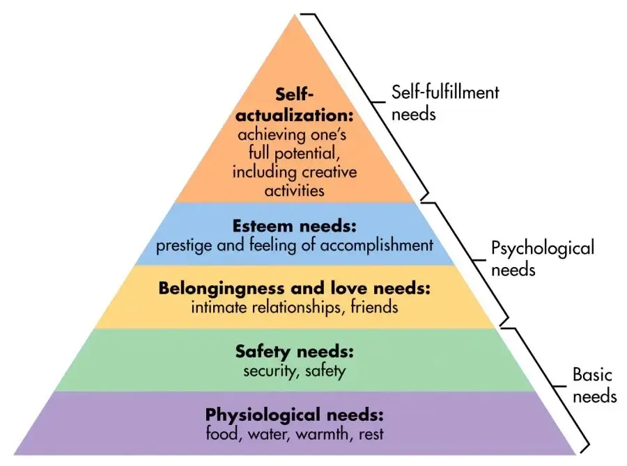

## Table of Contents

## What is behavioral modeling in the context of consumer behavior?

Behavioral modeling in the context of consumer behavior is a way to understand and predict how people will act when they buy things. It looks at what people do, not just what they say they will do. By studying patterns in how people shop, companies can figure out what makes someone more likely to buy a product. This helps businesses make better decisions about how to sell their products and what to sell.

For example, if a company sees that people often buy snacks and drinks together, they might decide to put these items close to each other in the store. Or, if they notice that people buy more during certain times of the year, they can plan special sales or promotions for those times. Behavioral modeling uses data from things like past purchases, loyalty cards, and online shopping habits to make these predictions. This helps companies meet the needs of their customers better and make more money.

## Why is it important to analyze consumer behavior using behavioral modeling?

Analyzing consumer behavior using behavioral modeling is important because it helps businesses understand their customers better. When companies know what their customers like and how they shop, they can make better decisions. For example, they can change how they set up their stores, what products they offer, and how they advertise. This can lead to happier customers who keep coming back, and more sales for the business.

Behavioral modeling also helps companies predict future trends. By looking at patterns in what people buy and when they buy it, businesses can plan ahead. They might see that certain products sell more during holidays, so they can stock up on those items and run special promotions. This kind of planning can help a company stay ahead of its competitors and make more money. In the end, understanding consumer behavior through behavioral modeling helps businesses grow and succeed.

## What are the basic principles behind behavioral modeling techniques?

Behavioral modeling techniques are based on the idea that you can understand and predict how people will act by looking at what they have done in the past. This means collecting a lot of data about what people buy, when they buy it, and how they buy it. By studying this data, companies can find patterns and trends. For example, they might see that people buy more ice cream in the summer, or that people who buy coffee also often buy pastries. These patterns help companies make guesses about what people will do next.

Another important principle is that behavior is influenced by many things, like a person's habits, the environment around them, and even their feelings at the time. Behavioral modeling tries to take all these things into account. For example, if a store is busy, people might buy things more quickly and not think as much about their choices. Or, if someone is in a good mood, they might be more likely to buy something they don't really need. By understanding these influences, companies can change how they sell things to make people more likely to buy.

## Can you explain the difference between descriptive and predictive behavioral modeling?

Descriptive behavioral modeling is like looking at a picture of the past. It helps businesses see what people have done before. For example, it can show what products people bought last month or which items are popular at certain times of the year. By looking at this data, companies can understand their customers better and see patterns in how they shop. It's like putting together a puzzle to see the whole picture of what has happened.

Predictive behavioral modeling is like trying to guess the future. It uses the patterns found in descriptive modeling to make guesses about what people will do next. For example, if a company sees that people buy more ice cream in the summer, they might predict that next summer will be the same. They can use this information to plan ahead, like stocking up on ice cream or running special summer sales. It's like using a weather forecast to decide if you need an umbrella tomorrow.

## What are some common data sources used in behavioral modeling for consumer analysis?

Behavioral modeling for consumer analysis uses different kinds of data to understand how people shop. Some common sources are sales records, which show what people have bought in the past. Loyalty card data is also useful because it tracks what individual customers buy over time. Online shopping data, like what people look at and add to their carts on a website, gives more information about their habits. Even social media activity can help, because it shows what people like and talk about.

Another important source is customer surveys and feedback. These can tell companies why people buy certain things or what they think about different products. Store traffic data, which tracks how many people come into a store and where they go inside, also helps. All these different pieces of data together give a full picture of how people shop and what they like. By looking at all this information, companies can make better guesses about what people will do next.

## How do you collect and prepare data for behavioral modeling?

To collect data for behavioral modeling, companies gather information from many places. They look at sales records to see what people have bought before. They also use loyalty card data, which shows what individual customers buy over time. Online shopping data, like what people look at and add to their carts on a website, is another source. Social media activity can also help, because it shows what people like and talk about. Companies might even use customer surveys and feedback to understand why people buy certain things. All these pieces of information help create a detailed picture of how people shop.

Once the data is collected, it needs to be prepared for analysis. This means cleaning the data to make sure it's accurate and complete. For example, if some sales records are missing, they need to be fixed or removed. The data also needs to be organized in a way that makes it easy to study. This might mean putting all the information into a special computer program that can look for patterns. Sometimes, the data needs to be changed into numbers or categories that the program can understand better. After it's all prepared, the data is ready to be used for behavioral modeling to understand and predict consumer behavior.

## What are the most popular methods of behavioral modeling used in consumer behavior analysis?

One of the most popular methods of behavioral modeling in consumer behavior analysis is the use of decision trees. Decision trees help businesses understand the choices people make when they buy things. They work by breaking down decisions into smaller steps and showing how different factors, like price or brand, can affect what people choose. For example, a decision tree might show that people are more likely to buy a product if it's on sale, or if it has good reviews. By using decision trees, companies can see the paths people take when they shop and predict what they might do next.

Another common method is cluster analysis. This method groups people together based on how they act when they shop. For example, some people might always buy healthy food, while others might buy a lot of snacks. By putting people into these groups, or clusters, companies can understand different types of shoppers better. They can then make special offers or change their stores to fit what each group likes. Cluster analysis helps businesses see the different ways people shop and plan how to meet their needs.

A third popular method is regression analysis. This method looks at how different things, like price or advertising, affect what people buy. It uses numbers to show how strong these effects are. For example, regression analysis might show that a small change in price can lead to a big change in how many people buy a product. By understanding these relationships, companies can make smart choices about how to price their products or where to spend their advertising money. Regression analysis helps businesses see how to influence what people buy.

## Can you describe how machine learning algorithms are applied in behavioral modeling?

Machine learning algorithms are used in behavioral modeling to help understand and predict what people will do when they shop. These algorithms look at lots of data, like what people have bought before, what they look at online, and even what they say on social media. By studying this data, the algorithms can find patterns and make guesses about what people will do next. For example, if a [machine learning](/wiki/machine-learning) algorithm sees that people often buy snacks and drinks together, it might predict that someone who buys a snack will also want a drink. This helps businesses plan how to set up their stores or what products to offer.

One way machine learning is used in behavioral modeling is through a method called supervised learning. In this method, the algorithm is given examples of what people have done before, along with what happened next. It uses these examples to learn how to make predictions. For example, if the algorithm sees that people often buy more during holidays, it can predict that next year's holidays will be the same. Another way is through unsupervised learning, where the algorithm looks for patterns in the data without being told what to look for. This can help find new groups of customers or new trends in shopping behavior. Both methods help businesses make better decisions and meet their customers' needs.

## What are the challenges faced when implementing behavioral modeling for consumer behavior?

Implementing behavioral modeling for consumer behavior can be tough because it needs a lot of data. Companies have to collect information from many places, like sales records, loyalty cards, and online shopping habits. This data must be clean and correct, which takes a lot of work. If the data is wrong or missing, the models won't work well. Also, keeping people's information safe is very important. Companies have to follow rules about data privacy, which can make things even harder.

Another challenge is that people's behavior can change over time. What works today might not work tomorrow. This means companies have to keep updating their models to stay accurate. It's like trying to hit a moving target. Also, the models can be hard to understand. They might give good predictions, but it can be tough to explain why they work. This can make it hard for companies to trust the models and use them to make decisions.

## How do you validate and test the accuracy of behavioral models?

To make sure behavioral models are working right, companies use something called validation. This means they check the model by using data it hasn't seen before. They split their data into two parts: one part to build the model, and another part to test it. If the model can predict what people will do with the new data, it's a good sign that it's accurate. Sometimes, they also use a third set of data to do a final check, just to be sure.

Testing the accuracy of these models is important too. Companies look at how often the model's guesses are right. They use numbers like "accuracy rate" to see how well the model works. If the model is wrong a lot, they might need to change it or collect more data. It's a bit like checking if a weather forecast is right most of the time. If it's not, you wouldn't trust it to plan your day.

## What advanced techniques can enhance the effectiveness of behavioral modeling in consumer analysis?

One advanced technique to make behavioral modeling better is using something called [deep learning](/wiki/deep-learning). Deep learning is a kind of machine learning that can find really complex patterns in data. It's like having a super smart computer that can learn from lots of different information at the same time. For example, it can look at what people buy, what they look at online, and even what they say on social media all at once. This helps companies understand their customers in a much deeper way and make more accurate predictions about what they will do next.

Another technique is using real-time data. Instead of just looking at what people did in the past, companies can see what they are doing right now. This means they can change their models and plans much faster. For example, if a company sees that people are suddenly buying more of a certain product, they can quickly put that product on sale or move it to a better spot in the store. Using real-time data helps companies stay up to date with what their customers want and make quick decisions to meet those needs.

## How can behavioral modeling results be integrated into marketing strategies to influence consumer behavior?

Behavioral modeling results can help companies make their marketing strategies better by understanding what people like and how they shop. If a company sees that people often buy snacks and drinks together, they can put these items close to each other in the store. They can also make special deals for these items to get more people to buy them. By knowing what people want, companies can make ads that show the right products to the right people. For example, if the model shows that young people like a certain brand of shoes, the company can show ads for those shoes on websites that young people visit a lot.

Using behavioral modeling can also help companies plan sales and promotions at the best times. If the model shows that people buy more during certain holidays, the company can plan big sales for those times. They can also send emails or text messages to customers to remind them about the sale. This way, more people will know about it and might come to the store. By using what they learn from behavioral modeling, companies can make their customers happier and sell more products.

## References & Further Reading

[1]: Bergstra, J., Bardenet, R., Bengio, Y., & Kégl, B. (2011). ["Algorithms for Hyper-Parameter Optimization."](https://proceedings.neurips.cc/paper/2011/file/86e8f7ab32cfd12577bc2619bc635690-Paper.pdf) Advances in Neural Information Processing Systems 24.

[2]: ["Advances in Financial Machine Learning"](https://www.amazon.com/Advances-Financial-Machine-Learning-Marcos/dp/1119482089) by Marcos Lopez de Prado

[3]: ["Evidence-Based Technical Analysis: Applying the Scientific Method and Statistical Inference to Trading Signals"](https://www.amazon.com/Evidence-Based-Technical-Analysis-Scientific-Statistical/dp/0470008741) by David Aronson

[4]: ["Machine Learning for Algorithmic Trading"](https://github.com/PacktPublishing/Machine-Learning-for-Algorithmic-Trading-Second-Edition) by Stefan Jansen

[5]: ["Quantitative Trading: How to Build Your Own Algorithmic Trading Business"](https://www.amazon.com/Quantitative-Trading-Build-Algorithmic-Business/dp/1119800064) by Ernest P. Chan