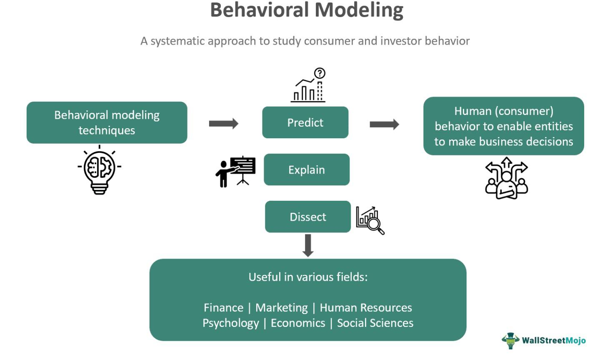

In the rapidly evolving digital economy, understanding consumer behavior is pivotal for businesses aiming to sustain a competitive edge. As technology advances, companies increasingly rely on sophisticated methods to interpret consumer actions, with behavioral modeling and algorithmic trading emerging as essential tools in this context. Behavioral modeling allows businesses to analyze complex data patterns, providing insights that drive strategic decision-making. By employing statistical and machine learning techniques, companies can anticipate consumer needs and enhance the precision of their marketing strategies.

Algorithmic trading, on the other hand, leverages these behavioral insights to optimize financial strategies. It uses computer programs to execute trades automatically, based on predetermined criteria. This approach reduces human error and allows for rapid decision-making, making it a critical component in modern financial markets.



Businesses today focus on integrating consumer analysis within their operational models to predict future consumer actions accurately. This involves understanding the multifaceted nature of consumer behavior, which includes psychological, social, and economic influences. With the rise of big data and analytical tools, companies can now process and analyze vast amounts of information, gaining nuanced insights that were previously unattainable.

The significance of these methods extends beyond mere prediction; they are instrumental in optimizing the allocation of resources, enhancing customer satisfaction, and improving the overall effectiveness of business operations. As data analytics and algorithmic trading continue to evolve, their role in interpreting consumer behavior and shaping the financial landscape becomes increasingly pronounced, offering businesses the opportunity to harness these insights for tangible competitive advantages.

## Table of Contents

## Understanding Consumer Analysis

Consumer analysis involves a comprehensive examination of consumer preferences, purchasing patterns, and behaviors. This analytical practice provides essential insights that allow businesses to segment markets effectively, thus enabling them to tailor their products and marketing strategies to align with consumer needs. Through this process, companies can enhance their engagement with customers and improve their market positioning.

A primary component of consumer analysis is data collection. Methods such as surveys, focus groups, and digital analytics tools gather quantitative and qualitative data about consumers. For instance, web analytics tools track user interactions and behaviors on websites, offering insights into consumer preferences and trends. Social media analytics also play a significant role by evaluating sentiment and engagement, helping businesses capture real-time consumer feedback and adjust strategies accordingly.

Once data is collected, the interpretation phase begins, involving statistical and computational methods to draw meaningful conclusions about consumer behavior. Techniques such as cluster analysis allow businesses to identify distinct consumer segments based on shared characteristics, enabling more targeted marketing efforts. For example, Python libraries like `pandas` and `scikit-learn` are frequently used to perform data analysis and [machine learning](/wiki/machine-learning) modeling to segment consumer data efficiently.

```python
import pandas as pd
from sklearn.cluster import KMeans

# Example of clustering consumer data
data = pd.read_csv('consumer_data.csv')
kmeans = KMeans(n_clusters=3)
kmeans.fit(data)
data['Segment'] = kmeans.labels_
```

Consumer analysis extends beyond simple segmentation by exploring deeper patterns and correlations in consumer behavior. Advanced algorithms, such as those used in predictive analytics, help forecast future purchasing behaviors and trends, allowing businesses to refine their financial strategies accordingly. These algorithms use historical data to predict future outcomes, enabling proactive decision-making.

A detailed understanding of consumer behavior, preferences, and purchasing patterns facilitates the development of effective marketing campaigns and financial strategies. By accurately predicting consumer needs, companies can optimize their product offerings and promotional efforts, enhancing both customer satisfaction and business performance. As consumer analysis tools and methodologies continue to evolve, they offer increasingly precise insights that drive strategic success in competitive markets.

## Consumer Behavior: Key Insights

Consumer behavior is a multifaceted field that explores the psychological, social, and economic dimensions influencing individuals' purchasing decisions. At its core, consumer behavior seeks to understand how and why people choose certain products or services over others, offering invaluable insights for businesses and marketers.

### Psychological Factors

Psychological elements play a significant role in shaping consumer behavior. These include perception, motivation, beliefs, and attitudes, which collectively influence consumer choices. Perception, for example, involves how consumers interpret information and form perceptions about products based on inputs such as advertisements and brand reputation. Motivation, often driven by needs and desires, dictates the intensity and direction of consumer actions. Maslow's Hierarchy of Needs, which categorizes human needs into physiological, safety, love, esteem, and self-actualization, is frequently cited in understanding consumer motivation.

### Social Factors

Social influences are equally critical in determining consumer behavior. These include family, friends, and societal norms, which exert considerable pressure on individual choices. For instance, the opinions of reference groups—people who significantly influence an individual's evaluations and behaviors—can sway consumer decisions, highlighting the social nature of consumption. Additionally, cultural context shapes consumer behavior profoundly. Culture encompasses shared beliefs, values, and customs that define a society's consumption norms. Companies aiming for international expansion must consider cultural nuances to tailor their products to local preferences effectively.

### Economic Factors

Economic conditions are another pivotal component affecting consumer behavior. These involve consumers' economic situations, encompassing income levels, economic outlook, and purchasing power. In favorable economic conditions, consumers are likely to spend more on discretionary items, whereas, in economic downturns, they prioritize essential goods. The price elasticity of demand, which measures consumers' responsiveness to price changes, is a fundamental concept in assessing economic factors' influence on consumer behavior.

### Models and Theories

Various models and theories have been developed to explain consumer decision-making processes. The Theory of Planned Behavior posits that intention, shaped by attitudes, subjective norms, and perceived behavioral control, predicts consumer actions. The Consumer Decision-Making Process model delineates several stages, including problem recognition, information search, evaluation of alternatives, purchase decision, and post-purchase behavior, illustrating the complex nature of consumer choices.

Understanding consumer behavior allows companies to anticipate market trends accurately and cater to consumer needs more effectively. By analyzing cultural influences, personal preferences, and economic conditions, businesses can refine their marketing strategies, enhancing customer satisfaction and loyalty.

## Behavioral Modeling in Financial Markets

Behavioral modeling plays a significant role in understanding and forecasting consumer actions within financial markets. By leveraging data from consumer spending patterns, companies have developed sophisticated models to interpret and predict market behavior, enhancing their trading strategies.

Central to behavioral modeling is the analysis of extensive datasets that capture consumer transactions and preferences. Companies utilize this information to generate predictions about future market trends. Techniques such as regression analysis, time-series analysis, and machine learning algorithms are fundamental tools in this context. For instance, regression analysis, which explores the relationship between dependent and independent variables, can provide insights into how specific consumer behaviors might impact financial market outcomes.

Advancements in data analytics and machine learning have refined these behavioral models, enhancing their accuracy. Machine learning algorithms, particularly [deep learning](/wiki/deep-learning) models, are adept at recognizing complex patterns and relationships within large datasets. These algorithms can incorporate various input features, such as historical spending data and macroeconomic variables, to make robust predictions. For example, a typical machine learning model for predicting consumer spending behavior might be based on features such as consumer income, employment status, and credit card activity.

```python
import numpy as np
from sklearn.model_selection import train_test_split
from sklearn.ensemble import RandomForestRegressor
from sklearn.metrics import mean_squared_error

# Sample data: consumer features - income, employment_status, credit_card_activity
X = np.array([[50000, 1, 0.3], [60000, 0, 0.6], [55000, 1, 0.5], ...])
# Target: consumer spending
y = np.array([1500, 2000, 1800, ...])

# Splitting data into training and test sets
X_train, X_test, y_train, y_test = train_test_split(X, y, test_size=0.2, random_state=42)

# Creating and training the model
model = RandomForestRegressor(n_estimators=100, random_state=42)
model.fit(X_train, y_train)

# Making predictions
y_pred = model.predict(X_test)

# Evaluating the model
mse = mean_squared_error(y_test, y_pred)
print(f"Mean Squared Error: {mse}")
```

The integration of behavioral modeling with financial technologies has greatly enhanced trading strategies. Financial markets benefit from these predictive models by reducing uncertainty and optimizing trade decisions. Algorithmic trading systems, which execute trades based on pre-programmed instructions, now incorporate behavioral insights to adjust trading tactics more accurately. This integration helps improve decision-making processes and fine-tune portfolio management strategies.

Overall, the synergy between behavioral modeling and advanced financial technologies offers more precise predictions and efficient market operations, driving significant improvements in trading strategy execution. This continuous innovation fosters a more adaptive approach to understanding and anticipating market dynamics, ensuring companies remain competitive and responsive to consumer trends.

## Algorithmic Trading and Its Impact

Algorithmic trading relies on sophisticated computer algorithms to execute trading decisions autonomously in financial markets. Utilizing substantial data sets and complex algorithms, this method has revolutionized the trading landscape by introducing unprecedented levels of precision and speed. By using these algorithms, traders can systematically analyze a myriad of variables to make informed decisions, enabling the processing of large volumes of data in real time. This process significantly diminishes human intervention, thereby minimizing human error and reducing the latency associated with manual trading processes.

Integrating behavioral insights into [algorithmic trading](/wiki/algorithmic-trading) involves harnessing data from consumer activities and market sentiment to improve decision-making and portfolio management. Behavioral insights provide a deeper understanding of market dynamics and consumer preferences, contributing to the development of more sophisticated algorithms. By considering factors such as economic indicators, news sentiment, and consumer trends, algorithms can be tailored to recognize favorable trading conditions or potential risks, ultimately optimizing trading strategies.

The impact of algorithmic trading on market efficiency is noteworthy. Proponents argue that algorithmic trading enhances efficiency by facilitating rapid trade executions and increasing [liquidity](/wiki/liquidity-risk-premium). These elements reduce the bid-ask spread, resulting in more efficient price discovery. However, critics highlight potential drawbacks, such as increased market [volatility](/wiki/volatility-trading-strategies) and reliance on complex systems that may be prone to technical glitches or flash crashes, instances where assets experience rapid price declines and recoveries in a very short time. The 2010 Flash Crash is a notable example where algorithmic trading significantly impacted market volatility.

Moreover, algorithmic trading enables high-frequency trading ([HFT](/wiki/high-frequency-trading-strategies)), where algorithms execute millions of transactions in fractions of a second. This capacity for rapid data processing can also lead to systemic risks, particularly if algorithms are misprogrammed or react unexpectedly to unforeseen market events. To mitigate these risks, regulatory frameworks and robust compliance protocols are necessary to monitor trading activities and maintain market stability.

Integrating behavioral insights into algorithmic trading not only enhances the precision of automated trades but also generates a comprehensive analysis of market trends. By continuously refining algorithms with advanced data analytics, including machine learning models, trading systems can self-optimize. Here's a Python snippet illustrating a simple moving average crossover strategy, a fundamental algorithmic trading concept:

```python
import numpy as np
import pandas as pd

def moving_average(data, window_size):
    return data.rolling(window=window_size).mean()

# Simulated price data
price_data = pd.Series(np.random.randn(100).cumsum())

# Calculate short and long moving averages
short_window = 10
long_window = 50

short_ma = moving_average(price_data, short_window)
long_ma = moving_average(price_data, long_window)

# Generate signals
signal = np.where(short_ma > long_ma, 1, 0)

# Print the signal
print(signal)
```

This code calculates short and long moving averages of price data to generate buy (1) or sell (0) signals, mimicking a basic strategy without the inclusion of behavioral insights. In practice, algorithms incorporate complex variables, including transaction costs, market sentiment, and historical consumer data, ensuring comprehensive trading strategies. As technology continues to evolve, the integration of behavioral insights into algorithmic trading systems will likely play an increasingly pivotal role in achieving market advantages, promoting further innovations in predictive analytics and automated portfolio management.

## Case Studies and Applications

In the context of consumer analysis and behavioral modeling, real-world applications provide critical insights into how these methodologies enhance business outcomes. This section outlines several case studies from retail and financial services, showcasing the practical implementation of these techniques.

### Retail Sector

A notable example in the retail industry is the use of consumer behavior insights to optimize in-store layout and product placement. A leading global retailer employed advanced data analytics to study customer movement and purchasing habits within their stores. By analyzing heat maps of foot traffic and correlating them with sales data, the retailer identified high-traffic areas and strategically placed high-margin products in these locations. The outcome was a measurable increase in sales [volume](/wiki/volume-trading-strategy) and customer satisfaction, as the product placements aligned with consumer shopping behaviors.

Additionally, predictive modeling was applied to manage inventory more efficiently. By harnessing historical sales data and external factors such as seasonality and regional events, the retailer developed a dynamic stock replenishment system. This system reduced overstock and stockouts, optimizing supply chain operations and enhancing overall profitability.

### Financial Services

In the financial services sector, behavioral modeling has significantly influenced investment strategies. A prominent investment firm utilized consumer spending data to refine their stock selection process. By employing sophisticated algorithms that analyzed transaction data, the firm identified emerging consumer trends before they became evident in typical financial indicators. This proactive approach allowed them to capitalize on investment opportunities earlier and adjust portfolios to mitigate risks associated with declining sectors.

Algorithmic trading systems also integrated behavioral insights to improve trade execution. By understanding patterns in consumer behavior, the trading algorithms adjusted their strategies in response to anticipated market movements. This adaptability resulted in higher returns and lower volatility in investment portfolios.

### Lessons and Strategic Insights

From these case studies, businesses can derive several strategic insights:

1. **Data-Driven Decision Making:** Both sectors highlight the importance of leveraging consumer data in making informed decisions. By understanding customer behavior, businesses can tailor their strategies to better meet consumer needs, leading to enhanced customer satisfaction and loyalty.

2. **Predictive Analytics for Proactive Strategies:** Utilizing predictive models enables companies to anticipate changes and act proactively rather than reactively. This foresight is crucial for maintaining a competitive edge in dynamic markets.

3. **Continuous Improvement and Adaptation:** The successful applications underscore the need for continuous monitoring and adaptation. As consumer preferences evolve, so must the strategies and models that businesses employ.

These case studies demonstrate how consumer analysis and behavioral modeling translate theoretical concepts into tangible business benefits, offering a blueprint for other organizations aiming to optimize their strategic and operational goals.

## Challenges and Future Trends

In the field of consumer analysis and algorithmic trading, several challenges hinder optimal implementation despite their considerable benefits. One prominent issue is data privacy. With the increasing availability of consumer data, safeguarding this information while adhering to stringent regulatory frameworks like GDPR is crucial. Businesses must implement robust data protection measures, anonymization techniques, and adopt privacy-preserving technologies such as differential privacy to mitigate risks.

Ethical considerations also present substantial challenges. The use of behavioral data can lead to ethical dilemmas, particularly when algorithms make decisions that affect consumer preferences or financial outcomes. Transparent algorithms that ensure fair decision-making processes and reduce biases are essential to maintaining ethical standards. Implementing regular audits and establishing ethical guidelines can aid companies in navigating these concerns.

Model accuracy remains a persistent challenge, as predictive models in consumer behavior and financial markets can be subject to data quality issues and overfitting. Employing advanced machine learning techniques, such as ensemble learning or deep learning, can enhance model robustness and accuracy. Continual validation with new data sets is necessary to ensure the models remain representative of real-world scenarios.

Emerging technologies are reshaping the future of consumer analysis and algorithmic trading. Artificial intelligence (AI) and machine learning are pivotal in processing vast data sets and uncovering patterns that human analysts may overlook. Quantum computing, though in its nascent stages, holds the potential to solve complex problems faster than classical computers, which could revolutionize both consumer analysis and transaction processing.

Blockchain technology is another development poised to impact these fields significantly. In addition to enhancing transparency and security in trading, blockchain can facilitate seamless and secure data sharing between entities while preserving consumer privacy.

To prepare for these evolving trends, businesses should invest in upskilling their workforce in AI and data science, adopting a forward-thinking approach to technology integration. Collaborating with technology providers and participating in industry consortiums can help organizations stay at the forefront of innovation.

Adapting to these trends requires a commitment to balancing technological advancements with ethical responsibilities and privacy concerns. Businesses that effectively navigate these challenges and embrace future technologies will not only enhance their strategic capabilities but also pave the way for sustainable growth and competitive advantage in the market.

## Conclusion

Understanding consumer behavior through analysis and behavioral modeling is vital for effectively leveraging algorithmic trading. These methodologies allow businesses to translate complex consumer data into actionable insights, which can significantly optimize trading strategies and maximize returns. As technological advancements continue, the methods for analyzing consumer behavior and constructing behavioral models are anticipated to progress, offering more precise and valuable market insights.

Algorithmic trading, which relies heavily on these insights, benefits greatly from enhancements in data collection techniques, machine learning algorithms, and computational power. The integration of consumer behavior analysis strengthens the ability of trading strategies to predict and adapt to market fluctuations. For instance, algorithms informed by consumer sentiment and spending patterns can dynamically adjust portfolio allocations for better risk management and return on investment.

As competition intensifies in global markets, businesses that effectively utilize consumer behavior insights and behavioral modeling in their algorithmic strategies will gain significant advantages. This capability allows them to execute trades with higher accuracy, reduce exposure to volatility, and ultimately capture more opportunities than those relying on traditional methods.

The synergy between consumer behavior insights and algorithmic trading is a key driver of success in today's economy. Firms that integrate these disciplines are better positioned to navigate the complexities of modern financial markets and capitalize on emerging trends, ensuring sustained growth and competitive excellence. Emphasizing the importance of continuous adaptation and innovation will further solidify their position in a rapidly evolving digital landscape.

## References & Further Reading

[1]: Bergstra, J., Bardenet, R., Bengio, Y., & Kégl, B. (2011). ["Algorithms for Hyper-Parameter Optimization."](https://proceedings.neurips.cc/paper/2011/file/86e8f7ab32cfd12577bc2619bc635690-Paper.pdf) Advances in Neural Information Processing Systems 24.

[2]: ["Advances in Financial Machine Learning"](https://www.amazon.com/Advances-Financial-Machine-Learning-Marcos/dp/1119482089) by Marcos Lopez de Prado

[3]: ["Evidence-Based Technical Analysis: Applying the Scientific Method and Statistical Inference to Trading Signals"](https://www.amazon.com/Evidence-Based-Technical-Analysis-Scientific-Statistical/dp/0470008741) by David Aronson

[4]: ["Machine Learning for Algorithmic Trading"](https://github.com/PacktPublishing/Machine-Learning-for-Algorithmic-Trading-Second-Edition) by Stefan Jansen

[5]: ["Quantitative Trading: How to Build Your Own Algorithmic Trading Business"](https://www.amazon.com/Quantitative-Trading-Build-Algorithmic-Business/dp/1119800064) by Ernest P. Chan