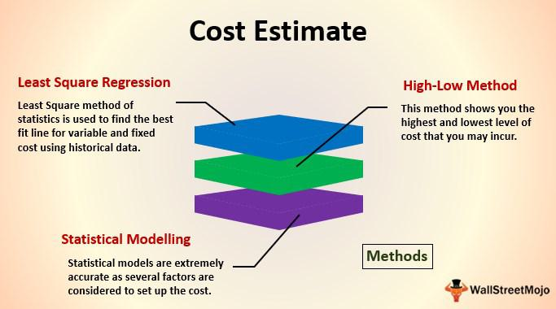

In the evolving world of finance, the role of financial advisors is undergoing significant transformation. The integration of technology, especially algorithmic trading, is reshaping the landscape of financial planning. Algorithmic trading, or algo trading, utilizes advanced computer systems to execute buying and selling decisions based on pre-set rules, removing much of the manual intervention traditionally associated with trading activities. This technological advancement is creating a dynamic shift in how financial advisors approach the management of their clients' investments.

The traditional role of financial advisors involves guiding clients through various personal finance challenges, investment strategies, and retirement planning. However, with the advent of sophisticated digital tools and technologies, advisors are being pushed to integrate these innovations into their practices to enhance efficiency in portfolio management. This represents a significant shift from relying solely on human judgment to leveraging machine-driven insights.



For financial advisors and their clients, understanding these technological changes is crucial to staying ahead in the financial game. By embracing these evolving tools, advisors can improve service offerings, optimize trading strategies, and mitigate human error, leading to more effective financial planning and improved client outcomes. This article will explore the transition faced by financial advisors as they adapt to these transformative forces, highlighting the importance of balancing cutting-edge innovations with personalized advisory services to succeed in the modern financial industry.

## Table of Contents

## The Role of Financial Advisors in Modern Financial Planning

Financial advisors serve as crucial navigators in their clients' journeys through the complexities of personal finance, strategic investments, and retirement planning. Their role has traditionally involved crafting tailored financial plans, offering expert advice, and helping clients make informed decisions. However, in the current financial climate, there's a significant transformation in how these advisors operate.

One of the most profound changes is the inclusion of innovative digital tools for efficient portfolio management. With the advent of technology, financial advisors are now equipped with sophisticated software that can analyze market trends, assess risks, and optimize investment strategies with unprecedented precision. This technological advancement allows advisors to provide more personalized and effective advice, catering to individual client needs more accurately.

Moreover, the emergence of technologies such as [artificial intelligence](/wiki/ai-artificial-intelligence) and machine learning is reshaping the advisory landscape. Financial advisors are now expected to adopt these tools not just for analysis but for predictive insights, enabling clients to better position their portfolios against market volatilities. This shift requires advisors to become adept at both understanding and explaining complex data-driven models to clients.

The integration of digital platforms also facilitates broader financial goal achievements for clients. Advisors can now offer seamless access to financial services through apps and online platforms, enabling clients to track their investments, receive updates, and even execute trades with ease. This connectivity improves client engagement and satisfaction, cementing the advisor-client relationship in a more interactive and transparent environment.

Overall, the evolving role of financial advisors in modern financial planning encompasses a blend of traditional advisory proficiency with contemporary digital capabilities. This transformation is not only enhancing the efficiency of advisors but is also expanding the horizon of possibilities for achieving client financial objectives.

## Transitioning to Algorithmic Trading

Algorithmic trading applies complex computer algorithms to automate trading processes. These systems execute orders based on pre-set parameters, which minimizes manual intervention and enhances the speed and accuracy of trading operations. This transition presents financial advisors with the opportunity to embrace cutting-edge technology, thus requiring a detailed understanding of sophisticated trading platforms and the algorithms that power them.

For financial advisors, adapting to algo trading involves equipping themselves with knowledge beyond traditional market dynamics. The process necessitates familiarity with advanced trading software and platforms that facilitate algorithmic operations. These platforms typically integrate real-time market data analysis, enabling quick decision-making based on specific algorithmic rules. Algorithms analyze various market conditions, employing quantitative models that include statistical, technical, and even [machine learning](/wiki/machine-learning)-based approaches to predict favorable trading opportunities. 

For example, an algorithm might be designed to automatically execute a buy order for a stock if its 50-day moving average crosses above its 200-day moving average, which is often considered a bullish signal. Implementing such automated strategies mitigates the risk of human error and psychological factors that may influence decision-making. This hands-off approach allows for high-frequency trading, where large volumes of trades occur in fractions of a second, optimizing strategies that would be impractical manually due to sheer speed and data processing demands.

The benefits of [algorithmic trading](/wiki/algorithmic-trading) are multifaceted. Efficiency is significantly boosted, as algorithms can process vast amounts of data much faster than a human trader. Other advantages include increased transaction speed, reduced costs, and the potential to identify and capitalize on favorable markets more swiftly. Additionally, algorithmic systems can back-test strategies on historical data to optimize performance before executing them in live markets.

Financial advisors, therefore, need to possess a technical understanding of these systems, which can often be intricate and mathematically intensive. This might involve basic proficiency in programming languages such as Python, which is frequently used to develop and customize trading algorithms. Libraries like Pandas for data analysis, NumPy for numerical operations, and libraries such as TA-Lib or PyAlgoTrade, can be instrumental in developing trading strategies.

On the whole, the transition to algorithmic trading represents a significant evolution in financial markets and advisory services. By integrating these technologies, financial advisors can enhance their service offering, enabling them to provide clients with more strategic, data-driven insights and portfolio management solutions. Adapting to this method of trading is not only a competitive advantage but is becoming increasingly essential in a technology-driven financial landscape.

## Challenges in Adopting Digital Transition Tools

In the current financial landscape, technological advancements are occurring at an unprecedented pace, fundamentally altering the tools and methodologies used by financial advisors. Staying updated with these rapid developments presents a significant challenge. The advent of algorithmic trading and digital management platforms requires advisors to continuously educate themselves about new software, APIs, and trading algorithms to remain competitive and relevant in their field. This necessity for ongoing learning can be daunting, especially for those accustomed to traditional methods of financial planning.

A critical aspect that financial advisors face is balancing the adoption of these new technologies while preserving strong personal relationships with clients. Clients often seek financial advisors for their personalized touch, insights, and human understanding, which cannot be wholly replicated by machines. Therefore, advisors must find a way to integrate digital tools in a manner that enhances, rather than detracts from, their client interactions. This might involve using technology to streamline routine processes, thus freeing up more time for personalized client engagement and bespoke financial advice.

Another formidable challenge is ensuring data security and compliance with regulatory standards. With the growing reliance on digital platforms, safeguarding sensitive client information against cyber threats becomes paramount. Financial advisors must employ robust encryption methods and secure servers to protect data integrity. Simultaneously, they must navigate an increasingly complex web of regulations and compliance requirements, which vary across jurisdictions. This includes complying with directives like the General Data Protection Regulation (GDPR) in Europe or the Securities and Exchange Commission (SEC) guidelines in the United States.

The implementation of secure practices can involve cryptographic protocols and secure coding practices. For instance, using libraries like Python's `cryptography` for encrypting sensitive data stored on digital platforms:

```python
from cryptography.fernet import Fernet

# Generate a key for encryption
key = Fernet.generate_key()
cipher_suite = Fernet(key)

# Encrypt sensitive information
sensitive_data = b"client_password"
encrypted_data = cipher_suite.encrypt(sensitive_data)

# Decrypt sensitive information
decrypted_data = cipher_suite.decrypt(encrypted_data)
```

Moreover, advisors need to keep abreast of regulatory changes and incorporate compliance checks within their systems to avoid legal repercussions and maintain client trust. Balancing the efficient use of technology with privacy concerns and regulatory adherence is essential for advisors to successfully transition to a digitally-enhanced service model.

## How Advisors Can Embrace the Change

Financial advisors are navigating an industry undergoing rapid technological advancement, making continuous education and training essential to remain effective and competitive. Regular participation in workshops, webinars, and certification programs focused on emerging financial technologies can equip advisors with the knowledge required to harness these innovations to their full potential. 

Digital tools have become indispensable in fostering client communications. They offer platforms for enhanced transparency and trust, allowing clients to access their account information and track portfolio performance in real time. By utilizing these tools, advisors can provide more detailed analyses and personalized insights, enabling them to address client queries efficiently and effectively. For instance, customer relationship management (CRM) systems can streamline communications by organizing client data and interactions, ensuring that information is readily accessible.

Moreover, building strategic partnerships with fintech firms presents an opportunity for financial advisors to gain access to advanced trading platforms and tools. These partnerships can open doors to cutting-edge technologies such as algorithmic trading systems, which can optimize trading strategies through data-driven insights and automation. By collaborating with fintech companies, advisors can offer their clients enhanced services that are both innovative and comprehensive.

The following Python snippet demonstrates how advisors might use a basic algorithmic tool to analyze potential investment opportunities by tracking moving averages:

```python
import pandas as pd

# Simulated stock price data
data = {
    'Date': ['2023-01-01', '2023-01-02', '2023-01-03', '2023-01-04', '2023-01-05'],
    'Close': [150, 153, 155, 149, 152]
}

df = pd.DataFrame(data)

# Calculate simple moving averages
df['SMA_3'] = df['Close'].rolling(window=3).mean()

print(df)
```

This basic example highlights how integrating simple algorithmic solutions can provide initial insights that benefit investment decisions. Advisors empowered with such technology can better anticipate market trends and respond proactively, reinforcing their strategic value to clients.

Overall, the integration of digital communication tools and strategic fintech partnerships, supported by ongoing education, positions financial advisors to not only adapt to technological advancements but also enhance their service offerings.

## The Future of Financial Advisory Services

The future of financial advisory services is characterized by the integration of human expertise with advanced technological tools. As the finance industry becomes increasingly competitive, digital transition is not merely an option; it is a strategic necessity for growth and survival. Financial advisors who embrace digital transformation are better positioned to deliver superior services, thereby distinguishing themselves in their field.

The incorporation of technology like big data analytics, machine learning, and robotic process automation (RPA) enables more personalized and efficient client experiences. Big data analytics allows advisors to interpret vast amounts of financial data, offering insights into market trends and individual client needs. Machine learning algorithms can optimize investment strategies by identifying patterns in data that humans might overlook. These technologies help advisors to forecast market developments and tailor investment solutions, enhancing their decision-making capabilities.

Moreover, the adoption of robo-advisors—automated platforms providing algorithm-driven financial advice—illustrates a shift towards a hybrid advisory model. This model leverages automation to manage routine tasks, allowing human advisors to focus on complex financial planning and building client relationships. Combining human judgment with the precision of technology creates a balanced advisory approach that can effectively meet diverse client demands.

Security and regulatory compliance are pivotal in the digital era, as the management of sensitive financial information is critical. Advanced cybersecurity measures and adherence to regulatory frameworks ensure data protection and client trust. This aspect underlines the importance of continuous technological and regulatory education for advisors.

Overall, the evolution of financial advisory services is poised towards a harmonious blend of technological prowess and human insight. Advisors who skillfully integrate these elements can offer enhanced value, ensuring their relevance and success in the dynamic financial landscape.

## Conclusion

The contemporary shift toward algorithmic trading and digital tools represents a pivotal change for financial advisors. This advance in technology radically enhances the capabilities of advisors by enabling streamlined processes, optimizing investment strategies, and minimizing human-induced errors. Algorithmic trading, which relies on pre-defined directives to execute trades, mitigates the latency of manual intervention and ensures a higher level of precision and speed. Such technologies redefine portfolio management and significantly influence decision-making processes.

Incorporating these dynamics allows financial planning to become more efficient. Automated tools enable advisors to process large datasets swiftly, providing insights that might be onerous and time-consuming manually. This efficiency translates to improved outcomes for clients, offering them agile and reactive management of their portfolios that aligns with market shifts.

Nonetheless, the coupling of technology with financial services must be harmonious, maintaining the invaluable essence of personalized human interaction. As advisors adapt to digital transformations, they must continue to deliver customized and comprehensive advice that technology alone cannot offer. The success of modern financial advisors hinges on their ability to integrate these technological tools while preserving personalized service. This balance not only sharpens their competitive edge but also amplifies their capacity to construct robust financial strategies that meet individualized client needs. In the future, the synthesis of sophisticated technology with human expertise will be vital for providing outcomes that are both innovative and trustworthy.

## References & Further Reading

[1]: Bergstra, J., Bardenet, R., Bengio, Y., & Kégl, B. (2011). ["Algorithms for Hyper-Parameter Optimization."](https://dl.acm.org/doi/10.5555/2986459.2986743) Advances in Neural Information Processing Systems 24.

[2]: ["Advances in Financial Machine Learning"](https://www.amazon.com/Advances-Financial-Machine-Learning-Marcos/dp/1119482089) by Marcos Lopez de Prado

[3]: ["Evidence-Based Technical Analysis: Applying the Scientific Method and Statistical Inference to Trading Signals"](https://www.amazon.com/Evidence-Based-Technical-Analysis-Scientific-Statistical/dp/0470008741) by David Aronson

[4]: ["Machine Learning for Algorithmic Trading"](https://github.com/stefan-jansen/machine-learning-for-trading) by Stefan Jansen

[5]: ["Quantitative Trading: How to Build Your Own Algorithmic Trading Business"](https://www.amazon.com/Quantitative-Trading-Build-Algorithmic-Business/dp/1119800064) by Ernest P. Chan