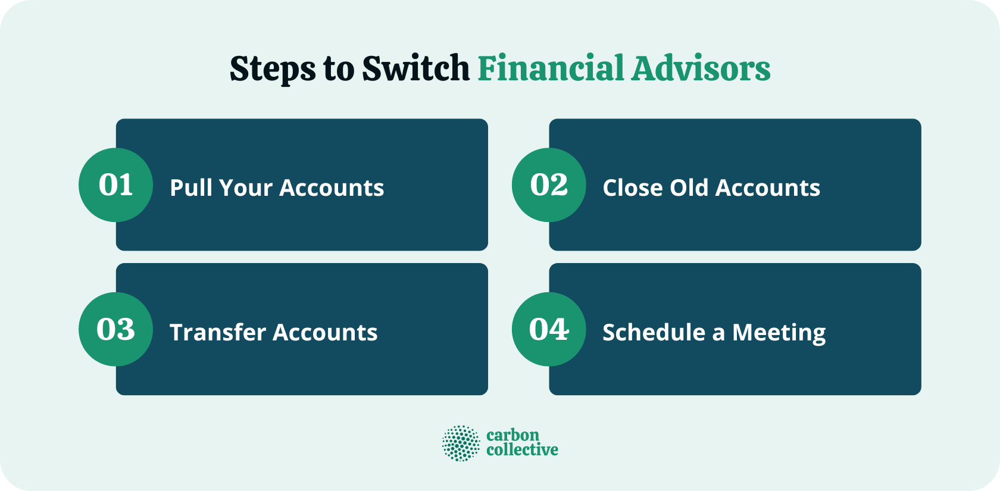

## Table of Contents

## What is a financial advisor and why might someone need to change theirs?

A financial advisor is someone who helps people manage their money. They give advice on things like saving, investing, and planning for the future. They can help you make smart choices with your money so you can reach your financial goals.

Someone might need to change their financial advisor for a few reasons. One reason could be if they are not happy with the advice they are getting. If their money is not growing or if they are losing money, they might want to find someone new. Another reason could be if their needs change. For example, if they get a new job or have a baby, they might need different advice. It's important to have an advisor who understands their current situation and can help them plan for the future.

## How can I identify if my current financial advisor is not meeting my needs?

You can tell if your current financial advisor is not meeting your needs if you feel like your money isn't growing as much as it should. If you look at your investments and see that they're not doing well, or if you're losing money instead of making it, that's a big sign. Also, if your advisor isn't clear about where your money is going or why they're making certain choices, that can be a problem. You should always feel like you understand what's happening with your money.

Another way to know if your advisor isn't right for you is if they don't seem to care about your goals. If you tell them you want to save for a house or retire early, and they don't make a plan that fits those goals, it might be time to look elsewhere. Also, if your life changes—like if you get married, have a baby, or switch jobs—and your advisor doesn't adjust your financial plan to match these changes, they might not be the best fit for you.

## What are the common reasons for changing financial advisors?

One common reason for changing financial advisors is if you're not happy with how your money is doing. If you look at your investments and see they're not growing or you're losing money, you might want a new advisor. Another reason is if your advisor doesn't explain things well. You should always understand what's happening with your money. If they use too many big words or don't answer your questions clearly, it can be frustrating.

Another reason is if your life changes and your advisor doesn't change with it. If you get married, have a baby, or get a new job, you might need different financial advice. Your advisor should make a new plan that fits your new life. If they don't, it might be time to find someone who will. Also, if you feel like your advisor doesn't care about your goals, like saving for a house or retiring early, you might want someone who will help you reach those goals.

Lastly, trust is really important. If you don't trust your advisor or feel like they're not honest with you, it's a big problem. You need to feel good about the person helping you with your money. If you don't, it's okay to look for someone new who you can trust.

## What steps should I take before deciding to switch financial advisors?

Before you decide to switch financial advisors, it's important to take a good look at why you're thinking about it. Are you unhappy because your money isn't growing, or because you don't understand what your advisor is doing with your money? Maybe your life has changed, like you got a new job or had a baby, and your advisor isn't helping you plan for these new things. It's also good to think about if you trust your advisor. If you feel like they're not honest or don't care about your goals, that's a big reason to consider a change.

Once you've figured out why you might want to switch, the next step is to talk to your current advisor. Let them know what's bothering you and see if they can fix it. They might not know you're unhappy unless you tell them. If they can't help you or if you still feel the same after talking to them, then it's time to start looking for a new advisor. Make sure the new one understands your goals and can explain things in a way that makes sense to you. It's all about finding someone who can help you reach your financial dreams.

## How do I evaluate the performance of my current financial advisor?

To evaluate the performance of your current financial advisor, start by looking at how your investments are doing. Are they growing? If you're losing money or not making as much as you think you should, that's a sign your advisor might not be doing a good job. Also, think about how well they explain things to you. Do you understand where your money is going and why they're making certain choices? If they use a lot of confusing words or don't answer your questions clearly, it can be hard to trust them.

Another thing to consider is if your advisor is helping you reach your goals. If you want to save for a house or retire early, are they making a plan that fits those goals? It's important that they care about what you want to achieve. Also, think about if your life has changed, like if you got married or had a baby. Does your advisor adjust your financial plan to match these changes? If they don't, they might not be the right fit for you.

Lastly, trust is key. Do you feel like your advisor is honest with you? If you have doubts about their honesty or feel like they don't have your best interests at heart, it's a big problem. You need to feel good about the person helping you with your money. If you're not happy with any of these things, it might be time to think about finding a new financial advisor.

## What are the legal and contractual considerations when changing financial advisors?

When you decide to change your financial advisor, you need to think about any legal or contract stuff that might be involved. First, check if you have a contract with your current advisor. Some contracts might say you have to pay a fee if you leave before a certain time. It's important to read your contract carefully so you know what you might have to pay. Also, you might need to give notice before you leave, so make sure you do that the right way.

Another thing to think about is how your money and investments will move to your new advisor. You might need to sign some papers to move your money from one place to another. It's good to talk to both your old and new advisors to make sure everything goes smoothly. They can help you understand what needs to be done so you don't miss any important steps. Remember, it's all about making sure your money is safe and that you're following the rules.

## How can I find and choose a new financial advisor that aligns with my financial goals?

To find a new financial advisor that fits your goals, start by asking people you trust, like family or friends, if they know a good advisor. You can also look online for advisors in your area. When you find some names, check if they have any special certifications, like a CFP (Certified Financial Planner). This shows they know a lot about helping people with money. Also, make sure they don't have any bad marks against them by checking with places like FINRA or the SEC.

Once you have a list of possible advisors, talk to them to see if they're a good match for you. Ask them about their experience and how they help people reach their goals. Tell them about your goals, like saving for a house or retiring early, and see if they have a plan that fits what you want. It's important that they can explain things in a way you understand and that you feel like they care about helping you. If you feel good about them and trust them, you've probably found the right advisor for you.

## What are the different types of financial advisors and how do their services vary?

Financial advisors come in different types, and each one can help you in different ways. One type is a certified financial planner (CFP). They can help you with all parts of your money, like saving, investing, and planning for the future. Another type is a registered investment advisor (RIA). They mostly focus on helping you invest your money in things like stocks or bonds. There are also robo-advisors, which are online services that use computers to help you invest. They are usually cheaper but might not give you the personal touch that a human advisor can.

The services from these advisors can be different. A CFP might sit down with you and make a full plan for your money, thinking about things like buying a house or retiring. They can help you with your budget and make sure you're saving enough. An RIA might help you pick the best investments to grow your money, but they might not help you with your whole financial picture. A robo-advisor is good if you want to start investing without talking to someone, but they might not be able to give you advice that fits your personal goals as well as a human advisor can. It's all about what kind of help you need with your money.

## How do I effectively communicate my decision to switch to my current financial advisor?

When you decide to switch financial advisors, it's important to tell your current advisor in a clear and respectful way. You can start by setting up a meeting or a call with them. During the meeting, explain that you've decided to go with a different advisor. It's good to be honest about why you're making this change. Maybe you're not happy with how your money is doing, or maybe your life has changed and you need different help. Whatever the reason, share it with them so they understand.

After you've explained your decision, talk about what needs to happen next. Ask them about any fees or paperwork you need to take care of before you leave. Make sure you understand how to move your money to the new advisor. It's important to keep things smooth and friendly, even though you're leaving. Thank them for their help in the past, and wish them well. This way, you end things on a good note and make sure everything is done right.

## What is the process of transferring assets and accounts to a new financial advisor?

When you decide to switch to a new financial advisor, you'll need to move your money and investments from your old advisor to the new one. Start by talking to your new advisor about how they want to handle the transfer. They can tell you what forms you need to fill out and what information they need from you. You might need to sign some papers to give your new advisor permission to manage your money. Your old advisor can also help with this process. They can give you any documents you need and make sure everything is done the right way.

Once you have all the paperwork ready, you can start moving your money. This might take a few days or even a few weeks, depending on what kind of investments you have. Your new advisor will work with your old advisor to make sure everything goes smoothly. They'll make sure your money is safe and that it gets to the right place. It's important to keep an eye on things during this time and ask questions if you're not sure about anything. Once everything is moved, your new advisor can start helping you reach your financial goals.

## How can I ensure a smooth transition when changing financial advisors?

To make sure your switch to a new financial advisor goes smoothly, start by talking to your new advisor about how they want to handle the transfer. They can tell you what forms you need to fill out and what information they need from you. You might need to sign some papers to give your new advisor permission to manage your money. It's also good to talk to your old advisor. They can give you any documents you need and help make sure everything is done the right way. Keep an eye on things during this time and ask questions if you're not sure about anything.

Once you have all the paperwork ready, you can start moving your money. This might take a few days or even a few weeks, depending on what kind of investments you have. Your new advisor will work with your old advisor to make sure everything goes smoothly. They'll make sure your money is safe and that it gets to the right place. Once everything is moved, your new advisor can start helping you reach your financial goals. By being clear and working together with both advisors, you can make the switch without any big problems.

## What are advanced strategies for managing multiple financial advisors for diversified financial planning?

Managing multiple financial advisors can help you get different kinds of advice and make sure your money is spread out in a good way. One way to do this is by having different advisors for different parts of your money. For example, you might have one advisor who helps you with your investments, another who helps you plan for retirement, and another who helps you with taxes. This way, each advisor can focus on what they know best and give you really good advice in their area. It's like having a team of experts working together to help you reach your financial goals.

To make sure everything works well when you have multiple advisors, it's important to keep everyone in the loop. You can do this by setting up regular meetings where all your advisors can talk to each other and share what they're doing. This helps make sure they're not giving you advice that goes against each other. Also, you should tell each advisor what the others are doing, so they can work together to make a plan that fits all parts of your money. By keeping good communication and making sure everyone knows what's going on, you can get the best out of having multiple financial advisors.

## References & Further Reading

[1]: Bergstra, J., Bardenet, R., Bengio, Y., & Kégl, B. (2011). ["Algorithms for Hyper-Parameter Optimization."](https://dl.acm.org/doi/10.5555/2986459.2986743) Advances in Neural Information Processing Systems 24.

[2]: ["Advances in Financial Machine Learning"](https://www.amazon.com/Advances-Financial-Machine-Learning-Marcos/dp/1119482089) by Marcos Lopez de Prado

[3]: ["Evidence-Based Technical Analysis: Applying the Scientific Method and Statistical Inference to Trading Signals"](https://www.amazon.com/Evidence-Based-Technical-Analysis-Scientific-Statistical/dp/0470008741) by David Aronson

[4]: ["Machine Learning for Algorithmic Trading"](https://github.com/stefan-jansen/machine-learning-for-trading) by Stefan Jansen

[5]: ["Quantitative Trading: How to Build Your Own Algorithmic Trading Business"](https://www.amazon.com/Quantitative-Trading-Build-Algorithmic-Business/dp/1119800064) by Ernest P. Chan