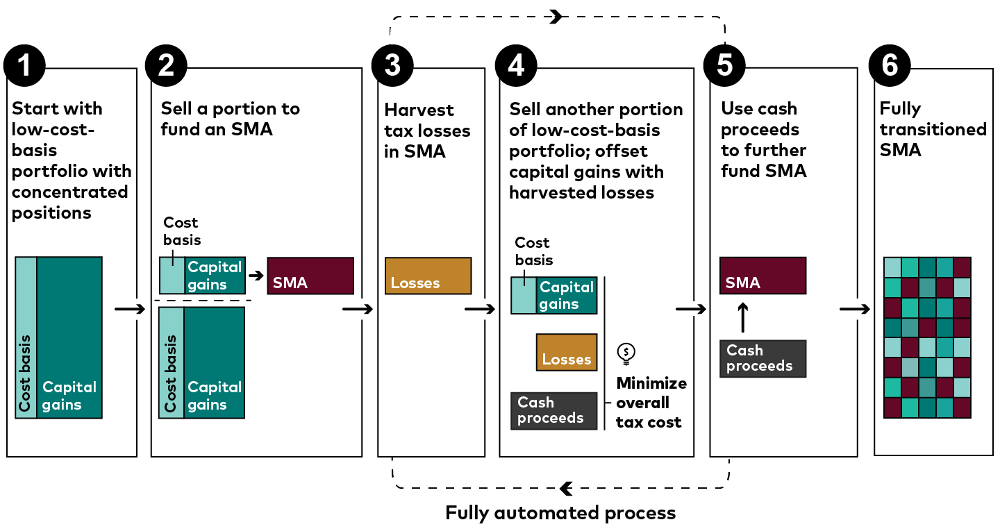

## Table of Contents

## What is a concentrated stock portfolio?

A concentrated stock portfolio is when an investor puts a lot of their money into just a few stocks instead of spreading it out over many. This means that a big part of their investment depends on how well those few stocks do. If the stocks do well, the investor can make a lot of money. But if the stocks do badly, the investor can lose a lot of money too. It's like betting a lot on just a few horses in a race.

Because a concentrated portfolio focuses on fewer stocks, it can be riskier than having a diversified portfolio. Diversification means spreading your money across many different stocks or types of investments to reduce risk. With a concentrated portfolio, if one of the few stocks you own goes down a lot, it can hurt your overall investment more than if you had many stocks. But some investors choose a concentrated portfolio because they believe strongly in the potential of those few stocks and are willing to take the higher risk for the chance of higher rewards.

## Why is it important to diversify a stock portfolio?

Diversifying a stock portfolio is important because it helps reduce risk. When you spread your money across many different stocks, you're not putting all your eggs in one basket. If one stock or one type of investment does badly, it won't hurt your whole portfolio as much because the other investments might still be doing well. This way, you can protect yourself from big losses if something unexpected happens to one of your investments.

Another reason to diversify is that it can help you take advantage of different opportunities in the market. Different industries and companies can grow at different times. By having a mix of stocks from various sectors, you increase your chances of benefiting from the growth in different parts of the economy. This can lead to more stable and potentially higher returns over time, as you're not relying on the success of just a few stocks or sectors.

## What are the risks associated with a concentrated stock portfolio?

A concentrated stock portfolio can be risky because it depends a lot on just a few stocks. If one of those stocks does badly, it can hurt your whole investment a lot. Imagine if you put most of your money into one company and that company has a big problem, like a scandal or a drop in sales. Your investment could lose a lot of value quickly. This is why having a lot of your money in just a few stocks can be dangerous.

Another risk is that you might miss out on other good opportunities. When you focus on just a few stocks, you're not spreading your money around to different types of companies or industries. If other parts of the market are doing well, you won't benefit from that growth. Also, if the few stocks you picked don't do as well as you hoped, you could end up with lower returns than if you had a more balanced mix of investments.

## What is the simplest method to start diversifying a concentrated stock portfolio?

The simplest way to start diversifying a concentrated stock portfolio is to slowly add new stocks from different industries. Instead of buying more of the stocks you already own, look for companies in areas like technology, healthcare, or consumer goods that you don't have in your portfolio yet. By doing this, you spread your money around so that your investment isn't all tied up in just a few stocks.

You can also consider adding funds that already have a mix of stocks, like index funds or ETFs. These funds hold many different stocks in one package, which can help you diversify without having to pick each stock yourself. Start by putting a small amount of money into these funds each month, and over time, you'll have a more balanced portfolio that's less risky because it's not depending on just a few stocks to do well.

## How can selling portions of a concentrated stock help in diversification?

Selling portions of a concentrated stock can help you diversify by freeing up money that you can then use to buy different stocks or investments. If you have a lot of your money in just one or two stocks, selling some of those shares can give you cash to spread around. This way, you're not relying so much on those few stocks to do well. By putting that money into other stocks from different industries, you can lower the risk that your whole investment will go down if one stock has a problem.

Another benefit of selling portions of a concentrated stock is that it can help you rebalance your portfolio over time. As you sell off parts of your big holdings, you can gradually build up a more balanced mix of investments. This means your portfolio will be less affected by the ups and downs of any single stock. By slowly selling and reinvesting in a variety of stocks or funds, you can create a more stable and diversified portfolio that's better able to weather market changes.

## What role do index funds play in diversifying a concentrated stock portfolio?

Index funds can help you diversify a concentrated stock portfolio by giving you an easy way to own a lot of different stocks at once. Instead of buying one stock at a time, an index fund lets you invest in a whole bunch of stocks that are part of a specific index, like the S&P 500. This means you're spreading your money across many companies in different industries, which reduces the risk that comes with having too much money in just a few stocks.

By putting some of your money into an index fund, you can balance out your portfolio. If you've been mostly invested in just a few stocks, adding an index fund can help because it won't go up and down as much as individual stocks. This makes your overall investment more stable. Over time, as you keep adding to the index fund, your portfolio will become less dependent on the performance of those few stocks, making it safer and more diversified.

## How can investing in different sectors aid in diversification?

Investing in different sectors helps you spread out your money so you're not just betting on one part of the economy. If you put all your money into tech stocks and something bad happens in the tech world, like a big company failing or new laws that hurt the industry, your whole investment could be in trouble. But if you also have money in other sectors like healthcare, energy, or consumer goods, those parts of your portfolio might do well even if tech stocks are struggling. This way, you're not putting all your eggs in one basket.

Having a mix of sectors in your portfolio can also help you take advantage of growth in different parts of the economy. Different industries can do well at different times. For example, when people are buying more stuff, consumer goods companies might do great. But if there's a new health crisis, healthcare companies might be the ones that grow. By having investments in various sectors, you can benefit from these ups and downs, making your portfolio more stable and possibly increasing your overall returns.

## What are the benefits of using exchange-traded funds (ETFs) for portfolio diversification?

Exchange-traded funds (ETFs) are a great way to diversify your portfolio because they let you invest in a whole bunch of stocks or other assets all at once. Instead of buying one stock at a time, you can buy shares in an [ETF](/wiki/etf-trading-strategies), which might hold hundreds or even thousands of different stocks. This means you're spreading your money across many companies and industries, which reduces the risk that comes with having too much money in just a few stocks. If one company or sector does badly, it won't hurt your whole investment as much because the other parts of the ETF might still be doing okay.

Another benefit of using ETFs for diversification is that they're easy to buy and sell, just like stocks. You can trade them anytime during the day, which gives you more control over your investments. Plus, ETFs often have lower fees than other types of funds, which means you get to keep more of your money. By adding ETFs to your portfolio, you can quickly build a more balanced mix of investments, making your portfolio safer and more likely to grow over time.

## How can options strategies be used to manage a concentrated stock position?

Options strategies can help you manage a concentrated stock position by giving you ways to protect your investment or make money from it without selling the stock. One common strategy is to use options to hedge your position. This means you buy options that will make money if your stock goes down. For example, you could buy a put option, which gives you the right to sell your stock at a certain price. If the stock price falls below that price, you can use the put option to sell at the higher price, which limits your losses.

Another way to use options is to generate income from your concentrated stock. You can do this by selling call options on the stock you own. When you sell a call option, you get paid right away, and you agree to sell your stock at a certain price if someone wants to buy it. If the stock price stays below that price, you keep the money from selling the option and you still have your stock. This can help you earn some money while you're waiting for the stock to go up. Options can be tricky, though, so it's important to understand them well or get advice from a financial expert before using them.

## What are the tax implications of diversifying a concentrated stock portfolio?

When you diversify a concentrated stock portfolio, you need to think about taxes. If you sell your stocks to buy different ones, you might have to pay capital gains tax. This tax is on the profit you make from selling your stocks. If you've owned the stocks for less than a year, you'll pay a short-term capital gains tax, which is usually higher. But if you've held them for more than a year, you'll pay a long-term capital gains tax, which is usually lower. So, selling stocks to diversify can mean you owe money to the government, depending on how much profit you made and how long you held the stocks.

There are ways to manage these tax implications, though. One way is to use tax-efficient accounts like an IRA or a 401(k). If you sell stocks inside these accounts, you won't have to pay capital gains tax right away. Another way is to donate some of your concentrated stocks to charity. If you do this, you might be able to get a tax deduction, which can help lower your taxes. It's a good idea to talk to a tax professional before making big changes to your portfolio, so you can understand all your options and make the best choices for your situation.

## How can charitable giving strategies help in diversifying a concentrated stock portfolio?

Charitable giving can help you diversify a concentrated stock portfolio by letting you donate some of your stocks to a charity instead of selling them. When you give stocks to a charity, you don't have to pay capital gains tax on the profit you made from those stocks. This means you can get a tax deduction for the full value of the stocks, which can lower your taxes. By donating stocks, you can reduce how much of your money is tied up in just one or two stocks, and then use the tax savings to buy different stocks or investments.

Another way charitable giving can help with diversification is through setting up a donor-advised fund. With a donor-advised fund, you can put your concentrated stocks into the fund and then recommend that the fund give those stocks to different charities over time. This lets you spread out your giving, and you can use the money you would have paid in taxes to invest in other stocks or funds. By doing this, you slowly build a more balanced portfolio while also supporting causes you care about.

## What advanced financial instruments or strategies can be employed for sophisticated diversification of a concentrated stock portfolio?

For sophisticated diversification of a concentrated stock portfolio, you can use advanced financial instruments like options and futures. Options let you buy or sell stocks at a set price in the future, which can help you hedge against big drops in your stock's value. For example, buying put options can protect you if the stock price goes down. Futures are contracts to buy or sell an asset at a future date, and they can be used to lock in prices or hedge against market changes. These instruments can be tricky, so it's smart to learn about them or talk to a financial advisor before using them.

Another strategy is to use exchange-traded funds (ETFs) and mutual funds that focus on different sectors or asset classes. ETFs and mutual funds can give you a quick and easy way to spread your money across many stocks or other investments. For example, you can buy ETFs that track different indexes or focus on specific industries like technology, healthcare, or real estate. This way, you're not just betting on one part of the market, and you can reduce the risk that comes with having too much money in one stock. Using these funds can help you build a more balanced and diversified portfolio over time.

## What is Understanding Stock Diversification?

Stock diversification is a key strategy in investment management, aimed at distributing investments across a variety of assets to mitigate risk. The primary objective of diversification is to minimize idiosyncratic risk, which is the risk associated with an individual company or industry. By diversifying a portfolio, investors reduce their susceptibility to the fluctuations of any single entity, thereby stabilizing returns.

A diversified portfolio typically includes investments across different sectors, geographic regions, and asset classes. This approach ensures that negative performance in one area can be balanced or offset by positive performance in another, enhancing the overall stability of the portfolio. For example, an investor might allocate funds across technology stocks, healthcare, and consumer goods, as well as fixed income securities and real estate. This variety not only serves to hedge against industry-specific downturns but also positions the investor to capture growth opportunities across different economic segments.

Mathematically, the benefits of diversification can be illustrated through the concept of portfolio variance. The formula for the variance ($\sigma^2_p$) of a two-asset portfolio is given by:

$$
\sigma^2_p = w_1^2 \sigma_1^2 + w_2^2 \sigma_2^2 + 2w_1w_2 \text{Cov}(r_1, r_2)
$$

Where:
- $w_1$ and $w_2$ are the weights of assets 1 and 2 in the portfolio,
- $\sigma_1^2$ and $\sigma_2^2$ are the variances of the returns of assets 1 and 2,
- $\text{Cov}(r_1, r_2)$ is the covariance between the returns of the two assets.

Through diversification, the correlation between asset returns ($\text{Cov}(r_1, r_2)$) is reduced, leading to a potential decrease in the overall portfolio variance, thereby lowering risk.

One common method of achieving diversification is through index funds or exchange-traded funds (ETFs), which offer exposure to a broad spectrum of the market at a relatively low cost. These vehicles allow investors to gain instant diversification without having to individually select each asset, thus simplifying the process and reducing transaction costs.

The long-term benefits of diversification are well-documented, including a reduced impact from market [volatility](/wiki/volatility-trading-strategies) and an enhanced potential for capital growth. By spreading investments, the compounding of different asset performances over time contributes to a smoother accumulation of wealth, aligning with the financial objectives of stability and growth. 

In conclusion, stock diversification is an essential strategy for investors aiming to manage risk effectively while seeking returns. By understanding and implementing diversified investment practices, investors are better equipped to navigate the uncertainties of financial markets and strive towards their financial goals.

## References & Further Reading

[1]: Malkiel, B. G. (2019). ["A Random Walk Down Wall Street."](https://yourknowledgedigest.org/wp-content/uploads/2020/04/a-random-walk-down-wall-street.pdf) W.W. Norton & Company.

[2]: Narang, R. K. (2013). ["Inside the Black Box: A Simple Guide to Quantitative and High-Frequency Trading."](https://onlinelibrary.wiley.com/doi/book/10.1002/9781118662717) Wiley.

[3]: Bodie, Z., Kane, A., & Marcus, A. J. (2014). ["Investments."](https://books.google.com/books/about/EBOOK_Investments_Global_edition.html?id=BMsvEAAAQBAJ) McGraw-Hill Education.

[4]: Avellaneda, M., & Stoikov, S. (2008). ["High-frequency trading in a limit order book."](https://people.orie.cornell.edu/sfs33/LimitOrderBook.pdf) Quantitative Finance, 8(3), 217-224.

[5]: Fabozzi, F. J., Kolm, P. N., Pachamanova, D. A., & Focardi, S. M. (2007). ["Robust Portfolio Optimization and Management."](https://onlinelibrary.wiley.com/doi/book/10.1002/9781119202172) Wiley.

[6]: Burns, A., & Kritzman, M. (2012). ["Investing: The Last Liberal Art."](https://cupola.columbia.edu/3c9add.pdf) Columbia Business School Publishing.