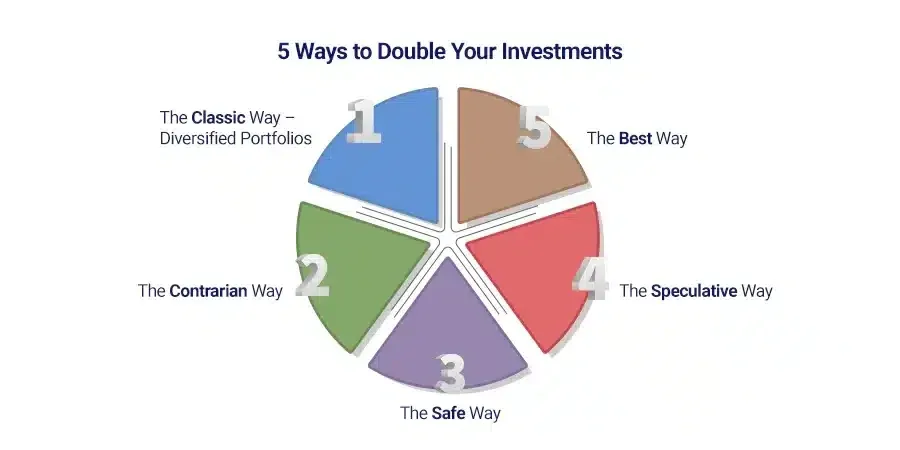

## Table of Contents

## What are the basic principles of investing for beginners?

Investing can seem hard at first, but it's really about some simple ideas. One big idea is to start early. When you invest early, your money has more time to grow. This is because of something called compound interest, which means you earn interest on your interest. Another important idea is to spread out your money. This is called diversification. Instead of putting all your money in one place, you put it in different things like stocks, bonds, and real estate. This way, if one thing doesn't do well, you won't lose all your money.

Another key principle is to understand your risk. Some investments can go up a lot, but they can also go down a lot. These are called high-risk investments. Other investments, like bonds, are safer but don't grow as fast. It's important to know how much risk you can handle. Also, it's good to keep learning. The world of investing changes, so reading books, watching videos, and talking to experts can help you make better choices. Remember, investing is a long-term game, so be patient and stay focused on your goals.

## How can diversification help in doubling my investment?

Diversification can help in doubling your investment by spreading your money across different types of investments. This means you're not putting all your eggs in one basket. If you invest all your money in just one stock or one type of investment, and it doesn't do well, you could lose a lot. But if you spread your money across stocks, bonds, real estate, and maybe even some international investments, you lower the risk. Some of your investments might go down, but others might go up, helping to balance out your overall returns.

Over time, this strategy can lead to steady growth. Because you're not relying on just one investment to double your money, you have a better chance of seeing overall growth. For example, if stocks are doing well, they might help push your portfolio up, even if bonds are not doing as well. This way, you're more likely to see your investment grow steadily, which can eventually lead to doubling your money. It's like planting different seeds in a garden; some might grow faster than others, but together they can create a healthy, growing portfolio.

## What role does risk management play in investment growth?

Risk management is super important when you want your investments to grow. It's all about knowing how much risk you can handle and making smart choices to protect your money. Imagine you're walking on a tightrope. If you take too many big steps (high risk), you might fall. But if you take small, careful steps (low risk), you'll probably make it to the other side safely. In investing, risk management helps you find that balance so you can grow your money without losing it all.

By managing risk, you can keep your investments safe and help them grow over time. One way to do this is by diversifying your investments, which means not putting all your money in one place. If one investment goes down, others might go up, keeping your overall money safe. Another way is to choose investments that match how much risk you can handle. If you're scared of big ups and downs, you might pick safer investments like bonds. If you're okay with more risk, you might choose stocks. By managing risk well, you can aim for steady growth and maybe even double your money over time.

## What are the differences between short-term and long-term investment strategies?

Short-term investment strategies focus on making money quickly, usually within a few months or a year. People who use these strategies often buy and sell things like stocks or cryptocurrencies fast, hoping to make a profit from quick changes in price. This can be exciting but also risky because prices can go up and down a lot in a short time. Short-term investors need to watch the market closely and be ready to make quick decisions. They might use tools like technical analysis to guess where prices are going next.

Long-term investment strategies are about growing your money over many years, sometimes even decades. Instead of trying to make quick profits, long-term investors look for things like stocks, bonds, or real estate that they believe will grow slowly but steadily over time. This approach is usually less risky because it's based on the idea that, over the long run, the market tends to go up. Long-term investors don't need to watch the market every day. They can be patient and focus on the big picture, like saving for retirement or buying a house. They often use something called [fundamental analysis](/wiki/fundamental-analysis) to pick investments that they think will do well in the long run.

## How can I use compound interest to double my money?

Compound interest is like a magic trick for growing your money. It works by [earning](/wiki/earning-announcement) interest not just on the money you put in, but also on the interest you've already earned. So, if you start with $1,000 and it earns 5% interest each year, after the first year, you'll have $1,050. The next year, you'll earn interest on that $1,050, not just the original $1,000. Over time, this can really add up and help your money grow faster.

To double your money using compound interest, you need to let it work its magic over time. A rule of thumb called the "Rule of 72" can help you figure out how long it will take. Just divide 72 by the [interest rate](/wiki/interest-rate-trading-strategies) you're getting. For example, if you're earning 6% interest, 72 divided by 6 is 12 years. That means it would take about 12 years for your money to double at that rate. The key is to start early and leave your money alone so the compound interest can keep working to grow your savings.

## What are the benefits and risks of investing in stocks to double my investment?

Investing in stocks can be a good way to try to double your money. Stocks are pieces of a company that you can buy. When the company does well, the price of the stock can go up, and you can make money. If you pick the right stocks, you might see your money grow fast. Some people have made a lot of money this way. Also, if you hold onto your stocks for a long time, you might get something called dividends, which are like little payments from the company. These can add up and help your money grow even more.

But investing in stocks can also be risky. The price of stocks can go down as well as up. If you pick the wrong stocks, you could lose money instead of doubling it. Sometimes, the whole market can go down, and that can make all your stocks lose value. Also, it can be hard to know which stocks will do well. You have to do a lot of research and sometimes even then you might not pick the right ones. So, while stocks can be a good way to grow your money, you have to be ready for the ups and downs and be okay with the risk.

## How does investing in real estate contribute to doubling my financial assets?

Investing in real estate can be a good way to double your money because property values can go up over time. When you buy a house or an apartment, and the area becomes more popular, the price of your property might go up. You can then sell it for more money than you paid for it. Also, if you rent out your property, you can earn money from the rent every month. If you use that rent money to pay off your mortgage, you'll own more of the property, which can help it grow in value even faster.

But, real estate investing can also be risky. It costs a lot of money to buy a property, and you might need to borrow money to do it. If the property value goes down instead of up, you could lose money. Also, being a landlord can be hard work. You might have to fix things in the property or deal with tenants who don't pay rent on time. So, while real estate can help you double your money, you have to be ready for the risks and the work that comes with it.

## What are the tax implications of different investment strategies aimed at doubling money?

When you try to double your money with different investment strategies, you need to think about taxes. If you make money from selling stocks, you might have to pay capital gains tax. This tax can be different depending on how long you held the stock. If you held it for less than a year, it's a short-term gain, and you'll pay more tax. But if you held it for more than a year, it's a long-term gain, and the tax is usually less. So, if you're trying to double your money with stocks, holding them for over a year can help you keep more of your profits.

Real estate investments also come with their own tax rules. If you sell a property for more than you paid for it, you'll pay capital gains tax on the profit. But, you can also get tax breaks. For example, you can deduct the cost of fixing up the property or the interest you pay on your mortgage. If you rent out the property, you'll pay taxes on the rental income, but you can also deduct expenses like maintenance and property taxes. So, while real estate can help you double your money, you need to understand how taxes will affect your profits.

Bonds and other fixed-income investments have different tax implications too. Interest you earn from bonds is usually taxed as regular income, which can be higher than the tax on long-term capital gains. But, some bonds, like municipal bonds, can be tax-free at the federal level, and sometimes at the state level too. So, if you're looking to double your money with bonds, choosing the right type can help you keep more of your earnings. Understanding these tax rules can help you pick the best strategy for growing your money.

## How can I leverage financial instruments like options and futures to increase my returns?

Options and futures are special financial tools that can help you make more money if you use them the right way. Options let you buy or sell something at a set price before a certain time. If you think a stock will go up, you can buy an option to buy that stock later at today's price. If the stock does go up, you can buy it at the lower price and then sell it at the higher price, making a profit. Futures are similar, but they're agreements to buy or sell something at a set price on a specific future date. If you think the price of something like oil will go up, you can buy a future to buy it later at today's price. If the price does go up, you can buy it at the lower price and sell it at the higher price, making money.

But using options and futures can also be very risky. These tools can make your money grow fast, but they can also make you lose money fast. If the stock or whatever you're betting on doesn't go the way you thought, you could lose all the money you put into the option or future. Also, these tools are complicated and hard to understand. You need to learn a lot about them and how they work before you start using them. If you're not careful, you could end up losing more money than you planned. So, while options and futures can help you increase your returns, you have to be ready for the risks and really understand what you're doing.

## What advanced techniques can be used to analyze market trends for doubling investments?

To double your investments by analyzing market trends, you can use a technique called technical analysis. This means looking at charts and graphs to see how prices have moved in the past. You can spot patterns that might tell you where prices are going next. For example, if a stock's price keeps going up and down in a certain way, you might guess it will keep doing that. You can also use things called indicators, like moving averages, which help you see if a trend is strong or if it might be about to change. By understanding these patterns and indicators, you can make better choices about when to buy and sell, which can help you double your money.

Another advanced technique is fundamental analysis. This means looking at the real value of a company or asset, not just its price. You check things like how much money the company makes, how much it owes, and how fast it's growing. If a company's stock price is low but its fundamentals are strong, it might be a good time to buy. You can also look at the bigger picture, like what's happening in the economy or in the world, to guess which industries will do well. By using fundamental analysis, you can find investments that are likely to grow a lot over time, helping you double your money.

Both technical and fundamental analysis can help you make smarter investment choices. But remember, no technique can predict the future perfectly. The market can be unpredictable, and even the best analysis can be wrong sometimes. So, always be ready for surprises and make sure you understand the risks before you invest.

## How do hedge funds and private equity work in the context of doubling financial investments?

Hedge funds and private equity can be powerful ways to try and double your money. Hedge funds are like special clubs where rich people and big investors put their money together. The people who run the [hedge fund](/wiki/hedge-fund-trading-strategies), called managers, use that money to make all kinds of investments, sometimes even betting that prices will go down. They might use complicated tools like options and futures to try and make big profits. If the managers are good at what they do, the hedge fund can grow a lot, and you might see your money double. But, hedge funds can also be very risky, and you might lose money if things don't go as planned.

Private equity is another way to try and double your money. It's when you buy a whole company or a big part of it, usually one that's not doing so well. You then try to make the company better by fixing its problems, maybe changing how it's run, or even selling off parts of it. If you can turn the company around and make it more valuable, you can sell it for a lot more than you paid for it. This can help you double your money. But, like hedge funds, private equity can be risky. It takes a lot of time and money to fix a company, and sometimes it doesn't work out, and you might lose your investment.

## What are the latest fintech solutions that can help in doubling my investment efficiently?

Fintech, or financial technology, has brought new tools that can help you double your money in smarter ways. One popular fintech solution is robo-advisors. These are computer programs that manage your investments for you. They use fancy math to pick the best mix of stocks, bonds, and other things to help your money grow. Robo-advisors are often cheaper than hiring a human advisor, and they can help you diversify your investments easily. This can make it more likely that you'll double your money over time without having to do all the work yourself.

Another fintech solution is peer-to-peer lending platforms. These let you lend money to other people or small businesses directly, instead of going through a bank. You can earn interest on the money you lend, and if you pick the right loans, you might earn more than you would with a regular savings account. This can help your money grow faster. But remember, there's a risk that the people you lend to might not pay you back, so you need to be careful. By using these fintech tools wisely, you can find new ways to grow your money and maybe even double it.

## References & Further Reading

[1]: Bergstra, J., Bardenet, R., Bengio, Y., & Kégl, B. (2011). ["Algorithms for Hyper-Parameter Optimization."](https://papers.nips.cc/paper/4443-algorithms-for-hyper-parameter-optimization) Advances in Neural Information Processing Systems 24.

[2]: ["Advances in Financial Machine Learning"](https://www.amazon.com/Advances-Financial-Machine-Learning-Marcos/dp/1119482089) by Marcos Lopez de Prado

[3]: ["Evidence-Based Technical Analysis: Applying the Scientific Method and Statistical Inference to Trading Signals"](https://www.amazon.com/Evidence-Based-Technical-Analysis-Scientific-Statistical/dp/0470008741) by David Aronson

[4]: ["Machine Learning for Algorithmic Trading"](https://github.com/stefan-jansen/machine-learning-for-trading) by Stefan Jansen

[5]: ["Quantitative Trading: How to Build Your Own Algorithmic Trading Business"](https://books.google.com/books/about/Quantitative_Trading.html?id=j70yEAAAQBAJ) by Ernest P. Chan