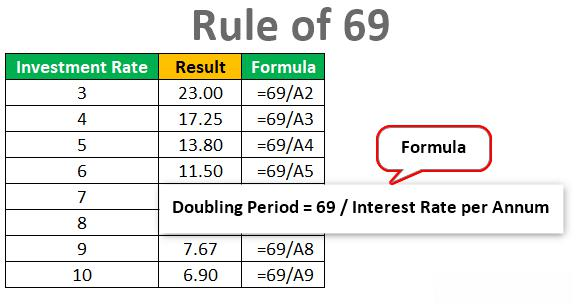

In today's rapidly evolving financial landscape, strategic investment practices are essential for wealth growth. Investors must navigate a complex matrix of opportunities and challenges, which demand innovative approaches to maximize returns. One key technique that has become indispensable in modern finance is algorithmic trading. This advanced and sophisticated method leverages computer programs to make automated trading decisions, thereby offering a systematic and efficient approach to executing trades. 

Algorithmic trading plays a crucial role in finance by enabling rapid decision-making and reducing the scope for human error. By analyzing vast amounts of market data in real-time, these algorithms facilitate precise execution of trades at optimal prices. As a result, investors can benefit from reduced transaction costs and enhanced market efficiency, positioning algorithmic trading as a pivotal tool in the contemporary investment landscape.



This article explores various aspects of wealth growth through investment strategies, focusing particularly on the role of algorithmic trading. It will guide readers through the benefits and limitations of algorithmic trading, the technical requirements for successful implementation, and the broader context of strategic investment planning. By examining these areas, investors can better understand how to integrate algorithmic trading into their portfolios and achieve robust financial growth.

## Table of Contents

## The Role of Algorithmic Trading in Modern Finance

Algorithmic trading has increasingly become a pivotal component in modern finance, leveraging computer programs to automate trading decisions and execute transactions with minimal human intervention. This sophisticated method relies on algorithms - a set of mathematical rules or instructions - to evaluate vast amounts of market data, identify potential trading opportunities, and implement these trades in real time. This process not only heightens the speed and frequency of trades beyond human capability but also considerably reduces transaction costs by minimizing the bid-ask spread through optimal trade execution.

The introduction of algorithmic trading represents a significant innovation in trading strategies, reshaping how market participants approach investment. One of the core advantages of algorithmic trading is its capacity to execute trades at the best possible prices. This is achieved by algorithms that constantly monitor market conditions, adjust to price movements, and execute trades faster than any human trader could. It thereby enhances market efficiency as it contributes to more accurate pricing of securities.

Moreover, algorithmic trading substantially reduces human error, which is often caused by emotional and psychological factors, such as fear and greed. By removing these elements from the decision-making process, algorithmic trading facilitates consistent and objective trading strategies. This is particularly advantageous in volatile markets where emotions can drastically influence human traders' decisions.

In addition to improving efficiency and reducing errors, [algorithmic trading](/wiki/algorithmic-trading) empowers investors with the ability to backtest their trading strategies. Backtesting involves applying algorithms to historical market data to determine their potential effectiveness. This technique enables investors to refine their algorithms before deploying them in live trading, thereby increasing the likelihood of favorable investment outcomes.

Algorithmic trading also supports the enhancement of financial growth opportunities by allowing access to multiple markets and asset classes simultaneously. For instance, algorithms can execute trades across global stock exchanges, [forex](/wiki/forex-system), commodities, and cryptocurrencies, optimizing investment portfolios and diversifying risk. This diversification helps investors mitigate losses in one market by gains in another, encouraging a more holistic approach to wealth growth.

Furthermore, algorithmic trading plays a crucial role in [liquidity](/wiki/liquidity-risk-premium) provision, particularly in large financial markets where liquidity is essential for smooth market operations. By constantly buying and selling securities, algorithmic traders help stabilize market prices and provide liquidity, which is vital for market participants to enter or [exit](/wiki/exit-strategy) positions without causing significant market disruptions.

In summary, algorithmic trading is revolutionizing the way trading is conducted in modern finance, offering significant advantages in terms of efficiency, accuracy, and financial growth. As technology continues to evolve, the role of algorithmic trading is likely to expand, further integrating sophisticated computational techniques into the fabric of financial investment strategies.

## Investment Strategies for Wealth Growth

Investors seeking wealth growth must deploy a variety of investment strategies, adapting traditional and modern approaches to balance risk and increase potential returns. Traditionally, stocks and bonds have been the cornerstone of investment portfolios. Equities provide the potential for capital appreciation and dividends, while bonds offer more stable, fixed-income returns. The combination of these assets can create a balanced portfolio, managing risk through diversification.

In recent years, emerging asset classes such as cryptocurrencies and commodities have gained traction among investors. Cryptocurrencies, like Bitcoin and Ethereum, offer high-risk, high-reward opportunities due to their [volatility](/wiki/volatility-trading-strategies) and potential for rapid appreciation. Commodities, including gold, oil, and agricultural products, provide a hedge against inflation and currency fluctuations, serving as a diversification tool.

Diversification remains a key technique in portfolio management. By spreading investments across various asset classes, sectors, and geographies, investors can reduce unsystematic risk. This risk management strategy involves holding a mix of assets that do not move in sync, smoothing returns and providing stability during market fluctuations.

Emerging markets present another avenue for wealth growth. These economies, characterized by rapid economic expansion and industrialization, may offer higher growth potential compared to developed markets. Investing in emerging markets involves risks such as political instability and currency volatility but can lead to substantial returns due to their dynamic growth trajectories.

A balanced investment portfolio might include a mixture of these asset classes, strategically allocated to reflect the investor's risk tolerance and financial goals. For example, conservative investors may prioritize bonds and low-volatility stocks, while aggressive investors might favor equities and alternative assets like cryptocurrencies. A robust investment strategy often combines these elements to maximize returns while managing risk effectively.

## Advantages and Disadvantages of Algorithmic Trading

Algorithmic trading, a technique that uses computer programs to automatically execute trading strategies, provides several distinct advantages that have made it popular among institutional and retail investors alike. One of the primary benefits of algorithmic trading is its ability to execute trades with high precision and at speeds unattainable by human traders. This is achieved through predefined algorithms that can evaluate market conditions and make trade decisions in fractions of a second, thereby taking advantage of short-lived market opportunities.

Moreover, algorithmic trading enables continuous market monitoring. Algorithms can be programmed to track multiple markets and asset classes simultaneously, identifying profitable opportunities and risks around the clock. This continuous observation ensures that investors do not miss out on potential gains or fail to minimize losses due to human limitations in monitoring complex and fast-moving markets.

Another core advantage of algorithmic trading is its emotional neutrality. Unlike human traders, algorithms are not influenced by emotions such as fear or greed, which often lead to irrational decision-making. Instead, they strictly adhere to the logic of the trading strategy coded within them, thus maintaining consistency and discipline, and reducing the risk of errors introduced by psychological factors.

Despite these benefits, algorithmic trading has its disadvantages. Foremost among these is the reliance on technology, which can sometimes be prone to glitches or system failures. Trading systems require robust infrastructures, and any malfunction, such as a hardware failure or network outage, can result in significant financial losses. Additionally, while algorithms are adept at executing predefined strategies, their inflexibility can be a disadvantage if market conditions change unexpectedly, but are not accounted for in the algorithm's design.

Another limitation of algorithmic trading includes the development and maintenance cost of these systems. Creating effective trading algorithms requires substantial expertise in both finance and computer programming, and continuous monitoring is necessary to ensure that they are functioning as intended and adapting to new market conditions.

Algorithmic trading also raises regulatory and ethical issues, as it can contribute to market volatility through activities such as high-frequency trading ([HFT](/wiki/high-frequency-trading-strategies)). The rapid execution of numerous small trades can lead to significant fluctuations in asset prices, potentially destabilizing markets.

Overall, while algorithmic trading introduces efficiency and precision into trading practices, it should be employed carefully alongside adequate risk management strategies to mitigate its inherent technological, financial, and ethical risks.

## Technical Requirements for Successful Algorithmic Trading

Implementing algorithmic trading effectively necessitates a solid technological foundation that integrates several critical components. The first requirement is a fast and reliable internet connection, which is crucial for executing trades with minimal latency. Latency refers to the delay between the decision to execute a trade and its actual completion in the market. Lower latency can significantly enhance the competitiveness of a trading system by ensuring timely executions that capitalize on current market conditions.

In addition to connectivity, powerful computing resources are essential to accommodate the computational demands of algorithmic trading. This often involves processing complex datasets and running sophisticated models to analyze market trends and predict future price movements. High-performance computing systems (HPC) can offer the processing power needed to handle such intensive calculations, enabling traders to implement more intricate algorithms and strategies.

Skilled programming expertise is another fundamental requirement for successfully executing algorithmic trading strategies. Traders or developers must be proficient in programming languages commonly used in finance, such as Python, C++, or Java. These languages aid in developing, testing, and optimizing trading algorithms. A simple example of a basic algorithm in Python to calculate the moving average of a stock price is as follows:

```python
import numpy as np

def moving_average(prices, window_size):
    return np.convolve(prices, np.ones(window_size)/window_size, mode='valid')
```

This example uses the NumPy library to calculate a simple moving average, a common technique in algorithmic trading to smooth price data and identify trends.

Access to real-time market data is indispensable for effective algorithmic trading. This data includes current stock prices, trading volumes, and other relevant market information. Real-time data feeds enable algorithms to make informed decisions based on the latest market conditions. Furthermore, [backtesting](/wiki/backtesting) capabilities are vital for refining trading algorithms. Backtesting involves testing a trading strategy on historical data to assess its feasibility and performance before deploying it in live markets.

To sum up, successful implementation of algorithmic trading requires a combination of fast internet connections, powerful computing capabilities, proficient programming skills, access to real-time market data, and thorough backtesting. By ensuring these technical prerequisites are met, investors can enhance their algorithmic trading's effectiveness, making informed and timely decisions to optimize their financial outcomes.

## Developing a Comprehensive Investment Plan

Successful wealth growth necessitates a well-structured investment plan that aligns with an investor's financial goals, risk tolerance, and timeline. An effective investment plan serves as a blueprint for achieving financial objectives and optimizing resource allocation. To construct such a plan, several key components must be considered:

1. **Define Financial Goals:** Investors should clearly articulate their short-term and long-term financial objectives. Whether the goal is to save for retirement, purchase a home, or generate passive income, these objectives guide the selection of investment vehicles and strategies.

2. **Assess Risk Tolerance:** Understanding risk tolerance is crucial. Investors must evaluate their willingness and ability to endure market volatility and potential losses. This assessment helps in crafting a portfolio that balances risk and return according to personal preferences.

3. **Establish a Timeline:** The investment horizon significantly impacts the choice of assets. A longer horizon might allow for more aggressive strategies with higher potential returns, while a shorter timeline might necessitate a conservative approach to preserve capital.

Incorporating algorithmic trading strategies into the investment plan can be a powerful approach to enhance portfolio performance. Algorithmic trading utilizes computer algorithms to execute trades based on predefined criteria, offering benefits like increased trading speed, reduced transaction costs, and minimized emotional bias. However, successful integration of algorithmic trading requires a consideration of several additional elements:

- **Market Trends and Indicators:** Investors should consistently monitor market trends and economic indicators to adapt their strategies as conditions change. Algorithms can be programmed to react to various signals, including price movements, volume changes, and macroeconomic data, to optimize trading decisions.

- **Diversification:** A diversified portfolio mitigates risk by spreading investments across various asset classes and sectors. By incorporating algorithms to assess and manage diversification, investors can systematically balance their portfolios according to changing market dynamics.

- **Performance Measurement and Adjustment:** Regular evaluation of investment performance is essential. Algorithms can be used for backtesting strategies to ensure they align with historical data and market conditions. Ongoing adjustments based on performance metrics and market feedback are vital to maintaining an effective investment strategy.

- **Cost Efficiency:** One of the key advantages of algorithmic trading is the potential for cost savings through reduced transaction fees and enhanced trade execution efficiency. Investors should leverage this aspect by optimizing their trading strategies for cost effectiveness.

By developing an investment plan that integrates algorithmic trading, investors can capitalize on technological advancements to achieve better financial outcomes. However, these strategies should be complemented by traditional investment techniques to create a balanced and comprehensive approach. Constant education and adaptation to new tools and techniques are crucial for navigating the complexities of modern finance and achieving sustainable wealth growth.

## Conclusion

In a constantly shifting financial environment, the growth of wealth through investment hinges on a blend of strategic planning, technological innovation, and financial expertise. Algorithmic trading, a significant advancement in modern finance, offers a method to potentially improve investment results through its precision and ability to mitigate human errors. However, while the automation and efficiency brought forth by algorithmic trading are enticing, these tools must be integrated with discernment and caution.

The innovative nature of algorithmic trading presents new avenues for investors to explore, promoting rapid decision-making and the possibility of reduced transaction costs. Yet, reliance solely on algorithmic strategies may overlook the nuance and depth offered by conventional investment approaches. For instance, the basic principles of portfolio diversification, risk management, and long-term asset allocation remain indispensable to a well-rounded investment strategy.

Educating oneself about both algorithmic trading techniques and traditional investment principles positions investors more favorably toward achieving their financial objectives. Understanding these tools’ complexities allows investors to adapt to market changes, optimize their portfolios, and sharpen their decision-making skills. As financial markets evolve, the optimal path for wealth growth will likely reside at the intersection of cutting-edge technology and foundational investment knowledge, enabling investors to navigate the intricate landscape of modern finance effectively.

## References & Further Reading

[1]: Bergstra, J., Bardenet, R., Bengio, Y., & Kégl, B. (2011). ["Algorithms for Hyper-Parameter Optimization."](https://papers.nips.cc/paper/4443-algorithms-for-hyper-parameter-optimization) Advances in Neural Information Processing Systems 24.

[2]: ["Advances in Financial Machine Learning"](https://www.amazon.com/Advances-Financial-Machine-Learning-Marcos/dp/1119482089) by Marcos Lopez de Prado

[3]: ["Evidence-Based Technical Analysis: Applying the Scientific Method and Statistical Inference to Trading Signals"](https://www.amazon.com/Evidence-Based-Technical-Analysis-Scientific-Statistical/dp/0470008741) by David Aronson

[4]: ["Machine Learning for Algorithmic Trading"](https://github.com/stefan-jansen/machine-learning-for-trading) by Stefan Jansen

[5]: ["Quantitative Trading: How to Build Your Own Algorithmic Trading Business"](https://books.google.com/books/about/Quantitative_Trading.html?id=j70yEAAAQBAJ) by Ernest P. Chan