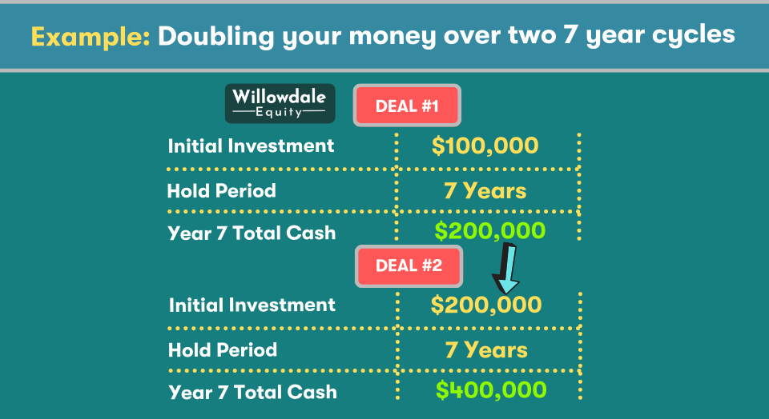

## Table of Contents

## What does it mean to double your money in seven years?

Doubling your money in seven years means that if you invest a certain amount of money, it will grow to be twice as much after seven years. This idea is often used to help people understand how their investments can grow over time. For example, if you start with $100, after seven years, you would have $200 if your investment doubles.

This concept is important because it helps you plan for the future. If you know that your money can double every seven years, you can figure out how much you need to save now to reach your financial goals later. It's a simple way to think about the power of investing and how it can help your money grow over time.

## What is the Rule of 72 and how does it apply to doubling money?

The Rule of 72 is a simple way to figure out how long it will take for your money to double. You just divide the number 72 by the interest rate you're getting on your investment. For example, if you're earning 8% interest, you divide 72 by 8, which gives you 9 years. That means your money will double in 9 years if you keep it invested at that rate.

This rule is handy because it helps you quickly see how different interest rates can affect your savings. If you want your money to grow faster, you need a higher [interest rate](/wiki/interest-rate-trading-strategies). For example, if you can get 12% interest, your money will double in just 6 years (72 divided by 12). It's a useful tool for planning your financial future and understanding the power of compound interest.

## What are the basic investment options for beginners looking to double their money?

For beginners looking to double their money, one of the simplest and safest options is to invest in a savings account or a certificate of deposit (CD). These options offer a fixed interest rate, which means you know exactly how much your money will grow over time. While the interest rates might be lower than other investments, they are very safe because they are usually insured by the government. This means you won't lose your money, even if the bank has problems. The downside is that it might take longer to double your money compared to riskier investments.

Another option for beginners is to invest in the stock market through a low-cost index fund or an exchange-traded fund ([ETF](/wiki/etf-trading-strategies)). These funds track a broad market index, like the S&P 500, and offer a way to spread your money across many different companies. This can be less risky than [picking](/wiki/asset-class-picking) individual stocks because it diversifies your investment. Over time, the stock market has historically provided higher returns than savings accounts, which could help you double your money faster. However, remember that the stock market can go up and down, so there's more risk involved.

A third option to consider is investing in real estate, either directly by buying property or indirectly through a real estate investment trust (REIT). Real estate can provide both rental income and the potential for the property to increase in value over time. This can be a good way to double your money, but it requires more money upfront and involves more work than other investments. Also, real estate markets can be unpredictable, so there's risk involved. It's important to do your research and maybe talk to a financial advisor before jumping into real estate investing.

## How can compound interest help in doubling money over seven years?

Compound interest is like a magic trick that helps your money grow faster over time. When you invest money, you earn interest on it. With compound interest, you don't just earn interest on the money you put in; you also earn interest on the interest you've already earned. This means your money can grow even faster. If you can find an investment that gives you a high enough interest rate, compound interest can help you double your money in seven years.

For example, if you invest $100 at an interest rate of about 10.4%, you will double your money in seven years thanks to compound interest. This is because the interest you earn each year is added to your total, and then you earn interest on that bigger amount the next year. Over seven years, this snowball effect can make your money grow to twice what you started with. It's a powerful way to grow your savings, but you need to find the right investment with a good interest rate to make it happen.

## What are the risks associated with high-return investments aimed at doubling money?

High-return investments that promise to double your money can be exciting, but they come with big risks. One major risk is that you could lose some or all of your money. Investments that offer high returns are often more volatile, meaning their value can go up and down a lot. This is especially true for things like stocks, cryptocurrencies, and some types of real estate. If the market takes a downturn, you might not be able to double your money in the time you expect, or you might even lose money.

Another risk is that high-return investments can be hard to understand. They might involve complex financial products or strategies that are difficult for beginners to grasp. This can lead to mistakes, like investing in something you don't fully understand or falling for scams that promise quick, high returns. It's important to do your homework and maybe talk to a financial advisor before jumping into these kinds of investments. Remember, if something sounds too good to be true, it probably is.

## How does inflation impact the goal of doubling money over seven years?

Inflation is like a sneaky thief that can make your money worth less over time. If you're trying to double your money over seven years, inflation can mess with your plans. Let's say you start with $100 and want it to become $200. But if inflation is high, the $200 you end up with won't buy as much as it used to. That means even though you doubled your money, it might not feel like you're as rich as you thought you'd be.

To deal with inflation, you need to find investments that grow faster than inflation. If inflation is at 3% a year, you need your money to grow by more than 3% a year to really feel like you're doubling your money. This can be tricky because high-return investments are often riskier. So, you have to balance the risk of losing money with the need to outpace inflation to make sure your goal of doubling your money over seven years is worth it in the end.

## What role does diversification play in a strategy to double money?

Diversification is like not putting all your eggs in one basket. When you're trying to double your money, it means spreading your money across different types of investments. This can help lower the risk of losing money. If one investment doesn't do well, the others might still grow, helping you reach your goal of doubling your money. For example, you might put some money in stocks, some in bonds, and some in real estate. This way, if the stock market goes down, your bonds and real estate might still be doing okay.

Diversification can also help you find the right balance between risk and reward. Some investments, like stocks, can grow a lot but are also riskier. Others, like savings accounts, are safer but grow more slowly. By spreading your money around, you can try to get the best of both worlds. You might not double your money as fast as with a single high-risk investment, but you're more likely to actually reach your goal without losing everything. It's like a safety net that helps you stay on track to double your money over time.

## Can real estate investments be a viable option for doubling money in seven years?

Real estate can be a good way to double your money in seven years, but it depends on a lot of things. If you buy a property in a place where the value of homes is going up fast, you might be able to sell it for twice what you paid after seven years. Also, if you rent out the property, the money you get from rent can help you pay off the mortgage and make more money. But real estate is a big investment, and it can be risky. The housing market can change, and if it goes down, you might not be able to double your money in the time you want.

You also need to think about other costs that come with owning real estate, like taxes, repairs, and insurance. These can eat into your profits and make it harder to double your money. Plus, real estate isn't as easy to sell as stocks or other investments, so you might have to wait longer to get your money back. If you're thinking about using real estate to double your money, it's a good idea to do a lot of research and maybe talk to someone who knows about real estate investing. That way, you can make a smart choice and have a better chance of reaching your goal.

## How do stock market investments, including stocks and ETFs, contribute to doubling money?

Investing in the stock market, like buying individual stocks or ETFs, can help you double your money over time. When you buy stocks, you're buying a small piece of a company. If the company does well, the price of its stock goes up, and you can make money. ETFs are like baskets of stocks that follow a certain part of the market, like the S&P 500. They spread your money across many companies, which can be safer than picking just one stock. If the market goes up, the value of your ETFs goes up too, helping you grow your money.

The key to doubling your money in the stock market is to pick investments that grow faster than inflation. Historically, the stock market has given higher returns than savings accounts or bonds, but it can be risky. The value of stocks and ETFs can go up and down a lot, so you might not double your money in exactly seven years. But if you're patient and keep your money invested over a long time, you have a good chance of reaching your goal. It's all about finding the right balance between risk and reward.

## What are advanced financial instruments like options and futures, and how can they be used to attempt doubling money?

Options and futures are types of advanced financial instruments that can be used to try and double your money, but they're pretty tricky and risky. An option gives you the right, but not the obligation, to buy or sell an asset at a certain price before a certain date. For example, if you think a stock is going to go up, you can buy a call option to buy that stock at a lower price later. If the stock goes up like you thought, you can make a lot of money. But if it goes down, you could lose what you paid for the option. Futures are contracts to buy or sell an asset at a set price on a future date. They're often used for things like oil or wheat, but you can use them for stocks too. If you guess right about where the price is going, you can make a lot of money, but if you're wrong, you can lose a lot too.

Using options and futures to double your money is like playing a high-stakes game. These instruments can give you big returns if you're right about the market, but they can also lead to big losses if you're wrong. They're not for beginners because they're hard to understand and can be very risky. If you're thinking about using options or futures to try and double your money, it's really important to learn as much as you can about them first and maybe talk to a financial advisor. They can help you figure out if these instruments are right for you and how to use them without losing everything.

## How can one use leverage to potentially double money, and what are the associated risks?

Leverage is like borrowing money to invest more than you have. Imagine you want to buy a stock but don't have enough money. You can borrow money to buy more of that stock. If the stock goes up, you make a lot more money because you have more shares. This can help you double your money faster. For example, if you use leverage to buy twice as many shares and the stock doubles, you end up with four times your original money instead of just double.

But using leverage is risky. If the stock goes down instead of up, you lose money on the shares you bought and still have to pay back the money you borrowed. This means you could lose more than you started with. Leverage can make your gains bigger, but it can also make your losses bigger. It's like a double-edged sword. If you're thinking about using leverage to double your money, you need to be ready for the chance that you might lose a lot instead.

## What are some expert strategies for tax optimization to maximize returns when aiming to double money?

One way to help double your money faster is by using tax optimization strategies. This means finding ways to pay less in taxes so you can keep more of your investment earnings. For example, you can invest in tax-advantaged accounts like a 401(k) or an IRA. These accounts let your money grow without being taxed until you take it out, which can help your investments grow faster. Another strategy is to use tax-loss harvesting, where you sell investments that have lost value to offset the taxes on your gains. This can lower your tax bill and let you keep more of your money.

Another expert strategy is to invest in things that have special tax benefits. For example, some investments like municipal bonds can give you income that's not taxed by the federal government. Also, if you hold onto stocks or other investments for more than a year, you might pay a lower tax rate on the profits when you sell them. This is called the long-term capital gains tax rate, and it's usually lower than the tax rate on regular income. By using these strategies, you can keep more of your money working for you, which can help you reach your goal of doubling your money faster.

## What is the Rule of 72 and how does it estimate money doubling time?

The Rule of 72 is an established financial principle used to estimate the number of years required for an investment to double, given a fixed annual rate of interest. This rule provides a valuable shortcut for investors, bypassing complex calculations to quickly gauge the potential growth of an investment.

### Formula

The formula is straightforward: 

$$
\text{Years to double} = \frac{72}{\text{Annual Interest Rate (\%)}}
$$

For example, if an investment offers a 6% annual return, the calculation would be:

$$
\text{Years to double} = \frac{72}{6} = 12 \text{ years}
$$

This example illustrates that at a 6% annual return, an investment will double in approximately 12 years. This simple rule underscores the significance of compounding in wealth accumulation.

### Explanation

The Rule of 72 is grounded in the principles of exponential growth, providing an understanding of how small differences in interest rates significantly impact investment growth over time. Typically attributed to financial planning and investment education, this rule assumes that the rate of return compounds annually. While the rule is an approximation, it is remarkably accurate for interest rates between 6% and 10%. The Rule of 72 does not require logarithmic understanding, making it accessible and easy to apply for quick calculations.

### Python Example

If you wish to calculate the doubling time using Python, a simple function can be implemented as follows:

```python
def years_to_double(rate):
    return 72 / rate

annual_rate = 6  # Annual interest rate in percentage
doubling_time = years_to_double(annual_rate)
print(f"Years to double your investment at {annual_rate}%: {doubling_time} years")
```

### Limitations

While the Rule of 72 provides quick estimates, it is an approximation. The rule assumes a fixed annual rate of return, not accounting for market fluctuations or additional contributions to the investment over time. For precise financial planning, more detailed calculations or simulations should be considered. Additionally, for interest rates outside the range of 6% to 10%, the accuracy of the rule diminishes, and alternative methods may be needed for a more exact determination.

## References & Further Reading

[1]: Bergstra, J., Bardenet, R., Bengio, Y., & Kégl, B. (2011). ["Algorithms for Hyper-Parameter Optimization."](https://papers.nips.cc/paper/4443-algorithms-for-hyper-parameter-optimization) Advances in Neural Information Processing Systems 24.

[2]: ["Advances in Financial Machine Learning"](https://www.amazon.com/Advances-Financial-Machine-Learning-Marcos/dp/1119482089) by Marcos Lopez de Prado

[3]: ["Evidence-Based Technical Analysis: Applying the Scientific Method and Statistical Inference to Trading Signals"](https://www.amazon.com/Evidence-Based-Technical-Analysis-Scientific-Statistical/dp/0470008741) by David Aronson

[4]: ["Machine Learning for Algorithmic Trading"](https://github.com/stefan-jansen/machine-learning-for-trading) by Stefan Jansen

[5]: ["Quantitative Trading: How to Build Your Own Algorithmic Trading Business"](https://www.amazon.com/Quantitative-Trading-Build-Algorithmic-Business/dp/1119800064) by Ernest P. Chan