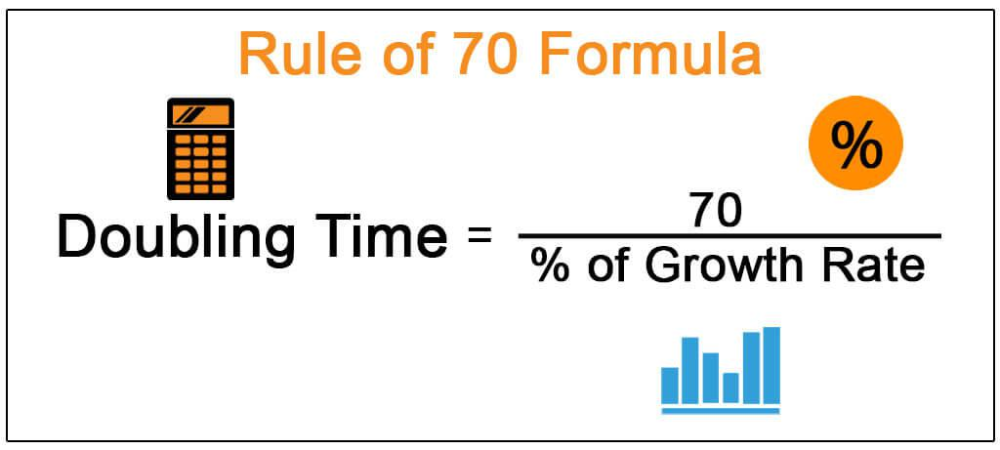

Investment strategies play a pivotal role in achieving financial growth and the doubling of wealth. As individuals seek to optimize their financial future, selecting the right investment approach becomes vital. Traditional strategies, focusing on diversification across various asset classes such as stocks, bonds, and mutual funds, are time-tested methods that help manage risk and promote steady returns. However, in the evolving financial landscape, new methodologies are emerging that promise heightened efficiency and returns.

Algorithmic trading, often referred to as algo trading, is one of these cutting-edge investment strategies garnering increasing attention. By employing automated systems to execute trades based on predefined criteria, algorithmic trading harnesses the power of technology for faster and more precise market actions. This approach leverages vast amounts of data and computational power to identify and seize market opportunities with a speed unattainable by human traders. Such capabilities make it a compelling choice for those seeking to enhance their portfolios and achieve financial goals more swiftly.



The integration of algorithmic trading into one's investment strategy can offer significant advantages. It allows for a systematic and emotion-free trading process, potentially leading to more consistent results. As market dynamics shift rapidly, incorporating algorithmic trading can position investors to better navigate the complexities of today’s markets.

This article examines various popular investment strategies, underscores their potential for financial growth, and situates algorithmic trading within this framework. By understanding these concepts, investors can empower themselves to make informed decisions, paving the way for a more secure financial future and the achievement of wealth longevity.

## Table of Contents

## Traditional Investment Strategies for Financial Growth

Traditional investment strategies play a significant role in fostering financial growth by emphasizing stability and risk management. Diversification is a key principle that underpins these strategies. By spreading investments across various asset classes such as stocks, bonds, and mutual funds, investors can reduce risk and increase the likelihood of steady returns. This approach mitigates the impact of poor performance within a single investment, balancing potential losses with gains in other areas.

Incorporating high-yield savings accounts and certificates of deposit (CDs) into a financial portfolio is another conservative strategy. These financial products offer fixed interest returns and are generally considered low-risk. High-yield savings accounts provide [liquidity](/wiki/liquidity-risk-premium) and safety while CDs, with their fixed terms and rates, ensure returns that are predictable. Although the growth from these investments may be modest, they offer security and act as a hedge against market volatility.

Real estate investment is a traditional strategy that provides both income and potential appreciation in asset value. Real estate can generate rental income, which contributes to cash flow, and property typically appreciates over time, thereby increasing the investment's capital value. Moreover, real estate serves as a tangible asset that can potentially balance more volatile investments in one's portfolio.

Additionally, investing in commodities, including precious metals like gold and silver, and agricultural products, can enhance portfolio diversification. Commodities often hold intrinsic value and may perform well during periods of economic uncertainty, offering a hedge against inflation and currency fluctuations. 

By employing a variety of these traditional approaches, investors can create a well-rounded portfolio that balances risk and return, providing a strong foundation for financial growth.

## The Rule of 72: Estimating Money Doubling Time

The Rule of 72 is an established financial principle used to estimate the number of years required for an investment to double, given a fixed annual rate of interest. This rule provides a valuable shortcut for investors, bypassing complex calculations to quickly gauge the potential growth of an investment.

### Formula

The formula is straightforward: 

$$
\text{Years to double} = \frac{72}{\text{Annual Interest Rate (\%)}}
$$

For example, if an investment offers a 6% annual return, the calculation would be:

$$
\text{Years to double} = \frac{72}{6} = 12 \text{ years}
$$

This example illustrates that at a 6% annual return, an investment will double in approximately 12 years. This simple rule underscores the significance of compounding in wealth accumulation.

### Explanation

The Rule of 72 is grounded in the principles of exponential growth, providing an understanding of how small differences in interest rates significantly impact investment growth over time. Typically attributed to financial planning and investment education, this rule assumes that the rate of return compounds annually. While the rule is an approximation, it is remarkably accurate for interest rates between 6% and 10%. The Rule of 72 does not require logarithmic understanding, making it accessible and easy to apply for quick calculations.

### Python Example

If you wish to calculate the doubling time using Python, a simple function can be implemented as follows:

```python
def years_to_double(rate):
    return 72 / rate

annual_rate = 6  # Annual interest rate in percentage
doubling_time = years_to_double(annual_rate)
print(f"Years to double your investment at {annual_rate}%: {doubling_time} years")
```

### Limitations

While the Rule of 72 provides quick estimates, it is an approximation. The rule assumes a fixed annual rate of return, not accounting for market fluctuations or additional contributions to the investment over time. For precise financial planning, more detailed calculations or simulations should be considered. Additionally, for interest rates outside the range of 6% to 10%, the accuracy of the rule diminishes, and alternative methods may be needed for a more exact determination.

## Algorithmic Trading: A Modern Investment Strategy

Algorithmic trading, often referred to as algo trading, is a method of executing trades utilizing automated and pre-programmed trading instructions accounting for variables such as time, price, and [volume](/wiki/volume-trading-strategy). This approach allows traders to process a large amount of data in real-time, identifying and capitalizing on minute market inefficiencies that would be challenging for human traders to detect at the same speed and efficiency.

The core advantage of [algorithmic trading](/wiki/algorithmic-trading) lies in its ability to analyze vast datasets rapidly, leveraging high-frequency trading ([HFT](/wiki/high-frequency-trading-strategies)) and statistical [arbitrage](/wiki/arbitrage) techniques. By employing algorithms, traders can execute transactions at a pace and frequency that human traders cannot achieve, often executing multiple trades within seconds to exploit small price discrepancies. This capability is crucial in markets where speed is of the essence, granting algorithmic traders a competitive edge over traditional trading methods.

Moreover, algorithmic trading minimizes human emotions, which can frequently lead to inconsistent decision-making. Automated systems follow predefined rules and parameters with rigorous discipline, ensuring that trades are executed following the set strategy irrespective of market conditions. This emotion-free approach helps maintain consistency, efficiency, and objectivity in trading operations, reducing the likelihood of errors caused by psychological factors like fear or greed.

Despite its numerous advantages, algorithmic trading is not devoid of risks. Algorithms must be carefully designed to account for market [volatility](/wiki/volatility-trading-strategies) and unexpected events. Robust back-testing on historical data and regular monitoring are essential to ensure that these systems perform as expected under varying market conditions. Moreover, algorithmic trading systems should be adaptable to new information, using [machine learning](/wiki/machine-learning) algorithms that allow them to learn and evolve with changing market dynamics.

The integration of sophisticated programming languages such as Python plays a critical role in developing and implementing trading algorithms. Python, in particular, is favored for its simplicity and vast libraries like NumPy, pandas, and scikit-learn, which provide the tools necessary for statistical analysis and machine learning applications in algorithmic trading. For instance, Python code can be used to implement a simple moving average crossover strategy as follows:

```python
import pandas as pd

# Load historical price data
data = pd.read_csv('historical_stock_data.csv')

# Calculate moving averages
data['SMA_50'] = data['Close'].rolling(window=50).mean()
data['SMA_200'] = data['Close'].rolling(window=200).mean()

# Define trading signals
data['Signal'] = 0
data['Signal'][50:] = np.where(data['SMA_50'][50:] > data['SMA_200'][50:], 1, -1)

# Implement logic for the algorithmic strategy
data['Position'] = data['Signal'].shift(1)
```

This snippet demonstrates how simple algorithms can be constructed to perform tasks that would be cumbersome for manual traders, hence showing the pragmatic application of algorithmic trading in financial markets.

## Advantages of Algorithmic Trading for Doubling Money

Algorithmic trading brings several advantages that can significantly boost the potential for doubling investments. One of the primary benefits is the speed and efficiency in executing trades. Automated systems can process and execute trades in milliseconds, allowing traders to capitalize on fleeting market opportunities that are often missed by manual trading. This swift execution minimizes slippage and optimizes profit potential by ensuring trades occur at the most favorable prices.

Another significant advantage is the elimination of human emotions from the trading process. Emotions like fear and greed can lead to irrational decision-making and inconsistent outcomes. By relying on predefined algorithms, traders can maintain discipline and adhere to a structured strategy that is grounded in data analysis. This removes emotional bias and leads to more consistent performance over time.

Algorithmic strategies are also highly adaptable to changing market conditions. Algorithms can be designed to analyze vast datasets to detect patterns and trends, allowing them to adjust strategies in real-time. This dynamic responsiveness means traders can better navigate market volatility and capitalize on emerging opportunities or mitigate risks, thus enhancing the potential for higher returns.

These advantages highlight the compelling benefits of algorithmic trading in the pursuit of financial growth, emphasizing its role in maximizing returns and increasing the likelihood of doubling an investment.

## Considerations and Risks in Algorithmic Trading

Back-testing and regular monitoring are essential components of managing risks in algorithmic trading. Back-testing involves running algorithms through historical market data to evaluate their performance over time. This process helps traders identify potential issues and optimize algorithmic strategies before deploying them in live trading environments. By analyzing historical performance, traders can adjust parameters, refine strategies, and ensure that algorithms align with risk tolerance and investment goals.

Moreover, regular monitoring is vital, as algorithms need continuous supervision to adapt to real-time market conditions and to ensure they are performing as expected. Even well-tested algorithms may face challenges when exposed to actual market dynamics, requiring ongoing evaluation and fine-tuning.

Market volatility can significantly impact the effectiveness of algorithms. Periods of high volatility may lead to widened bid-ask spreads, increased execution costs, and slippage. To maintain performance during volatile conditions, algorithms should be equipped with dynamic risk management protocols and must be capable of adapting to changing market patterns. Continuous adaptation and improvement of trading algorithms are critical to mitigating the adverse effects of market fluctuations.

Additionally, regulatory concerns and compliance are paramount when developing and implementing trading algorithms. Financial markets are governed by a range of regulations designed to ensure transparency, fairness, and stability. Algorithmic traders must ensure that their strategies comply with these regulations, which may include pre-trade risk checks, real-time monitoring, and post-trade analysis. Non-compliance can result in severe penalties, including fines and trading bans, underscoring the importance of integrating compliance checks within algorithmic trading systems.

In summary, successful algorithmic trading requires thorough back-testing, vigilant monitoring, adaptability to market conditions, and strict adherence to regulatory standards. By addressing these considerations, traders can better navigate the risks and leverage the advantages of algorithmic trading.

## Conclusion: Combining Strategies for Optimal Growth

Balancing traditional investment strategies with algorithmic trading can offer a comprehensive approach to financial growth. Traditional methods, such as diversification across various asset classes like stocks, bonds, and real estate, provide a foundation for reducing risk and ensuring a steady return. These strategies have long been established for their ability to weather market fluctuations and capitalize on long-term growth trends.

Integrating algorithmic trading with these conventional strategies can elevate financial growth potential. Algorithmic trading systems are engineered to execute trades at high speed and precision, using complex algorithms that analyze vast amounts of market data. This systematic approach allows traders to exploit short-term opportunities, often overlooked by traditional methods, without the emotional biases that can impair decision-making.

Understanding both the potential and the risks involved is key to leveraging these tools effectively. Traditional investments offer stability, whereas algorithmic trading can optimize returns through rapid market response and adaptability. However, algorithmic trading is not without its challenges. The development of robust trading algorithms requires back-testing and regular optimization to ensure their effectiveness in varying market conditions. Moreover, compliance with regulatory standards is essential to avoid potential legal pitfalls.

By educating oneself and possibly working with financial experts, investors can better reach their financial doubling goals. Financial experts can provide insights into the complexities of algo-trading and help align these strategies with your personal financial goals. Continuous education in both traditional and algorithmic strategies is crucial, as it empowers investors to navigate the ever-evolving landscape of financial markets.

Therefore, a well-rounded investment strategy that combines both traditional and algorithmic elements can harness the strengths of each approach, potentially leading to optimal financial growth. This strategic balance not only aims to double one's wealth but also secures it against the uncertainties of an unpredictable market.

## References & Further Reading

[1]: Bergstra, J., Bardenet, R., Bengio, Y., & Kégl, B. (2011). ["Algorithms for Hyper-Parameter Optimization."](https://papers.nips.cc/paper/4443-algorithms-for-hyper-parameter-optimization) Advances in Neural Information Processing Systems 24.

[2]: ["Advances in Financial Machine Learning"](https://www.amazon.com/Advances-Financial-Machine-Learning-Marcos/dp/1119482089) by Marcos Lopez de Prado

[3]: ["Evidence-Based Technical Analysis: Applying the Scientific Method and Statistical Inference to Trading Signals"](https://www.amazon.com/Evidence-Based-Technical-Analysis-Scientific-Statistical/dp/0470008741) by David Aronson

[4]: ["Machine Learning for Algorithmic Trading"](https://github.com/stefan-jansen/machine-learning-for-trading) by Stefan Jansen

[5]: ["Quantitative Trading: How to Build Your Own Algorithmic Trading Business"](https://www.amazon.com/Quantitative-Trading-Build-Algorithmic-Business/dp/1119800064) by Ernest P. Chan