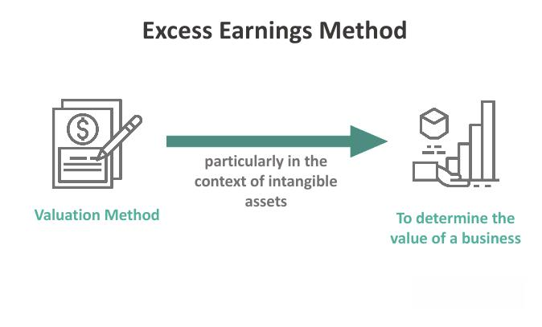

In the complex world of finance, identifying effective financial strategies is key to achieving long-term growth and stability. As global markets evolve, investors are increasingly looking for ways to maximize their returns while managing risk. One effective approach is earning interest through smart investment methods. This involves selecting financial instruments that not only provide a stream of income but also appreciate in value over time. Traditional investment vehicles like bonds, savings accounts, and mutual funds have long been used to generate interest income, offering varying degrees of risk and return.

However, the rise of technology has introduced new dimensions to investment strategies. Algorithmic trading, or algo trading, leverages advanced computer programs to execute trades with precision and speed that human traders cannot achieve. By utilizing algorithms designed to follow specific trading strategies, investors can take advantage of market inefficiencies and make data-driven decisions. This method minimizes emotional biases, enhances discipline, and opens up new opportunities for generating returns.



This article explores various strategies for interest-earning investments, alongside the efficient application of technology in trading. It examines both conservative and innovative approaches, providing a comprehensive understanding that empowers investors to make informed decisions about their financial portfolios. By incorporating both traditional and modern methodologies, investors can effectively navigate the complexities of the financial markets.

Whether you are a seasoned investor or new to the financial world, this guide offers valuable insights into managing your financial portfolio. It is designed to help you understand the benefits and risks associated with different strategies, ultimately guiding you toward achieving your financial goals.

## Table of Contents

## Understanding Interest Earning Investment Methods

Interest-earning investments are essential instruments in personal finance, offering a steady mechanism to accumulate wealth over time. Various methods exist, each with unique characteristics, risk levels, and potential returns. These investments not only provide a mechanism for protecting capital but also deliver periodic returns that can significantly enhance an investor's financial position.

Conservative options like savings accounts and certificates of deposit (CDs) are popular for their safety and predictability. Savings accounts offer immediate liquidity and modest interest rates, while CDs typically present higher interest rates in exchange for locking in the investment for a specified term. The Federal Deposit Insurance Corporation (FDIC) provides coverage for both, up to $250,000, ensuring investor security in these vehicles.[^1^]

For those seeking slightly higher returns, bonds and mutual funds represent dynamic alternatives. Bonds are debt securities issued by corporations or governments, and they pay interest at regular intervals. The bond market is diverse, encompassing government bonds (considered low-risk) and corporate bonds, which may offer higher yields to compensate for increased risk. Mutual funds, on the other hand, pool money from multiple investors to invest in a diversified array of stocks, bonds, or other securities, providing diversified exposure and professional management.

A pivotal concept underpinning these investments is the power of compounding. Compounding occurs when the earnings on an investment generate additional earnings. This exponential growth formula can be represented mathematically as:

$$
A = P \left(1 + \frac{r}{n}\right)^{nt}
$$

where $A$ is the future value of the investment, $P$ is the principal investment, $r$ is the annual interest rate, $n$ is the number of times the interest is compounded per year, and $t$ is the number of years the money is invested. This mechanism magnifies the returns over time, making it a formidable ally for long-term investors.

Investors can also employ strategies like bond laddering to optimize their portfolios. Bond laddering involves purchasing bonds with varying maturity dates. As each bond matures, the proceeds can be reinvested into new bonds, thereby maintaining a constant flow of income while potentially benefiting from varying [interest rate](/wiki/interest-rate-trading-strategies) environments. This strategy can smooth out interest rate risks and provide a blend of [liquidity](/wiki/liquidity-risk-premium) and income stability.

Selecting the appropriate interest-[earning](/wiki/earning-announcement) investment method necessitates a careful assessment of one's financial goals and risk tolerance. For example, an individual seeking stable returns with minimal risk may favor CDs or government bonds, while an investor with a higher risk threshold might allocate funds into corporate bonds or mutual funds. Tailoring investment choices to align with personal financial objectives ensures that the portfolio not only meets immediate needs but also contributes to long-term wealth accumulation.

[^1^]: Federal Deposit Insurance Corporation (FDIC). The standard insurance amount is $250,000 per depositor, per insured bank, for each account ownership category. See: "Understanding Deposit Insurance" (https://www.fdic.gov/resources/deposit-insurance/).

## The Role of Automated Trading Systems

Automation in trading, particularly through [algorithmic trading](/wiki/algorithmic-trading), has become an integral component of modern financial markets. Algorithmic trading employs computer programs to automate the decision-making and execution of trade orders, enabling transactions at speeds and frequencies that humans cannot achieve. These systems effectively remove emotional biases, promoting consistency and discipline in trading activities.

Algorithmic trading leverages mathematical models and quantitative analysis to detect market inefficiencies and opportunities more rapidly and accurately. These models often incorporate statistical methods, such as regression analysis or [machine learning](/wiki/machine-learning) techniques, to predict price movements and inform trading decisions. For instance, a basic moving average crossover strategy, a common algorithmic approach, generates buy or sell signals based on the crossing of short-term and long-term moving averages.

The advantages of algorithmic trading are notable. These systems can process vast amounts of market data in real time, quickly respond to changing conditions, and execute orders in a fraction of a second. Furthermore, algorithmic trading can optimize portfolio returns by deploying complex trading strategies, such as statistical [arbitrage](/wiki/arbitrage) or pairs trading, which aim to profit from the price discrepancies of correlated financial instruments.

However, algorithmic trading is not without its risks. The high-speed nature of these systems can lead to significant market [volatility](/wiki/volatility-trading-strategies), as evidenced by events such as the "Flash Crash" of 2010, where the Dow Jones Industrial Average plunged within minutes due to rapid algorithms conflicting with each other. Moreover, the development and maintenance of these systems require significant expertise and resources, including access to reliable data feeds and high-performance computing infrastructure.

For investors and traders, understanding the benefits and potential pitfalls of algorithmic trading is crucial for incorporating these systems into their financial strategies. By closely monitoring the performance of algorithms and adapting them to changing market conditions, traders can potentially enhance returns while managing risk. In conclusion, algorithmic trading represents a powerful tool for executing sophisticated trading strategies, offering both opportunities and challenges that require careful consideration and continuous adaptation.

## Algorithmic Trading Strategies

Algorithmic trading strategies have become an integral component of modern financial markets due to their ability to process large volumes of data and execute trades with precision and speed. Among the most widely recognized strategies are [trend following](/wiki/trend-following), arbitrage, and mean reversion, each offering unique approaches to trading.

Trend Following: This strategy focuses on capturing gains through the identification of market trends. Traders using trend following algorithms aim to buy assets that are trending upwards and sell those that are trending downwards. The underlying assumption is that assets in motion will continue in the same direction rather than reverse. A common approach to trend following involves technical indicators like moving averages, which help in identifying potential entry and [exit](/wiki/exit-strategy) points based on historical price patterns. For instance, a simple moving average crossover system could be implemented as follows in Python:

```python
import pandas as pd

# Load stock price data into a DataFrame
data = pd.read_csv('stock_data.csv')

# Calculate the short-term and long-term moving averages
data['Short_MA'] = data['Close'].rolling(window=50).mean()
data['Long_MA'] = data['Close'].rolling(window=200).mean()

# Generate trading signals
data['Signal'] = 0
data['Signal'][50:] = np.where(data['Short_MA'][50:] > data['Long_MA'][50:], 1, -1)

# Plot the results
data[['Close', 'Short_MA', 'Long_MA']].plot()
```

Arbitrage: This strategy seeks to exploit price differentials of the same asset in different markets or in different forms. This can be achieved by simultaneously buying and selling the asset in these markets to lock in profit. A simple example of arbitrage can be seen in currency markets where discrepancies might exist between exchange rates offered by different brokers. The key to successful arbitrage is speed, as these price differentials are often small and correct themselves quickly.

Mean Reversion: Mean reversion strategies are based on the assumption that asset prices tend to revert to their historical averages over time. Traders employing this strategy identify instances where prices are significantly above or below their historical average and trade on the anticipation that they will return to the average. This can be formulated using the Bollinger Bands technique, which involves the standard deviation of price data to create dynamic price channels.

Implementing these algorithmic trading strategies requires careful consideration of their risks and potential rewards. While trend following can be beneficial in capturing market [momentum](/wiki/momentum), it may suffer during sideways markets. Conversely, mean reversion might face challenges during strong trending periods. Arbitrage, although considered relatively low-risk, demands technological infrastructure capable of high-speed execution. Understanding these dynamics and aligning them with personal investment goals is critical for integrating algorithmic trading effectively.

## Balancing Traditional and Modern Financial Strategies

A diversified investment portfolio should ideally integrate both traditional and modern investment strategies. Traditional financial strategies, such as investments in stocks, bonds, and mutual funds, offer stability and a track record of predictable returns. These methods are often based on [fundamental analysis](/wiki/fundamental-analysis), focusing on the intrinsic value of financial instruments. They provide a foundation of reliability, allowing investors to earn steady income streams over time.

In contrast, algorithmic trading, a quintessential modern financial strategy, introduces a layer of technological innovation that can result in potentially higher yields. Algorithmic trading utilizes computer algorithms to execute trades based on predefined criteria at speeds human traders cannot match. This approach can capitalize on short-term market inefficiencies and trends, offering opportunities for enhanced returns. For example, by using a basic algorithmic strategy such as moving averages in Python:

```python
def moving_average(prices, window_size):
    return [sum(prices[i:i+window_size]) / window_size for i in range(len(prices) - window_size + 1)]

# Example usage:
prices = [100, 102, 104, 103, 102, 101]
print(moving_average(prices, 3))
```

Combining these traditional and modern approaches can effectively mitigate risk while maximizing potential returns, such as optimizing Sharpe Ratio, a measure defined as:

$$

\text{Sharpe Ratio} = \frac{E[R_p - R_f]}{\sigma_p} 
$$

Where $E[R_p]$ is the expected portfolio return, $R_f$ is the risk-free rate, and $\sigma_p$ is the portfolio standard deviation.

Assessing market conditions and aligning them with strategy objectives is crucial to balanced financial planning. Investors need to understand when to rely on the stability of traditional methods and when to exploit the dynamic potential of algorithmic trading. This analytical balance ensures that the portfolio is resilient against volatility yet poised for growth during opportunistic market movements.

Financial literacy and continuous learning are essential for adapting to the evolving financial landscape and integrating new strategies. Keeping abreast of market trends, technological advancements, and regulatory changes enables investors to make informed decisions. Continuous education, whether through formal courses or staying updated with financial news, empowers investors to refine their strategies and enhance their portfolios' performance. This ongoing process of education and adaptation is key to sustaining financial health and achieving long-term investment goals.

## Conclusion

Incorporating both interest-earning investment methods and advanced trading technologies into your financial strategy can significantly enhance financial outcomes. Success in financial markets relies on a comprehensive understanding of various investment avenues and the capacity to execute strategies with patience. Interest-earning investments, such as bonds and savings accounts, offer stability, while modern algorithmic trading can provide opportunities for increased returns through rapid and precise market actions.

Maintaining an awareness of emerging trends and adapting strategies to align with evolving market conditions are integral for investors aiming to maximize returns. This necessitates a commitment to continuous learning and attentiveness to shifts in financial landscapes. Engaging with financial markets with comprehensive knowledge and strategic agility allows investors to make informed decisions, mitigating risks and capitalizing on potential opportunities.

A successful financial strategy integrates careful planning and diversification. By balancing traditional and modern investment strategies, investors can mitigate risks while optimizing returns. Moreover, leveraging technology—such as algorithmic trading systems—can enhance decision-making processes, providing discipline and consistency in trading activities.

Ultimately, attaining financial goals requires a thoughtful approach that combines patience, strategic planning, and technological integration. Through this balance, investors can confidently navigate financial markets, aligning their portfolios with their financial objectives and achieving sustainable growth and stability.

## References & Further Reading

[1]: Bergstra, J., Bardenet, R., Bengio, Y., & Kégl, B. (2011). ["Algorithms for Hyper-Parameter Optimization."](https://dl.acm.org/doi/10.5555/2986459.2986743) Advances in Neural Information Processing Systems 24.

[2]: ["Advances in Financial Machine Learning"](https://www.amazon.com/Advances-Financial-Machine-Learning-Marcos/dp/1119482089) by Marcos Lopez de Prado

[3]: ["Evidence-Based Technical Analysis: Applying the Scientific Method and Statistical Inference to Trading Signals"](https://www.amazon.com/Evidence-Based-Technical-Analysis-Scientific-Statistical/dp/0470008741) by David Aronson

[4]: ["Machine Learning for Algorithmic Trading"](https://github.com/stefan-jansen/machine-learning-for-trading) by Stefan Jansen

[5]: ["Quantitative Trading: How to Build Your Own Algorithmic Trading Business"](https://www.amazon.com/Quantitative-Trading-Build-Algorithmic-Business/dp/1119800064) by Ernest P. Chan