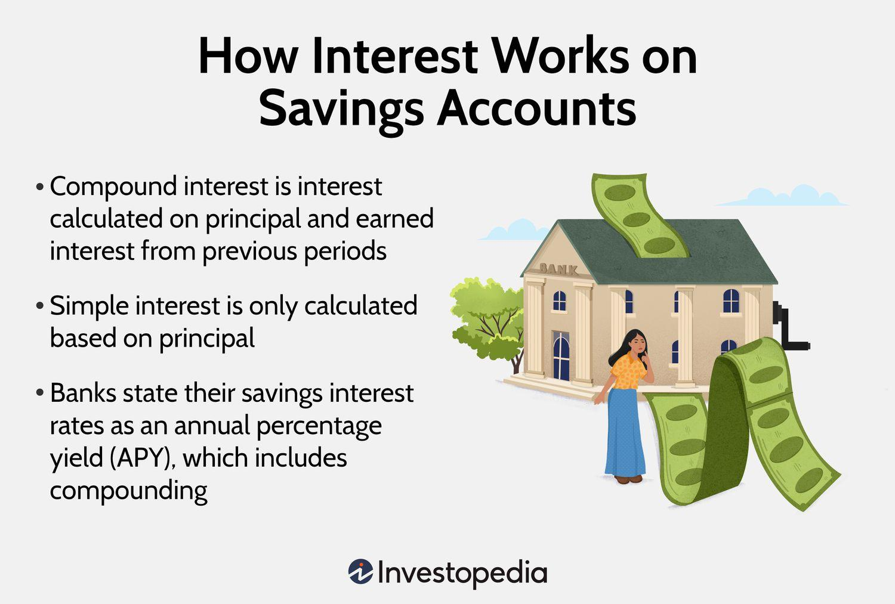

## Table of Contents

## What is interest and how does it work?

Interest is the money you pay for borrowing money or the money you earn when you save or invest money. When you borrow money from a bank or someone else, they charge you interest as a fee for letting you use their money. This is how banks and lenders make money. On the other hand, when you put money into a savings account or invest it, the bank or investment company pays you interest as a reward for letting them use your money.

Interest can be calculated in different ways, but the two main types are simple interest and compound interest. Simple interest is calculated only on the original amount of money you borrowed or saved, called the principal. For example, if you borrow $100 at a 5% simple interest rate for one year, you will owe $105 at the end of the year. Compound interest is calculated on the original amount plus any interest that has already been added. This means that over time, you earn or owe interest on interest, which can make the amount grow much faster. For example, if you have $100 in a savings account with a 5% annual compound interest rate, after one year you will have $105, and the next year you will earn interest on $105, not just the original $100.

## What are the basic types of interest - simple and compound?

Simple interest is easy to understand. It's the interest you pay or earn only on the original amount of money, called the principal. For example, if you borrow $100 at a 5% simple interest rate for one year, you will owe $105 at the end of the year. That's because the interest is calculated just on the $100 you borrowed, not on any interest that gets added later.

Compound interest is a bit more complicated but can make your money grow faster. It's the interest you pay or earn on both the original amount and any interest that has already been added. For example, if you put $100 in a savings account with a 5% annual compound interest rate, after one year you will have $105. The next year, you will earn interest on the new total of $105, not just the original $100. This means your money can grow quicker over time because you're earning interest on a bigger amount each time.

## How can you earn interest in a savings account?

You can earn interest in a savings account by putting your money in a bank. The bank uses your money to make loans to other people or businesses. In return, the bank pays you a small amount of money called interest. This interest is like a reward for letting the bank use your money. The more money you keep in your savings account, the more interest you can earn.

The interest you earn in a savings account can be simple or compound. Simple interest means you earn interest only on the money you originally put in the account. For example, if you put $100 in a savings account with a 1% simple interest rate, you will earn $1 after one year. Compound interest is different because you earn interest on the money you put in and also on the interest you've already earned. This means your money can grow faster over time. If you have $100 in an account with a 1% annual compound interest rate, after one year you will have $101, and the next year you will earn interest on $101, not just the original $100.

## What are certificates of deposit (CDs) and how do they generate interest?

Certificates of deposit, or CDs, are a type of savings account that you can open at a bank. When you put money into a CD, you agree to leave it there for a certain amount of time, like six months or a year. In return, the bank pays you interest. The interest rate on a CD is usually higher than what you would get from a regular savings account because you promise to keep your money in the CD for the whole time.

CDs generate interest in the same way as other savings accounts. The bank uses your money to make loans to other people or businesses. As a reward for letting the bank use your money, they pay you interest. The interest can be simple or compound. Simple interest means you earn interest only on the money you put in at the start. Compound interest means you earn interest on the money you put in and also on the interest you've already earned. This means your money can grow faster over time.

## How do money market accounts earn interest?

Money market accounts are another type of savings account where you can earn interest on your money. When you put your money into a money market account, the bank uses it to make loans or invest in other ways. In return, the bank pays you interest. The interest rate for a money market account is often higher than a regular savings account but can change over time.

The interest you earn in a money market account can be simple or compound. Simple interest means you earn interest only on the money you put in at the start. Compound interest means you earn interest on the money you put in and also on the interest you've already earned. This makes your money grow faster over time.

## What is a bond and how does it pay interest?

A bond is like a loan you give to a company or the government. When you buy a bond, you are lending them money. They promise to pay you back the money you lent them, plus some extra money called interest, after a certain amount of time. This time can be a few years or even longer.

Bonds pay interest in two main ways. One way is through regular interest payments, which are usually made every six months. For example, if you buy a bond that pays 5% interest each year, you might get half of that, or 2.5%, every six months. The other way is when the bond reaches the end of its time, called the maturity date. At this point, the company or government gives you back all the money you lent them, plus any final interest payment. This is how bonds can help you earn money over time.

## How can investing in stocks generate interest through dividends?

When you invest in stocks, you can earn money through dividends. Dividends are like rewards that some companies give to their shareholders. If you own stock in a company that pays dividends, they will give you a part of their profits. This is usually done every three months, but it can be different for each company. The amount you get depends on how many shares you own and how much the company decides to pay out.

Dividends are not the same as interest, but they work in a similar way. While interest is what you earn from lending money, dividends are what you earn from owning a piece of a company. Just like interest, dividends can add up over time and give you extra money. If you keep the dividends in your account, you might be able to buy more stocks, which could lead to even more dividends in the future. This is one way that investing in stocks can help your money grow.

## What are peer-to-peer lending platforms and how do they offer interest earnings?

Peer-to-peer lending platforms are websites where people can lend money to other people without using a bank. If you have some extra money, you can put it on the platform and lend it to someone who needs a loan. In return, the person borrowing the money pays you back with interest. This is like being a mini-bank yourself. The platform takes care of matching lenders with borrowers and handling the payments.

The interest you earn from peer-to-peer lending can be higher than what you get from a regular savings account or a CD. This is because you are taking on more risk by lending directly to other people. The platform usually charges a small fee for their services, but the interest you earn still goes straight to you. Just like with other types of investments, the more money you lend, the more interest you can earn. But remember, there's also a chance that the borrower might not pay you back, so it's important to be careful and understand the risks.

## How do retirement accounts like IRAs and 401(k)s earn interest?

Retirement accounts like IRAs and 401(k)s help you save money for when you stop working. You put money into these accounts, and they grow over time by earning interest or through investments. The money you put in can be invested in things like stocks, bonds, or mutual funds. These investments can earn you money in different ways. For example, if you invest in stocks, you might get dividends, which are like rewards from the company. If you invest in bonds, you get interest payments from the company or government that borrowed your money.

Both IRAs and 401(k)s can also earn interest through the money you keep in cash or money market funds within the account. This interest is usually lower than what you might earn from stocks or bonds, but it's still a way to grow your savings. The great thing about these retirement accounts is that the interest and earnings you get are often not taxed until you take the money out, which can help your savings grow even more over time.

## What are the risks associated with different methods of earning interest?

Earning interest can help your money grow, but it comes with risks. When you put your money in a savings account or a CD, the risk is low. You are very likely to get your money back plus the interest. But the interest rates might be low, so you won't earn much. If you choose a money market account, the interest rate can change, so you might earn more or less interest over time. There's still a low risk of losing your money, but you need to be ready for the interest rate to go up or down.

When you invest in bonds, the risk goes up a bit. If the company or government that borrowed your money has trouble paying back, you might not get all your interest or even your original money back. Stocks can be riskier because their value can go up and down a lot. If you get dividends from stocks, that's great, but if the stock price falls, you could lose money. Peer-to-peer lending can offer high interest rates, but it's risky because the person borrowing your money might not pay you back. Retirement accounts like IRAs and 401(k)s mix different investments, so they have a mix of risks. You could earn a lot, but you could also lose some of your money if the investments don't do well.

## How can one maximize interest earnings through financial strategies?

To maximize interest earnings, you need to think about where you put your money and how long you can leave it there. One good way is to use a mix of different accounts and investments. For example, you can put some money in a savings account for easy access, but also put some in a CD where you can't touch it for a while but it earns more interest. If you're okay with taking more risk, you can invest in bonds or stocks that pay dividends. The key is to spread your money around so some of it is safe and some of it is working harder to earn more.

Another important thing is to keep adding money to your accounts and investments over time. The more money you have in them, the more interest you can earn. If you can, try to put in extra money whenever you get a chance, like from a bonus at work or a tax refund. Also, think about how often the interest gets added to your account. If it's compound interest, where you earn interest on your interest, you want to find accounts that add it more often, like monthly instead of yearly. This can help your money grow faster.

## What advanced investment vehicles like REITs and annuities offer in terms of interest earnings?

Real Estate Investment Trusts (REITs) are a way to earn money from real estate without buying property yourself. When you invest in a REIT, you're buying a piece of a company that owns or finances real estate. These companies have to pay out most of their income to shareholders as dividends, which can be like interest earnings. The dividends from REITs can be higher than what you get from regular stocks or savings accounts, but they can also change based on how well the real estate market is doing. So, while REITs can help you earn more, they also come with more risk because the real estate market can go up and down.

Annuities are another way to earn money, but they work a bit differently. When you buy an annuity, you give a lump sum of money to an insurance company, and they promise to pay you back over time, kind of like interest. There are different types of annuities, but some of them guarantee you a certain amount of money each year, no matter what happens in the market. This can be a safe way to earn money, but the interest rates might be lower than what you could get from riskier investments. Annuities can be a good choice if you want steady income, but you need to be sure you understand all the terms and fees before you buy one.

## What are the methods for earning interest on investments?

Interest-earning investments are essential instruments in personal finance, offering a steady mechanism to accumulate wealth over time. Various methods exist, each with unique characteristics, risk levels, and potential returns. These investments not only provide a mechanism for protecting capital but also deliver periodic returns that can significantly enhance an investor's financial position.

Conservative options like savings accounts and certificates of deposit (CDs) are popular for their safety and predictability. Savings accounts offer immediate liquidity and modest interest rates, while CDs typically present higher interest rates in exchange for locking in the investment for a specified term. The Federal Deposit Insurance Corporation (FDIC) provides coverage for both, up to $250,000, ensuring investor security in these vehicles.[^1^]

For those seeking slightly higher returns, bonds and mutual funds represent dynamic alternatives. Bonds are debt securities issued by corporations or governments, and they pay interest at regular intervals. The bond market is diverse, encompassing government bonds (considered low-risk) and corporate bonds, which may offer higher yields to compensate for increased risk. Mutual funds, on the other hand, pool money from multiple investors to invest in a diversified array of stocks, bonds, or other securities, providing diversified exposure and professional management.

A pivotal concept underpinning these investments is the power of compounding. Compounding occurs when the earnings on an investment generate additional earnings. This exponential growth formula can be represented mathematically as:

$$
A = P \left(1 + \frac{r}{n}\right)^{nt}
$$

where $A$ is the future value of the investment, $P$ is the principal investment, $r$ is the annual interest rate, $n$ is the number of times the interest is compounded per year, and $t$ is the number of years the money is invested. This mechanism magnifies the returns over time, making it a formidable ally for long-term investors.

Investors can also employ strategies like bond laddering to optimize their portfolios. Bond laddering involves purchasing bonds with varying maturity dates. As each bond matures, the proceeds can be reinvested into new bonds, thereby maintaining a constant flow of income while potentially benefiting from varying [interest rate](/wiki/interest-rate-trading-strategies) environments. This strategy can smooth out interest rate risks and provide a blend of [liquidity](/wiki/liquidity-risk-premium) and income stability.

Selecting the appropriate interest-[earning](/wiki/earning-announcement) investment method necessitates a careful assessment of one's financial goals and risk tolerance. For example, an individual seeking stable returns with minimal risk may favor CDs or government bonds, while an investor with a higher risk threshold might allocate funds into corporate bonds or mutual funds. Tailoring investment choices to align with personal financial objectives ensures that the portfolio not only meets immediate needs but also contributes to long-term wealth accumulation.

[^1^]: Federal Deposit Insurance Corporation (FDIC). The standard insurance amount is $250,000 per depositor, per insured bank, for each account ownership category. See: "Understanding Deposit Insurance" (https://www.fdic.gov/resources/deposit-insurance/).

## How can one balance traditional and modern financial strategies?

A diversified investment portfolio should ideally integrate both traditional and modern investment strategies. Traditional financial strategies, such as investments in stocks, bonds, and mutual funds, offer stability and a track record of predictable returns. These methods are often based on [fundamental analysis](/wiki/fundamental-analysis), focusing on the intrinsic value of financial instruments. They provide a foundation of reliability, allowing investors to earn steady income streams over time.

In contrast, [algorithmic trading](/wiki/algorithmic-trading), a quintessential modern financial strategy, introduces a layer of technological innovation that can result in potentially higher yields. Algorithmic trading utilizes computer algorithms to execute trades based on predefined criteria at speeds human traders cannot match. This approach can capitalize on short-term market inefficiencies and trends, offering opportunities for enhanced returns. For example, by using a basic algorithmic strategy such as moving averages in Python:

```python
def moving_average(prices, window_size):
    return [sum(prices[i:i+window_size]) / window_size for i in range(len(prices) - window_size + 1)]

# Example usage:
prices = [100, 102, 104, 103, 102, 101]
print(moving_average(prices, 3))
```

Combining these traditional and modern approaches can effectively mitigate risk while maximizing potential returns, such as optimizing Sharpe Ratio, a measure defined as:

$$

\text{Sharpe Ratio} = \frac{E[R_p - R_f]}{\sigma_p} 
$$

Where $E[R_p]$ is the expected portfolio return, $R_f$ is the risk-free rate, and $\sigma_p$ is the portfolio standard deviation.

Assessing market conditions and aligning them with strategy objectives is crucial to balanced financial planning. Investors need to understand when to rely on the stability of traditional methods and when to exploit the dynamic potential of algorithmic trading. This analytical balance ensures that the portfolio is resilient against [volatility](/wiki/volatility-trading-strategies) yet poised for growth during opportunistic market movements.

Financial literacy and continuous learning are essential for adapting to the evolving financial landscape and integrating new strategies. Keeping abreast of market trends, technological advancements, and regulatory changes enables investors to make informed decisions. Continuous education, whether through formal courses or staying updated with financial news, empowers investors to refine their strategies and enhance their portfolios' performance. This ongoing process of education and adaptation is key to sustaining financial health and achieving long-term investment goals.

## References & Further Reading

[1]: Bergstra, J., Bardenet, R., Bengio, Y., & Kégl, B. (2011). ["Algorithms for Hyper-Parameter Optimization."](https://dl.acm.org/doi/10.5555/2986459.2986743) Advances in Neural Information Processing Systems 24.

[2]: ["Advances in Financial Machine Learning"](https://www.amazon.com/Advances-Financial-Machine-Learning-Marcos/dp/1119482089) by Marcos Lopez de Prado

[3]: ["Evidence-Based Technical Analysis: Applying the Scientific Method and Statistical Inference to Trading Signals"](https://www.amazon.com/Evidence-Based-Technical-Analysis-Scientific-Statistical/dp/0470008741) by David Aronson

[4]: ["Machine Learning for Algorithmic Trading"](https://github.com/stefan-jansen/machine-learning-for-trading) by Stefan Jansen

[5]: ["Quantitative Trading: How to Build Your Own Algorithmic Trading Business"](https://www.amazon.com/Quantitative-Trading-Build-Algorithmic-Business/dp/1119800064) by Ernest P. Chan