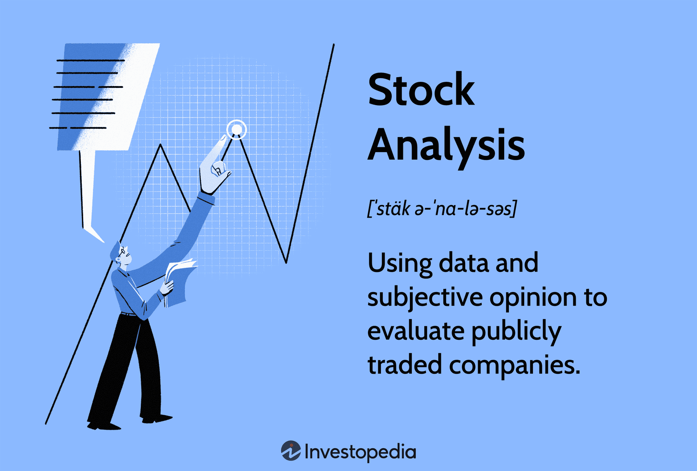

## Table of Contents

## What are the basic concepts of stock investing for beginners?

Stock investing is when you buy small pieces of a company, called shares, with the hope that the company will grow and the value of those shares will increase. When you own shares, you become a part-owner of the company. The price of a share goes up and down based on how well the company is doing and what people think about its future. If the company does well, the share price usually goes up, and you can sell your shares for more than you paid. If the company does poorly, the share price can go down, and you might lose money.

There are two main ways to make money from stocks. The first way is through capital gains, which means you buy a stock at a low price and sell it at a higher price. The second way is through dividends, which are payments companies sometimes give to shareholders from their profits. Not all companies pay dividends, so it's important to know what you're looking for when you invest. It's also important to understand that investing in stocks comes with risks. The stock market can be unpredictable, and there's always a chance you could lose some or all of your money. That's why it's a good idea to start small, do your research, and maybe even talk to a financial advisor before you begin.

## How can beginners start researching stocks with limited resources?

Beginners can start researching stocks by using free online resources. Websites like Yahoo Finance and Google Finance offer a lot of information about different companies, including their stock prices, financial reports, and news articles. These sites can help you learn about a company's performance and what people are saying about it. You can also use social media and online forums to see what other investors think about a stock. Just remember to be careful and check if the information you find is reliable.

Another good way to research stocks is by using educational resources like Investopedia and The Motley Fool. These websites have lots of articles and guides that explain how the stock market works and how to analyze stocks. They can teach you about important ideas like price-to-earnings ratio and dividend yield, which can help you decide if a stock is a good buy. Many public libraries also offer free access to financial databases and [books](/wiki/algo-trading-books) that can help you learn more about investing. By using these resources, you can start to understand the stock market better and make smarter investment choices.

## What free tools and resources are available for stock market analysis?

There are many free tools and resources that can help you analyze the stock market. Websites like Yahoo Finance and Google Finance are great places to start. They give you access to stock prices, historical data, financial statements, and news articles about different companies. You can use these sites to track how a company is doing and what people are saying about it. Another useful tool is Finviz, which lets you screen stocks based on different criteria like price, market cap, and performance. This can help you find stocks that fit your investment goals.

In addition to these websites, you can use social media and online forums to see what other investors think about a stock. Platforms like Reddit and Twitter can give you insights into what people are saying about a company, but always check if the information is reliable. Educational resources like Investopedia and The Motley Fool are also very helpful. They have lots of articles and guides that explain how to analyze stocks and understand important concepts like price-to-earnings ratio and dividend yield. By using these free tools and resources, you can start to make more informed decisions about your investments.

## How do you evaluate a company's financial health using publicly available data?

To evaluate a company's financial health, you can start by looking at its financial statements, which are often available on the company's website or through free financial websites like Yahoo Finance. The three main financial statements you should look at are the income statement, the balance sheet, and the cash flow statement. The income statement shows how much money the company made and spent over a period of time, helping you see if it's making a profit. The balance sheet shows what the company owns and owes at a specific point in time, giving you an idea of its financial position. The cash flow statement shows how money moves in and out of the company, which can help you understand if it has enough cash to keep running.

Another way to evaluate a company's financial health is by using financial ratios. These are simple calculations that help you compare different parts of the financial statements. For example, the debt-to-equity ratio tells you how much the company relies on debt compared to its own money. A high ratio might mean the company is taking on too much risk. The current ratio shows if the company has enough short-term assets to pay its short-term debts, which is important for its day-to-day operations. The return on equity (ROE) tells you how well the company is using the money shareholders have invested to make a profit. By looking at these ratios and financial statements, you can get a good idea of whether a company is financially healthy.

## What are the key financial ratios to look at when analyzing stocks?

When you're looking at stocks, some key financial ratios can help you understand how a company is doing. One important ratio is the price-to-earnings (P/E) ratio, which shows how much investors are willing to pay for each dollar of the company's earnings. A high P/E might mean people think the company will grow a lot in the future, while a low P/E might mean the company is not expected to grow much or is seen as riskier. Another useful ratio is the debt-to-equity ratio, which tells you how much the company relies on borrowed money compared to its own money. A high debt-to-equity ratio could mean the company is taking on too much risk.

Another ratio to consider is the current ratio, which shows if the company has enough short-term assets to pay its short-term debts. A current ratio above 1 is generally good because it means the company can cover its short-term obligations. The return on equity (ROE) is also important because it tells you how well the company is using the money shareholders have invested to make a profit. A high ROE means the company is good at turning shareholder money into more money. By looking at these ratios, you can get a better idea of a company's financial health and whether its stock might be a good investment.

## How can one use stock screeners to filter potential investment opportunities?

Stock screeners are tools that help you find stocks that match what you're looking for. You can use them to set different rules, like the price of the stock, how much the company is worth, or how fast it's growing. For example, if you want to find stocks that are cheap compared to their earnings, you can set the screener to show stocks with a low price-to-earnings ratio. This can help you narrow down a big list of stocks to just the ones that fit your investment goals.

Once you have your list of stocks from the screener, you can start looking at each one more closely. You might want to check the company's financial statements, read news articles about it, and see what other investors are saying. This can help you decide if a stock is really a good investment for you. Stock screeners make it easier to find potential opportunities, but it's important to do your own research too.

## What advanced techniques can be used to analyze stock market trends?

One advanced technique to analyze stock market trends is technical analysis. This method involves looking at charts and using different tools to find patterns in how stock prices move. For example, you might use moving averages to see if a stock's price is going up or down over time. Another tool is the Relative Strength Index (RSI), which can tell you if a stock is overbought or oversold. By studying these patterns, you can try to predict where the stock price might go next. Technical analysis doesn't tell you about the company itself, but it can help you make decisions based on what the market is doing.

Another advanced technique is [fundamental analysis](/wiki/fundamental-analysis), which looks at the company's financial health and what's happening in the world around it. This involves looking at financial statements to see if the company is making money and growing. You might also look at things like interest rates, the economy, and what's happening in the industry the company is in. By understanding these factors, you can get a better idea of whether a stock is a good investment. Fundamental analysis can help you see the big picture and make long-term investment decisions based on the company's actual performance and future potential.

## How do economic indicators affect stock market performance and investment decisions?

Economic indicators are important because they give us information about how the economy is doing, and this can affect the stock market. When the economy is growing, people might feel more confident and spend more money, which can be good for businesses and their stock prices. For example, if unemployment is low, more people have jobs and money to spend, which can help companies make more profit. On the other hand, if interest rates go up, borrowing money becomes more expensive, and this can slow down the economy and make stock prices go down. So, by keeping an eye on economic indicators like unemployment rates, inflation, and interest rates, investors can make better decisions about when to buy or sell stocks.

Another important economic indicator is the Gross Domestic Product (GDP), which measures the total value of all goods and services produced in a country. If GDP is growing, it usually means the economy is doing well, and this can be good for the stock market. But if GDP is shrinking, it might mean the economy is in trouble, and this can make stock prices fall. Investors also look at consumer confidence, which shows how people feel about the economy and their own finances. High consumer confidence can lead to more spending and higher stock prices, while low consumer confidence can lead to less spending and lower stock prices. By understanding these economic indicators, investors can get a better sense of the overall economic environment and adjust their investment strategies accordingly.

## What are the pros and cons of using algorithmic trading for stock purchases?

Algorithmic trading uses computer programs to buy and sell stocks quickly and automatically. One big advantage is that it can trade much faster than a person can, which can help take advantage of small price changes in the market. This can lead to making more money in a shorter time. Also, algorithms can follow a set of rules without getting tired or making emotional decisions, which can help keep trading consistent and disciplined. Another benefit is that it can handle a lot of data and make complex calculations to find the best times to buy or sell, which can be hard for a person to do by themselves.

However, there are also some downsides to using [algorithmic trading](/wiki/algorithmic-trading). One problem is that it relies a lot on the quality of the data it uses. If the data is wrong or outdated, the algorithm might make bad trading decisions. Also, because algorithms can trade so quickly, they can sometimes cause big price swings in the market, which can be risky. Another issue is that setting up and maintaining an algorithm can be complicated and might need a lot of technical knowledge. This means it might not be the best choice for everyone, especially beginners who are just starting to learn about investing.

## How can investors use options and futures to enhance their stock investment strategies?

Options and futures are tools that investors can use to make their stock investment strategies better. Options give you the right, but not the obligation, to buy or sell a stock at a certain price before a certain date. This can help you protect your investments from big price changes or make money if you think the stock price will go up or down. For example, if you own a stock and you're worried the price might go down, you can buy a "put" option to sell it at a higher price than the market might fall to. On the other hand, if you think a stock's price will go up, you can buy a "call" option to buy it at a lower price than you expect it to reach.

Futures are agreements to buy or sell something, like a stock, at a set price on a future date. They can be used to lock in prices and protect against big changes in the market. For example, if you think the price of a stock will go up, you can buy a futures contract to buy it later at today's price. This way, if the price does go up, you can still buy it at the lower price you agreed on. But, using options and futures can be risky and complicated, so it's important to learn about them and maybe talk to a financial advisor before you start using them in your investment strategy.

## What are the tax implications of different stock investment strategies?

When you invest in stocks, the money you make can be taxed in different ways depending on your strategy. If you buy a stock and sell it for more than you paid, you have a capital gain. If you hold the stock for less than a year before selling, the gain is taxed as regular income, which can be a high rate. But if you hold the stock for more than a year, the gain is taxed at a lower rate, called the long-term capital gains rate. This can save you money, so many people try to hold their stocks for at least a year before selling.

Another way to make money from stocks is through dividends, which are payments companies sometimes give to shareholders. Dividends are usually taxed at the same rate as long-term capital gains, which is lower than the rate for regular income. But, if you hold stocks in a retirement account like an IRA or 401(k), you don't have to pay taxes on the gains or dividends right away. Instead, you pay taxes when you take the money out of the account, and the rate depends on your income at that time. Understanding these tax rules can help you plan your investment strategy to keep more of your money.

## How can seasoned investors leverage global market analysis for better stock picks?

Seasoned investors can use global market analysis to find better stock picks by looking at what's happening in different countries and industries around the world. For example, if a country's economy is growing fast, companies there might do well, and their stocks could go up. By keeping an eye on things like a country's GDP, unemployment rates, and interest rates, investors can see which places might be good to invest in. They can also look at trends in different industries, like technology or healthcare, to find companies that are doing well no matter where they are.

Another way to use global market analysis is by looking at how different markets are connected. Sometimes, what happens in one country can affect stocks in another country. For example, if the U.S. dollar gets stronger, it might make American companies that sell things in other countries less competitive, and their stock prices could go down. By understanding these connections, investors can make smarter choices about where to put their money. They can also spread their investments across different countries to lower their risk, which is called diversification.

## References & Further Reading

[1]: Bergstra, J., Bardenet, R., Bengio, Y., & Kégl, B. (2011). ["Algorithms for Hyper-Parameter Optimization."](https://papers.nips.cc/paper/4443-algorithms-for-hyper-parameter-optimization) Advances in Neural Information Processing Systems 24.

[2]: ["Advances in Financial Machine Learning"](https://www.amazon.com/Advances-Financial-Machine-Learning-Marcos/dp/1119482089) by Marcos Lopez de Prado

[3]: ["Evidence-Based Technical Analysis: Applying the Scientific Method and Statistical Inference to Trading Signals"](https://www.amazon.com/Evidence-Based-Technical-Analysis-Scientific-Statistical/dp/0470008741) by David Aronson

[4]: ["Machine Learning for Algorithmic Trading"](https://github.com/stefan-jansen/machine-learning-for-trading) by Stefan Jansen

[5]: ["Quantitative Trading: How to Build Your Own Algorithmic Trading Business"](https://github.com/LucindaYa/quant-resources/blob/master/Quantitative%20Trading%20How%20to%20Build%20Your%20Own%20Algorithmic%20Trading%20Business.pdf) by Ernest P. Chan