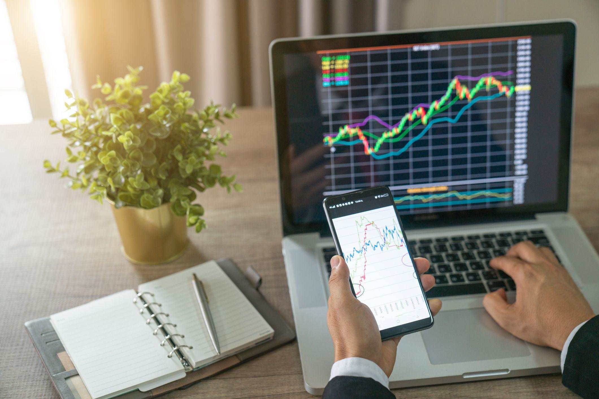

The trading world offers numerous opportunities for wealth accumulation, yet achieving success in trading requires a well-thought-out strategic approach. The process of trading involves careful planning and execution of strategies that align with both short-term objectives and long-term financial goals. This article aims to provide insights into a range of trading strategies that can significantly boost investment performance. 

Understanding different strategies such as trend-following, mean-reversion, and breakout trading can provide traders with the tools necessary to excel in unpredictable markets. Each strategy is built on foundational principles of market analysis, requiring traders to make informed decisions based on data and trends. Effective traders seamlessly integrate these strategies into their routines, adapting to the dynamism of the market environment.



Furthermore, algorithmic trading represents a noteworthy advancement in the trading landscape. It employs sophisticated computer algorithms to execute trades with unparalleled speed and precision, minimizing the emotional biases often associated with manual trading. Algorithmic strategies can efficiently handle large volumes of transactions, offering a distinct advantage in competitive markets.

Both novice and experienced traders can gain valuable insights from technology-driven strategies and practical trading tips discussed in this article. By mastering these methodologies, traders enhance their ability to navigate various market conditions, optimizing their investment returns. Through strategic application and continuous learning, traders can develop the confidence and efficiency needed to thrive in the financial markets.

## Table of Contents

## Understanding Trading Strategies

Trading strategies are critical tools for investors looking to achieve their financial objectives while effectively managing risk. Among the myriad strategies available, several are particularly noteworthy for their distinct characteristics and adaptability to different trading scenarios. 

One such strategy is **trend-following**, which is predicated on the notion that prices exhibit momentum and tend to move in consistent directions over time, irrespective of whether they are rising or falling. Trend-following is especially beneficial in markets characterized by sustained directional movements. Traders employing this strategy typically utilize technical indicators such as moving averages or the Moving Average Convergence Divergence (MACD) to identify and confirm trends.

Another widely utilized strategy is **mean-reversion**, which posits that asset prices, in due [course](/wiki/best-algorithmic-trading-courses), revert to their historical averages. This approach is favored in markets prone to [volatility](/wiki/volatility-trading-strategies), where prices frequently deviate from their mean. Statistical tools like Bollinger Bands are often employed to gauge the distance between prices and their moving averages. Mean-reversion traders may also use z-scores to determine the relative valuation of an asset compared to its historical mean. For example, a z-score greater than 2 or less than -2 might indicate overbought or oversold conditions, respectively:

$$
z = \frac{x - \mu}{\sigma}
$$

Where $x$ is the current price, $\mu$ is the historical mean, and $\sigma$ is the standard deviation.

**Breakout trading** is another strategy that capitalizes on assets breaching established support or resistance levels. This method aims to identify the onset of a new trend, potentially yielding substantial profits at the early stages of price movement. Traders often rely on tools such as price channels and trendlines, coupled with volume analysis, to authenticate breakouts. A successful breakout trade typically involves entering positions when an asset price surpasses a recent high (resistance) or drops below a recent low (support), amidst increasing trading volumes.

Implementing these strategies requires an adept understanding of market analysis and prudent decision-making. Each strategy caters to distinct trading styles—trend-following suits those favoring a patient, long-term approach, mean-reversion appeals to contrarian traders anticipating short-term corrections, while [breakout](/wiki/breakout-trading) trading is often preferred by those looking for quick, decisive gains.

The choice of a trading strategy should reflect the trader's personal risk tolerance and adaptation to market conditions. High-risk tolerance may encourage strategies with elevated potential returns, whereas conservative traders might gravitate towards methods with well-defined risk limitations. Furthermore, the efficacy of these strategies can be differing in varying market environments, emphasizing the importance of adaptability in strategy selection. Understanding and aligning these elements is a vital step towards successful investment outcomes.

## Tips for Improving Trading and Investment

Continuous practice and education are vital to achieving success in trading and investment. Mastery of trading strategies is not a static accomplishment, but rather an ongoing process requiring consistent effort and dedication. Traders must engage actively with both theoretical knowledge and practical experience to hone their skills.

Recording each trade is an essential practice that aids in learning from past mistakes and shaping future strategies. This practice allows traders to analyze their decision-making processes and gain insight into what works and what doesn't. Utilizing a trading journal or digital platform can facilitate this process, providing a structured way to document trades, define objectives, and log outcomes.

Traders should also be cautious of allowing others' opinions to overly influence their trading decisions. While consulting with peers and experts can provide valuable perspectives, it's crucial to maintain an independent critical approach. Each trader's risk tolerance, investment goals, and market understanding are unique, and decisions should be tailored to these individual parameters.

Maintaining mental clarity is another key aspect of successful trading. The volatile nature of financial markets can evoke stress and emotional reactions, which may cloud judgment. Techniques such as mindfulness, meditation, and adequate rest are beneficial in preserving mental sharpness. By ensuring cognitive health, traders can remain focused and capable of making well-reasoned decisions.

Regularly reviewing trades and performance is indispensable for ongoing improvement and skill enhancement. This retrospective analysis helps identify patterns or areas that need adjustment. It also reinforces successful strategies, providing a framework for consistent progress. Utilizing software tools and analytical methods can aid in this evaluative process, giving traders data-driven insights into their trading behavior.

By integrating these tips into their routines, traders can create a disciplined and reflective trading practice that supports both immediate and long-term investment success.

 to Algorithmic Trading

Algorithmic trading, widely recognized as algo trading, involves the use of sophisticated computer algorithms to execute trading orders with impressive speed and precision. Its core advantage lies in the ability to analyze market data and make trading decisions without human intervention, effectively minimizing emotional bias and enhancing operational efficiency. Through the use of predefined criteria, algorithms can process massive amounts of data at a pace far exceeding human capabilities, thus identifying and executing profitable opportunities with exceptional accuracy.

One of the notable benefits of [algorithmic trading](/wiki/algorithmic-trading) is its ability to manage large volumes of trades efficiently. This capacity is particularly advantageous for institutional traders and large-scale investors who need to handle significant market transactions without sacrificing speed or incurring market impact. By automating trade execution, algorithmic systems can execute thousands of trades across different markets and securities simultaneously, a feat that's virtually impossible with manual trading.

Understanding the components and requirements of algorithmic trading is essential for harnessing its full potential. These systems typically consist of data feeds, trading platforms, and execution interfaces. The data feeds provide real-time information on price movements, market conditions, and news events crucial for decision-making processes. Trading platforms serve as the environment where algorithms are developed, tested, and deployed. Execution interfaces connect the trading system to the marketplaces, ensuring timely order submissions and confirmations.

Algorithmic trading leverages data-driven strategies to capture market opportunities more quickly and efficiently than manual methods can achieve. For example, quantitative indices or statistical models might be used to forecast future price movements and identify trading signals. Code snippets, often developed in Python due to its comprehensive libraries and ease of use, allow traders to create and backtest their algorithms before implementation. Addressing basic algo trading, a simple moving average crossover strategy can be implemented as follows:

```python
import pandas as pd
import numpy as np

# Sample price data
prices = pd.Series([100, 101, 102, 108, 115, 120, 119, 121, 125, 130])

# Calculate short-term and long-term moving averages
short_window = 3
long_window = 5

short_mavg = prices.rolling(window=short_window, min_periods=1).mean()
long_mavg = prices.rolling(window=long_window, min_periods=1).mean()

# Generate trading signals
signals = np.where(short_mavg > long_mavg, 1.0, 0.0)

# Output signals
print(signals)
```

This code example showcases how simple algorithms can be developed to signal buying or selling based on moving average crossovers, illustrating the potential for executing complex strategies at scale. The ability to continuously analyze data and adapt strategies on-the-fly means that algorithmic trading systems can stay ahead of changing market conditions, offering traders a significant competitive advantage in fast-paced and volatile environments.

## Common Algorithmic Trading Strategies

Algorithmic trading strategies lever the power of computational algorithms to identify and exploit market inefficiencies, optimize execution, and capture price movements. These strategies range from simple rule-based systems to complex [machine learning](/wiki/machine-learning) models, each contributing to different facets of trading performance enhancement. Below are some of the common algorithmic trading strategies and considerations for their implementation:

**1. Arbitrage**

Arbitrage is the practice of exploiting price differences of identical or similar financial instruments across different markets or forms. It relies on the core principle that prices for the same asset should converge. Algorithmic [arbitrage](/wiki/arbitrage) strategies can execute trades at superhuman speeds, capturing even the smallest price discrepancies. A classic example would be triangular arbitrage in [forex](/wiki/forex-system) markets, where discrepancies among exchange rates provide the opportunity for profit without any net investment.

Mathematically, a simple arbitrage opportunity can be defined as:

$$
\text{Profit} = (P_1 - P_2) - \text{Transaction Costs}
$$

where $P_1$ and $P_2$ are prices from two different exchanges or markets.

**2. Market Making**

Market making involves providing [liquidity](/wiki/liquidity-risk-premium) to the markets by simultaneously offering to buy and sell the same asset, profiting from the bid-ask spread. Algorithmic market makers continuously adjust their quotes based on market conditions to remain competitive and manage inventory risk. An effective [market making](/wiki/market-making) strategy requires sophisticated algorithms that analyze large amounts of market data to predict short-term price directions and adjust spreads dynamically.

Python code to simulate a simple market making would look like:

```python
def market_maker(current_price, spread):
    bid_price = current_price - spread / 2
    ask_price = current_price + spread / 2
    return bid_price, ask_price

bid, ask = market_maker(100, 0.5)
print(f"Bid: {bid}, Ask: {ask}")
```

**3. Trend-Following**

Trend-following algorithms aim to capitalize on the [momentum](/wiki/momentum) of asset prices moving consistently in one direction over time. This strategy is based on the premise that prices tend to exhibit trends, and by aligning trades with these trends, profits can be realized. A common implementation uses moving averages to identify the start and end of a trend:

$$

\text{Buy Signal: } \text{Short-term MA} > \text{Long-term MA} 
$$
$$

\text{Sell Signal: } \text{Short-term MA} < \text{Long-term MA} 
$$

These strategies should be extensively backtested on historical data to evaluate their performance under various market conditions. Backtesting helps in tweaking parameters to enhance the strategy's robustness.

**Strategy Selection and Adaptation**

Choosing an appropriate algorithmic trading strategy requires understanding one's trading goals, risk tolerance, and market conditions. Each strategy has its strengths and weaknesses, necessitating a thorough evaluation of potential returns versus associated risks. Additionally, these strategies must be continually monitored and adapted to suit changing market environments, ensuring sustained profitability and reduced drawdowns.

Regular performance assessment and adjustment, utilizing real-time data analytics, ensure that algorithmic trading strategies remain effective. As markets evolve, integrating proprietary or open-source algorithmic libraries and frameworks can further enhance the capability to respond to shifts, ensuring consistently optimized trading decisions.

## Algorithmic Trading: Pitfalls and Considerations

Algorithmic trading has revolutionized financial markets by using computer algorithms to execute trades with unparalleled speed and precision. However, this technology-intensive approach is replete with potential pitfalls that traders must recognize and address to ensure successful outcomes.

Overfitting is a prominent concern in algorithmic trading. It occurs when a trading model is excessively tailored to historical data, capturing noise rather than the underlying market patterns. This leads to models that perform well on past data but fail in real-time trading. To mitigate overfitting, traders should employ cross-validation techniques and ensure that their models generalize well across different data sets. Python libraries like scikit-learn provide tools for effective model validation.

Ignoring transaction costs is another significant risk. High-frequency trading, characterized by large volumes of trades, can be severely impacted by transaction costs such as brokerage fees and slippage. These costs, when aggregated over countless trades, can erode profits. Hence, integrating transaction cost models into trading strategies is essential to maintaining profitability. For example, transaction costs can be incorporated into a strategy's [backtesting](/wiki/backtesting) phase, allowing for realistic performance evaluation.

Robust data and thorough backtesting form the backbone of successful algorithmic trading strategies. Comprehensive backtesting involves simulating a trading strategy on historical data to estimate its performance. Yet, the reliability of this process heavily depends on the quality of the data. Traders should ensure the use of clean, accurate, and representative historical data to avoid misleading results. Data vendors and APIs, such as Bloomberg or Alpha Vantage, are valuable sources of reliable financial data.

Understanding market regulations and ethical boundaries is crucial in avoiding legal and ethical pitfalls. Algorithmic trading strategies must comply with the legal frameworks established by financial authorities, which are designed to preserve market integrity and protect investors. Ethical considerations include avoiding strategies that manipulate markets or exploit vulnerabilities to the detriment of other participants.

Strategies must be resilient to varying market conditions to ensure long-term viability. Market dynamics are inherently unpredictable, and strategies must adapt to changes such as volatility spikes, liquidity shifts, and economic events. This involves regularly updating models and incorporating mechanisms that allow strategies to adapt to new conditions without manual intervention.

Transparency and regular performance monitoring are vital for the maintenance of effective algorithmic trading systems. By keeping a transparent audit trail of algorithmic decisions and system behavior, traders can identify issues, verify compliance, and fine-tune their strategies over time. Many traders employ monitoring dashboards that provide real-time insights into algorithm performance, making it easier to diagnose problems and optimize strategy execution.

In conclusion, while algorithmic trading offers numerous advantages, awareness and proactive management of its inherent pitfalls are crucial for sustainable success. By focusing on model robustness, cost considerations, compliance, adaptation, and transparency, traders can enhance their algorithmic trading strategies and navigate the complexities of financial markets more effectively.

## Conclusion

Trading is a craft that demands continuous learning and practice, as well as the flexibility to adapt to changing market conditions. A successful trading approach often involves integrating both manual and algorithmic strategies to enhance overall efficiency. Manual strategies, with their reliance on human intuition and expertise, can be complemented by algorithmic trading, which offers speed and precision through computer algorithms. This synergy allows traders to exploit both analytical insights and technical advancements effectively.

Risk management, discipline, and regular evaluation are pivotal to ensuring long-term profitability in trading endeavors. Risk management involves setting clear parameters for acceptable losses and gains, thereby safeguarding investments from unexpected market fluctuations. Discipline ensures adherence to established trading plans and prevents impulsive decisions driven by emotions. Constant evaluation, on the other hand, involves reviewing past trades and strategies to identify areas for improvement and to ensure alignment with current market trends.

Traders, whether beginners or experienced, who apply well-considered and tested strategies are more likely to see enhanced trading performance. Thoughtful strategy application involves a combination of thorough research, strategic planning, and efficient execution. Testing these strategies through backtesting or simulation before real-world application can mitigate potential risks and maximize returns.

Adopting a strategic and informed mindset is crucial for effectively navigating the complexities of financial markets. This involves staying informed about global economic indicators, market news, and trends that may impact trading outcomes. By being proactive and knowledgeable, traders can make informed decisions that position them advantageously within the market landscape, ultimately paving the way for greater trading success.

## References & Further Reading

[1]: Bergstra, J., Bardenet, R., Bengio, Y., & Kégl, B. (2011). ["Algorithms for Hyper-Parameter Optimization."](https://dl.acm.org/doi/10.5555/2986459.2986743) Advances in Neural Information Processing Systems 24.

[2]: ["Advances in Financial Machine Learning"](https://www.amazon.com/Advances-Financial-Machine-Learning-Marcos/dp/1119482089) by Marcos Lopez de Prado

[3]: ["Evidence-Based Technical Analysis: Applying the Scientific Method and Statistical Inference to Trading Signals"](https://www.amazon.com/Evidence-Based-Technical-Analysis-Scientific-Statistical/dp/0470008741) by David Aronson

[4]: ["Machine Learning for Algorithmic Trading"](https://github.com/stefan-jansen/machine-learning-for-trading) by Stefan Jansen

[5]: ["Quantitative Trading: How to Build Your Own Algorithmic Trading Business"](https://www.amazon.com/Quantitative-Trading-Build-Algorithmic-Business/dp/1119800064) by Ernest P. Chan