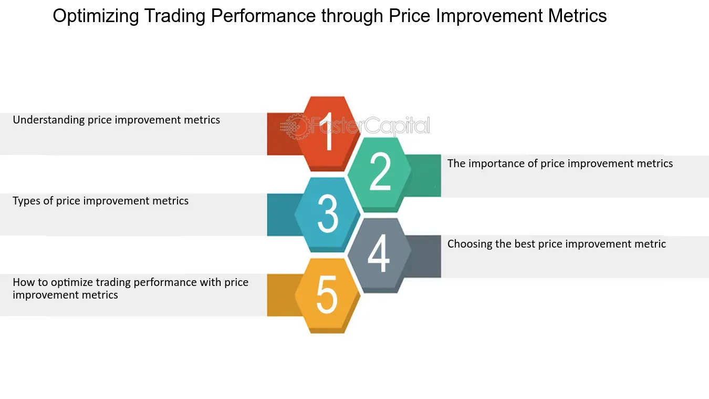

## Table of Contents

## What are the basic principles of trading that beginners should understand?

Trading involves buying and selling assets like stocks, currencies, or commodities to make a profit. One of the basic principles beginners should understand is the concept of supply and demand. When more people want to buy an asset than sell it, the price goes up. When more people want to sell than buy, the price goes down. Understanding this can help beginners predict how prices might change and make better trading decisions.

Another important principle is risk management. Trading always involves some level of risk, and beginners need to learn how to manage it. This means setting limits on how much money they are willing to lose on a single trade and not putting all their money into one investment. Using tools like stop-loss orders can help limit losses if the market moves against them. By managing risk, beginners can protect their money and stay in the game longer.

Lastly, beginners should understand the importance of having a trading plan. A trading plan is like a roadmap that outlines what to buy or sell, when to do it, and why. It helps traders stay disciplined and avoid making impulsive decisions based on emotions. A good plan also includes clear goals and a strategy for achieving them. By following a well-thought-out trading plan, beginners can increase their chances of success in the markets.

## How can setting clear trading goals improve performance?

Setting clear trading goals can really help improve your performance. When you have specific goals, you know exactly what you're aiming for. This makes it easier to stay focused and motivated. For example, if your goal is to make a certain amount of money each month, you can plan your trades around that target. This helps you avoid getting distracted by short-term market changes and keeps you on track.

Having clear goals also helps you measure your success. If you know what you want to achieve, you can see how well you're doing and make changes if needed. For instance, if you're not meeting your goals, you can look at your trading plan and see what's not working. Maybe you need to adjust your strategy or take on less risk. By setting and reviewing your goals regularly, you can keep improving and get better results over time.

## What role does a trading journal play in enhancing trading skills?

A trading journal is like a diary where you write down all your trades. It helps you keep track of what you did, why you did it, and what happened. By writing in your journal every time you trade, you can see patterns in your behavior. For example, you might notice that you make better trades in the morning than in the afternoon. Or you might see that you often lose money when you trade based on news events. This information can help you make better decisions in the future.

Using a trading journal also helps you learn from your mistakes. When you write down what went wrong, you can think about how to avoid the same mistakes next time. Maybe you traded too much or didn't stick to your plan. By looking back at your journal, you can see what works and what doesn't. This way, you can slowly improve your skills and become a better trader. Keeping a trading journal is a simple but powerful tool for anyone who wants to get better at trading.

## How can risk management strategies be applied to minimize losses?

Risk management strategies are important for traders because they help minimize losses. One key strategy is setting stop-loss orders. A stop-loss order is like a safety net that automatically sells your asset if its price drops to a certain level. This way, you can limit how much money you lose on a single trade. For example, if you buy a stock at $100 and set a stop-loss at $90, the stock will be sold if it drops to $90, so you only lose $10 per share.

Another strategy is not putting all your money into one trade. This is called diversification. By spreading your money across different assets, you reduce the risk of losing everything if one investment goes bad. For instance, instead of using all your money to buy one stock, you could buy a few different stocks or even invest in different types of assets like stocks, bonds, and commodities. This way, if one investment loses value, you still have others that might do well.

## What are the most effective technical analysis tools for beginners?

For beginners, some of the most effective technical analysis tools are moving averages and the Relative Strength Index (RSI). Moving averages help you see the overall trend of a stock's price over time. There are two types: simple moving averages (SMA) and exponential moving averages (EMA). SMA gives you an average price over a certain period, like 50 days or 200 days. EMA is similar but puts more weight on recent prices. By looking at where the price is compared to these moving averages, you can tell if the stock is trending up or down. If the price is above the moving average, it's usually a good sign, and if it's below, it might be time to sell.

Another useful tool is the Relative Strength Index (RSI). The RSI measures how fast and how much a stock's price is changing. It gives you a number between 0 and 100. If the RSI is above 70, it means the stock might be overbought, which could mean the price will go down soon. If it's below 30, the stock might be oversold, and the price could go up. By watching the RSI, beginners can get a sense of when a stock might be ready to change direction. These tools are easy to use and can help beginners make better trading decisions.

## How does understanding market sentiment help in making better trading decisions?

Understanding market sentiment means knowing how other people feel about the market. If most people are happy and think prices will go up, that's called bullish sentiment. If most people are worried and think prices will go down, that's called bearish sentiment. By paying attention to market sentiment, you can guess what might happen next. For example, if everyone is very excited about a stock, its price might go up because more people want to buy it. But if everyone is scared, the price might go down because more people want to sell.

Using market sentiment can help you make better trading decisions. If you see that everyone is very positive about a stock, you might want to buy it before the price goes up too much. But if you see that people are getting worried, you might want to sell before the price drops. You can check market sentiment by reading news, looking at social media, or using tools like the Fear and Greed Index. By understanding how others feel, you can make smarter choices about when to buy and sell.

## What advanced charting techniques can traders use to predict market movements?

Advanced charting techniques can help traders predict market movements by giving them more detailed information about price trends and patterns. One popular technique is using Fibonacci retracement levels. This tool helps traders find potential support and resistance levels by drawing lines between high and low points on a chart. These lines show where the price might stop falling or rising before it starts moving in the other direction. By looking at these levels, traders can guess where the price might go next and make better trading decisions.

Another useful technique is the use of candlestick patterns. Candlestick charts show the open, high, low, and close prices for a specific time period, and different patterns can signal whether the market might go up or down. For example, a "bullish engulfing" pattern, where a small red candle is followed by a larger green candle, can mean that the price might start going up. On the other hand, a "bearish engulfing" pattern, where a small green candle is followed by a larger red candle, can mean that the price might start going down. By recognizing these patterns, traders can predict market movements and plan their trades accordingly.

## How can algorithmic trading be utilized to enhance trading performance?

Algorithmic trading uses computer programs to buy and sell assets automatically. These programs follow a set of rules that traders create based on their trading strategy. By using algorithms, traders can make decisions faster than they could on their own. This is helpful because the market can change quickly, and being able to act fast can lead to better trades. Also, algorithms can look at a lot of data at once, which helps traders find good opportunities that they might miss if they were doing everything by hand.

Another way [algorithmic trading](/wiki/algorithmic-trading) can help is by taking emotions out of trading. When people trade, they can sometimes make bad decisions because they feel scared or excited. But a computer program doesn't have feelings, so it sticks to the plan no matter what. This can lead to more consistent results over time. Plus, algorithmic trading can be set up to trade 24/7, which means it can take advantage of opportunities even when the trader is not watching the market. By using algorithms, traders can improve their performance and make more money.

## What are the benefits of using high-frequency trading strategies?

High-frequency trading strategies use computers to buy and sell things very quickly. This can help traders make money by taking advantage of small changes in prices that happen all the time. Because the computer can do this much faster than a person, it can make more trades in a short time. This means traders can make a lot of small profits that add up to a big amount.

Another benefit of high-frequency trading is that it can help make the market more fair. When lots of people are using these strategies, it can make prices more accurate because there are so many trades happening. This can also make it easier for everyone to buy and sell things because there are always people trading. But, it's important for traders to be careful and understand the risks, because high-frequency trading can be complicated and things can change very quickly.

## How can traders leverage options and futures to optimize their trading portfolio?

Options and futures are special kinds of investments that traders can use to make their trading portfolio better. Options give traders the right, but not the obligation, to buy or sell an asset at a certain price before a certain date. This can be useful because it lets traders make money from big price changes without having to buy the actual asset. For example, if a trader thinks a stock will go up a lot, they can buy an option to buy that stock at a lower price later. If they're right, they can make a lot of money. Futures, on the other hand, are agreements to buy or sell an asset at a set price on a future date. They can help traders lock in prices and protect against big changes in the market.

Using options and futures can also help traders manage risk. By using options, traders can set up strategies that limit how much they can lose on a trade. For example, they can buy a put option to protect against a drop in the price of a stock they own. Futures can also be used to hedge, which means protecting against losses. If a trader thinks the price of oil will go down, they can sell oil futures to make money if the price does drop. By adding options and futures to their portfolio, traders can make more money and keep their investments safer.

## What psychological factors affect trading performance and how can they be managed?

One big thing that can affect how well someone trades is their emotions. Feelings like fear, greed, and excitement can make people do things they might not do if they were thinking clearly. For example, if a trader is feeling very excited about a stock, they might buy too much of it and not think about the risks. Or if they're scared, they might sell too soon and miss out on making more money. These emotions can lead to bad decisions and can hurt a trader's performance.

To manage these emotions, traders can use different strategies. One way is to have a good trading plan and stick to it, no matter how they feel. This helps them stay focused and not make choices based on their emotions. Another way is to take breaks and step away from trading when they start feeling too stressed or excited. It's also helpful to keep a trading journal to write down their feelings and see how those feelings affect their trades. By understanding and controlling their emotions, traders can make better decisions and improve their performance.

## How can continuous learning and adaptation to market changes be integrated into a trader's strategy?

Continuous learning and adaptation are very important for traders. The market is always changing, so traders need to keep learning new things to stay ahead. They can do this by reading [books](/wiki/algo-trading-books), taking courses, and following the news. It's also helpful to join trading communities where they can learn from other traders. By always trying to learn more, traders can understand the market better and find new ways to make money.

Adapting to market changes means changing their trading strategy when things are different. If a trader sees that a certain strategy isn't working anymore, they should be ready to try something new. They can use tools like [backtesting](/wiki/backtesting) to see how well their new ideas might work. By being flexible and willing to change, traders can keep making good trades even when the market is different. This helps them stay successful over time.

## What are the key aspects of understanding trading strategies?

Trading strategies are critical tools for investors looking to achieve their financial objectives while effectively managing risk. Among the myriad strategies available, several are particularly noteworthy for their distinct characteristics and adaptability to different trading scenarios. 

One such strategy is **trend-following**, which is predicated on the notion that prices exhibit momentum and tend to move in consistent directions over time, irrespective of whether they are rising or falling. Trend-following is especially beneficial in markets characterized by sustained directional movements. Traders employing this strategy typically utilize technical indicators such as moving averages or the Moving Average Convergence Divergence (MACD) to identify and confirm trends.

Another widely utilized strategy is **mean-reversion**, which posits that asset prices, in due [course](/wiki/best-algorithmic-trading-courses), revert to their historical averages. This approach is favored in markets prone to [volatility](/wiki/volatility-trading-strategies), where prices frequently deviate from their mean. Statistical tools like Bollinger Bands are often employed to gauge the distance between prices and their moving averages. Mean-reversion traders may also use z-scores to determine the relative valuation of an asset compared to its historical mean. For example, a z-score greater than 2 or less than -2 might indicate overbought or oversold conditions, respectively:

$$
z = \frac{x - \mu}{\sigma}
$$

Where $x$ is the current price, $\mu$ is the historical mean, and $\sigma$ is the standard deviation.

**Breakout trading** is another strategy that capitalizes on assets breaching established support or resistance levels. This method aims to identify the onset of a new trend, potentially yielding substantial profits at the early stages of price movement. Traders often rely on tools such as price channels and trendlines, coupled with volume analysis, to authenticate breakouts. A successful breakout trade typically involves entering positions when an asset price surpasses a recent high (resistance) or drops below a recent low (support), amidst increasing trading volumes.

Implementing these strategies requires an adept understanding of market analysis and prudent decision-making. Each strategy caters to distinct trading styles—trend-following suits those favoring a patient, long-term approach, mean-reversion appeals to contrarian traders anticipating short-term corrections, while [breakout](/wiki/breakout-trading) trading is often preferred by those looking for quick, decisive gains.

The choice of a trading strategy should reflect the trader's personal risk tolerance and adaptation to market conditions. High-risk tolerance may encourage strategies with elevated potential returns, whereas conservative traders might gravitate towards methods with well-defined risk limitations. Furthermore, the efficacy of these strategies can be differing in varying market environments, emphasizing the importance of adaptability in strategy selection. Understanding and aligning these elements is a vital step towards successful investment outcomes.

## What are Common Algorithmic Trading Strategies?

Algorithmic trading strategies lever the power of computational algorithms to identify and exploit market inefficiencies, optimize execution, and capture price movements. These strategies range from simple rule-based systems to complex [machine learning](/wiki/machine-learning) models, each contributing to different facets of trading performance enhancement. Below are some of the common algorithmic trading strategies and considerations for their implementation:

**1. Arbitrage**

Arbitrage is the practice of exploiting price differences of identical or similar financial instruments across different markets or forms. It relies on the core principle that prices for the same asset should converge. Algorithmic [arbitrage](/wiki/arbitrage) strategies can execute trades at superhuman speeds, capturing even the smallest price discrepancies. A classic example would be triangular arbitrage in [forex](/wiki/forex-system) markets, where discrepancies among exchange rates provide the opportunity for profit without any net investment.

Mathematically, a simple arbitrage opportunity can be defined as:

$$
\text{Profit} = (P_1 - P_2) - \text{Transaction Costs}
$$

where $P_1$ and $P_2$ are prices from two different exchanges or markets.

**2. Market Making**

Market making involves providing [liquidity](/wiki/liquidity-risk-premium) to the markets by simultaneously offering to buy and sell the same asset, profiting from the bid-ask spread. Algorithmic market makers continuously adjust their quotes based on market conditions to remain competitive and manage inventory risk. An effective [market making](/wiki/market-making) strategy requires sophisticated algorithms that analyze large amounts of market data to predict short-term price directions and adjust spreads dynamically.

Python code to simulate a simple market making would look like:

```python
def market_maker(current_price, spread):
    bid_price = current_price - spread / 2
    ask_price = current_price + spread / 2
    return bid_price, ask_price

bid, ask = market_maker(100, 0.5)
print(f"Bid: {bid}, Ask: {ask}")
```

**3. Trend-Following**

Trend-following algorithms aim to capitalize on the [momentum](/wiki/momentum) of asset prices moving consistently in one direction over time. This strategy is based on the premise that prices tend to exhibit trends, and by aligning trades with these trends, profits can be realized. A common implementation uses moving averages to identify the start and end of a trend:

$$

\text{Buy Signal: } \text{Short-term MA} > \text{Long-term MA} 
$$
$$

\text{Sell Signal: } \text{Short-term MA} < \text{Long-term MA} 
$$

These strategies should be extensively backtested on historical data to evaluate their performance under various market conditions. Backtesting helps in tweaking parameters to enhance the strategy's robustness.

**Strategy Selection and Adaptation**

Choosing an appropriate algorithmic trading strategy requires understanding one's trading goals, risk tolerance, and market conditions. Each strategy has its strengths and weaknesses, necessitating a thorough evaluation of potential returns versus associated risks. Additionally, these strategies must be continually monitored and adapted to suit changing market environments, ensuring sustained profitability and reduced drawdowns.

Regular performance assessment and adjustment, utilizing real-time data analytics, ensure that algorithmic trading strategies remain effective. As markets evolve, integrating proprietary or open-source algorithmic libraries and frameworks can further enhance the capability to respond to shifts, ensuring consistently optimized trading decisions.

## References & Further Reading

[1]: Bergstra, J., Bardenet, R., Bengio, Y., & Kégl, B. (2011). ["Algorithms for Hyper-Parameter Optimization."](https://dl.acm.org/doi/10.5555/2986459.2986743) Advances in Neural Information Processing Systems 24.

[2]: ["Advances in Financial Machine Learning"](https://www.amazon.com/Advances-Financial-Machine-Learning-Marcos/dp/1119482089) by Marcos Lopez de Prado

[3]: ["Evidence-Based Technical Analysis: Applying the Scientific Method and Statistical Inference to Trading Signals"](https://www.amazon.com/Evidence-Based-Technical-Analysis-Scientific-Statistical/dp/0470008741) by David Aronson

[4]: ["Machine Learning for Algorithmic Trading"](https://github.com/stefan-jansen/machine-learning-for-trading) by Stefan Jansen

[5]: ["Quantitative Trading: How to Build Your Own Algorithmic Trading Business"](https://www.amazon.com/Quantitative-Trading-Build-Algorithmic-Business/dp/1119800064) by Ernest P. Chan