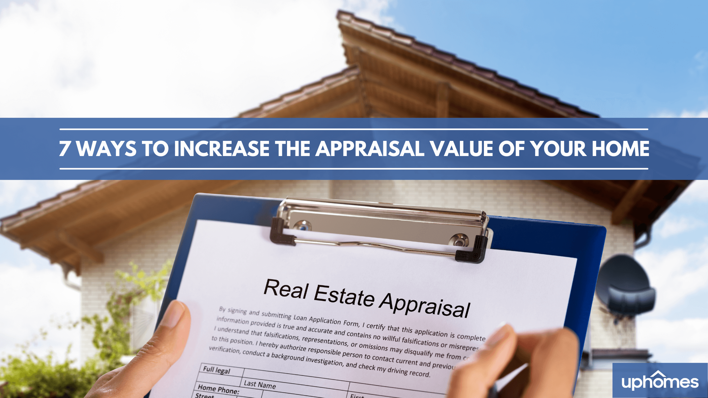

## Table of Contents

## What is home appraisal and why is it important?

A home appraisal is when a professional, called an appraiser, looks at a house and decides how much it is worth. They check things like the size of the house, how old it is, what it looks like inside and out, and what other houses nearby are selling for. The appraiser then gives a report with their opinion on the value of the house.

Home appraisal is important for a few reasons. If you want to sell your house, the appraisal helps you know a fair price to ask for it. If you are buying a house, the appraisal can tell you if the price the seller is asking is too high. Also, if you are getting a loan to buy a house, the bank will want an appraisal to make sure the house is worth the money they are lending. This helps protect both the buyer and the bank.

## How can basic home maintenance affect appraisal value?

Basic home maintenance can really change how much your home is worth when it's appraised. If you keep your home in good shape, like fixing leaky faucets, painting walls, and making sure the roof doesn't leak, it can make your home look better and last longer. Appraisers notice these things and might give your home a higher value because it looks well cared for and won't need big repairs soon.

On the other hand, if you don't do basic maintenance, your home's value can go down. Things like broken windows, peeling paint, or a messy yard can make your home look old and uncared for. Appraisers will see these problems and might think it will cost a lot to fix them, so they'll lower the value of your home. Keeping up with simple maintenance can make a big difference in what your home is worth.

## What are some simple cosmetic upgrades that can increase home value?

Simple cosmetic upgrades can make your home look better and increase its value. One easy thing to do is to paint the walls. Fresh paint in neutral colors can make your home look clean and modern. Another simple upgrade is to update the light fixtures. New, stylish lights can make your home feel brighter and more welcoming. Also, changing the cabinet hardware in the kitchen and bathroom can make a big difference. New knobs and handles can make your cabinets look new and more expensive.

Another good idea is to replace old, worn-out flooring. New carpet or a fresh layer of hardwood can make your home look much nicer. If you can't replace the flooring, a good cleaning can help too. Also, don't forget about the outside of your home. Simple things like cleaning the gutters, trimming the bushes, and adding some colorful flowers can make your home's curb appeal go up. These small changes can make a big impact on how much your home is worth.

## How does landscaping impact the appraisal value of a home?

Landscaping can really change how much your home is worth when it's appraised. When someone comes to look at your home, the first thing they see is the outside. If your yard looks nice with healthy plants, neat grass, and maybe some flowers, it can make your home look more valuable. Appraisers like to see that the outside of your home is taken care of because it shows that the whole house is probably well maintained. A good-looking yard can make people think your home is worth more money.

On the other hand, if your yard is messy with dead plants, overgrown bushes, or trash lying around, it can make your home's value go down. Appraisers will notice if the outside of your home looks bad and might think that the inside isn't taken care of either. They might also think it will cost a lot to fix up the yard, so they'll lower the value of your home. So, spending some time and money on your landscaping can be a smart way to make your home worth more when it's appraised.

## What role does kitchen renovation play in enhancing home appraisal value?

A kitchen renovation can really boost the value of your home when it's appraised. The kitchen is often called the heart of the home, and appraisers know that a modern, well-kept kitchen can make the whole house look better. If you update things like the countertops, cabinets, and appliances, it can make your kitchen look new and stylish. Appraisers like to see that the kitchen is in good shape because it's a big part of what buyers look at when they're thinking about buying a home.

On the other hand, if your kitchen looks old and worn out, it can bring down the value of your home. Things like old appliances, chipped countertops, and outdated cabinets can make your kitchen look bad. Appraisers will notice these problems and might think it will cost a lot to fix them, so they'll lower the value of your home. So, spending some money on a kitchen renovation can be a smart way to make your home worth more when it's appraised.

## Can bathroom upgrades significantly affect home appraisal values?

Yes, bathroom upgrades can really change how much your home is worth when it's appraised. Bathrooms are important rooms in a house, and if they look nice and modern, it can make the whole house seem more valuable. Things like new tiles, a fresh coat of paint, and updated fixtures can make a big difference. Appraisers notice if the bathrooms are in good shape because it shows that the house is well taken care of.

If your bathrooms are old and worn out, it can lower the value of your home. Things like cracked tiles, old faucets, and moldy walls can make your bathroom look bad. Appraisers will see these problems and might think it will cost a lot to fix them, so they'll lower the value of your home. So, spending some money on bathroom upgrades can be a good way to make your home worth more when it's appraised.

## How important is energy efficiency in increasing home appraisal values?

Energy efficiency is becoming more and more important when it comes to how much a home is worth. When a home uses less energy, it can save money on bills. Appraisers know this and might give a higher value to a home that has things like good insulation, energy-efficient windows, and modern heating and cooling systems. These things make the home more attractive to buyers who want to save money and help the environment.

On the other hand, if a home is not energy efficient, it might be worth less. Old windows, poor insulation, and outdated appliances can make a home use more energy, which means higher bills. Appraisers will notice these problems and might think it will cost a lot to fix them, so they could lower the value of the home. Making your home more energy efficient can be a smart way to make it worth more when it's appraised.

## What impact do smart home technologies have on home appraisal?

Smart home technologies can make your home worth more when it's appraised. Things like smart thermostats, security systems, and lights you can control with your phone make your home more modern and convenient. Appraisers like to see these technologies because they know that buyers are looking for homes that are easy to live in and can save them money on bills. A home with smart tech might be worth more because it's more attractive to buyers.

On the other hand, if your home doesn't have any smart tech, it might not be worth as much. Appraisers know that more and more people want homes with these modern features. If your home is missing out on smart tech, it might seem old-fashioned compared to other homes. Adding smart home technologies can be a good way to make your home worth more when it's appraised.

## How can adding extra living space influence the appraisal value?

Adding extra living space can make your home worth more when it's appraised. If you build a new room or finish a basement, it makes your home bigger. More space means more room for people to live and do things, which is something buyers like. Appraisers know that bigger homes are usually worth more money. So, if you add space, the appraiser might say your home is worth more because it's bigger and more useful.

But, you have to do the extra space the right way. If the new room or basement looks good and matches the rest of the house, it will help the value go up. But if the new space is not done well, like if it's messy or doesn't fit with the house, it might not help as much. Appraisers will look at how well the new space is made and if it adds to the house in a good way. So, making sure the extra space is done right can really help increase your home's value.

## What are the effects of historical or architectural significance on appraisal value?

If a home has historical or architectural significance, it can make the home worth more when it's appraised. This means the home might be old and important, or it might have a special design that people like. Appraisers know that homes like this are special and not easy to find. Buyers might want to live in a home with a cool history or a unique look, so they might be willing to pay more for it. This can make the appraisal value go up.

But, having historical or architectural significance can also make things harder. These homes might need special care or rules to follow to keep them looking the way they should. If the home needs a lot of work to stay in good shape, it might cost more money. Appraisers will think about these costs and might not raise the value as much if the home needs a lot of fixing. So, while being special can make a home worth more, it can also mean more work and money to keep it that way.

## How do local market trends affect home appraisal values?

Local market trends can really change how much a home is worth when it's appraised. If a lot of people want to buy homes in your area, it can make your home worth more. Appraisers look at what other homes nearby are selling for and how fast they're selling. If homes are selling quickly and for high prices, it means the market is hot, and your home might be worth more too. On the other hand, if not many people are buying homes in your area, it can make your home worth less. Appraisers will see that homes are not selling fast or for as much money, so they might give your home a lower value.

But, local market trends can also depend on what's happening in the bigger picture. Things like the economy, interest rates, and jobs can change how much people want to buy homes. If the economy is doing well and people have good jobs, more people might want to buy homes, which can make your home worth more. But if the economy is not doing well, people might not want to buy homes, and that can make your home worth less. So, appraisers have to think about both what's happening in your local area and what's happening everywhere else when they decide how much your home is worth.

## What advanced strategies can homeowners use to maximize appraisal value?

Homeowners can use some smart strategies to make their home worth more when it's appraised. One good idea is to keep up with what's happening in the local real estate market. If you know what other homes are selling for and what buyers want, you can make changes to your home that will make it more attractive. For example, if people in your area like homes with open floor plans, you might want to take down a wall to make your home more open. Also, getting a pre-appraisal can help. This is when you hire an appraiser to look at your home before you sell it. They can tell you what to fix or change to make your home worth more.

Another strategy is to focus on the big things that make a home valuable. This means making sure your home is in good shape and looks nice. You can do this by fixing any big problems, like a leaky roof or old plumbing, and by making your home look modern. Upgrading the kitchen and bathrooms can really help because these rooms are important to buyers. Also, making your home more energy efficient can make it worth more. Things like new windows, better insulation, and smart home tech can save money on bills and make your home more attractive to buyers. By focusing on these big things, you can make your home worth more when it's appraised.

## What are Traditional Appraisal Methods?

Traditional appraisal methods serve as the foundational framework for assessing the value of real estate properties. These approaches are critical not only for facilitating real estate transactions but also for ensuring fairness and accuracy in financial dealings involving properties. This section details the three primary traditional methods: the Sales Comparison Approach, the Cost Approach, and the Income Capitalization Approach.

The **Sales Comparison Approach** is one of the most widely used methods, primarily due to its intuitiveness and reliance on actual market activity. Under this method, the value of a property is estimated by examining recent sales of comparable properties within the same area. Adjustments are made for differences in characteristics such as location, size, and condition. This approach assumes that an informed buyer would not pay more for a property than the cost of acquiring a similar property with equivalent utility. Despite its widespread use, this method can be limited by the availability of comparable sales data, particularly in unique or rapidly changing markets.

The **Cost Approach** considers the expense required to reconstruct the property with added adjustments for depreciation. It is expressed by the formula:

$$
\text{Value} = \text{Cost of Reproduction/Replacement} - \text{Depreciation} + \text{Land Value}
$$

This approach can be particularly useful for newly constructed properties or specialty buildings where comparable sales data may be sparse. It operates on the principle that a rational buyer would not pay more for an existing property than the cost to build a similar one, taking into account depreciation and land value. However, its reliance on cost data can render it less effective in fluctuating markets or in cases where unique property characteristics do not align with typical construction expenses.

The **Income Capitalization Approach** is predominantly applied to income-generating properties, such as rental buildings. This method estimates value based on the anticipated income the property is expected to produce. The formula for this approach is often given by:

$$
\text{Value} = \frac{\text{Net Operating Income (NOI)}}{\text{Capitalization Rate (Cap Rate)}}
$$

Where Net Operating Income represents the income after operating expenses, and the Capitalization Rate reflects the investor's desired rate of return. This method's strength lies in its ability to directly relate a property’s profitability potential to its market value. However, its accuracy is contingent upon the reliability of income and expense projections as well as the appropriateness of the chosen capitalization rate.

Each of these traditional methods has its distinct advantages and limitations, determined largely by market conditions and specific property attributes. Thus, proficiency in these appraisal techniques is invaluable for real estate professionals seeking to conduct thorough and precise property evaluations.

## References & Further Reading

[1]: Bergstra, J., Bardenet, R., Bengio, Y., & Kégl, B. (2011). ["Algorithms for Hyper-Parameter Optimization."](https://dl.acm.org/doi/10.5555/2986459.2986743) Advances in Neural Information Processing Systems 24.

[2]: ["Advances in Financial Machine Learning"](https://www.amazon.com/Advances-Financial-Machine-Learning-Marcos/dp/1119482089) by Marcos Lopez de Prado

[3]: ["Evidence-Based Technical Analysis: Applying the Scientific Method and Statistical Inference to Trading Signals"](https://www.amazon.com/Evidence-Based-Technical-Analysis-Scientific-Statistical/dp/0470008741) by David Aronson

[4]: ["Machine Learning for Algorithmic Trading"](https://github.com/stefan-jansen/machine-learning-for-trading) by Stefan Jansen

[5]: ["Quantitative Trading: How to Build Your Own Algorithmic Trading Business"](https://www.amazon.com/Quantitative-Trading-Build-Algorithmic-Business/dp/1119800064) by Ernest P. Chan