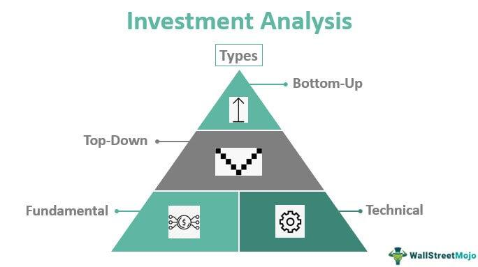

The increasing interest in investment strategies reflects a growing awareness of the importance of financial literacy in achieving personal and economic goals. As individuals seek to build wealth and ensure financial security, understanding the various avenues of investment has become crucial. This knowledge empowers individuals to make informed decisions that align with their long-term objectives.

Technology has fundamentally transformed the landscape of investing. One of the most significant developments is algorithmic trading, which uses computer algorithms to execute trades at speeds and frequencies impossible for human traders. This method relies on advanced mathematical models and systems to assess market data and make trading decisions, leveraging the power of big data and computational finance.



This article explores diverse investment strategies and provides actionable financial tips to enhance investment performance. It covers traditional investment options such as stocks, bonds, and ETFs, as well as the benefits of diversification. In addition, the article examines how to evaluate investment performance using metrics like return on investment (ROI) and the Sharpe ratio. A comprehensive understanding of algorithmic trading is also offered, including its strategies, potential risks, and the challenges it poses in the investment world.

By blending traditional investing strategies with innovative technologies, individuals can optimize their investment outcomes, paving the way for a more secure financial future.

## Table of Contents

## Understanding Investment Strategies

Investment strategies are systematic plans designed to guide individuals and institutions in selecting and managing investment portfolios to achieve financial goals. These strategies are essential for building wealth over time as they offer structured approaches to optimizing returns while managing risks. The significance of investment strategies lies in their ability to tailor investment plans to align with an individual's risk tolerance, financial goals, and time horizons, ensuring that investment decisions are consistent and result-driven.

Traditional investment options include stocks, bonds, and exchange-traded funds (ETFs), each with distinct characteristics and potential returns. Stocks represent ownership shares in a company, offering the potential for high returns through capital appreciation and dividends. They are, however, associated with higher volatility compared to other investment vehicles. Bonds are fixed-income instruments that involve lending money to an issuer, typically a corporation or government, in exchange for periodic interest payments and the return of principal at maturity. Bonds are generally considered lower risk than stocks, making them a staple for conservative investors seeking steady income. ETFs are investment funds traded on stock exchanges, comprising a diversified portfolio of assets such as stocks, bonds, or commodities. They provide investors with exposure to various asset classes with the flexibility of stock trading, offering diversification benefits while potentially reducing risk.

Diversification is a fundamental concept in investment strategy, based on the adage "don't put all your eggs in one basket." It involves spreading investments across various asset classes, sectors, or geographies to mitigate risk. The primary benefit of diversification is reducing the unsystematic risk associated with individual investments. By holding a variety of assets, the negative performance of some investments can be offset by the positive performance of others. Mathematically, the risk reduction from diversification is evident in the portfolio variance formula:

$$
\sigma^2_p = \sum_{i=1}^{n} w_i^2 \sigma_i^2 + \sum_{i=1}^{n} \sum_{j=1, j\neq i}^{n} w_i w_j \sigma_i \sigma_j \rho_{ij}
$$

Here, $\sigma^2_p$ represents the portfolio variance, $w_i$ represents the weight of asset $i$ in the portfolio, $\sigma_i^2$ represents the variance of asset $i$, and $\rho_{ij}$ represents the correlation between assets $i$ and $j$. A diversified portfolio tends to have a lower overall variance, particularly when asset correlations are less than perfect. Thus, diversification is key to achieving a more stable return profile while pursuing long-term wealth accumulation.

## Financial Tips for Better Investment Performance

In enhancing investment performance, setting clear financial goals and developing a structured plan stands as a fundamental step. Financial goals provide direction and a metric for evaluating progress. They facilitate decision-making by informing investors when and where to allocate resources, potentially leading to better returns. Establishing goals involves defining short-term and long-term objectives and understanding risk tolerance. With well-defined goals, investors can put a structured plan in place, detailing strategies, budget allocations, and timelines to achieve those objectives.

Financial literacy plays a critical role in making informed investment decisions. It involves understanding financial concepts such as interest rates, inflation, asset management, and valuation metrics. A high level of financial literacy enables investors to analyze investment options critically, understand market conditions, and mitigate risks. Knowledgeable investors are better equipped to navigate market complexities, recognize opportunities, and avoid potential pitfalls.

To enhance investment performance, consider the following actionable financial tips:

1. **Diversification**: Spread investments across various asset classes such as stocks, bonds, and real estate to mitigate risk. Diversification helps reduce the impact of poor performance in a single investment.

2. **Regular Reviews and Adjustments**: Periodically review your investment portfolio to ensure alignment with financial goals. Economic conditions and personal financial situations change; regular assessments help maintain optimal performance and risk balance.

3. **Cost Awareness**: Be mindful of transaction fees and management costs, which can erode investment returns. Opt for low-cost investment vehicles like index funds or ETFs to retain more of your returns.

4. **Emergency Fund**: Maintain an emergency fund to cover unexpected expenses, allowing your investment strategy to remain unaffected by sudden financial pressures.

5. **Continuous Learning**: Stay informed about market trends and financial news. Leveraging resources such as books, podcasts, and financial courses can enhance understanding and inform decision-making.

These strategies emphasize the importance of a proactive approach in managing investments. By setting defined goals, continually enhancing financial literacy, and implementing disciplined investment habits, investors can significantly improve their financial outcomes and overall investment performance.

## Evaluating Investment Performance

Evaluating investment performance is crucial for investors to ensure their strategies are generating the intended returns and aligning with their financial goals. Several metrics can be employed to measure investment performance, and among the most widely used are Return on Investment (ROI) and the Sharpe Ratio.

Return on Investment (ROI) is a straightforward metric that quantifies the profitability of an investment. It is calculated using the formula: 

$$
\text{ROI} = \left( \frac{\text{Current Value of Investment} - \text{Cost of Investment}}{\text{Cost of Investment}} \right) \times 100\%
$$

ROI provides a percentage that illustrates the efficiency of an investment, allowing investors to compare the profitability of different investments.

The Sharpe Ratio, on the other hand, assesses the return of an investment relative to its risk. It is computed as follows:

$$
\text{Sharpe Ratio} = \frac{\text{Average Return of the Investment} - \text{Risk-Free Rate}}{\text{Standard Deviation of Investment Returns}}
$$

The Sharpe Ratio helps investors understand how much excess return they are receiving for the [volatility](/wiki/volatility-trading-strategies) they are accepting. A higher ratio suggests a better risk-adjusted return.

Assessing risk-adjusted returns is essential because it provides a clearer picture of an investment's performance relative to the risk taken. Traditional metrics like ROI do not account for volatility or market risk, leading to potential misinterpretations of an investment's efficiency. Risk-adjusted measures like the Sharpe Ratio enable investors to compare two investments' returns directly, factoring in their associated risks.

Regularly reviewing and adjusting investment portfolios is important to maintaining alignment with financial goals and market conditions. To this end, investors should:

1. **Set Clear Benchmarks:** Establish performance benchmarks relevant to investment strategies and asset classes involved.
2. **Conduct Periodic Reviews:** Regularly (e.g., quarterly, biannually) review the performance of individual investments relative to benchmarks.
3. **Rebalance Portfolios:** Adjust the allocation of assets periodically to maintain desired risk levels. This may involve selling overperforming assets and buying underperforming ones to adhere to a target asset allocation.
4. **Stay Informed:** Keep abreast of market developments, economic indicators, and shifts in personal circumstances that may warrant portfolio adjustments.

By employing these methods, investors can navigate the complexities of financial markets more effectively and strive towards enhanced investment performance with a balanced risk-return profile.

 to Algorithmic Trading

Algorithmic trading, often referred to as algo trading, employs computer programs to execute trades based on predetermined strategies. It has gained prominence in the investment industry due to its ability to process vast amounts of data at unparalleled speed, execute trades with precision, and eliminate the emotional biases often associated with human decision-making. With the advancement of technology and increased market access, [algorithmic trading](/wiki/algorithmic-trading) has become a fundamental component of modern investment practices.

Algo trading strategies are based on a set of rules or conditions. These rules can be as straightforward as moving averages or as complex as multiple factors incorporating real-time data feeds. The primary advantage of algorithmic trading is its speed and efficiency; algorithms can analyze market conditions and execute trades in milliseconds, which is vital in high-frequency trading environments.

Furthermore, algorithmic trading minimizes human error and improves consistency. Unlike human traders, algorithms operate under strict logical guidelines without fatigue or emotional distraction. This consistency allows for exploiting slight price inefficiencies, which can cumulatively result in significant profits.

There are several common misconceptions about algorithmic trading. One is the belief that it guarantees profits. While algo trading can enhance trading efficiency and decision-making accuracy, it is still susceptible to financial market uncertainties. Proper risk management and strategy validation are essential to mitigate potential losses. 

Another misconception is that algorithmic trading is only accessible to large financial institutions. With the democratization of technology, retail traders now have access to sophisticated platforms capable of supporting algorithmic trading. These platforms often provide user-friendly programming interfaces, enabling individual investors to develop and backtest their trading strategies.

Algorithmic trading's rise has significantly influenced the financial markets by improving [liquidity](/wiki/liquidity-risk-premium) and altering trading dynamics. Its integration with various trading platforms ensures it is a crucial tool for both institutional and individual investors aiming to enhance their investment performance.

## Popular Algorithmic Trading Strategies

Algorithmic trading has become an integral part of the financial markets, leveraging advanced computational techniques to execute trades at optimal conditions. Among the various strategies employed, three stand out for their distinct approaches: [trend following](/wiki/trend-following), mean reversion, and [arbitrage](/wiki/arbitrage).

**Trend Following**

Trend following is predicated on the assumption that financial instruments, such as stocks or commodities, are more likely to continue a trend than to reverse it. This strategy analyzes past price data to identify asset behavior over time, enabling traders to profit from sustained market movements. By using indicators like moving averages, trend lines, and [momentum](/wiki/momentum) indicators, traders can ascertain the direction of the trend. For instance, a simple moving average crossover strategy, where traders buy when a short-term moving average crosses above a long-term moving average, exemplifies trend following.

In Python, a basic moving average strategy for trend following can be implemented as follows:

```python
import numpy as np
import pandas as pd

data = pd.read_csv('historical_prices.csv')  # Replace with your data source

data['MA50'] = data['Close'].rolling(window=50).mean()
data['MA200'] = data['Close'].rolling(window=200).mean()

data['Signal'] = 0
data['Signal'][50:] = np.where(data['MA50'][50:] > data['MA200'][50:], 1, 0)  # 1 for buy, 0 for sell
```

**Mean Reversion**

The mean reversion strategy is based on the concept that asset prices tend to oscillate around their historical average. It implies that deviations from this average will eventually return to the mean. Traders employing this strategy identify overbought or oversold conditions using indicators such as Bollinger Bands or the Relative Strength Index (RSI). When prices move beyond these bands, traders anticipate a reversion to the mean, executing trades accordingly.

A simple mean reversion strategy could utilize Bollinger Bands:

```python
data['MA20'] = data['Close'].rolling(window=20).mean()
data['STD'] = data['Close'].rolling(window=20).std()

data['Upper Band'] = data['MA20'] + (data['STD'] * 2)
data['Lower Band'] = data['MA20'] - (data['STD'] * 2)

data['Signal'] = 0
data['Signal'] = np.where(data['Close'] < data['Lower Band'], 1, np.where(data['Close'] > data['Upper Band'], -1, 0))
```

**Arbitrage**

Arbitrage exploits price inefficiencies across different markets or instruments. When an asset is priced differently in two separate markets, traders can simultaneously buy low and sell high to lock in risk-free profits. This strategy requires rapid execution and access to multiple markets, often possible only through automated systems due to the slim and quick nature of opportunities.

Arbitrage strategies often require sophisticated models and execution mechanisms that are deeply intertwined with technological advancements.

**The Role of Technology and Data in Refinement**

Technology and the vast accumulation of data have been pivotal in refining these strategies. With powerful computing resources, traders can now process enormous datasets to uncover patterns unnoticeable to the human eye. Machine learning algorithms enhance strategy development by predicting market movements based on complex patterns identified in historical data.

**Backtesting: A Critical Process**

Backtesting is an essential process in algorithmic trading, allowing strategies to be tested against historical data to evaluate their performance. This process helps in fine-tuning strategies by analyzing how they would have performed in past market conditions. A robust [backtesting](/wiki/backtesting) setup can prevent substantial losses by revealing potential pitfalls and optimization opportunities prior to deploying a strategy live.

In summary, by effectively utilizing strategies such as trend following, mean reversion, and arbitrage, along with the support of technology and thorough backtesting, traders can significantly enhance their algorithmic trading outcomes.

## Challenges and Risks of Algorithmic Trading

Algorithmic trading, while offering substantial advantages, is not without its challenges and risks. Key among these are the pitfalls of overfitting and data snooping. Overfitting occurs when a trading model is excessively tailored to historical data, capturing noise as if it were a signal. This results in a model that performs well in historical tests but poorly in live trading. A common way to mitigate overfitting is to use techniques such as cross-validation and to maintain a clear distinction between training and test datasets.

Data snooping, or the multiple testing problem, arises when a large number of hypotheses are tested on a dataset without accounting for the likelihood of spurious results. To avoid data snooping, it is crucial to apply proper statistical methods such as Bonferroni correction or to use out-of-sample testing where new data is not seen by the model during the training phase.

Understanding market microstructures is essential for effective algorithmic trading. Market microstructure refers to the mechanisms and rules that govern trading and the detailed processes behind transactions. It includes knowledge of order types, latency, liquidity, and price formation. A lack of understanding of market microstructures can lead to suboptimal trade execution and increased trading costs.

Risk management is a critical component of successful algorithmic trading. Strategies for managing risk include:

1. **Position Sizing:** Determine the appropriate amount to invest in each trade to manage potential losses.

2. **Stop Loss Orders:** Utilize stop-loss mechanisms to automatically exit losing positions after a predetermined threshold is reached.

3. **Diversification:** Spread out investments across various assets or strategies to mitigate the risk of loss from a single point of failure.

4. **Volatility Management:** Adjust trading strategies based on market volatility, using tools such as the VIX Index to gauge market sentiment and possible adjustments.

5. **Backtesting:** Consistently backtest trading strategies using historical data to evaluate performance and validate the strategy under different market conditions, while ensuring out-of-sample testing to confirm the model’s validity.

Algorithmic traders must stay vigilant against these challenges and implement robust risk management practices to safeguard their portfolios from potential pitfalls. Through careful strategy development, continued learning, and applying these risk management techniques, traders can considerably enhance the likelihood of achieving favorable outcomes.

## Conclusion

In conclusion, the landscape of investment strategies is undergoing significant transformation, driven predominantly by advancements in technology. Traditional investment strategies, which have long included options such as stocks, bonds, and ETFs, are now being complemented by more sophisticated, technology-driven approaches like algorithmic trading. This technological shift allows for enhanced decision-making capabilities by leveraging vast amounts of data for more informed and timely trades.

Investors are increasingly acknowledging the importance of blending traditional methodologies with modern techniques to achieve optimized outcomes. By integrating algorithmic trading strategies—such as trend following and arbitrage—with conventional investment principles like diversification and risk management, individuals and institutions can enhance their investment performance while managing risks more effectively.

Continuous learning and adaptation are crucial in this evolving financial landscape. Financial literacy remains a cornerstone for informed investing, highlighting the need for investors to remain educated and updated on both traditional and technological advancements. As investment strategies continue to evolve, the fusion of old and new can provide a broader spectrum of opportunities, allowing for more robust portfolio management and sustainable wealth accumulation. The journey toward financial success is ever-changing, and by harnessing the synergy between traditional practices and modern innovations, investors can navigate these changes with greater confidence and competence.

## References & Further Reading

[1]: Bergstra, J., Bardenet, R., Bengio, Y., & Kégl, B. (2011). ["Algorithms for Hyper-Parameter Optimization."](https://dl.acm.org/doi/10.5555/2986459.2986743) Advances in Neural Information Processing Systems 24.

[2]: ["Advances in Financial Machine Learning"](https://www.amazon.com/Advances-Financial-Machine-Learning-Marcos/dp/1119482089) by Marcos Lopez de Prado

[3]: ["Evidence-Based Technical Analysis: Applying the Scientific Method and Statistical Inference to Trading Signals"](https://www.amazon.com/Evidence-Based-Technical-Analysis-Scientific-Statistical/dp/0470008741) by David Aronson

[4]: ["Machine Learning for Algorithmic Trading"](https://github.com/stefan-jansen/machine-learning-for-trading) by Stefan Jansen

[5]: ["Quantitative Trading: How to Build Your Own Algorithmic Trading Business"](https://www.amazon.com/Quantitative-Trading-Build-Algorithmic-Business/dp/1119800064) by Ernest P. Chan