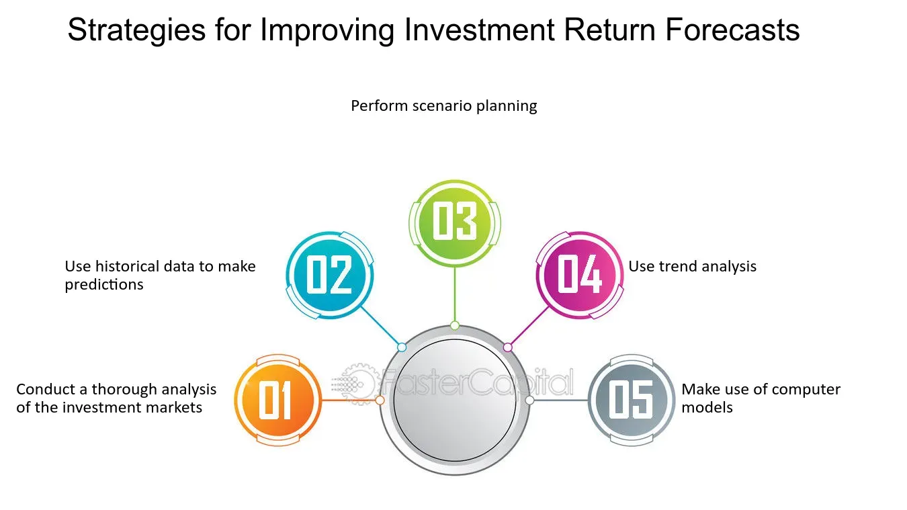

## Table of Contents

## What are the basic principles of investing for beginners?

Investing can seem hard at first, but it's based on some simple ideas that can help you grow your money over time. One key principle is to start early. The sooner you begin investing, the more time your money has to grow through the power of compounding. Another important idea is diversification. This means spreading your money across different types of investments, like stocks, bonds, and real estate, to reduce risk. If one investment doesn't do well, others might make up for it.

Another basic principle is to invest regularly, even if it's a small amount. This approach, called dollar-cost averaging, helps you buy more shares when prices are low and fewer when prices are high, which can lead to better long-term results. It's also crucial to understand your risk tolerance. Some investments, like stocks, can be more volatile but offer higher potential returns, while others, like bonds, are more stable but offer lower returns. Knowing how much risk you're comfortable with can help you choose the right investments for your goals.

Lastly, it's important to have a long-term perspective. Investing is not about getting rich quickly; it's about building wealth over time. This means you should be prepared to hold onto your investments for many years, even if there are short-term ups and downs in the market. By following these principles—starting early, diversifying, investing regularly, understanding your risk tolerance, and maintaining a long-term view—you can set yourself up for success in the world of investing.

## How can diversification improve investment performance?

Diversification helps improve investment performance by spreading your money across different types of investments. This means you're not putting all your eggs in one basket. If one investment does poorly, others might do well and balance it out. For example, if you only invest in one company's stock and that company has a bad year, you could lose a lot of money. But if you also have money in other stocks, bonds, or real estate, those might go up and help cushion the blow.

Another way diversification helps is by reducing the overall risk of your portfolio. Different investments react differently to market conditions. Stocks might go down when the economy is bad, but bonds might stay steady or even go up. By having a mix of investments, you can protect your money from big swings in any one area. This can lead to smoother, more consistent growth over time, which is what most investors want.

## What is the difference between active and passive investment strategies?

Active investing is when you or a fund manager pick specific investments, like stocks or bonds, trying to beat the market. They do a lot of research and make changes often, hoping to buy low and sell high. This can be exciting but it's also riskier and costs more because of the fees for the manager's work. It's like trying to win a race by picking the fastest horse, but you might not always guess right.

Passive investing is simpler and usually cheaper. Instead of picking individual investments, you invest in a whole market or a big group of investments through things like index funds or ETFs. These funds just try to match the performance of the market, not beat it. It's like betting on all the horses in the race instead of just one. This way, you don't have to guess which investments will do best, and you pay less in fees. Over time, passive investing often does just as well or better than active investing because it's steady and costs less.

## How can rebalancing a portfolio enhance investment returns?

Rebalancing a portfolio means adjusting it to keep the mix of investments the way you want it. Over time, some of your investments might grow faster than others. This can change the balance of your portfolio, making it riskier or less risky than you planned. By selling some of the investments that grew a lot and buying more of the ones that didn't, you bring your portfolio back to your original plan. This helps you stick to your investment strategy and manage risk better.

Rebalancing can also help improve your returns over time. When you sell investments that have gone up a lot, you're taking some profits. When you buy more of the investments that haven't done as well, you're buying them at a lower price. This is a bit like buying low and selling high, which can lead to better long-term results. Plus, rebalancing forces you to review your investments regularly, which can help you make smarter decisions and keep your portfolio on track.

## What role does asset allocation play in managing investment risk?

Asset allocation is about deciding how to split your money between different types of investments, like stocks, bonds, and cash. It's a big part of managing risk because each type of investment acts differently. Stocks can go up and down a lot, which means they're riskier but can give you bigger rewards. Bonds are usually more stable but don't grow as much. By choosing the right mix, you can make your investments fit how much risk you're okay with.

For example, if you're young and can handle more risk, you might put more money in stocks. This could lead to bigger gains over time, but it also means bigger ups and downs. If you're closer to retirement and want to be safer, you might put more in bonds. This way, your money won't jump around as much, but it won't grow as fast either. By changing your asset allocation, you can keep your investments in line with your goals and how much risk you're comfortable with.

## How can understanding market cycles help in timing investments?

Understanding market cycles can help you time your investments better by knowing when to buy or sell. Markets go through ups and downs, like a roller coaster. If you know where the market is in its cycle, you can try to buy when prices are low and sell when they're high. For example, during a downturn, when everyone is scared and selling, you might find good deals on stocks. If you believe the market will go back up, buying during a dip could lead to big gains later.

But timing the market perfectly is really hard. Even experts can't always guess right. So, instead of trying to jump in and out at the perfect time, it's often better to have a long-term plan. You can still use your knowledge of market cycles to make smarter choices, like slowly buying more when prices are low and maybe selling a bit when they're high. This way, you're not betting everything on one moment but using the cycles to guide your overall strategy.

## What are advanced techniques for using leverage in investing?

Using leverage in investing means borrowing money to buy more investments than you could with just your own money. This can make your gains bigger if your investments go up in value. For example, if you borrow money to buy more stocks and the stock price goes up, you make more money than if you had only used your own money. But it's risky because if the investments go down, you can lose more money than you started with. You still have to pay back the borrowed money, plus interest, even if your investments lose value.

Advanced techniques for using leverage include using margin accounts, options, and futures. A margin account lets you borrow money from your broker to buy stocks. You put up some of your own money as collateral, and the broker lends you the rest. Options and futures are more complicated. Options give you the right, but not the obligation, to buy or sell an asset at a certain price. Futures are contracts to buy or sell an asset at a set price on a future date. Both options and futures can be used to bet on price movements without buying the actual asset, which is a form of leverage. These techniques can lead to big gains but also big losses, so they need to be used carefully and with a good understanding of the risks involved.

## How can tax strategies be optimized to improve investment performance?

Tax strategies can help you keep more of your investment earnings. One way to do this is by using tax-advantaged accounts like IRAs and 401(k)s. These accounts let your investments grow without being taxed right away. You only pay taxes when you take the money out, which can be years later. This can make a big difference because your money can grow more over time without the drag of taxes. Another strategy is to hold onto your investments for more than a year. If you do this, you might pay a lower tax rate on your gains, called long-term capital gains tax, instead of the higher short-term rate.

Another way to optimize your tax strategy is by being smart about where you put your investments. For example, you might want to put investments that pay a lot of dividends in tax-advantaged accounts because dividends are taxed as income. By keeping them in an IRA or 401(k), you can avoid paying taxes on those dividends until you withdraw the money. Also, you can use tax-loss harvesting, which means selling investments that have gone down in value to offset the taxes on your gains. This can help lower your tax bill and improve your overall investment performance.

## What are the benefits and risks of using derivatives in an investment portfolio?

Using derivatives in an investment portfolio can offer some big benefits. Derivatives are like financial contracts that let you bet on the future price of something without actually buying it. One big benefit is that they can help you make money if you think the price of something will go up or down. For example, if you think a stock will go down, you can use a derivative to make money if it does. Another benefit is that derivatives can help you protect your other investments. If you own a lot of stocks and you're worried they might go down, you can use derivatives to kind of "insure" them against a drop in value. This can help you sleep better at night knowing your portfolio is a bit safer.

But derivatives also come with some big risks. They can be really complicated, and if you don't understand them well, you could lose a lot of money. Because derivatives let you bet with borrowed money, your losses can be bigger than what you started with. If the price moves against you, you might have to put in more money to cover your losses, or you could lose everything you put in. Also, derivatives markets can be less predictable than regular stock markets, so it's harder to know what will happen. Because of these risks, it's important to use derivatives carefully and only if you really understand how they work.

## How does behavioral finance impact investment decision-making and performance?

Behavioral finance looks at how people's feelings and habits can affect their choices about money and investing. It shows that people don't always make smart choices, even when they know better. For example, some people might sell their investments when the market goes down because they're scared, even though it might be a good time to buy more. Others might hold onto losing investments too long, hoping they'll go back up, instead of cutting their losses. These behaviors can hurt investment performance because they lead to buying high and selling low, which is the opposite of what you want to do.

Understanding behavioral finance can help you make better investment decisions. If you know about common mistakes like being too confident or following the crowd, you can try to avoid them. For example, you might set up rules for yourself, like not checking your investments every day to avoid making quick, emotional decisions. Or you might decide to stick to a long-term plan and not change it just because the market is going up or down. By being aware of how your feelings can affect your choices, you can work to make more rational decisions and improve your investment performance over time.

## What are the latest trends in algorithmic trading and how can they be applied to enhance investment returns?

Algorithmic trading is getting more popular and it's using new technology to make better and faster investment choices. One big trend is using machine learning and artificial intelligence. These tools can look at a lot of data quickly and find patterns that people might miss. This helps traders make better guesses about where the market is going. Another trend is high-frequency trading, where computers buy and sell investments in just a few seconds. This can make money from tiny changes in prices that happen all the time.

These trends can help improve your investment returns if you use them the right way. For example, you can use algorithms to spot good times to buy or sell investments based on past data. This can help you make more money by getting in and out of the market at the right times. But it's important to remember that these tools aren't perfect. They can make mistakes, and the market can be unpredictable. So, it's a good idea to use them as part of a bigger plan, not as the only way you make investment choices.

## How can investors use quantitative analysis to identify undervalued assets and optimize their investment strategy?

Quantitative analysis is a way for investors to use numbers and math to find good investments. It involves looking at things like a company's earnings, how much debt it has, and how fast it's growing. By using formulas and models, investors can figure out if a stock or other investment is priced too low compared to what it's really worth. This can help them find undervalued assets that might go up in value later. For example, if a company's stock price is low but its earnings are growing, that might be a sign that it's undervalued.

Once investors find undervalued assets, they can use quantitative analysis to make their investment strategy better. They can set up rules and models to decide when to buy or sell investments based on the numbers. This can help them make more money over time by buying low and selling high. But it's important to remember that numbers aren't everything. Sometimes, things like news or changes in the market can affect investments in ways that numbers can't predict. So, while quantitative analysis is a powerful tool, it's best used along with other kinds of research to make the smartest investment choices.

## What are the key aspects of understanding investment strategies?

Investment strategies are systematic plans designed to guide individuals and institutions in selecting and managing investment portfolios to achieve financial goals. These strategies are essential for building wealth over time as they offer structured approaches to optimizing returns while managing risks. The significance of investment strategies lies in their ability to tailor investment plans to align with an individual's risk tolerance, financial goals, and time horizons, ensuring that investment decisions are consistent and result-driven.

Traditional investment options include stocks, bonds, and exchange-traded funds (ETFs), each with distinct characteristics and potential returns. Stocks represent ownership shares in a company, offering the potential for high returns through capital appreciation and dividends. They are, however, associated with higher volatility compared to other investment vehicles. Bonds are fixed-income instruments that involve lending money to an issuer, typically a corporation or government, in exchange for periodic interest payments and the return of principal at maturity. Bonds are generally considered lower risk than stocks, making them a staple for conservative investors seeking steady income. ETFs are investment funds traded on stock exchanges, comprising a diversified portfolio of assets such as stocks, bonds, or commodities. They provide investors with exposure to various asset classes with the flexibility of stock trading, offering diversification benefits while potentially reducing risk.

Diversification is a fundamental concept in investment strategy, based on the adage "don't put all your eggs in one basket." It involves spreading investments across various asset classes, sectors, or geographies to mitigate risk. The primary benefit of diversification is reducing the unsystematic risk associated with individual investments. By holding a variety of assets, the negative performance of some investments can be offset by the positive performance of others. Mathematically, the risk reduction from diversification is evident in the portfolio variance formula:

$$
\sigma^2_p = \sum_{i=1}^{n} w_i^2 \sigma_i^2 + \sum_{i=1}^{n} \sum_{j=1, j\neq i}^{n} w_i w_j \sigma_i \sigma_j \rho_{ij}
$$

Here, $\sigma^2_p$ represents the portfolio variance, $w_i$ represents the weight of asset $i$ in the portfolio, $\sigma_i^2$ represents the variance of asset $i$, and $\rho_{ij}$ represents the correlation between assets $i$ and $j$. A diversified portfolio tends to have a lower overall variance, particularly when asset correlations are less than perfect. Thus, diversification is key to achieving a more stable return profile while pursuing long-term wealth accumulation.

## How can we evaluate investment performance?

Evaluating investment performance is crucial for investors to ensure their strategies are generating the intended returns and aligning with their financial goals. Several metrics can be employed to measure investment performance, and among the most widely used are Return on Investment (ROI) and the Sharpe Ratio.

Return on Investment (ROI) is a straightforward metric that quantifies the profitability of an investment. It is calculated using the formula: 

$$
\text{ROI} = \left( \frac{\text{Current Value of Investment} - \text{Cost of Investment}}{\text{Cost of Investment}} \right) \times 100\%
$$

ROI provides a percentage that illustrates the efficiency of an investment, allowing investors to compare the profitability of different investments.

The Sharpe Ratio, on the other hand, assesses the return of an investment relative to its risk. It is computed as follows:

$$
\text{Sharpe Ratio} = \frac{\text{Average Return of the Investment} - \text{Risk-Free Rate}}{\text{Standard Deviation of Investment Returns}}
$$

The Sharpe Ratio helps investors understand how much excess return they are receiving for the [volatility](/wiki/volatility-trading-strategies) they are accepting. A higher ratio suggests a better risk-adjusted return.

Assessing risk-adjusted returns is essential because it provides a clearer picture of an investment's performance relative to the risk taken. Traditional metrics like ROI do not account for volatility or market risk, leading to potential misinterpretations of an investment's efficiency. Risk-adjusted measures like the Sharpe Ratio enable investors to compare two investments' returns directly, factoring in their associated risks.

Regularly reviewing and adjusting investment portfolios is important to maintaining alignment with financial goals and market conditions. To this end, investors should:

1. **Set Clear Benchmarks:** Establish performance benchmarks relevant to investment strategies and asset classes involved.
2. **Conduct Periodic Reviews:** Regularly (e.g., quarterly, biannually) review the performance of individual investments relative to benchmarks.
3. **Rebalance Portfolios:** Adjust the allocation of assets periodically to maintain desired risk levels. This may involve selling overperforming assets and buying underperforming ones to adhere to a target asset allocation.
4. **Stay Informed:** Keep abreast of market developments, economic indicators, and shifts in personal circumstances that may warrant portfolio adjustments.

By employing these methods, investors can navigate the complexities of financial markets more effectively and strive towards enhanced investment performance with a balanced risk-return profile.

 to Algorithmic Trading

Algorithmic trading, often referred to as algo trading, employs computer programs to execute trades based on predetermined strategies. It has gained prominence in the investment industry due to its ability to process vast amounts of data at unparalleled speed, execute trades with precision, and eliminate the emotional biases often associated with human decision-making. With the advancement of technology and increased market access, [algorithmic trading](/wiki/algorithmic-trading) has become a fundamental component of modern investment practices.

Algo trading strategies are based on a set of rules or conditions. These rules can be as straightforward as moving averages or as complex as multiple factors incorporating real-time data feeds. The primary advantage of algorithmic trading is its speed and efficiency; algorithms can analyze market conditions and execute trades in milliseconds, which is vital in high-frequency trading environments.

Furthermore, algorithmic trading minimizes human error and improves consistency. Unlike human traders, algorithms operate under strict logical guidelines without fatigue or emotional distraction. This consistency allows for exploiting slight price inefficiencies, which can cumulatively result in significant profits.

There are several common misconceptions about algorithmic trading. One is the belief that it guarantees profits. While algo trading can enhance trading efficiency and decision-making accuracy, it is still susceptible to financial market uncertainties. Proper risk management and strategy validation are essential to mitigate potential losses. 

Another misconception is that algorithmic trading is only accessible to large financial institutions. With the democratization of technology, retail traders now have access to sophisticated platforms capable of supporting algorithmic trading. These platforms often provide user-friendly programming interfaces, enabling individual investors to develop and backtest their trading strategies.

Algorithmic trading's rise has significantly influenced the financial markets by improving [liquidity](/wiki/liquidity-risk-premium) and altering trading dynamics. Its integration with various trading platforms ensures it is a crucial tool for both institutional and individual investors aiming to enhance their investment performance.

## References & Further Reading

[1]: Bergstra, J., Bardenet, R., Bengio, Y., & Kégl, B. (2011). ["Algorithms for Hyper-Parameter Optimization."](https://dl.acm.org/doi/10.5555/2986459.2986743) Advances in Neural Information Processing Systems 24.

[2]: ["Advances in Financial Machine Learning"](https://www.amazon.com/Advances-Financial-Machine-Learning-Marcos/dp/1119482089) by Marcos Lopez de Prado

[3]: ["Evidence-Based Technical Analysis: Applying the Scientific Method and Statistical Inference to Trading Signals"](https://www.amazon.com/Evidence-Based-Technical-Analysis-Scientific-Statistical/dp/0470008741) by David Aronson

[4]: ["Machine Learning for Algorithmic Trading"](https://github.com/stefan-jansen/machine-learning-for-trading) by Stefan Jansen

[5]: ["Quantitative Trading: How to Build Your Own Algorithmic Trading Business"](https://www.amazon.com/Quantitative-Trading-Build-Algorithmic-Business/dp/1119800064) by Ernest P. Chan