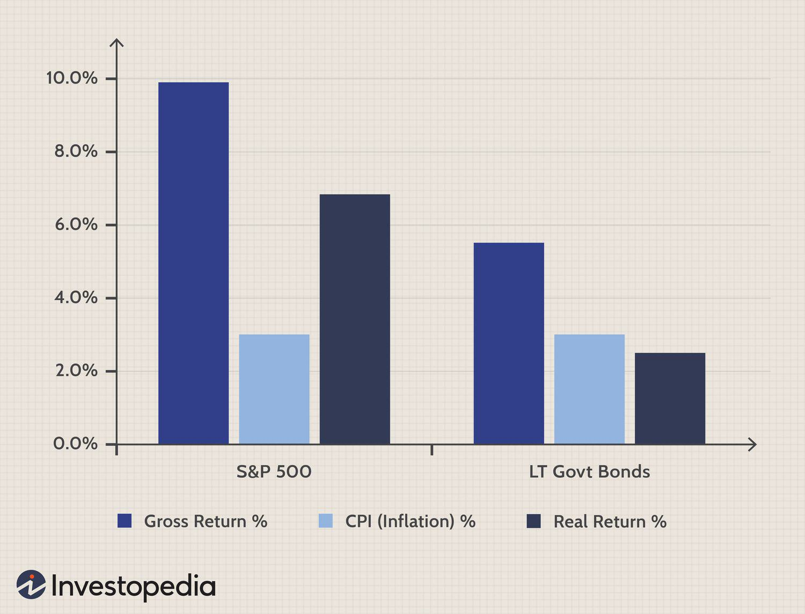

Investment strategies play a crucial role in enhancing financial performance and improving portfolio returns. Fundamentally, these strategies encompass a variety of methods employed by investors to maximize their financial gains while minimizing risks. Traditionally, investors have relied on approaches such as equities over bonds, diversification, and active versus passive management to construct robust portfolios. Diversification, for example, involves spreading investments across various asset classes to reduce exposure to any single asset's volatility. Such strategies have served as the backbone of investment practices for decades.

In recent years, however, the landscape of investing has evolved significantly with the advent of technology-driven solutions, notably algorithmic trading. Algorithmic trading utilizes advanced algorithms and computer programs to execute trades based on predetermined criteria. This modern approach offers a systematic method to not only streamline trading activities but also to optimize investment strategies. By processing vast amounts of data swiftly and accurately, algorithmic trading can identify market inefficiencies and opportunities that may be overlooked by human traders. This technological advantage can lead to improved portfolio returns by leveraging high-frequency trading and sophisticated analytics.

Algorithmic trading integrates both traditional and modern investment strategies to yield better outcomes. For instance, by using algorithms to automate strategies like trend following, mean reversion, or statistical arbitrage, investors can achieve consistent results while mitigating human errors and emotional decision-making. Moreover, the ability to backtest these strategies against historical data allows for ongoing refinement and performance enhancement.

The aim of this article is to guide readers through effective investment strategies leveraging algorithmic trading. By understanding the interplay between traditional investment principles and modern technology-driven techniques, investors can position themselves more competitively in the financial market. Ultimately, this knowledge empowers investors to optimize their strategies and achieve optimal portfolio returns, reflecting the dynamic and ever-evolving nature of investment practices.

## Table of Contents

## Investment Strategies for Financial Performance

Investment strategies play a crucial role in enhancing financial performance by optimizing returns while managing risks. Among these strategies, the allocation between equities and bonds, diversification, and expense management are fundamental components.

Equities and bonds represent distinct asset classes with differing risk-return profiles. Equities typically offer higher potential returns compared to bonds but come with greater [volatility](/wiki/volatility-trading-strategies). Investors often prefer equities to bonds for long-term growth, particularly in a bullish market environment. The choice between these asset classes hinges on individual risk tolerance and investment horizons. For instance, a younger investor with a higher risk appetite might allocate more towards equities, while someone nearing retirement may prefer the stability and regular income provided by bonds.

Diversification reduces risk by spreading investments across various assets, sectors, or geographic regions. By not "putting all eggs in one basket," investors can minimize the impact of specific asset underperformances. Diversification can be achieved through various means, such as combining domestic and international stocks, holding a mix of large-cap, mid-cap, and small-cap stocks, and including alternative investments like real estate or commodities.

Expense management is another critical aspect. Reducing costs can significantly enhance net returns over time. Investors must be cognizant of management fees, transaction costs, and tax implications when constructing portfolios. Low-cost index funds or exchange-traded funds (ETFs) are popular for their minimal expenses compared to actively managed funds.

Risk management practices are central to enhancing financial performance. These include asset allocation, hedging, and stop-loss orders. Asset allocation strategically distributes investments among asset classes to balance risk and reward, tailored to an investor's risk tolerance and goals. For example, a 60/40 ratio of equities to bonds has traditionally been a benchmark for balanced portfolios. Hedging techniques, such as options or futures contracts, can protect against adverse price movements, while stop-loss orders automatically sell a security at a predefined price to limit losses.

Investors often face the choice between active and passive investment strategies. Active investing involves making specific investment decisions with the aim of outperforming market indices through stock [picking](/wiki/asset-class-picking) and market timing. This strategy requires substantial research and expert market analysis but comes with higher fees and no guaranteed success. Conversely, passive investing tracks indices and requires less frequent trading, offering lower costs and consistent, market-matching returns. The decision-making process involves considering the investor's time, resources, and confidence in market predictions.

Finally, portfolio construction involves decisions about investing in small versus large companies. Large-cap companies are usually well-established with stable revenues and are considered safer, especially during market downturns. In contrast, small-cap stocks can offer substantial growth potential but entail higher risk. An investor's portfolio may benefit from a combination of both to leverage the stability of large companies and the growth opportunities of smaller ones.

In summary, investment strategies that balance asset allocation, diversification, and expense management with effective risk practices, aligned with active or passive preferences, can markedly enhance financial performance. A well-constructed portfolio considers all these facets and adapts to market conditions and individual goals.

## Understanding Portfolio Returns

Portfolio returns are a key measure of an investor's success, representing the gains or losses achieved from an investment portfolio over a specific period. These returns are crucial for evaluating financial performance and determining an investor's ability to meet financial goals.

### Factors Affecting Portfolio Returns

1. **Market Conditions**: The performance of financial markets significantly impacts portfolio returns. Economic indicators, interest rate changes, geopolitical events, and investor sentiment can cause market fluctuations, influencing asset prices. For instance, a bullish market generally leads to higher returns, whereas a bearish market may result in losses.

2. **Diversification**: Diversification involves spreading investments across various asset classes, sectors, and geographical regions to reduce risk. By including a mix of asset types, such as stocks, bonds, and real estate, investors can mitigate the impact of poor performance in any single investment. Effective diversification can enhance portfolio returns by optimizing risk-adjusted performance.

3. **Asset Allocation**: Strategic asset allocation determines the proportion of each asset class within a portfolio. It is influenced by factors such as an investor's risk tolerance, investment horizon, and financial objectives. Proper asset allocation can help balance risk and return, thus affecting overall portfolio performance.

### Methods to Boost Portfolio Returns

1. **Strategic Investments**: Identifying undervalued assets or sectors with growth potential is essential for enhancing returns. Investors should perform thorough research and analysis to make informed decisions, considering both current market trends and future growth prospects.

2. **Regular Rebalancing**: Rebalancing involves adjusting the portfolio's asset allocation to maintain the desired risk level. Over time, as some investments outperform or underperform, the portfolio's initial asset mix may shift. Regular rebalancing helps realign the portfolio with the investor's strategic objectives and risk tolerance, potentially improving returns.

### Performance Metrics

1. **Sharpe Ratio**: The Sharpe Ratio is a widely used metric for assessing portfolio returns relative to risk. It is calculated by subtracting the risk-free rate from the portfolio's return and dividing the result by the portfolio's standard deviation. A higher Sharpe Ratio indicates better risk-adjusted returns:
$$
   \text{Sharpe Ratio} = \frac{R_p - R_f}{\sigma_p}

$$

   where $R_p$ is the expected portfolio return, $R_f$ is the risk-free rate, and $\sigma_p$ is the standard deviation of the portfolio's excess return.

2. **Maximum Drawdown**: Maximum Drawdown measures the largest peak-to-trough decline in portfolio value over a specified period. It is an important indicator of downside risk and gives insight into the potential for loss an investor may face. Lower drawdown values are preferred as they indicate greater portfolio resilience.

In summary, understanding portfolio returns is essential for evaluating financial performance and guiding investment decisions. By considering market conditions, diversification, and asset allocation, while using strategic investments and regular rebalancing, investors can optimize their portfolios. Performance metrics like the Sharpe Ratio and Maximum Drawdown offer valuable insights into risk-adjusted returns, helping investors align their strategies with their financial goals.

## Algorithmic Trading: A Modern Approach

Algorithmic trading involves the use of computer algorithms to execute orders efficiently in financial markets. These algorithms make decisions based on pre-defined criteria, facilitating rapid transactions with minimal human intervention. This method of trading has gained prominence due to its ability to process large volumes of data and execute trades at speeds unattainable by human traders.

A key feature of [algorithmic trading](/wiki/algorithmic-trading) is its ability to capitalize on market opportunities using advanced computational strategies. Among its benefits over traditional methods are improved accuracy, enhanced speed, and reduced transaction costs. Algorithms can analyze market conditions in real-time, identifying favorable trading opportunities without being influenced by emotions or biases that typically affect human traders.

Popular strategies employed in algorithmic trading include [trend following](/wiki/trend-following) and statistical [arbitrage](/wiki/arbitrage). Trend following strategies attempt to identify and capitalize on market trends by using historical price data to predict future movements. Statistical arbitrage involves the identification and exploitation of price inefficiencies between related financial instruments, relying heavily on statistical and mathematical models to assess the probability of convergence.

Several tools and platforms are available for implementing algorithmic trading strategies. Software such as MetaTrader, NinjaTrader, and Python-based libraries like QuantConnect and Zipline provide traders with the resources needed to develop, test, and deploy algorithmic models. These platforms often include [backtesting](/wiki/backtesting) capabilities, allowing for the evaluation of strategies across historical data to understand their potential performance in various market conditions.

Algorithmic trading continues to reshape modern investing by bringing efficiency, precision, and scalability to trading activities. Its role in democratizing access to sophisticated trading tools has made it an indispensable component of contemporary financial markets.

## Evaluating and Optimizing Algorithmic Trading Strategies

Evaluating and optimizing algorithmic trading strategies involves the use of various metrics and tools to assess their effectiveness and ensure they operate efficiently. A fundamental component of this process is the measurement of performance, which can be achieved through several key metrics. One crucial metric is the Sharpe Ratio, which quantifies the risk-adjusted return of an investment by comparing excess portfolio return to its standard deviation. Mathematically, it is expressed as:

$$
\text{Sharpe Ratio} = \frac{R_p - R_f}{\sigma_p}
$$

where $R_p$ is the portfolio return, $R_f$ is the risk-free rate, and $\sigma_p$ is the standard deviation of the portfolio's excess return.

Another important performance measure is the Maximum Drawdown, which captures the largest peak-to-trough decline in a portfolio's value. This metric helps assess the risk associated with trading strategies by quantifying the potential loss from the highest observed point.

The optimization of algorithmic trading strategies comes with certain challenges and risks. Overfitting is a significant concern, where a model becomes excessively complex and tailored to past data, losing its predictive power in future market conditions. To mitigate this, techniques such as cross-validation and out-of-sample testing are employed to ensure robustness and generalizability of the trading strategy.

Transaction costs present another critical risk. These include brokerage fees, bid-ask spreads, and slippage, all of which can erode the profitability of high-frequency trading strategies. Algorithms must be designed to minimize these costs, perhaps by optimizing trade execution or by employing strategies that are less sensitive to them.

Continuous performance monitoring is essential to maintain a competitive edge. Algorithmic strategies need constant evaluation to ensure they react appropriately to evolving market environments. This requires the integration of adaptive algorithms, capable of learning and adjusting their parameters dynamically.

Real-time monitoring and trade execution are crucial for staying competitive. This involves the use of sophisticated trading platforms and technologies that provide real-time data feeds and low-latency order execution. Tools like Python's PyAlgoTrade and Zipline can facilitate the development and back-testing of trading algorithms, while platforms like MetaTrader can be used for live trading.

In summary, evaluating and optimizing algorithmic trading strategies necessitates a thorough understanding of performance metrics, active management of associated risks, and the deployment of advanced monitoring and execution tools. By continuously refining these strategies, traders can improve their chances of achieving favorable financial outcomes.

## The Intersection of Diversification and Algo Trading

Algorithmic trading strategies have revolutionized how investors approach diversification in their portfolios. By leveraging complex algorithms, these strategies can enhance diversification potential, effectively manage risk, and boost portfolio resilience.

Algorithmic trading enables diversification by systematically analyzing and processing large volumes of market data for various asset classes, such as equities, bonds, and commodities. Algorithms can identify non-correlated assets, allowing investors to create portfolios that mitigate unsystematic risk, thereby enhancing overall stability. This benefit is particularly significant in volatile market environments where maintaining a balanced portfolio is crucial for sustaining returns.

Risk management is another crucial aspect where algorithmic trading contributes to portfolio resilience. Algorithms can be programmed to automatically adjust asset allocations based on real-time market data, ensuring that the portfolio remains well-diversified over time. For instance, if an algorithm detects underperformance in a specific asset class, it can reallocate capital to more promising investments swiftly, thus maintaining an optimal risk-return profile.

Several case studies highlight the success of algorithmic trading in achieving diversification. One notable example is Two Sigma Investments, an asset management firm that relies heavily on quantitative methods and [machine learning](/wiki/machine-learning) algorithms for portfolio diversification. By systematically analyzing vast datasets across multiple markets and sectors, Two Sigma has consistently achieved greater diversification and risk-adjusted returns compared to traditional investment approaches.

Investors considering diversification through algorithmic trading strategies should keep in mind several key tips. First, it is essential to select algorithms that are aligned with specific investment goals and risk tolerance levels. Different algorithms are suited for various market conditions and asset types, so a tailored approach is necessary. Conducting thorough backtesting is crucial to ensure that the chosen algorithms perform well across different scenarios and historical data sets, reducing the probability of overfitting.

Another consideration is the technological infrastructure required to execute algorithmic trading successfully. Since algorithmic strategies depend on real-time data processing and speedy execution, investors must invest in robust computational resources and low-latency trading platforms.

Finally, continuous performance monitoring and refining of algorithms are necessary to adapt to changing market conditions. Given the dynamic nature of financial markets, strategies that are effective today might not yield the same results tomorrow. Therefore, ongoing analysis and algorithm updates are vital for maintaining improved diversification and optimal performance over time.

In conclusion, algorithmic trading offers powerful tools for enhancing diversification in investment portfolios. By systematically managing risk and leveraging data-driven insights, investors can achieve more resilient and better-performing portfolios, positioning themselves favorably in an ever-evolving financial landscape.

## Conclusion

Investment strategies and algorithmic trading play a crucial role in enhancing financial performance, providing a framework for optimizing portfolio returns and managing risks effectively. Traditional investment strategies, such as diversification and asset allocation, lay the foundation for wealth creation. They help investors spread risk and capture gains across different market conditions. However, integrating algorithmic trading into these strategies offers a modern and dynamic approach to amplifying returns and improving efficiency.

Algorithmic trading leverages data analysis, mathematical models, and automated systems to make precise, rapid trades that are often difficult for humans to execute manually. This method can improve decision-making by reacting to market changes faster and with more accuracy. As the financial markets evolve, the reliance on technology will undoubtedly increase, with algorithmic trading becoming a mainstay due to its ability to process vast amounts of data and execute trades at optimal times.

Investors are encouraged to explore algorithmic trading as a means to enhance portfolio returns. By integrating sophisticated algorithms into their investment strategy, they can better navigate complex markets and capitalize on opportunities that may not be apparent through traditional analysis.

Looking ahead, the future of investing will be shaped by the continued evolution of technology. Machine learning, [artificial intelligence](/wiki/ai-artificial-intelligence), and data analytics are poised to further transform investment strategies, offering new avenues for growth and innovation. As the landscape changes, staying informed and adaptable will be key to leveraging these advancements effectively.

A call to action is warranted for those interested in keeping pace with the changes: continuous learning and skill development in investment strategies and algorithmic trading are essential. Engaging with these tools and strategies will equip investors to thrive in an increasingly tech-driven financial environment. This pursuit not only promises improved portfolio performance but also aligns with the broader trend of technological integration into everyday financial decision-making.

## References & Further Reading

[1]: Bergstra, J., Bardenet, R., Bengio, Y., & Kégl, B. (2011). ["Algorithms for Hyper-Parameter Optimization."](https://papers.nips.cc/paper/4443-algorithms-for-hyper-parameter-optimization) Advances in Neural Information Processing Systems 24.

[2]: ["Advances in Financial Machine Learning"](https://www.amazon.com/Advances-Financial-Machine-Learning-Marcos/dp/1119482089) by Marcos Lopez de Prado

[3]: ["Evidence-Based Technical Analysis: Applying the Scientific Method and Statistical Inference to Trading Signals"](https://www.amazon.com/Evidence-Based-Technical-Analysis-Scientific-Statistical/dp/0470008741) by David Aronson

[4]: ["Machine Learning for Algorithmic Trading"](https://github.com/stefan-jansen/machine-learning-for-trading) by Stefan Jansen

[5]: ["Quantitative Trading: How to Build Your Own Algorithmic Trading Business"](https://www.amazon.com/Quantitative-Trading-Build-Algorithmic-Business/dp/1119800064) by Ernest P. Chan