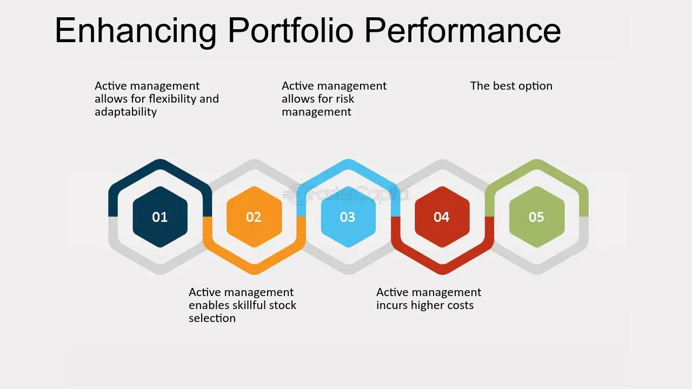

## Table of Contents

## What is a portfolio and why is enhancing its returns important?

A portfolio is a collection of investments like stocks, bonds, and other assets that someone owns. It's like a basket where you put different things to grow your money over time. People make portfolios to reach their financial goals, like saving for retirement or buying a house. 

Enhancing the returns of a portfolio is important because it helps your money grow faster. When your investments do well, you can reach your financial goals sooner. This means you might be able to retire earlier or buy that house you've been dreaming of. Plus, better returns can help protect your money from things like inflation, which makes the cost of living go up over time.

## What are the basic principles of portfolio diversification?

Portfolio diversification means spreading your investments across different types of assets. The main idea is not to put all your eggs in one basket. By investing in a mix of things like stocks, bonds, and real estate, you reduce the risk that one bad investment will hurt your whole portfolio. If one investment goes down, another might go up, helping to balance things out.

The key to good diversification is to choose investments that don't all move in the same way. For example, when the stock market goes down, bonds might go up. This is called having a low correlation between your investments. By [picking](/wiki/asset-class-picking) a variety of assets that behave differently, you can smooth out the ups and downs of your portfolio. This makes it more likely that you'll reach your financial goals without taking on too much risk.

Remember, diversification isn't just about having a lot of different investments. It's about having the right mix. You need to think about how each investment fits into your overall plan and how it might perform under different market conditions. A well-diversified portfolio is one that balances risk and reward in a way that matches your personal goals and comfort level with risk.

## How can asset allocation impact portfolio returns?

Asset allocation is all about deciding how to split your money between different types of investments, like stocks, bonds, and cash. This choice can have a big impact on how much money your portfolio makes over time. If you put a lot of your money into stocks, which can go up and down a lot, you might see bigger gains, but you also take on more risk. On the other hand, if you put more money into bonds, which are usually safer but grow more slowly, your portfolio might grow more steadily but not as quickly.

Getting the right mix of assets can help you balance the risk and reward in your portfolio. For example, if you're young and have a long time before you need the money, you might choose to have more stocks because you can handle the ups and downs. But if you're closer to retirement, you might want more bonds to keep your money safer. By changing your asset allocation over time, you can try to get the best returns for the level of risk you're comfortable with.

## What role do stocks play in enhancing portfolio returns?

Stocks can help make your portfolio grow faster. When you buy stocks, you're buying a small piece of a company. If the company does well, the value of your stock can go up, and you might get dividends, which are like little payments from the company. Over time, stocks have usually given higher returns than other types of investments like bonds or cash. This means if you have stocks in your portfolio, your money has a better chance of growing more quickly.

But stocks can also be risky. Their prices can go up and down a lot, sometimes even in a single day. This is called [volatility](/wiki/volatility-trading-strategies). If you need your money soon, big drops in stock prices could be a problem. But if you can leave your money in stocks for a long time, like many years, you can ride out the ups and downs. Over the long run, the good years usually make up for the bad ones, and your portfolio can grow. So, stocks can help boost your portfolio's returns, but you need to be ready for the ride.

## How can bonds be used to balance risk and return in a portfolio?

Bonds can help make your portfolio safer. They're like loans you give to a company or the government. In return, they promise to pay you back with interest over time. Because bonds are usually less risky than stocks, they don't go up and down as much. This means if the stock market has a bad day, your bonds might not lose as much value. By having bonds in your portfolio, you can smooth out the ups and downs, making your overall investment less risky.

Bonds can also help balance the growth of your portfolio. While they might not grow as fast as stocks, they still add to your returns with the interest they pay. This steady income can be really helpful, especially if you're getting close to retirement and need a more predictable source of money. By mixing stocks and bonds in the right way, you can aim for good growth while keeping things safer. It's like having a safety net that lets you take some risks with stocks but still sleep well at night.

## What are alternative investments and how can they boost portfolio performance?

Alternative investments are things you can put your money into that are not stocks, bonds, or cash. They can be things like real estate, commodities like gold or oil, private equity, or even art and collectibles. These investments can help make your portfolio more interesting and potentially grow your money in different ways. Since they don't always move the same way as stocks and bonds, they can help balance out your portfolio, making it less risky overall.

Adding alternative investments to your portfolio can boost its performance because they can offer higher returns than traditional investments. For example, real estate can give you rental income and might go up in value over time. Commodities like gold can protect your money from inflation. But remember, alternative investments can also be more complicated and harder to sell quickly. So, while they can help your portfolio grow, you need to think carefully about how much risk you're willing to take and how these investments fit into your overall plan.

## How does rebalancing a portfolio contribute to enhancing returns?

Rebalancing a portfolio means checking it now and then and making changes to keep it in line with your plan. Over time, some of your investments might grow faster than others. This can make your portfolio different from what you wanted at the start. For example, if your stocks did really well, you might have more money in stocks than you planned. By rebalancing, you sell some of the stocks that grew a lot and buy more of the other investments to get back to your original plan. This helps you keep the right mix of risk and reward.

Rebalancing can help make your portfolio do better over time. When you sell investments that have gone up a lot, you're taking some profits. And when you buy more of the investments that haven't grown as much, you're buying them at a lower price. This is like buying low and selling high, which can lead to better returns. Plus, rebalancing keeps your portfolio in line with your goals, making sure you're not taking more risk than you want.

## What are the benefits and risks of using leverage in a portfolio?

Using leverage in a portfolio means borrowing money to invest more than you have. This can make your returns bigger if your investments do well. For example, if you borrow money to buy more stocks and the stock prices go up, you can make more money than if you just used your own money. This can help you reach your financial goals faster. But leverage can also make your losses bigger if your investments go down. If the stock prices drop, you still have to pay back the money you borrowed, which can be hard if you've lost money on your investments.

The main benefit of using leverage is the chance to grow your portfolio faster. It's like using a magnifying glass to make your returns bigger. If you're smart about it and your investments do well, you can see a lot more money in your portfolio. But the big risk is that it can also make your losses bigger. If things go wrong, you could end up owing more money than you started with. This can be really stressful and might even force you to sell your investments at a bad time. So, while leverage can help your portfolio grow, it's important to use it carefully and understand the risks.

## How can tax strategies improve net portfolio returns?

Using smart tax strategies can help you keep more of the money you make from your investments. One way to do this is by putting your money into tax-advantaged accounts like a 401(k) or an IRA. These accounts let your investments grow without being taxed right away. This means your money can grow faster because you're not losing any to taxes each year. Another way is to be smart about when you sell your investments. If you sell something at a profit, you might have to pay capital gains tax. But if you hold onto it for more than a year, you might pay a lower tax rate. By planning when to sell, you can keep more of your money.

Another tax strategy is to use losses to your advantage. If you sell an investment at a loss, you can use that loss to lower the taxes you owe on other gains. This is called tax-loss harvesting. It's like using one part of your portfolio to help another part. Also, think about where you put different types of investments. For example, putting bonds that pay a lot of interest in a tax-free account can save you money on taxes. By being smart about taxes, you can make your portfolio grow faster and keep more of your returns.

## What advanced techniques like options and futures can be used to enhance portfolio returns?

Options and futures are advanced tools that can help you make more money from your portfolio. Options give you the right, but not the obligation, to buy or sell an asset at a certain price before a certain time. If you think a stock will go up, you can buy a call option to buy it at a lower price later. If you're right, you can make a lot of money. But if you're wrong, you only lose what you paid for the option. Futures are contracts to buy or sell an asset at a set price on a future date. They can be used to bet on the price of things like oil or corn going up or down. If you guess right, you can make a big profit, but if you're wrong, you can lose a lot.

Using options and futures can be tricky because they're complicated and risky. They can make your portfolio grow faster if you know what you're doing, but they can also make you lose money quickly if you don't. It's important to understand how they work and to use them carefully. For example, you can use options to protect your portfolio from big drops in the market. This is called hedging. Or you can use futures to lock in prices for things you need to buy or sell later. But always remember, these tools are like sharp knives – they can help you a lot, but they can also hurt you if you're not careful.

## How does global diversification affect portfolio returns and risk?

Global diversification means spreading your investments across different countries and regions. This can help your portfolio grow better and be less risky. When you invest in different parts of the world, you're not putting all your money in one place. If one country's economy is doing badly, another country might be doing well. This can balance out your returns, making them more stable over time. For example, if the U.S. stock market goes down, your investments in Europe or Asia might go up, helping to protect your money.

But global diversification also comes with its own risks. Different countries can have different rules and problems. Things like political changes, currency changes, and economic troubles in one country can affect your investments there. For example, if a country's currency loses value, your investments in that country might be worth less when you convert them back to your home currency. So, while global diversification can help your portfolio grow and be safer, you need to think about these extra risks and make sure you understand them before you invest.

## What role does behavioral finance play in optimizing portfolio returns?

Behavioral finance looks at how people's feelings and habits can affect their choices about money. It says that sometimes, we don't make the best choices because we let our emotions get in the way. For example, if the stock market goes down, we might feel scared and sell our investments, even though it might be better to wait. Or we might see a stock that's been doing well and buy it without thinking, hoping to make quick money. By understanding these behaviors, we can try to make smarter choices and keep our emotions from messing up our plans.

Knowing about behavioral finance can help us make our portfolios do better. If we can spot when we're making choices based on fear or greed, we can stop and think before we act. This might mean sticking to our plan even when the market is scary, or not chasing after the latest hot investment. By being aware of our own habits and working to make choices based on facts and our long-term goals, we can keep our portfolio on track and maybe even make it grow more over time.

## What is Understanding Portfolio Returns?

Portfolio returns are a key measure of an investor's success, representing the gains or losses achieved from an investment portfolio over a specific period. These returns are crucial for evaluating financial performance and determining an investor's ability to meet financial goals.

### Factors Affecting Portfolio Returns

1. **Market Conditions**: The performance of financial markets significantly impacts portfolio returns. Economic indicators, interest rate changes, geopolitical events, and investor sentiment can cause market fluctuations, influencing asset prices. For instance, a bullish market generally leads to higher returns, whereas a bearish market may result in losses.

2. **Diversification**: Diversification involves spreading investments across various asset classes, sectors, and geographical regions to reduce risk. By including a mix of asset types, such as stocks, bonds, and real estate, investors can mitigate the impact of poor performance in any single investment. Effective diversification can enhance portfolio returns by optimizing risk-adjusted performance.

3. **Asset Allocation**: Strategic asset allocation determines the proportion of each asset class within a portfolio. It is influenced by factors such as an investor's risk tolerance, investment horizon, and financial objectives. Proper asset allocation can help balance risk and return, thus affecting overall portfolio performance.

### Methods to Boost Portfolio Returns

1. **Strategic Investments**: Identifying undervalued assets or sectors with growth potential is essential for enhancing returns. Investors should perform thorough research and analysis to make informed decisions, considering both current market trends and future growth prospects.

2. **Regular Rebalancing**: Rebalancing involves adjusting the portfolio's asset allocation to maintain the desired risk level. Over time, as some investments outperform or underperform, the portfolio's initial asset mix may shift. Regular rebalancing helps realign the portfolio with the investor's strategic objectives and risk tolerance, potentially improving returns.

### Performance Metrics

1. **Sharpe Ratio**: The Sharpe Ratio is a widely used metric for assessing portfolio returns relative to risk. It is calculated by subtracting the risk-free rate from the portfolio's return and dividing the result by the portfolio's standard deviation. A higher Sharpe Ratio indicates better risk-adjusted returns:
$$
   \text{Sharpe Ratio} = \frac{R_p - R_f}{\sigma_p}

$$

   where $R_p$ is the expected portfolio return, $R_f$ is the risk-free rate, and $\sigma_p$ is the standard deviation of the portfolio's excess return.

2. **Maximum Drawdown**: Maximum Drawdown measures the largest peak-to-trough decline in portfolio value over a specified period. It is an important indicator of downside risk and gives insight into the potential for loss an investor may face. Lower drawdown values are preferred as they indicate greater portfolio resilience.

In summary, understanding portfolio returns is essential for evaluating financial performance and guiding investment decisions. By considering market conditions, diversification, and asset allocation, while using strategic investments and regular rebalancing, investors can optimize their portfolios. Performance metrics like the Sharpe Ratio and Maximum Drawdown offer valuable insights into risk-adjusted returns, helping investors align their strategies with their financial goals.

## How can we evaluate and optimize algorithmic trading strategies?

Evaluating and optimizing [algorithmic trading](/wiki/algorithmic-trading) strategies involves the use of various metrics and tools to assess their effectiveness and ensure they operate efficiently. A fundamental component of this process is the measurement of performance, which can be achieved through several key metrics. One crucial metric is the Sharpe Ratio, which quantifies the risk-adjusted return of an investment by comparing excess portfolio return to its standard deviation. Mathematically, it is expressed as:

$$
\text{Sharpe Ratio} = \frac{R_p - R_f}{\sigma_p}
$$

where $R_p$ is the portfolio return, $R_f$ is the risk-free rate, and $\sigma_p$ is the standard deviation of the portfolio's excess return.

Another important performance measure is the Maximum Drawdown, which captures the largest peak-to-trough decline in a portfolio's value. This metric helps assess the risk associated with trading strategies by quantifying the potential loss from the highest observed point.

The optimization of algorithmic trading strategies comes with certain challenges and risks. Overfitting is a significant concern, where a model becomes excessively complex and tailored to past data, losing its predictive power in future market conditions. To mitigate this, techniques such as cross-validation and out-of-sample testing are employed to ensure robustness and generalizability of the trading strategy.

Transaction costs present another critical risk. These include brokerage fees, bid-ask spreads, and slippage, all of which can erode the profitability of high-frequency trading strategies. Algorithms must be designed to minimize these costs, perhaps by optimizing trade execution or by employing strategies that are less sensitive to them.

Continuous performance monitoring is essential to maintain a competitive edge. Algorithmic strategies need constant evaluation to ensure they react appropriately to evolving market environments. This requires the integration of adaptive algorithms, capable of learning and adjusting their parameters dynamically.

Real-time monitoring and trade execution are crucial for staying competitive. This involves the use of sophisticated trading platforms and technologies that provide real-time data feeds and low-latency order execution. Tools like Python's PyAlgoTrade and Zipline can facilitate the development and back-testing of trading algorithms, while platforms like MetaTrader can be used for live trading.

In summary, evaluating and optimizing algorithmic trading strategies necessitates a thorough understanding of performance metrics, active management of associated risks, and the deployment of advanced monitoring and execution tools. By continuously refining these strategies, traders can improve their chances of achieving favorable financial outcomes.

## References & Further Reading

[1]: Bergstra, J., Bardenet, R., Bengio, Y., & Kégl, B. (2011). ["Algorithms for Hyper-Parameter Optimization."](https://papers.nips.cc/paper/4443-algorithms-for-hyper-parameter-optimization) Advances in Neural Information Processing Systems 24.

[2]: ["Advances in Financial Machine Learning"](https://www.amazon.com/Advances-Financial-Machine-Learning-Marcos/dp/1119482089) by Marcos Lopez de Prado

[3]: ["Evidence-Based Technical Analysis: Applying the Scientific Method and Statistical Inference to Trading Signals"](https://www.amazon.com/Evidence-Based-Technical-Analysis-Scientific-Statistical/dp/0470008741) by David Aronson

[4]: ["Machine Learning for Algorithmic Trading"](https://github.com/stefan-jansen/machine-learning-for-trading) by Stefan Jansen

[5]: ["Quantitative Trading: How to Build Your Own Algorithmic Trading Business"](https://www.amazon.com/Quantitative-Trading-Build-Algorithmic-Business/dp/1119800064) by Ernest P. Chan