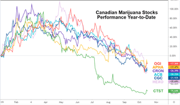

The marijuana industry has rapidly emerged as an arena of significant interest among investors, primarily due to the expansive growth opportunities it presents. This burgeoning sector comprises various players engaged in both the medical and recreational marijuana markets. Projections indicate substantial increases in market size, driven by widespread legalization efforts and growing acceptance of cannabis products. This environment has naturally attracted investors seeking to capitalize on the industry's potential for explosive growth.

Investing in marijuana stocks, however, involves navigating unique challenges alongside potential rewards. The market is characterized by high volatility, influenced by factors such as regulatory changes, public perception, and variability in market demand. These dynamics create a complex landscape where informed decision-making becomes crucial for investors. Understanding the nuances of individual companies, market trends, and legislative developments is essential to minimize risks and maximize gains.



Algorithmic trading offers a promising avenue for optimizing investments in marijuana stocks. By leveraging sophisticated mathematical models and high-frequency data processing, algorithmic trading enables investors to make informed decisions with enhanced precision and efficiency. This method of trading helps in managing the inherent volatility of marijuana stocks, offering better timing and execution of trades.

The purpose of this article is to provide insights into effective investment strategies specific to marijuana stocks, integrating the principles of stock analysis and algorithmic trading. Through a structured approach, the article aims to assist investors in understanding the distinct aspects of the marijuana industry, evaluating investment opportunities, and harnessing technology-driven trading methods to boost investment outcomes.

## Table of Contents

## Understanding Marijuana Stocks

The global marijuana industry is divided into two primary sectors: medical and recreational. The medical marijuana sector focuses on the cultivation and distribution of cannabis for therapeutic uses. It has gained significant traction as several countries and U.S. states have legalized cannabis for medical applications, recognizing its potential in pain management, epilepsy treatment, and alleviating the symptoms of other chronic conditions. On the other hand, the recreational marijuana sector deals with the production and sale of cannabis for non-medical use, targeting adult users in regions where such use has been legalized.

Prominent companies like Canopy Growth Corporation and Aurora Cannabis Inc. have emerged as key players in the marijuana industry. Canopy Growth, headquartered in Smiths Falls, Ontario, is known for its expansive operations and partnerships across several continents. Aurora Cannabis, based in Edmonton, Alberta, follows closely with its innovative cultivation techniques and a broad product portfolio. Both companies have expanded through mergers and acquisitions, aiming to secure their market positions and leverage economies of scale.

The historical performance of marijuana stocks has been marked by significant [volatility](/wiki/volatility-trading-strategies). Factors contributing to this include fluctuating regulatory environments, varying consumer demand, and market hype often associated with legalization news. For instance, initial enthusiasm following the legalization of recreational cannabis in Canada in 2018 led to rapid stock price increases, only to be followed by a market correction as companies faced challenges in meeting supply demands and managing costs.

Current trends influencing the valuation of marijuana stocks encompass several aspects. First, regulatory developments continue to play a crucial role. As countries and states consider legalizing marijuana, the potential market size expands, impacting stock valuations positively. For example, the ongoing discussions about federal legalization in the United States have kept investor interest high. Moreover, consumer behavior trends, such as the preference for organic products and cannabis-infused goods, shape demand patterns, affecting company revenues and profit margins.

Additionally, advancements in cannabis-related technologies and the integration of biotechnology for more efficient crop yields and innovative product offerings contribute to valuation dynamics. The competition within the industry has also intensified, with companies seeking to differentiate themselves through unique value propositions and strategic partnerships.

In summary, while the marijuana industry presents lucrative opportunities due to its growth potential and expanding regulatory acceptance, it also poses risks primarily due to market volatility and evolving legal landscapes. Investors must remain informed and cautious, considering both the broader market trends and individual company performances when evaluating marijuana stocks.

## Investment Strategies for Marijuana Stocks

Investment in marijuana stocks requires a thorough understanding of key factors that can influence the success of such ventures. One of the primary considerations is the importance of management and company fundamentals. This involves evaluating the leadership team’s experience, strategic vision, and execution capabilities. A strong management team can navigate the complex regulatory landscape and adapt effectively to changes in the market environment. 

In addition to management, company fundamentals play a pivotal role. Key metrics such as revenue growth, profit margins, and balance sheet strength provide crucial insights into a company’s financial health. For marijuana companies, which often operate in rapidly expanding markets, these indicators can signal the ability to scale operations and compete effectively.

Scalability is another critical [factor](/wiki/factor-investing). The ability to increase production without proportionally increasing costs is vital for profitability. An analysis of production costs against output can be conducted using methods like break-even analysis:

$$
\text{Break-even point (units)} = \frac{\text{Fixed Costs}}{\text{Selling Price per Unit} - \text{Variable Cost per Unit}}
$$

For marijuana companies, input costs, regulatory compliance, and distribution expenses are particularly significant. Efficient production processes and economies of scale can offer competitive advantages.

Diversification is a fundamental strategy in mitigating the risks associated with marijuana stock investments. By spreading investments across various segments of the marijuana industry, such as medical, recreational, CBD products, and ancillary services, investors can reduce the impact of volatility in any single area. Market research is integral to this approach, providing insights into emerging trends, consumer preferences, and competitive dynamics. 

Additionally, diversification can be enhanced by incorporating stocks from different geographic regions, as legal and market conditions can vary significantly. Comprehensive market research and continuous monitoring are essential to adjust strategies in response to new data and legislative changes.

In summary, successful investment strategies in marijuana stocks hinge on rigorous assessments of management and company fundamentals, scalability, and the use of diversification and market research to manage risk. These elements combine to create a robust approach, balancing opportunities and uncertainties inherent in this dynamic sector.

## Algorithmic Trading and Its Importance

Algorithmic trading, also referred to as algo trading, is a method of executing trades using pre-programmed instructions based on various factors such as timing, price, and [volume](/wiki/volume-trading-strategy). This approach allows for the rapid and automated buying and selling of securities, providing significant advantages over manual trading. In financial markets, [algorithmic trading](/wiki/algorithmic-trading) has evolved to become an integral tool for investors seeking to optimize their strategies, enhance efficiency, and manage risks more effectively.

### Benefits of Algorithmic Trading for Marijuana Stocks

The marijuana industry is characterized by high volatility and rapid policy changes, which presents both opportunities and challenges for investors. Algorithmic trading offers several benefits for investing in marijuana stocks:

1. **Efficiency**: Algorithms can process vast amounts of data and execute trades quicker than human traders. This speed is particularly advantageous in fast-moving markets such as marijuana stocks, where delays in execution can lead to missed opportunities or unfavorable trading outcomes.

2. **Precision**: By relying on predetermined criteria, algorithms help eliminate human errors and biases, ensuring trades are executed with high precision. This precision is crucial in the marijuana sector, where stock prices can be influenced by sudden regulatory news or market shifts.

3. **Risk Management**: Automated trading systems can incorporate sophisticated risk management tools, such as stop-loss orders and hedging strategies. These tools help to mitigate potential losses by automatically adjusting the trading parameters based on market conditions, providing a more controlled investment environment in volatile markets like marijuana stocks.

### Examples of Successful Algorithmic Trading Strategies in Volatile Markets

Algorithmic trading strategies that have proven successful in volatile markets, such as those often seen in the marijuana industry, include:

- **Mean Reversion Strategy**: This strategy is based on the idea that stock prices tend to revert to their historical averages. In practice, an algorithm will buy marijuana stocks when prices are below their historical average and sell when prices rise above this average, capitalizing on expected corrections.

- **Momentum Trading**: Momentum strategies involve purchasing stocks that have shown an upward price movement and selling those with a declining trend. This technique can be effective in capturing short-term market trends in the marijuana sector, allowing investors to benefit from price movements facilitated by market news or sentiment.

- **Statistical Arbitrage**: This strategy uses statistical methods to identify pricing inefficiencies between related securities. For instance, an algorithm might identify temporary discrepancies in the pricing of marijuana ETFs and their underlying stocks, executing trades to take advantage of these inefficiencies.

Algorithmic strategies can be further customized using programming languages like Python. For example, a simple moving average crossover strategy could be implemented using Python as follows:

```python
import pandas as pd

# Load historical stock data
data = pd.read_csv('marijuana_stock_data.csv')

# Calculate moving averages
data['short_window'] = data['Close'].rolling(window=20, min_periods=1).mean()
data['long_window'] = data['Close'].rolling(window=50, min_periods=1).mean()

# Generate trading signals
data['signal'] = 0.0
data['signal'][20:] = np.where(data['short_window'][20:] > data['long_window'][20:], 1.0, 0.0)

# Create positions
data['positions'] = data['signal'].diff()

print(data[['Date', 'Close', 'short_window', 'long_window', 'signal', 'positions']])
```

This code calculates short-term and long-term moving averages for stock prices, generating buy and sell signals based on their crossover. Such algorithms demonstrate how algorithmic trading can be tailored to specific market conditions, providing enhanced opportunities for managing investments in the dynamic marijuana stock market.

## Algo Trading Tools and Platforms

Algorithmic trading has revolutionized financial markets by automating trading processes, offering precision, efficiency, and risk management. Among various tools and platforms available, MetaTrader 5 and QuantConnect are noteworthy for their popularity and robust features.

MetaTrader 5, developed by MetaQuotes, is a multifunctional trading platform widely used by professional traders. It supports the trading of currencies, stocks, and futures. The platform is appreciated for its comprehensive suite of trading tools, including advanced charting capabilities and a flexible trading environment. Key features include:

- **Backtesting**: MetaTrader 5 allows historical data-driven backtesting, enabling traders to evaluate the effectiveness of their strategies over past market conditions.

- **Data Availability**: Users have access to financial data from various markets, which is vital for creating informed trading algorithms.

- **Customization**: MetaTrader 5 uses MQL5, a powerful language for coding custom indicators and algorithms, allowing a tailored trading experience.

- **Security**: It offers enhanced security features, including two-factor authentication and high-level encryption, crucial for protecting users' trading accounts and data integrity.

QuantConnect, on the other hand, is an open-source platform that caters to algorithmic trading enthusiasts and professionals. It is known for its versatility and community-driven development model. Key features include:

- **Backtesting**: QuantConnect provides historical data for a wide range of assets, allowing traders to backtest strategies across different market conditions. 

- **Data Availability**: It offers access to various financial datasets, essential for modeling diverse trading strategies.

- **Customization**: With support for multiple programming languages including Python and C#, QuantConnect offers flexibility in algorithm development.

- **Security**: The platform prioritizes data security with encrypted user data and secure APIs.

When comparing open-source vs. proprietary software, QuantConnect represents the former, offering flexibility and transparency, drawing on community collaboration for continuous improvement. Meanwhile, MetaTrader 5, as a proprietary tool, provides a stable environment with dedicated customer and technical support.

Regarding deployment options, cloud-based platforms like QuantConnect allow traders to run algorithms globally without needing robust local computing resources, fostering accessibility and scalability. Conversely, on-premise platforms, often favored by organizations requiring stringent data control and low latency, ensure full control over the trading environment while potentially incurring higher maintenance costs.

Each platform presents unique advantages, and selection depends on individual requirements such as technical expertise, resource availability, and specific trading goals. Understanding these features can significantly enhance the decision-making process for traders investing in volatile sectors like the marijuana industry.

## Navigating Financial Risks in Marijuana Stocks

Navigating financial risks in marijuana stocks requires a strategic approach to mitigate potential losses while maximizing gains. The marijuana industry, characterized by its swift evolution and regulatory complexities, presents unique challenges for investors. Thorough market analysis and vigilance over legislative changes play critical roles in this endeavor.

Market analysis encompasses various facets, including understanding supply and demand dynamics, evaluating company financials, and assessing competitive positioning. Investors should consider the impact of external factors such as changes in consumer preferences and evolving health research related to marijuana use. Conducting a detailed SWOT analysis can provide insights into a company's Strengths, Weaknesses, Opportunities, and Threats, thereby aiding in informed decision-making.

Monitoring legislative changes is crucial due to the high regulatory variability surrounding marijuana. The legal landscape for marijuana is in constant flux, with regulations differing starkly across regions. In the United States, for instance, marijuana legalization varies from state to state, and federal regulations remain stringent. Keeping abreast of policy shifts, such as new legalization agendas or restrictions, can help investors anticipate market movements. This proactive approach enables the recalibration of investment strategies in response to potential disruptions or opportunities created by legislative changes.

A crucial debate in marijuana stock investments is whether to adopt long-term or short-term strategies, especially given the volatility that characterizes this sector. Long-term investing involves holding stocks over extended periods, banking on gradual growth and potential appreciation in value as the industry matures. This strategy is conducive to investors who are patient and ready to weather short-term market fluctuations. It aligns well with the buy-and-hold philosophy, potentially reducing transaction costs and benefiting from compound growth over time.

On the other hand, short-term investment strategies focus on capitalizing on immediate market movements, relying heavily on technical analysis and market timing. This approach could involve trading on news catalysts such as legislative announcements or quarterly earnings reports. Short-term trading can be lucrative if investors accurately predict price movements, but it comes with higher risks due to market volatility and trading costs.

Investors might employ algorithmic trading to navigate these decisions effectively. Algorithms can swiftly process large datasets, analyze historic performance, and execute trades based on pre-set criteria. By automating the decision-making process, investors can potentially reduce emotional biases and improve response times to market changes.

In summary, effectively navigating financial risks in marijuana stocks involves a balanced strategy combining thorough market analysis, keen awareness of legislative developments, and a judicious choice between long-term and short-term investment methodologies. Maintaining flexibility in strategy formulation allows investors to adjust to the mutable nature of the marijuana market, thereby safeguarding their investments while pursuing potential growth opportunities.

## Conclusion

In the burgeoning arena of marijuana stock investments, significant opportunities are juxtaposed with inherent risks. The sector's rapid growth potential stems from expanding legalization and increasing acceptance of both medical and recreational marijuana use. However, the volatility associated with regulatory uncertainties, market fluctuations, and the nascent nature of the industry presents considerable challenges to investors.

Algorithmic trading emerges as a vital tool in optimizing investment strategies in this dynamic milieu. Through the application of advanced algorithms, investors can enhance decision-making processes by leveraging efficiency, precision, and improved risk management capabilities. Algorithms can accurately analyze vast data sets, identify profitable trading opportunities, and execute trades at speeds unattainable by humans alone, minimizing market exposure and potential losses.

Moreover, algorithmic trading supports the implementation of techniques such as [backtesting](/wiki/backtesting), which allows investors to assess strategies against historical data, thus refining investment methods before market deployment. This aligns well with the unpredictable dynamics of marijuana stocks, where historical performance data can provide valuable insights into future trends.

As investors navigate the volatile marijuana market, informed and responsible approaches are crucial. This involves continuous market research, understanding regulatory landscapes, and recognizing the significance of diversification to mitigate overarching risks. Algorithmic trading can be an integral part of this informed strategy, but it should not replace the need for comprehensive market knowledge and thorough analysis.

In conclusion, while marijuana stocks offer promising growth avenues, they demand a strategic and cautious investment approach. Algorithmic trading plays an instrumental role in managing risks and can significantly enhance investment techniques, thereby supporting sustained growth in an ever-evolving industry landscape. Investors are encouraged to remain informed and adaptively strategize to unlock the full potential of marijuana stock investments.

## References & Further Reading

1. **"Marijuana and the Economy: Understanding Impacts and Opportunities"** by Ben Cort - This book provides a comprehensive analysis of marijuana's economic impact, offering insights into investment opportunities and potential challenges.

2. **"Investing in Cannabis Stocks: The Complete Guide"** by Alan Brochstein, CFA - Brochstein's guide is valuable for understanding the fundamentals of cannabis investment, including key performance indicators and market dynamics specific to marijuana stocks.

3. **"Algorithmic Trading: Winning Strategies and Their Rationale"** by Ernest P. Chan - This book is essential for anyone interested in applying algorithmic trading strategies to marijuana stocks, clarifying the concepts with practical examples.

4. **"High Growth Handbook"** by Elad Gil - Though not specifically focused on marijuana stocks, this handbook offers strategies for managing high-growth companies' investments, relevant to fast-developing industries like cannabis.

5. **"A Beginner's Guide to Online Stock Trading"** by Todd Lammle - Lammle's book provides a starting point for traders interested in algorithmic methods and technical concepts, applicable to marijuana stocks.

6. **"Global Cannabis Report: 2021 Industry Outlook"** by Prohibition Partners - This report offers data-driven insights and predictions for the cannabis industry, essential for investors looking to understand the industry's future trends.

7. **"Quantitative Finance for Dummies"** by QuantInsti - An insightful resource for mastering algorithmic trading and quantitative analysis, suitable for implementing techniques in marijuana stock trading.

8. **Academic Journals and Papers:**
   - *The Journal of Cannabis Research* - Features articles on economic, policy, and business aspects of the marijuana industry.
   - *Algorithmic Finance* - Includes research on the cutting-edge methods and applications of algorithmic trading.

9. **Online Platforms and Courses:**
   - **Coursera and edX**: Courses on financial markets, investment strategies, and algorithmic trading.
   - **QuantConnect**: Offers tutorials and resources on building and testing algorithmic trading strategies.

10. **Websites and Blogs:**
    - **New Cannabis Ventures** (newcannabisventures.com) - Provides regular updates and analyses of developments in the cannabis industry.
    - **Seeking Alpha's Cannabis Section** - A collection of articles discussing trends and strategies in marijuana stock investments.

These resources provide a diverse range of information and tools to aid in understanding and optimizing investment strategies for marijuana stocks using algorithmic trading.