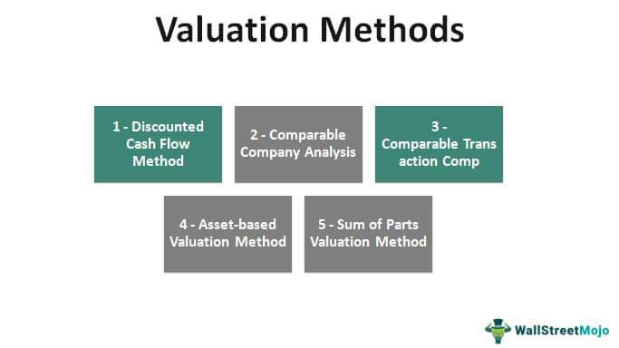

## Table of Contents

## What is business valuation and why is it important?

Business valuation is the process of figuring out how much a business is worth. It's like putting a price tag on a company. People do this by looking at different things, like how much money the business makes, what it owns, and what other similar businesses are worth. There are different ways to do a valuation, and which method you use can depend on what you need it for.

Business valuation is important for many reasons. If someone wants to buy or sell a business, they need to know its value to make a fair deal. It's also important for getting loans or attracting investors. Banks and investors want to know the value of a business before they give money to it. Plus, business owners can use valuation to see how well their business is doing and make plans for the future. Knowing the value of a business helps everyone involved make smart decisions.

## What are the basic methods used for valuing a business?

There are several basic methods used for valuing a business, and each one looks at the company from a different angle. The first method is the Asset-Based Approach. This method adds up everything the business owns, like buildings, equipment, and inventory, and then subtracts what it owes, like loans and debts. It's like figuring out the net worth of the business. This approach is useful if the business is being sold off in pieces or if it's not making much profit.

Another common method is the Income Approach. This one focuses on how much money the business makes. There are two main ways to do this: the Capitalization of Earnings method, which looks at the expected future profits and turns them into a present value, and the Discounted Cash Flow method, which adds up all future cash flows and discounts them back to today's value. This approach is good for businesses that have a steady income and are expected to keep making money in the future.

The third method is the Market Approach. This method compares the business to similar businesses that have been sold recently. It's like looking at the price of houses in a neighborhood to guess the value of your own house. You look at things like the size of the business, how much money it makes, and what industry it's in. This approach works well when there are a lot of similar businesses being bought and sold, so you can see what the market thinks they're worth.

## How does the Asset-Based Approach work in business valuation?

The Asset-Based Approach to business valuation is like figuring out what you would have left if you sold everything the business owns and paid off all its debts. It's pretty straightforward. You start by making a list of all the things the business owns, like buildings, machines, and products ready to sell. These are called assets. Then, you add up how much all these assets are worth. After that, you look at what the business owes, like loans or money it needs to pay to others. These are called liabilities. You subtract the total liabilities from the total assets, and what you're left with is the net value of the business.

This method is really useful in certain situations. For example, if a business is not making much profit or if it's being sold off in pieces, the Asset-Based Approach can give a good idea of its worth. It's like looking at the pieces of a puzzle instead of the whole picture. But, it's not perfect for every business. If a company's value comes more from its brand, its customers, or its ability to make money in the future, then just looking at its assets might not tell the whole story. So, while the Asset-Based Approach is simple and clear, it's best used when the focus is on what the business physically owns.

## What is the Income Approach and how is it applied in business valuation?

The Income Approach to business valuation looks at how much money a business makes. It's like guessing how much money the business will bring in the future and then figuring out what that money is worth today. There are two main ways to do this. The first way is called the Capitalization of Earnings method. This method takes the business's expected future profits and turns them into a present value by using a rate that shows how risky the business is. The second way is called the Discounted Cash Flow method. This method adds up all the money the business is expected to make in the future and then uses a discount rate to figure out what that money is worth right now.

This approach is really good for businesses that have a steady income and are expected to keep making money in the future. It's like looking at a business's future money-making power instead of just what it owns right now. But, it can be tricky because you have to guess what the future will be like, and that's not always easy. If the guesses about future profits or the discount rate are off, then the valuation might not be right. Still, the Income Approach is a popular way to value businesses because it focuses on the money the business can make, which is often what buyers and investors care about the most.

## Can you explain the Market Approach to business valuation?

The Market Approach to business valuation is like comparing a business to other businesses that have been sold recently. It's similar to checking the prices of similar houses in a neighborhood to guess the value of your own house. With this approach, you look at businesses that are a lot like the one you're valuing. You compare things like how big they are, how much money they make, and what industry they're in. By seeing what other similar businesses have sold for, you can get a good idea of what the business you're looking at might be worth.

This method works well when there are a lot of similar businesses being bought and sold. It's like having a lot of data to work with, so you can see what the market thinks businesses like this are worth. But, it can be hard if there aren't many similar businesses to compare to, or if the businesses are very different from each other. Even so, the Market Approach is a helpful way to value a business because it uses real-world sales to guide the valuation, giving a practical sense of what buyers might be willing to pay.

## What are the key differences between the three main valuation methods?

The Asset-Based Approach, Income Approach, and Market Approach each look at a business in different ways. The Asset-Based Approach is like figuring out what you would have left if you sold everything the business owns and paid off all its debts. It adds up all the things the business owns, like buildings and machines, and then subtracts what it owes, like loans. This method is good for businesses that aren't making much profit or if they're being sold off in pieces. It focuses on what the business has right now, not what it might do in the future.

The Income Approach looks at how much money a business makes. It tries to guess how much money the business will bring in the future and then figures out what that money is worth today. There are two ways to do this: the Capitalization of Earnings method, which turns future profits into a present value, and the Discounted Cash Flow method, which adds up all future cash flows and discounts them back to today's value. This method is great for businesses with steady income and a clear future, but it can be tricky because guessing the future isn't always easy.

The Market Approach is like comparing a business to other businesses that have been sold recently. It looks at businesses that are similar and sees what they sold for. This method works well when there are a lot of similar businesses being bought and sold, giving a good idea of what the market thinks a business like this is worth. But it can be hard if there aren't many similar businesses to compare to. Each method has its own way of figuring out a business's value, depending on what you're looking at: the business's stuff, its money-making power, or what others have paid for similar businesses.

## How do you choose the appropriate valuation method for a specific business?

Choosing the right valuation method for a specific business depends on what you need the valuation for and what kind of business it is. If you're looking at a business that owns a lot of stuff like buildings or machines, and maybe it's not making much profit, then the Asset-Based Approach might be the best choice. This method looks at what the business has right now, not what it might do in the future. It's like figuring out what you'd have left if you sold everything and paid off all the debts. So, if you're thinking about selling off the business in pieces or if it's in an industry where the value comes from what it owns, this method works well.

On the other hand, if the business has a steady income and you want to know how much money it might make in the future, the Income Approach could be better. This method tries to guess future profits and turn them into a value today. It's good for businesses that are expected to keep making money, like a stable company with regular customers. But it can be tricky because you have to make guesses about the future, which isn't always easy. If you're looking to attract investors or get a loan, this method can show how much money the business might make, which is what investors and banks care about.

Sometimes, the best way to value a business is to look at what similar businesses have sold for recently. That's what the Market Approach does. It's like checking the prices of similar houses in a neighborhood to guess the value of your own house. If there are a lot of businesses like yours being bought and sold, this method can give a good idea of what buyers might be willing to pay. But it can be hard if there aren't many similar businesses to compare to. So, you pick the Market Approach when you want to know what the market thinks your business is worth, especially if you're thinking about selling it.

## What role do financial statements play in the valuation process?

Financial statements are super important when you're trying to figure out how much a business is worth. They show you the money coming in and going out, what the business owns, and what it owes. When you use the Asset-Based Approach, you look at the balance sheet, which lists all the stuff the business owns and what it owes. This helps you find out the net worth of the business by subtracting what it owes from what it owns. So, the balance sheet is key for this method.

For the Income Approach, you need the income statement, which tells you how much money the business made and spent over a certain time. This helps you guess how much money the business might make in the future. You can use this to turn those future profits into a value today. The cash flow statement is also helpful here because it shows the actual cash moving in and out, which is important for the Discounted Cash Flow method. So, the income and cash flow statements are really important for figuring out the business's future money-making power.

The Market Approach also uses financial statements, but in a different way. You compare the business's financials, like its income and assets, to those of similar businesses that have been sold. This helps you see if your business is doing better or worse than others and can give you a good idea of what it might be worth. So, no matter which method you use, financial statements are like the building blocks that help you put a price tag on a business.

## How do intangible assets like goodwill affect business valuation?

Intangible assets like goodwill can make a big difference in how much a business is worth. Goodwill is the value of things you can't touch, like a business's reputation, its brand name, or how loyal its customers are. When a business is valued, these things can add a lot to the price, especially if the business is well-known or has a strong brand. For example, if a company like Coca-Cola were to be valued, its brand name would be worth a lot because people all over the world know and trust it. So, when you're figuring out the value of a business, you need to think about more than just what it owns; you also need to think about what it's known for and how people feel about it.

In the Asset-Based Approach, intangible assets like goodwill can be hard to measure because they're not things you can see or touch. But, they still matter. Sometimes, a business's value comes more from its brand or its customer relationships than from its buildings or machines. In the Income Approach, goodwill can be included in the future profits because a strong brand or loyal customers can help the business make more money. And in the Market Approach, if similar businesses with strong brands have sold for higher prices, that can show how much goodwill might be worth. So, even though intangible assets are tricky to pin down, they're a big part of what makes a business valuable.

## What advanced techniques can be used to refine business valuation estimates?

To make business valuation estimates more accurate, you can use some advanced techniques. One way is to do a sensitivity analysis. This means you change the numbers you're using, like future profits or discount rates, a little bit to see how much the business's value changes. It helps you see which numbers are most important and how sure you can be about your valuation. Another technique is called Monte Carlo simulation. This is like playing out a lot of different futures for the business to see what might happen. It uses a computer to run thousands of scenarios and gives you a range of possible values instead of just one number. This can be really helpful when the future is hard to predict.

Another advanced method is to use real options valuation. This is good for businesses that have a lot of choices about what to do next, like whether to expand or start a new product. It treats those choices like financial options, which can add value to the business. You can also look at the business's value from different angles by using a weighted average of different valuation methods. For example, you might use a bit of the Asset-Based Approach, a bit of the Income Approach, and a bit of the Market Approach to get a more complete picture. This is called a weighted average cost of capital (WACC) approach, and it can help you see the business's value in a more balanced way.

## How do industry-specific factors influence the choice of valuation method?

Industry-specific factors can really change which valuation method you pick for a business. Different industries have different ways of making money and different kinds of stuff they own. For example, if you're looking at a manufacturing business, it might have a lot of machines and buildings. So, the Asset-Based Approach could be a good choice because it looks at what the business owns. On the other hand, if you're valuing a tech company, its value might come more from its ideas and its ability to make money in the future. In that case, the Income Approach might be better because it focuses on future profits.

Also, some industries have a lot of similar businesses being bought and sold, like restaurants or retail stores. For those kinds of businesses, the Market Approach can work well because you can compare them to other businesses that have sold recently. But if you're looking at a business in a unique industry where there aren't many similar businesses to compare to, the Market Approach might not be the best choice. So, when you're [picking](/wiki/asset-class-picking) a valuation method, you need to think about what's important in the industry the business is in and what kind of information you have to work with.

## What are the common pitfalls and challenges in business valuation and how can they be addressed?

One common pitfall in business valuation is relying too much on one method without considering the others. Each method has its strengths and weaknesses, and using just one can give you a skewed picture of the business's value. For example, the Asset-Based Approach might miss out on the value of a strong brand, while the Income Approach can be off if future profits are hard to predict. To address this, it's a good idea to use a mix of methods and see how they line up. This can give you a more complete and balanced view of the business's worth.

Another challenge is dealing with uncertainty, especially when using the Income Approach. Guessing future profits and choosing the right discount rate can be tricky because the future is hard to predict. If your guesses are wrong, your valuation might be way off. To tackle this, you can use advanced techniques like sensitivity analysis or Monte Carlo simulation. These methods help you see how changes in your guesses affect the valuation and give you a range of possible values instead of just one number. This way, you can be more confident in your valuation even when the future is uncertain.

Lastly, industry-specific factors can make valuation harder. Different industries have different ways of making money and different kinds of assets. For example, a tech company's value might come more from its ideas and future profits, while a manufacturing business might be worth more because of its machines and buildings. To deal with this, you need to pick the right valuation method based on what's important in the industry. Sometimes, using a mix of methods and adjusting them to fit the industry can help you get a more accurate valuation.

## What are Common Valuation Methods?

Market Capitalization: Market capitalization is one of the simplest and most straightforward methods to assess the value of a publicly-traded company. It is calculated by multiplying the current share price by the total number of outstanding shares. This method offers a quick snapshot of a company’s market value, allowing investors to gauge its size relative to peers. However, it does not account for the company's debt or future earnings potential, making it less comprehensive than other methods.

Mathematically, Market Capitalization is expressed as:

$$
\text{Market Capitalization} = \text{Share Price} \times \text{Total Outstanding Shares}
$$

Times Revenue Method: This method estimates a company's value by applying a multiplier to its revenue. The multiplier varies among industries, reflecting different growth potentials, risk profiles, and capital requirements. Generally, high-growth, high-margin industries command higher multiples compared to low-growth sectors. This method provides a rough value that is straightforward but can be skewed by the cyclicality or seasonality of revenues.

Earnings Multiplier: The earnings multiplier method evaluates a company's worth by capitalizing its expected profits. Future profits are adjusted against current interest rates to determine present value. This method acknowledges the company's profitability, differentiating it from methods focusing purely on revenue or assets. Generally, companies with stable, predictable earnings derive their value more accurately through this method.

Discounted Cash Flow (DCF): The DCF method involves projecting future cash flows and discounting them back to present value, considering the time value of money and inflation. The discount rate reflects the riskiness of the investment and the cost of capital. DCF is a robust method that incorporates detailed cash flow projections and risk adjustments.

The DCF formula is given by:

$$
\text{DCF} = \sum_{t=1}^{n} \frac{CF_t}{(1 + r)^t}
$$

where $CF_t$ is the cash flow in year $t$, $r$ is the discount rate, and $n$ is the period considered.

Book Value: This valuation approach uses the net asset value of a company as represented on the balance sheet. It is calculated as shareholders’ equity, which is the difference between total assets and total liabilities. Book value is a measure of the intrinsic value but often underestimates the value of intangible assets like brand reputation or intellectual property.

Mathematically, Book Value is:

$$
\text{Book Value} = \text{Total Assets} - \text{Total Liabilities}
$$

Liquidation Value: Liquidation value estimates the net cash a company would generate if all assets were sold and liabilities paid off. It is a conservative approach, typically used in contexts like bankruptcy or asset-heavy valuations, where the worst-case scenario is considered. The liquidation value can be beneficial in industries where asset tangibility is high. 

These valuation methods provide diverse lenses through which companies can be evaluated, each with specific strengths and limitations, influencing their suitability according to different contexts and needs.

## What is the role of algorithmic trading in valuation?

Algorithmic trading, or algo trading, plays a significant role in the financial markets by providing a means to execute trades based on sophisticated quantitative analysis. The effectiveness of these algorithms is deeply intertwined with the precision of business valuation methods, as the algorithms rely on these valuations to make informed investment decisions. The process involves leveraging computational power to rapidly analyze large volumes of data, identifying opportunities where perceived value discrepancies exist.

Accurate valuations are crucial for the performance of these trading systems. They employ a variety of valuation techniques to ensure that the inputs into their models reflect true economic values. For instance, algorithms might utilize the Discounted Cash Flow (DCF) method to estimate the present value of a company's expected future cash flows, thereby determining if a stock is undervalued or overvalued relative to current market prices. The formula typically used is:

$$
PV = \sum \frac{CF_t}{(1 + r)^t}
$$

Where $PV$ is the present value of future cash flows, $CF_t$ represents cash flow in time period $t$, and $r$ is the discount rate.

In addition to traditional methods, algo trading systems can incorporate [machine learning](/wiki/machine-learning) techniques and real-time data processing to refine these valuation estimates continuously. For example, a Python script could be developed to train a machine learning model on historical price data and financial indicators to predict future price movements:

```python
import numpy as np
from sklearn.model_selection import train_test_split
from sklearn.ensemble import RandomForestRegressor
from sklearn.metrics import mean_squared_error

# Sample data
features = np.random.rand(1000, 10)  # 1000 samples, 10 features
prices = np.random.rand(1000)        # 1000 target values

# Train-test split
X_train, X_test, y_train, y_test = train_test_split(features, prices, test_size=0.2)

# Model training
model = RandomForestRegressor()
model.fit(X_train, y_train)

# Prediction and evaluation
predictions = model.predict(X_test)
mse = mean_squared_error(y_test, predictions)
print(f"Mean Squared Error: {mse}")
```

This script illustrates how an algorithm can be trained to predict stock prices based on feature sets derived from financial data, thereby assisting in the valuation process.

The ability to quickly assess and validate assumptions about economic value means that algo trading can capitalize on opportunities more efficiently than human traders. The integration of robust valuation methods into algorithmic frameworks not only supports rapid decision-making but also mitigates risks associated with erroneous valuations, ensuring that trading strategies are grounded in precise, data-driven assessments of market opportunities.

## References & Further Reading

[1]: Damodaran, A. (2012). ["Investment Valuation: Tools and Techniques for Determining the Value of Any Asset."](https://books.google.com/books/about/Investment_Valuation.html?id=5SRHAAAAQBAJ) John Wiley & Sons.

[2]: "Advanced Algorithmic Trading Strategies" by Kevin Davey

[3]: ["Valuation: Measuring and Managing the Value of Companies."](https://books.google.com/books/about/Valuation.html?id=fGXjDwAAQBAJ) McKinsey & Company Inc.

[4]: Pardo, R. (2008). ["The Evaluation and Optimization of Trading Strategies."](https://onlinelibrary.wiley.com/doi/book/10.1002/9781119196969) John Wiley & Sons.

[5]: Hull, J. C. (2014). ["Options, Futures, and Other Derivatives."](https://www.amazon.com/Options-Futures-Other-Derivatives-9th/dp/0133456315) Pearson Education.