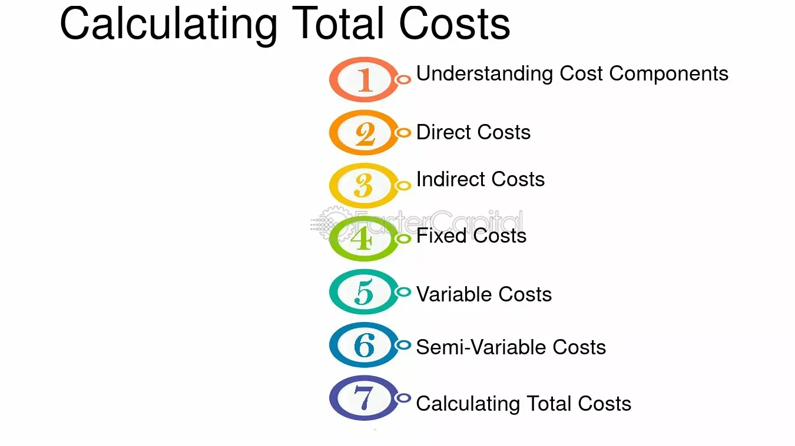

## Table of Contents

## What are the basic types of business costs?

Business costs are the expenses a company has to pay to keep running. There are two main types of costs: fixed costs and variable costs. Fixed costs are expenses that stay the same no matter how much a business sells. Examples include rent, salaries, and insurance. These costs are predictable and help a business plan its budget.

Variable costs, on the other hand, change depending on how much a business produces or sells. Examples of variable costs include raw materials, production supplies, and sales commissions. These costs go up when a business makes or sells more and go down when it makes or sells less. Understanding both fixed and variable costs helps a business manage its finances better and make smarter decisions.

## How do you differentiate between fixed and variable costs?

Fixed costs are expenses that do not change no matter how much a business sells. Think of them as the costs you have to pay just to keep the doors open. For example, rent for your store or office stays the same whether you sell a lot or a little. The same goes for salaries of employees who get paid the same amount every month, no matter how busy the business is. Fixed costs are predictable, which helps businesses plan their budgets more easily.

Variable costs, on the other hand, go up and down depending on how much a business produces or sells. These costs change with the level of activity in the business. For example, if you run a bakery, the cost of flour and sugar will increase if you bake more cakes. Similarly, if you have salespeople who earn commissions, their pay will vary based on how much they sell. Understanding variable costs is important because they can help a business figure out how profitable it is to increase production or sales.

## What is the formula for calculating total business costs?

To calculate total business costs, you add up all your fixed costs and all your variable costs. Fixed costs are the expenses that stay the same no matter how much you sell, like rent and salaries. Variable costs are the expenses that change depending on how much you produce or sell, like raw materials and sales commissions. So, the formula is: Total Costs = Fixed Costs + Variable Costs.

For example, if your monthly rent is $1,000 and your salaries total $5,000, your fixed costs are $6,000. If you spend $2,000 on raw materials and $1,000 on sales commissions, your variable costs are $3,000. Using the formula, your total costs for the month would be $6,000 (fixed costs) + $3,000 (variable costs) = $9,000. This simple calculation helps you understand all the money you need to spend to keep your business running.

## How can small businesses track their costs effectively?

Small businesses can track their costs effectively by using simple tools and staying organized. One good way is to use accounting software like QuickBooks or FreshBooks. These tools help you keep track of all your money coming in and going out. They can automatically sort your expenses into fixed and variable costs, making it easy to see where your money is going. Another simple method is to use a spreadsheet. You can make columns for different types of costs and update it regularly. This helps you see patterns and plan your budget better.

It's also important to keep good records. Save receipts and invoices, and write down every expense, no matter how small. This helps you not miss any costs and makes it easier to check your records later. Regularly reviewing your costs is key. Set a time each week or month to go over your expenses. This way, you can catch any problems early and make sure you're not spending more than you should. By staying on top of your costs, you can keep your business healthy and make smart decisions about where to spend your money.

## What role does cost accounting play in business management?

Cost accounting is really important for managing a business because it helps you understand where your money is going. It breaks down all the costs into different types, like fixed and variable costs. This helps you see which parts of your business are costing you the most money. By knowing this, you can make better decisions about where to spend your money and how to save it. For example, if you see that you're spending too much on raw materials, you might decide to find a cheaper supplier or change your product a bit to use less material.

Cost accounting also helps you figure out how profitable your business is. It shows you how much it costs to make each product or provide each service. Then, you can compare these costs to what you're selling your products or services for. If you're not making enough profit, cost accounting can help you see why and what you can do about it. Maybe you need to raise your prices, cut some costs, or focus on selling more of your most profitable items. By using cost accounting, you can keep your business running smoothly and make smart choices to grow it.

## How do you calculate the break-even point for a business?

The break-even point is the point where your business makes enough money to cover all its costs, but not more. To find it, you need to know your fixed costs, variable costs, and how much you sell each item for. Start by figuring out your total fixed costs, like rent and salaries. Then, find out your variable costs per item, like the cost of materials for each product you sell. Subtract the variable cost per item from the selling price to get the contribution margin per item. This tells you how much each sale contributes to covering your fixed costs.

Once you have these numbers, you can calculate the break-even point. Divide your total fixed costs by the contribution margin per item. The result is the number of items you need to sell to break even. For example, if your fixed costs are $10,000 and your contribution margin per item is $20, you need to sell 500 items to break even. This simple calculation helps you understand how many sales you need to cover all your costs and start making a profit.

## What are the advanced methods for cost allocation in large corporations?

Large corporations often use advanced methods for cost allocation to make sure they understand where their money is going and how to use it best. One common method is activity-based costing (ABC). This method looks at all the activities a business does and figures out how much each activity costs. Then, it assigns these costs to the products or services that use those activities. For example, if a company has a department that does a lot of quality checks, ABC would figure out how much those checks cost and then add that cost to the products that need those checks. This way, the company can see which products are really costing more to make and price them right or find ways to cut costs.

Another method is the use of cost centers and profit centers. A cost center is a part of the business that does not make money directly but helps other parts of the business. For example, the human resources department is a cost center because it helps hire and train employees, but it doesn't sell anything. A profit center, on the other hand, is a part of the business that makes money, like a sales department. By separating these centers, a large corporation can see which parts are spending money and which parts are making money. This helps them manage their costs better and make sure each part of the business is working well. Both of these methods help big companies keep track of their costs and make smart decisions about where to spend their money.

## How can activity-based costing improve cost management?

Activity-based costing (ABC) can improve cost management by giving businesses a clearer picture of where their money is going. Instead of just looking at overall costs, ABC breaks down costs by specific activities. For example, if a company makes toys, ABC can show how much it costs to design the toys, how much it costs to make them, and how much it costs to check their quality. By understanding these costs, a business can see which activities are the most expensive and find ways to make them cheaper. Maybe they can find a faster way to design toys or use less expensive materials. This helps the business save money and use its resources better.

Using ABC also helps businesses make better pricing decisions. When a company knows exactly how much it costs to do each activity, it can set prices that cover all those costs and still make a profit. For example, if a business finds out that quality checks are very expensive, it might decide to charge more for products that need a lot of checking. Or, it might look for ways to do those checks more cheaply. By understanding the true cost of their products, businesses can set prices that are fair and profitable. This makes it easier for them to compete in the market and keep their customers happy.

## What are the implications of using standard costing in a manufacturing business?

Standard costing is a way for manufacturing businesses to plan how much things should cost. It helps them set a goal for what it should cost to make each product. By using standard costs, a business can see if they are spending more or less than they planned. This can help them find problems early. For example, if the cost of making a toy is higher than the standard cost, the business can look into why. Maybe the materials cost more than expected, or maybe the workers are taking too long. By finding these problems, the business can fix them and save money.

Using standard costing also has some challenges. It can be hard to set the right standard costs. If the standards are too high, the business might think it's doing better than it really is. If the standards are too low, it might seem like the business is always doing worse than expected. Also, standard costing can make it hard to see the real costs if things change a lot. For example, if the price of materials goes up a lot, the standard costs might not show the true cost of making the product. This can make it hard for the business to make good decisions. Despite these challenges, standard costing can still be a useful tool for managing costs in a manufacturing business if used carefully.

## How do you use cost-volume-profit analysis to make strategic decisions?

Cost-volume-profit (CVP) analysis is a tool that helps businesses understand how changes in costs, sales volume, and prices affect their profits. It's like a map that shows how many products a business needs to sell to break even or make a profit. By using CVP analysis, a business can figure out if it's a good idea to lower prices to sell more, or if it should raise prices to make more money per sale. It helps answer questions like, "What if we increase production? Will it be worth it?" or "Should we spend more on marketing to sell more?"

CVP analysis is really helpful for making big decisions. For example, if a business is thinking about starting a new product line, CVP can show if it will be profitable. The business can see how many units it needs to sell to cover the costs of making the new product. If the numbers look good, they might decide to go ahead with the new product. If not, they might choose to focus on something else. By using CVP analysis, a business can make smarter choices about where to spend its money and how to grow.

## What are the latest trends in cost management technology?

The latest trend in cost management technology is the use of cloud-based accounting software. This type of software lets businesses keep track of their costs from anywhere, as long as they have an internet connection. It's easy to use and often cheaper than traditional software because you don't have to buy and set up big systems. Cloud-based software can also update itself, so businesses always have the latest tools to manage their costs. It can connect with other tools like banks and payment systems, making it easier to see all the money coming in and going out.

Another big trend is the use of [artificial intelligence](/wiki/ai-artificial-intelligence) (AI) and [machine learning](/wiki/machine-learning) in cost management. These technologies can look at a lot of data and find patterns that humans might miss. For example, AI can predict how much a business will spend on materials in the future, helping the business plan better. It can also spot when costs are going up and suggest ways to save money. Using AI and machine learning makes cost management more accurate and helps businesses make smarter decisions about where to spend their money.

## How can predictive analytics be used to forecast future business costs?

Predictive analytics is a tool that helps businesses guess what their costs will be in the future. It uses data from the past to find patterns and make predictions. For example, if a business sees that the cost of materials goes up every summer, predictive analytics can help them plan for that. By looking at old data, the tool can say, "Last year, materials cost more in July, so we should expect the same this year." This helps the business set aside money or find cheaper materials before the costs go up.

Using predictive analytics also helps businesses see what might happen if they make changes. For example, if a business is thinking about buying new machines, predictive analytics can show how that might change their costs. It can predict if the new machines will save money on labor or if they will cost more to maintain. By knowing these things ahead of time, the business can make better decisions about what to do. This way, they can keep their costs under control and plan for the future.

## What are the methods for calculating business costs?

Business costs encompass a range of expenses that businesses incur in their operations, and their calculation is pivotal in determining profitability and operational efficiency. Employing different cost calculation methods allows businesses to allocate expenses accurately and analyze profits effectively. Key methodologies include average cost, first in, first out (FIFO), and specific identification, each serving distinct purposes and offering various benefits depending on the business context.

### Average Cost Method

The average cost method, also known as the weighted average cost method, involves calculating the cost of inventory by averaging the cost of goods available for sale over a specific period. The formula for the average cost is:

$$
\text{Average Cost} = \frac{\text{Total Cost of Goods Available for Sale}}{\text{Total Units Available for Sale}}
$$

This method is beneficial for industries where inventory items are indistinguishable from one another or are frequently mixed together. It provides a straightforward, smoothed out approach to cost calculation, making it easier for businesses dealing with high [volume](/wiki/volume-trading-strategy) turnover to manage inventory costs without focusing on individual item purchase dates.

### First In, First Out (FIFO)

FIFO assumes that the oldest inventory items are sold first, meaning the cost of goods sold is based on the cost of earliest purchased inventory. It reflects the actual physical flow in many businesses, approximating current market conditions better than other methods. The FIFO approach can lead to higher net income in times of inflation, as the older, lower costs are matched against current revenues, resulting in lower cost of goods sold and higher profits.

### Specific Identification

The specific identification method assigns the actual cost to each specific item sold and in inventory. This method is most effective when dealing with items that are unique or easily distinguishable, such as vehicles or real estate. By assigning specific costs, businesses gain precise insights into inventory costs, allowing for detailed financial analysis. However, it can be labor-intensive, particularly for businesses dealing with hundreds or thousands of similar items.

### Importance and Application

Accurately calculating business costs aids in forecasting future expenses and assessing business efficiency. Each method provides varying levels of precision and administrative burden, making it crucial for businesses to choose the most suitable one based on their operational structure and reporting requirements.

Understanding and applying these cost calculation methods enables businesses to make informed financial decisions, optimize resource allocation, and enhance overall performance. By accurately identifying and managing costs, businesses can maintain competitive advantages and adapt to changing market conditions effectively.

## What are the methods to calculate and minimize trading costs in algorithmic trading?

Explicit costs in [algorithmic trading](/wiki/algorithmic-trading) refer to those that are directly quantifiable, such as brokerage and exchange fees. On the other hand, implicit costs include slippage and market impact, which are less defined but crucially important to overall trading effectiveness. Effective management of these costs is essential for optimizing algorithmic trading strategies and improving net returns.

**1. Transaction Cost Analysis (TCA):**

Transaction Cost Analysis (TCA) is an essential tool for understanding and optimizing trading performance. TCA involves evaluating both explicit and implicit costs associated with trading activities. By analyzing historical data, traders can identify patterns and inefficiencies in trade execution. TCA typically involves the following steps:

- **Data Collection:** Gather data on historical trades, including timestamps, prices, and volumes.
- **Benchmark Comparison:** Compare the execution price of trades against benchmarks such as the VWAP (Volume Weighted Average Price) or TWAP (Time Weighted Average Price).
- **Cost Attribution:** Break down costs into explicit fees and implicit costs like slippage. This can be modeled using formulas:
$$
  \text{Slippage} = \text{Execution Price} - \text{Expected Price}

$$

- **Performance Measurement:** Evaluate the performance of trading against the set benchmarks to assess the efficiency of the strategies used.

**2. Algorithm Selection and Trade Timing Optimization:**

Selecting the right trading algorithm and optimizing trade execution timing are crucial for minimizing costs:

- **Algorithm Selection:** Choose algorithms that are well-suited for the specific trading environment. For example, VWAP algorithms are effective for executing large orders in liquid markets without exacerbating price impact.

- **Trade Timing Optimization:** Implement strategies to execute trades at optimal times. This involves analyzing historical data to identify periods of low market volatility and high liquidity, which can reduce slippage and market impact.

**3. Broker Negotiation:**

Securing favorable terms with brokers can significantly reduce trading costs:

- **Commission Structures:** Negotiate lower commission rates based on trading volume or frequency.
- **Fee Reductions:** Explore opportunities for reducing exchange fees through bulk trading agreements or volume discounts.

**4. Advanced Algorithmic Strategies:**

Advanced algorithms designed for specific market conditions also contribute to cost minimization:

- **Adaptive Algorithms:** Use adaptive strategies that adjust dynamically to prevailing market conditions, such as liquidity and volatility.

- **Machine Learning Models:** Integrate machine learning techniques to predict market trends and optimize execution strategies. Python code can be employed for modeling:

  ```python
  from sklearn.linear_model import LinearRegression
  import numpy as np

  # Example data
  features = np.array([[10, 0.5], [20, 0.3], [30, 0.4]])
  target = np.array([1, 0, 1])

  # Linear regression model
  model = LinearRegression().fit(features, target)

  # Predicting costs based on new data
  new_data = np.array([[15, 0.4]])
  predicted_impact = model.predict(new_data)
  ```

Incorporating these strategies can significantly enhance the efficiency of trades by decreasing the frictional costs that impact profitability. By continuously updating and refining these methods, algorithmic traders can maintain a competitive edge in the fast-paced financial markets.

## References & Further Reading

[1]: Bergstra, J., Bardenet, R., Bengio, Y., & Kégl, B. (2011). ["Algorithms for Hyper-Parameter Optimization."](https://dl.acm.org/doi/10.5555/2986459.2986743) Advances in Neural Information Processing Systems 24.

[2]: ["Advances in Financial Machine Learning"](https://www.amazon.com/Advances-Financial-Machine-Learning-Marcos/dp/1119482089) by Marcos Lopez de Prado

[3]: ["Evidence-Based Technical Analysis: Applying the Scientific Method and Statistical Inference to Trading Signals"](https://www.amazon.com/Evidence-Based-Technical-Analysis-Scientific-Statistical/dp/0470008741) by David Aronson

[4]: ["Machine Learning for Algorithmic Trading"](https://github.com/stefan-jansen/machine-learning-for-trading) by Stefan Jansen

[5]: ["Quantitative Trading: How to Build Your Own Algorithmic Trading Business"](https://www.amazon.com/Quantitative-Trading-Build-Algorithmic-Business/dp/1119800064) by Ernest P. Chan