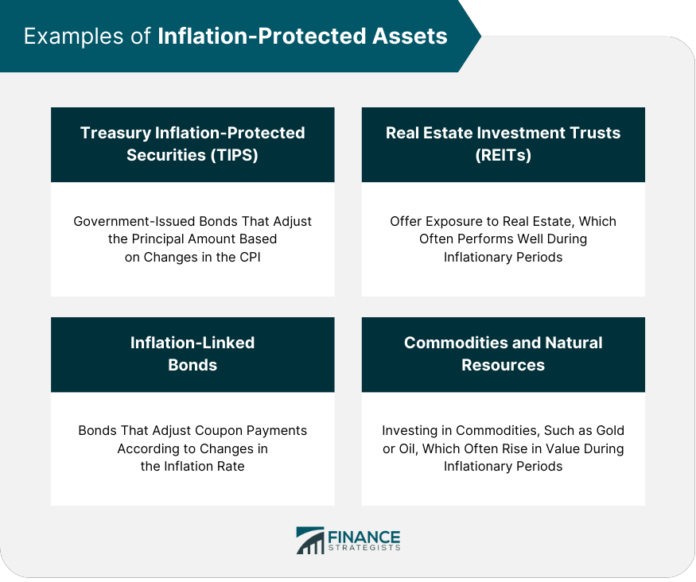

In today's volatile economic climate, understanding financial strategies and economic measures is crucial for safeguarding against inflation and optimizing returns via algorithmic trading. This article examines the confluence of financial strategies, economic measures, inflation protection, and algorithmic trading, highlighting their role in shaping contemporary financial planning and trading strategies. By integrating these concepts, investors can effectively navigate economic unpredictabilities and seize potential opportunities.

Inflation is a key economic challenge, characterized by the continuous increase in the price levels of goods and services, which erodes the purchasing power of money. As inflation affects both individuals and industries by inflating costs and shrinking real incomes, understanding its dynamics becomes essential for effective financial strategy planning. To counteract inflation, diversification across various asset classes, and investing in inflation-resistant assets, such as Treasury Inflation-Protected Securities (TIPS) and real estate, are recommended strategies.



Meanwhile, governments employ monetary and fiscal policies to combat inflation, with central banks influencing interest rates and the money supply to maintain price stability. Inflation targeting and international coordination are also pivotal in managing global inflation expectations.

Algorithmic trading, a transformative force in modern finance, leverages computer algorithms to automate and refine trading decisions, offering enhanced speed and precision. By incorporating economic indicators such as the Consumer Price Index (CPI) into algorithmic strategies, traders can adjust portfolios in response to inflationary signals, enhancing their ability to manage risks and capitalize on market movements.

This integrative approach underscores the importance of aligning economic policies with trading strategies, fostering stability and growth in financial markets. By embracing continuous learning and adaptability, investors can succeed in the evolving financial landscape, ensuring sustainable economic progress.

## Table of Contents

## Understanding Inflation and Its Economic Impact

Inflation represents a sustained increase in the overall price level of goods and services within an economy over a designated period, leading to a subsequent decline in the purchasing power of money. It is a pivotal economic indicator as it influences various aspects of financial decision-making and economic policy. One primary measure of inflation is the Consumer Price Index (CPI), which assesses changes in the price level of a predetermined basket of consumer goods and services purchased by households. The CPI serves as a critical reference for policymakers, particularly central banks, to make informed monetary policy decisions aimed at controlling inflation and stabilizing the economy.

The impact of high inflation is multifaceted, affecting both individuals and businesses. For individuals, inflation diminishes real income, as the cost of living increases faster than income growth, eroding purchasing power. This affliction is often referred to as the inflationary tax on consumers. Businesses are similarly affected as input costs rise, squeezing profit margins unless firms can pass these costs onto consumers through higher prices. The resulting uncertainty in costs and pricing can deter investment and affect long-term economic planning.

For effective financial strategy implementation, a thorough understanding of inflation dynamics is imperative. This involves comprehending how inflation expectations influence economic behavior, interest rates, and currency valuation. For instance, anticipated inflation can lead to preemptive buying or wage negotiations, further driving price increases. Additionally, central banks often respond to rising inflation with monetary policies such as [interest rate](/wiki/interest-rate-trading-strategies) adjustments, which can directly influence borrowing costs and investment decisions.

Mathematically, the real interest rate $r$ can be determined by subtracting the inflation rate $i$ from the nominal interest rate $n$:

$$
r = n - i
$$

Understanding this relationship is essential for investors and businesses to evaluate the true cost of borrowing and the real return on investments.

In summary, unraveling the complexities of inflation and its economic repercussions is crucial for both individuals and businesses to develop resilient financial strategies and adapt to changing economic conditions. A keen awareness of inflation trends allows for informed decisions, whether adjusting portfolio allocations or negotiating wages and contracts, thus safeguarding against the erosive effects of inflation.

## Effective Inflation Protection Strategies

Diversification across asset classes is a fundamental strategy for hedging against inflation, as varying asset categories respond differently to inflationary pressures. By spreading investments across multiple asset classes, an investor can mitigate the adverse effects of inflation on a portfolio. Key inflation-resistant assets include Treasury Inflation-Protected Securities (TIPS), real estate, and commodities.

TIPS are government bonds specifically designed to hedge against inflation. Their principal value adjusts with changes in the Consumer Price Index (CPI), ensuring that the investor's purchasing power is preserved. The formula for calculating the adjusted principal of TIPS is:

$$
\text{Adjusted Principal} = \text{Original Principal} \times \left(1 + \frac{\text{CPI at Maturity}}{\text{CPI at Issuance}}\right)
$$

Real estate is another effective hedge, as property values and rental income tend to increase with inflation. This appreciation often surpasses the broader inflation rate, making real estate a reliable store of value over the long term. Similarly, commodities such as gold, oil, and agricultural products generally exhibit a positive correlation with inflation, serving as a protective buffer against rising prices.

Investors should also evaluate dividend-paying stocks and growth sectors. Companies in growth sectors, like technology or renewable energy, may have the ability to increase prices or innovate, allowing them to maintain profitability. Stocks from companies that consistently pay dividends might offer a partial inflation hedge, as companies that can grow their dividends can often pass on higher costs to consumers.

Incorporating annuities and pensions with cost-of-living adjustments (COLAs) is another approach to securing retirement income against inflation. These financial products adjust payouts in accordance with inflation rates, ensuring that the retiree's purchasing power is preserved throughout their retirement years. 

By combining these various strategies, investors can construct a resilient portfolio capable of withstanding the erosive effects of inflation. Balancing these investments requires ongoing assessment of economic conditions and adjustments to asset allocation as necessary to maintain effective inflation protection.

## Economic Measures for Inflation Control

Governments combat inflation primarily through monetary and fiscal policies, which are tools designed to either contract or expand economic activity as necessary. Central banks, such as the Federal Reserve in the United States or the European Central Bank, play a crucial role in this process. By adjusting interest rates, central banks can influence borrowing costs, consumer spending, and investment. When inflation is high, central banks may increase interest rates to discourage borrowing and spending, thereby reducing inflationary pressure. Conversely, lowering interest rates can stimulate economic growth by making borrowing cheaper, which might be necessary during periods of low inflation or economic stagnation.

In addition to interest rate adjustments, central banks regulate the money supply through open market operations, reserve requirements, and various lending facilities. For instance, by selling government securities, a central bank can withdraw [liquidity](/wiki/liquidity-risk-premium) from the economy, reducing inflation. Conversely, purchasing securities injects liquidity, which can help combat deflation.

Inflation targeting is another crucial strategy employed by central banks to manage public expectations around inflation. By publicly announcing a targeted inflation rate, central banks aim to influence economic behavior by providing a transparent and predictable monetary policy framework. When the public believes that the central bank is committed to controlling inflation, it can stabilize both consumer prices and behaviors, such as spending and saving.

International coordination also plays a significant role in controlling global inflation. Economic conditions and inflationary trends in one country can have ripple effects on the global economy. Thus, governments and central banks often collaborate with international institutions, such as the International Monetary Fund (IMF), to harmonize monetary policies and ensure collective financial stability. For example, during the financial crisis of 2008, coordinated efforts across major economies helped stabilize the global financial system by ensuring liquidity and adjusting interest rates collectively.

In summary, effective inflation control requires a combination of interest rate management, money supply regulation, public expectation management through inflation targeting, and international collaboration. These measures collectively help stabilize prices, influencing economic growth and maintaining purchasing power.

 to Algorithmic Trading

Algorithmic trading employs computer algorithms to execute trading decisions based on pre-established criteria. These systems are designed to make trading more efficient by minimizing human intervention and emotional bias, thus enabling faster and more accurate transactions. At its core, [algorithmic trading](/wiki/algorithmic-trading) leverages quantitative models to identify and execute trades, relying on predefined parameters such as timing, price, and quantity. This automation allows traders to balance speed and precision, which is pivotal in high-frequency trading environments where even microseconds can determine profitability.

One of the key benefits of algorithmic trading is the ability to backtest strategies. Backtesting involves running a trading algorithm against historical data to evaluate its performance. This process allows traders to refine strategies by assessing their effectiveness before actual deployment in live markets. For example, a Python code snippet for a simple [backtesting](/wiki/backtesting) process might look like this:

```python
import pandas as pd

# Example of historical data as a DataFrame
data = pd.DataFrame({
    'price': [100, 102, 101, 103, 105, 107],  # Simplified price data
    'volume': [10, 12, 9, 11, 14, 13]        # Simplified volume data
})

# Example of trading strategy: simple moving average crossover
short_window = 3
long_window = 5

data['short_ma'] = data['price'].rolling(window=short_window, min_periods=1).mean()
data['long_ma'] = data['price'].rolling(window=long_window, min_periods=1).mean()

# Generate signals
data['signal'] = 0
data['signal'][short_window:] = np.where(data['short_ma'][short_window:] > data['long_ma'][short_window:], 1, -1)

print(data)
```

Common strategies in algorithmic trading include [market making](/wiki/market-making), where algorithms provide liquidity by simultaneously posting buy and sell orders, and [trend following](/wiki/trend-following), where trades are executed based on the identification of a market trend. Another prevalent strategy is statistical [arbitrage](/wiki/arbitrage), which exploits price discrepancies between related financial instruments. These strategies capitalize on statistical and mathematical models to identify profitable trading opportunities.

Algorithmic trading has significantly transformed modern financial markets by allocating resources more efficiently and enhancing liquidity. Its ability to process vast amounts of data at high speed allows for immediate response to market changes, which is crucial in today's fast-paced trading environment. As algorithmic trading continues to evolve, its role in financial markets is expected to expand, further integrating advanced technology and data analytics into trading practices.

## Incorporating Inflation Data into Trading Strategies

Integrating Consumer Price Index (CPI) data into trading algorithms provides traders with the ability to respond proactively to inflationary signals. By incorporating real-time inflation data, algorithms can dynamically adjust investment portfolios, aligning positions with current economic conditions and interest rate forecasts. For instance, when CPI indicates rising inflation, algorithms might shift portfolios toward inflation-resistant assets such as commodities or real estate investment trusts (REITs).

One of the fundamental techniques to refine these algorithms is backtesting, which involves running a trading strategy on historical CPI data to evaluate its performance. Backtesting helps in identifying potential weaknesses and optimizing strategies for better outcomes. The Python code snippet below illustrates how one might implement a simple backtesting setup using historical CPI data:

```python
import pandas as pd
import numpy as np

# Load historical CPI data
cpi_data = pd.read_csv('cpi_data.csv')

# Assume we have a function to simulate trading strategy
def simulate_strategy(cpi_data):
    # Example strategy: invest more in commodities if inflation is rising
    investment_allocation = []
    for index, row in cpi_data.iterrows():
        if row['CPI'] > row['CPI'].shift(1):  # If CPI is increasing
            allocation = {'commodities': 0.7, 'equities': 0.3}
        else:
            allocation = {'commodities': 0.3, 'equities': 0.7}
        investment_allocation.append(allocation)
    return investment_allocation

# Running the backtest
strategies = simulate_strategy(cpi_data)
print(strategies)
```

Additionally, diversification and hedging are crucial elements to manage the risks associated with volatile inflation data. Diversifying across various asset classes can reduce the potential impact of adverse inflation shocks. For instance, holding a mix of equities, bonds, and alternative assets can buffer against inflation-induced market [volatility](/wiki/volatility-trading-strategies).

Furthermore, hedging strategies, such as using options and futures contracts, enable traders to protect their portfolios against unpredictable inflationary trends. By structuring a portfolio that leverages both diversification and hedging, traders can mitigate risks linked to high-impact economic events, thereby ensuring a more resilient investment strategy. 

These methodologies underline the importance of a data-driven approach in algorithmic trading, particularly in contexts where inflation plays a significant role. By integrating CPI data, traders gain a potent tool to enhance their decision-making processes and fortify their positions against inflationary pressures.

## Case Studies and Real-World Applications

Examining successful applications of Consumer Price Index (CPI)-based trading strategies underscores the importance of leveraging economic data effectively in algorithmic trading. One of the prominent strategies that leverage CPI data is trend-following. This strategy involves identifying and capitalizing on currency or stock trends triggered by unexpected changes in CPI figures. For instance, a sudden increase in the CPI may indicate rising inflation, leading traders to expect central banks to raise interest rates. As a result, currencies from economies with higher interest rates may become attractive, prompting trend-following algorithms to buy such currencies. The key to success with trend-following lies in the ability to recognize and act upon these CPI-induced market trends promptly.

Pairs trading and mean reversion strategies offer alternative methods to exploit inflation data. In pairs trading, an algorithm identifies two correlated financial instruments, such as stocks or currencies. When a divergence occurs—potentially influenced by inflation-related news—the strategy involves taking opposing positions in the two instruments, betting that they will revert to their historical correlation. For example, if currency A and currency B traditionally move together, and a spike in the CPI causes them to diverge, traders may go long on the undervalued currency and short the overvalued one, expecting a return to the mean.

Mean reversion strategies, on the other hand, assume that prices will revert to their historical average over time. When applied to inflation data, traders can set thresholds based on historical CPI patterns to identify when a currency or commodity is overbought or oversold. By using statistical analysis or [machine learning](/wiki/machine-learning) algorithms, traders can backtest these thresholds to refine the strategy and increase its predictive accuracy.

Continuous adaptation and strategy refinement are paramount for success in dynamic markets. Algorithmic trading inherently benefits from the ability to backtest and iterate strategies using historical data. Regularly updating the algorithms to incorporate the latest CPI releases and market conditions ensures they remain relevant and effective. Additionally, the use of technologies like machine learning can enhance the adaptability of trading strategies. Machine learning models can be trained to recognize complex patterns in CPI data and other economic indicators, offering nuanced insights and improving decision-making processes.

To illustrate, consider a Python-based approach for a trend-following strategy that reacts to CPI changes:

```python
import pandas as pd
import numpy as np

# Example DataFrame with simulated CPI data and asset prices
data = pd.DataFrame({
    'Date': pd.date_range(start='1/1/2020', periods=100),
    'CPI': np.random.normal(100, 5, 100),  # Simulated CPI values
    'Asset_Price': np.random.normal(50, 2, 100)  # Simulated asset prices
})

# Calculate the moving average of the CPI
data['CPI_MA'] = data['CPI'].rolling(window=10).mean()

# Define a simple trend-following strategy
def trend_strategy(row):
    if row['CPI'] > row['CPI_MA']:  # CPI above moving average indicates inflationary trend
        return 'Buy'
    else:
        return 'Hold'

# Apply the strategy
data['Signal'] = data.apply(trend_strategy, axis=1)

# Output the trading signals
print(data[['Date', 'CPI', 'CPI_MA', 'Signal']])
```

In summary, incorporating CPI data into trading strategies provides a robust framework for identifying and exploiting inflation-related market opportunities. Trend-following, pairs trading, and mean reversion each offer unique techniques to navigate economic shifts, emphasizing the need for ongoing adaptation and strategy refinement in the ever-evolving financial markets.

## Aligning Economic Policy and Algorithmic Trading

Collaboration between policymakers and financial markets is crucial for ensuring economic stability and fostering growth. As financial markets become increasingly driven by algorithmic trading, aligning these trading strategies with broader economic goals becomes essential. Algorithmic trading, with its capability to execute trades at high speed and [volume](/wiki/volume-trading-strategy), holds significant influence over market dynamics. Therefore, integrating economic policy considerations into algorithmic frameworks can enhance market responsiveness and contribute to economic objectives.

Firstly, algorithms can be designed to incorporate macroeconomic indicators, such as interest rates and inflation targets, established by central banks. By adjusting trading models based on these indicators, traders can align their strategies with prevailing economic conditions, promoting more stable and predictable market behavior. For example, algorithms might be programmed to reduce trading volumes during periods of aggressive monetary tightening to prevent exacerbating market volatility.

Regulation and oversight play a critical role in ensuring that algorithmic trading positively contributes to market integrity. Regulators are tasked with creating frameworks that prevent manipulative practices and systemic risks associated with high-frequency trading ([HFT](/wiki/high-frequency-trading-strategies)). By enforcing rules that require transparency and fairness, regulatory bodies help maintain a level playing field in the market. Measures such as circuit breakers, which halt trading during sharp market declines, are examples of regulatory interventions aimed at curbing excessive volatility caused by algorithmic activities.

Continued innovation in trading technologies and policy frameworks is crucial for fostering economic resilience. As technologies advance, the ability to process large datasets in real-time and apply machine learning techniques to derive insights becomes more robust. This progression allows algorithmic trading strategies to become more adaptive and aligned with economic developments. Moreover, policymakers must innovate in their approach to regulation, ensuring that they keep pace with technological advancements to effectively manage their implications on market stability.

In conclusion, the synergy between economic policy and algorithmic trading is instrumental in promoting a stable and growth-oriented financial environment. By aligning algorithmic strategies with economic goals, incorporating effective regulation, and fostering technological and policy innovations, the financial markets can better contribute to the overarching economic objectives.

## Conclusion

Navigating financial markets today demands a robust understanding of inflation's effects and the strategic application of trading methodologies. Investors who integrate economic indicators, such as inflation data, with algorithmic trading techniques can more effectively manage risks while seizing opportunities within complex market environments. 

Algorithmic trading, with its reliance on precise data analysis and swift execution, allows traders to react promptly to economic indicators. For instance, by incorporating Consumer Price Index (CPI) metrics into their models, traders can adjust their portfolios to align with inflation forecasts, potentially enhancing their decision-making process. This level of integration helps investors anticipate market fluctuations, ensuring that they remain competitive even amidst varying economic conditions.

The financial landscape is ever-changing, necessitating continuous learning and strategy refinement. Successful investors are those who embrace ongoing adaptation, analyzing historical data and forecasting future trends to refine their approaches consistently. Regular backtesting of algorithms against historical economic data ensures that strategies remain relevant and effective in responding to new economic realities.

Strategic synergy between economic measures and algorithmic trading practices provides a foundation for sustainable growth. Policymakers and financial market participants can benefit from collaboration, ensuring that trading activities support broader economic goals while maintaining market integrity. Through innovative trading technologies and informed policy frameworks, there exists a possibility for enhanced market responsiveness and resilience, ultimately contributing to the stability and growth of financial systems globally. 

By maintaining a balance between understanding inflation dynamics and leveraging algorithmic tools, investors not only protect their interests in volatile markets but also create pathways for sustainable prosperity in the long run.

## References & Further Reading

[1]: ["Quantitative Finance: A Simulation-Based Introduction Using Excel"](https://www.taylorfrancis.com/books/mono/10.1201/b16039/quantitative-finance-matt-davison) by Matt Davison

[2]: ["Algorithmic Trading and DMA"](https://www.amazon.com/Algorithmic-Trading-DMA-introduction-strategies/dp/0956399207) by Barry Johnson

[3]: ["Trading and Exchanges: Market Microstructure for Practitioners"](https://www.amazon.com/Trading-Exchanges-Market-Microstructure-Practitioners/dp/0195144708) by Larry Harris

[4]: ["A Random Walk Down Wall Street: The Time-Tested Strategy for Successful Investing"](https://www.amazon.com/Random-Walk-Down-Wall-Street/dp/0393358380) by Burton G. Malkiel

[5]: ["Algorithmic and High-Frequency Trading"](https://www.amazon.com/Algorithmic-High-Frequency-Trading-Mathematics-Finance/dp/1107091144) by Álvaro Cartea, Sebastian Jaimungal, and José Penalva

[6]: ["Treasury Inflation-Protected Securities: Evaluating Their Role and Performance"](https://www.investopedia.com/investing/introduction-treasury-inflation-protected-securities-tips/)by Roger G. Ibbotson, with Zhiwu Chen and Lawrence B. Siegel

[7]: Goodhart, C.A.E. (1989). ["Monetary policy and price-level change"](https://academic.oup.com/ej/article-abstract/99/396/293/5188263) National Institute Economic Review, 46. 

[8]: Campbell, J.Y., & Shiller, R.J. (1996). ["Inflation Illusion and Stock Prices"](https://www.jstor.org/stable/2961997). 

[9]: ["The Harvard Business Review Guide to Financial Intelligence"](https://store.hbr.org/product/financial-intelligence-revised-edition-a-manager-s-guide-to-knowing-what-the-numbers-really-mean/10833) 

[10]: ["Options, Futures, and Other Derivatives"](https://www.amazon.com/Options-Futures-Other-Derivatives-10th/dp/013447208X) by John C. Hull