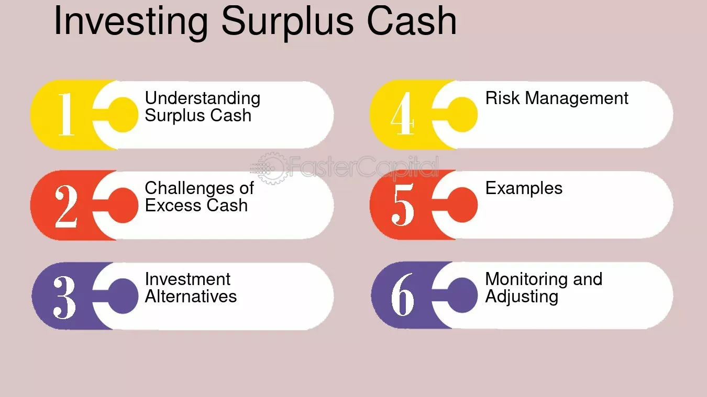

## Table of Contents

## What is excess cash and why should you invest it?

Excess cash is the money a person or a business has after paying all their bills and expenses. It's the extra money that is not needed for daily needs or planned spending. For a business, this might be money left over after paying for things like rent, salaries, and supplies. For a person, it could be money left after paying for rent, food, and other monthly costs.

Investing excess cash is a good idea because it can help your money grow over time. Instead of keeping the money in a bank account where it might not earn much interest, you can put it into investments like stocks, bonds, or real estate. These investments can give you a better return, meaning your money can increase more than it would just sitting in a savings account. This can help you reach your financial goals, like saving for a big purchase or planning for retirement.

## What are the basic investment options for beginners?

For beginners, one of the simplest investment options is a savings account. This is a safe place to keep your money, and you earn a little bit of interest over time. Savings accounts are good for people who want to keep their money safe and don't want to take big risks. Another option is a certificate of deposit (CD), which is like a savings account but you agree to leave your money in the bank for a certain time, like six months or a year. CDs usually give you a bit more interest than a regular savings account.

Another good choice for beginners is investing in the stock market through mutual funds or exchange-traded funds (ETFs). These funds let you invest in a lot of different companies at once, which can help spread out your risk. Mutual funds are managed by professionals who pick the stocks, while ETFs often follow a specific index, like the S&P 500. Both can be a good way to start investing in the stock market without having to pick individual stocks yourself.

Lastly, you might want to consider bonds. Bonds are like loans you give to a government or a company, and they pay you back with interest over time. They are usually safer than stocks but might not grow as much. For beginners, starting with government bonds, like U.S. Treasury bonds, can be a good way to get into investing without too much risk.

## How can you assess your risk tolerance before investing?

Assessing your risk tolerance before investing is important because it helps you choose investments that you feel comfortable with. Risk tolerance is about how much money you can afford to lose and how much uncertainty you can handle. To figure out your risk tolerance, think about your financial goals and how soon you need the money. If you need the money soon, you might want to take less risk. If you can wait a long time, you might be okay with more risk.

One way to assess your risk tolerance is to ask yourself some questions. For example, how would you feel if your investments lost value? Would you be able to sleep at night, or would you be too worried? Another question is, how much money can you afford to lose without it affecting your daily life? If the answer is not much, you might want to stick with safer investments. There are also online quizzes and tools that can help you figure out your risk tolerance by asking you these kinds of questions.

It's also a good idea to talk to a financial advisor. They can help you understand your risk tolerance better and suggest investments that match it. Remember, your risk tolerance can change over time, so it's good to check it again every now and then. This way, you can make sure your investments still fit with how you feel about risk.

## What are the differences between short-term and long-term investments?

Short-term investments are for money you need soon, usually within a few years. They are less risky because you don't want to lose money you need quickly. Examples of short-term investments include savings accounts, certificates of deposit (CDs), and money market funds. These options are safer and give you easy access to your money. The downside is that they usually don't grow as much as long-term investments. If you're saving for something like a vacation or a down payment on a house, short-term investments might be a good choice.

Long-term investments are for money you don't need right away, often for goals like retirement or buying a home years in the future. These investments can be riskier but have the potential to grow more over time. Examples include stocks, mutual funds, and real estate. Because you can wait longer, you can ride out the ups and downs of the market. The longer you can leave your money invested, the more time it has to grow. If you're planning for the future and can handle some risk, long-term investments could help your money grow more.

## How can diversification help in managing investment risks?

Diversification is like not putting all your eggs in one basket. It means spreading your money across different types of investments. This can help lower your risk because if one investment goes down, the others might go up or stay the same. For example, if you only invest in one company's stock and that company does badly, you could lose a lot of money. But if you invest in many different companies, the loss from one might be balanced out by gains in others.

By diversifying, you can also invest in different kinds of assets, like stocks, bonds, and real estate. Each type of investment can react differently to things happening in the economy. When stocks go down, bonds might go up, and vice versa. This mix can help keep your overall investment safer. It's like having a safety net that catches you if one part of your investments falls. Diversification doesn't guarantee you won't lose money, but it can help make your investment journey smoother and less risky.

## What are some common investment vehicles for excess cash?

One common way to invest excess cash is through a savings account. This is a safe and easy option where you can keep your money and earn a small amount of interest over time. Savings accounts are great for people who want to keep their money secure without taking big risks. Another option is a certificate of deposit (CD), which is similar to a savings account but requires you to leave your money in the bank for a set period, like six months or a year. CDs usually offer a bit more interest than regular savings accounts, making them a good choice for short-term savings goals.

Another popular investment vehicle is the stock market, where you can invest in stocks, mutual funds, or exchange-traded funds (ETFs). Stocks let you own a piece of a company, and if the company does well, the value of your stock can go up. Mutual funds and ETFs allow you to invest in a bunch of different companies at once, spreading out your risk. These options can be good for long-term goals like saving for retirement because they have the potential to grow more over time, even though they come with more risk.

Bonds are another option for investing excess cash. When you buy a bond, you're basically lending money to a government or a company, and they pay you back with interest over time. Bonds are usually safer than stocks but might not grow as much. For beginners, starting with government bonds, like U.S. Treasury bonds, can be a good way to get into investing without taking on too much risk. Each of these investment vehicles has its own benefits and risks, so it's important to choose the ones that fit your financial goals and how much risk you're comfortable with.

## How do interest rates affect investment decisions?

Interest rates can have a big impact on your investment decisions. When interest rates go up, it usually means that borrowing money becomes more expensive. This can slow down the economy because people and businesses might borrow less. For investors, higher interest rates can make safer investments like savings accounts and bonds more attractive because they offer better returns. On the other hand, when interest rates are high, the stock market might not do as well because companies have to pay more to borrow money, which can hurt their profits.

On the flip side, when interest rates go down, borrowing money becomes cheaper. This can help the economy grow because people and businesses might borrow more to spend or invest. For investors, lower interest rates can make stocks and real estate more appealing because the returns from safer investments like savings accounts and bonds might not be as good. So, when you're thinking about where to put your money, it's important to keep an eye on interest rates because they can change which investments look best at any given time.

## What role does inflation play in investment strategy?

Inflation is when prices go up over time, making your money worth less. If you just keep your money in a savings account, inflation can eat away at its value. That's why it's important to think about inflation when you're making investment choices. If your investments don't grow faster than inflation, you're losing buying power. For example, if inflation is at 3% and your savings account only gives you 1% interest, you're actually losing 2% in value each year.

To fight inflation, you might want to invest in things that can grow faster than the rate of inflation. Stocks and real estate are often good choices because they can go up in value over time. Some people also invest in things like commodities or inflation-protected bonds, which are designed to keep up with inflation. By thinking about inflation, you can pick investments that help your money keep its value and grow, even when prices are going up.

## How can tax implications influence your investment choices?

Taxes can change how much money you keep from your investments. Different investments are taxed in different ways. For example, money you earn from a savings account is usually taxed as regular income. But if you invest in stocks and hold them for more than a year, you might pay a lower tax rate on any profits you make when you sell them. This is called a long-term capital gains tax. Knowing how taxes work can help you pick investments that let you keep more of your money.

Another thing to think about is tax-advantaged accounts like 401(k)s or IRAs. These accounts can help you save on taxes. With a traditional 401(k) or IRA, you don't pay taxes on the money you put in until you take it out, usually when you're retired. This can help your investments grow faster because you're not losing money to taxes right away. With a Roth IRA, you pay taxes on the money you put in, but you don't pay taxes on the money you take out later. By using these kinds of accounts, you can make your investment strategy work better with your tax situation.

## What are advanced strategies for investing large sums of excess cash?

When you have a lot of extra money to invest, you might want to think about using advanced strategies to make the most of it. One strategy is called dollar-cost averaging. This means you spread out your investment over time instead of putting all your money in at once. By doing this, you can buy more shares when prices are low and fewer when prices are high, which can help you get a better average price. Another strategy is to use a tax-efficient approach. This means [picking](/wiki/asset-class-picking) investments that help you pay less in taxes. For example, you might invest in municipal bonds, which often don't get taxed, or use tax-advantaged accounts like a Roth IRA to grow your money without losing a lot to taxes.

Another advanced strategy is to use leverage, which means borrowing money to invest. This can make your gains bigger, but it also makes your losses bigger if things go wrong, so it's riskier. You might also want to think about alternative investments like real estate, private equity, or hedge funds. These can be good ways to diversify your portfolio and possibly get higher returns, but they can also be more complicated and harder to sell quickly. It's important to do a lot of research and maybe talk to a financial advisor to make sure these strategies fit with your goals and how much risk you're okay with.

## How can you use financial advisors to optimize your investment portfolio?

Using a financial advisor can really help you make the most of your investments. A good advisor can look at your whole financial situation and help you set clear goals. They can figure out how much risk you're okay with and suggest investments that fit your needs. They might suggest different kinds of investments like stocks, bonds, or even real estate, and help you spread your money out to lower your risk. They can also keep an eye on your investments and make changes when things in the market change or when your life changes, like if you get a new job or have a baby.

Financial advisors can also help you save on taxes. They know about special accounts like 401(k)s and IRAs that can help your money grow without losing a lot to taxes. They can also tell you about other ways to save on taxes, like investing in certain kinds of bonds. Plus, they can help you avoid common mistakes that people make when they invest on their own. Having a financial advisor can give you peace of mind because you know someone with a lot of knowledge is looking out for your money.

## What are the latest trends and technologies impacting cash investment methods?

One big trend in cash investment is the rise of digital platforms and apps. These tools make it easier for people to invest their money without having to go to a bank or talk to a financial advisor in person. You can use apps on your phone to buy and sell stocks, put money into mutual funds, or even invest in things like cryptocurrencies. These platforms often have low fees and let you start investing with just a little bit of money. They also use technology like [artificial intelligence](/wiki/ai-artificial-intelligence) to give you suggestions on what to invest in based on your goals and how much risk you're okay with.

Another trend is the use of robo-advisors. These are automated services that use computer programs to manage your investments for you. They ask you some questions about your goals and risk tolerance, then they pick and manage a mix of investments that fit what you're looking for. Robo-advisors can be cheaper than working with a human financial advisor and are good for people who want a simple way to invest without having to do a lot of work themselves. They can also automatically adjust your investments to keep them in line with your goals, which can save you time and help you stay on track.

## What is the Role of Risk Management in Algorithmic Trading?

Effective risk management is essential in [algorithmic trading](/wiki/algorithmic-trading) to protect against unforeseen market [volatility](/wiki/volatility-trading-strategies), which can lead to significant financial losses. One of the primary methods used to manage risk in algorithmic trading is the implementation of specific risk management tools such as stop-loss orders and position sizing.

Stop-loss orders are automated instructions to sell an asset when it reaches a certain price level, thereby limiting potential losses. The logic behind a stop-loss order can be implemented in Python as follows:

```python
def place_stop_loss(current_price, stop_loss_price):
    if current_price <= stop_loss_price:
        return "Sell order executed"
    else:
        return "Hold position"

# Example usage
current_price = 95
stop_loss_price = 100
order_status = place_stop_loss(current_price, stop_loss_price)
print(order_status)  # Output: Sell order executed
```

Position sizing is another critical risk management tool, which involves determining the appropriate amount of capital to invest in a single trade. This ensures that a trader does not allocate too much of their investment capital to a single position, thereby spreading risk across multiple trades. An efficient method to calculate position size might involve using the Kelly Criterion, which is a formula used to determine the optimal size of a series of bets:

$$
\text{Position Size} = \left( \frac{bp - q}{b} \right) \times \text{Total Capital}
$$

Where:
- $b$ is the odds received on the wager (in decimal format),
- $p$ is the probability of winning,
- $q$ is the probability of losing (1 - p).

Incorporating diversification within algorithmic strategies is another method to manage risk. Diversification involves spreading investments across various assets, time frames, or strategies, which reduces the impact of a poor performance in any single asset or strategy. This can be achieved by ensuring that trading algorithms simultaneously apply multiple strategies or trade across different asset classes to provide a balance between risk and reward. The effectiveness of diversification is often measured through metrics such as the Sharpe Ratio, which evaluates the risk-adjusted return of an investment:

$$
\text{Sharpe Ratio} = \frac{E[R] - R_f}{\sigma}
$$

Where:
- $E[R]$ is the expected portfolio return,
- $R_f$ is the risk-free rate,
- $\sigma$ is the standard deviation of the portfolio's excess return.

By integrating these risk management tools and strategies, traders can enhance the resilience and robustness of their algorithmic trading systems, ultimately striving for a balance between minimizing potential losses and maximizing returns.

## References & Further Reading

[1]: ["Algorithms for Hyper-Parameter Optimization"](https://dl.acm.org/doi/10.5555/2986459.2986743) by Bergstra, J., Bardenet, R., Bengio, Y., & Kégl, B. Advances in Neural Information Processing Systems 24.

[2]: ["Advances in Financial Machine Learning"](https://www.amazon.com/Advances-Financial-Machine-Learning-Marcos/dp/1119482089) by Marcos Lopez de Prado

[3]: ["Evidence-Based Technical Analysis: Applying the Scientific Method and Statistical Inference to Trading Signals"](https://www.amazon.com/Evidence-Based-Technical-Analysis-Scientific-Statistical/dp/0470008741) by David Aronson

[4]: ["Machine Learning for Algorithmic Trading"](https://github.com/stefan-jansen/machine-learning-for-trading) by Stefan Jansen

[5]: ["Quantitative Trading: How to Build Your Own Algorithmic Trading Business"](https://www.amazon.com/Quantitative-Trading-Build-Algorithmic-Business/dp/1119800064) by Ernest P. Chan

[6]: Harris, L. (2003). ["Trading and Exchanges: Market Microstructure for Practitioners."](https://academic.oup.com/book/52292) Oxford University Press.

[7]: Aldridge, I. (2013). ["High-Frequency Trading: A Practical Guide to Algorithmic Strategies and Trading Systems."](https://www.amazon.com/High-Frequency-Trading-Practical-Algorithmic-Strategies/dp/1118343506) Wiley Finance.

[8]: Hasbrouck, J. (2007). ["Empirical Market Microstructure: The Institutions, Economics, and Econometrics of Securities Trading."](https://academic.oup.com/book/52241) Oxford University Press.