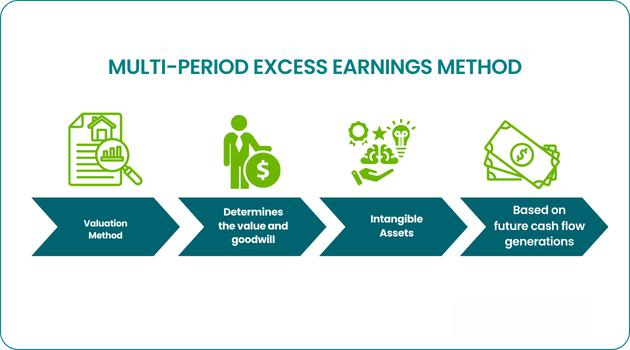

Investing surplus cash can be a daunting task, especially with the myriad of options available in today’s financial markets. The decision-making process involves understanding various vehicles ranging from traditional savings accounts to complex investment products. For investors seeking to go beyond conventional savings or stock market investments, algorithmic trading presents a sophisticated option. This form of trading utilizes computer algorithms to execute trades at speeds and frequencies that are impossible for human traders.

Algorithmic trading is a technological frontier in investing, leveraging computational power and quantitative analysis to identify trading opportunities based on pre-defined criteria. The use of historical data and real-time analysis allows for the development of strategies that can offer significant advantages over traditional investment approaches. By evaluating both the benefits and considerations involved in algorithmic trading, investors can make informed decisions to optimize their investment's performance.



This article will explore various financial strategies for investing extra cash, with an emphasis on algorithmic trading. Topics covered will include an understanding of the general strategies available for surplus cash, insights into algorithmic trading, popular trading strategies within this domain, and the crucial aspects of risk management. Additionally, we will examine how these algorithmic strategies can be optimized through techniques like backtesting and continuous monitoring, and discuss the ethical considerations and regulatory landscape that govern algorithmic trading.

In a world where financial markets are increasingly driven by advanced technology, algorithmic trading represents a dynamic and evolving field, offering investors potentially superior returns when combined with sound financial principles and diligent oversight. This article aims to equip readers with the essential knowledge needed to navigate the complexities of investing surplus cash through algorithmic trading.

## Table of Contents

## Understanding Financial Strategies for Extra Cash

Managing extra cash efficiently requires a thorough understanding of various financial instruments and their potential implications on an investor's portfolio. Common financial instruments include stocks, bonds, exchange-traded funds (ETFs), and real estate.

Stocks represent ownership in a company and entitle holders to a proportion of the corporation’s profit through dividends and stock appreciation. They offer high return potential but also come with higher volatility and risk. Bonds, on the other hand, are debt securities that provide fixed income and are regarded as less risky than stocks, hence, suitable for risk-averse investors seeking predictable returns.

ETFs are investment funds traded on stock exchanges, much like individual stocks. They provide diversification by holding a basket of assets, which may encompass a variety of stocks, bonds, or other securities. This diversification can mitigate risk compared to investing in single stocks or bonds. Real estate investments, through direct property ownership or real estate investment trusts (REITs), provide income through rents and potential capital appreciation, acting as a hedge against inflation.

In selecting the right investment strategy, one must evaluate their financial goals, which may include capital preservation, income generation, or growth. Additionally, understanding personal risk tolerance is crucial. Investors must ask themselves if they are comfortable with the market's ups and downs or if they prefer the stability of fixed returns.

Diversification remains a pivotal [factor](/wiki/factor-investing) in investment strategy, spreading risk across various asset classes to manage potential downsides. Traditional avenues like stocks and bonds can be complemented with modern ones like ETFs and real estate to balance risk and return levels effectively. A well-diversified portfolio can mitigate the impact of a poor-performing asset and enhance overall returns.

In conclusion, a strategic combination of stocks, bonds, ETFs, and real estate, aligned with financial goals and risk tolerance, can effectively manage extra cash and deliver optimal investment outcomes.

## Exploring Algorithmic Trading

Algorithmic trading is a method of executing transactions that utilizes computer algorithms to analyze market data and implement trading strategies efficiently. These algorithms follow pre-set criteria, such as timing, price, or [volume](/wiki/volume-trading-strategy), to make buy and sell decisions. The primary goal of [algorithmic trading](/wiki/algorithmic-trading) is to capitalize on various market opportunities while minimizing human intervention and emotional decision-making.

The strategies employed in algorithmic trading are primarily based on quantitative models that analyze historical data and current market conditions. By identifying patterns and trends in the data, algorithms can predict potential trading opportunities. This data-driven approach allows for more precise decision-making compared to traditional trading, where human judgment and experience play larger roles.

One of the key benefits of algorithmic trading is its speed. Computer algorithms can process and analyze data much faster than a human trader. This speed enables algorithms to execute trades in fractions of a second, capitalizing on short-lived opportunities that would be impossible for humans to exploit manually.

Efficiency is another significant advantage of algorithmic trading. Algorithms can handle vast amounts of data and monitor multiple markets and securities simultaneously. This capability allows traders to diversify their trading activities and achieve better risk management.

Furthermore, algorithmic trading eliminates many of the biases and emotional responses that can adversely affect human traders. By adhering strictly to the pre-defined rules and models, algorithms help maintain consistency in trading strategies, reducing the likelihood of impulsive decisions that could lead to losses.

In conclusion, algorithmic trading leverages advanced technology and data analysis to enhance trading efficiency and performance. By managing large sets of data and executing trades swiftly and precisely, algorithmic trading offers a compelling alternative to traditional trading methods.

## Popular Algo Trading Strategies for Investment

Algorithmic trading leverages a variety of strategies aimed at optimizing returns by automating trading decisions based on sophisticated algorithms. Popular strategies include Trend-Following, Mean Reversion, Arbitrage, and News-Based Trading, each with distinct methodologies and objectives.

**Trend-Following**

Trend-following strategies focus on identifying and investing in sustained market movements. By analyzing price data, traders utilize algorithms to detect and follow these trends, whether bullish or bearish. The core principle is that significant price movements, once started, are likely to continue in the same direction. Technical indicators such as moving averages and the Relative Strength Index (RSI) are commonly used to determine entry and [exit](/wiki/exit-strategy) points. A sample Python snippet for calculating a simple moving average (SMA) might look like this:

```python
import pandas as pd

def calculate_sma(data, window):
    return data.rolling(window=window).mean()

# Example usage with a Pandas DataFrame 'df' with a 'price' column
sma = calculate_sma(df['price'], window=50)
```

**Mean Reversion**

Mean reversion strategies operate on the assumption that asset prices will return to their mean or average over time. When prices deviate significantly from this mean, it presents opportunities to trade on the expected reversion. This strategy often uses statistical tools like Bollinger Bands to visualize price movements in relation to averages. Traders might set buy/sell signals based on price breaches above or below these bands.

**Arbitrage**

Arbitrage involves exploiting price inefficiencies of the same asset across different markets. This can be particularly effective in markets where information asymmetry or timing differences result in price discrepancies. Types of [arbitrage](/wiki/arbitrage) strategies include pure arbitrage, risk arbitrage, and [statistical arbitrage](/wiki/statistical-arbitrage). Algorithms can quickly execute trades to lock in profit before the market corrects the price differences.

**News-Based Trading**

News-based strategies rely on algorithms to rapidly interpret new information and make trading decisions based on predicted market reactions. Algorithms process news alerts, social media updates, and economic reports to gauge market sentiment. Natural language processing (NLP) and [machine learning](/wiki/machine-learning) techniques are often employed to analyze the sentiment and potential impact of the news. Python libraries like `nltk` and `scikit-learn` are useful for developing such models. An outline for a sentiment analysis script might be:

```python
import nltk
from sklearn.feature_extraction.text import CountVectorizer
from sklearn.naive_bayes import MultinomialNB

def analyze_sentiment(news_article):
    vectorizer = CountVectorizer()
    X = vectorizer.fit_transform([news_article])
    model = MultinomialNB()
    # Assume 'X_train' and 'y_train' are the features and labels from a training dataset
    model.fit(X_train, y_train)
    return model.predict(X)

# Use analyze_sentiment on incoming news
sentiment = analyze_sentiment("Breaking news article content here")
```

Each of these algorithmic trading strategies requires robust risk management and continuous monitoring to adapt to market conditions. Understanding their distinct characteristics enables investors to select the most appropriate approach based on their financial goals and risk appetite.

## The Role of Risk Management in Algorithmic Trading

Effective risk management is essential in algorithmic trading to protect against unforeseen market [volatility](/wiki/volatility-trading-strategies), which can lead to significant financial losses. One of the primary methods used to manage risk in algorithmic trading is the implementation of specific risk management tools such as stop-loss orders and position sizing.

Stop-loss orders are automated instructions to sell an asset when it reaches a certain price level, thereby limiting potential losses. The logic behind a stop-loss order can be implemented in Python as follows:

```python
def place_stop_loss(current_price, stop_loss_price):
    if current_price <= stop_loss_price:
        return "Sell order executed"
    else:
        return "Hold position"

# Example usage
current_price = 95
stop_loss_price = 100
order_status = place_stop_loss(current_price, stop_loss_price)
print(order_status)  # Output: Sell order executed
```

Position sizing is another critical risk management tool, which involves determining the appropriate amount of capital to invest in a single trade. This ensures that a trader does not allocate too much of their investment capital to a single position, thereby spreading risk across multiple trades. An efficient method to calculate position size might involve using the Kelly Criterion, which is a formula used to determine the optimal size of a series of bets:

$$
\text{Position Size} = \left( \frac{bp - q}{b} \right) \times \text{Total Capital}
$$

Where:
- $b$ is the odds received on the wager (in decimal format),
- $p$ is the probability of winning,
- $q$ is the probability of losing (1 - p).

Incorporating diversification within algorithmic strategies is another method to manage risk. Diversification involves spreading investments across various assets, time frames, or strategies, which reduces the impact of a poor performance in any single asset or strategy. This can be achieved by ensuring that trading algorithms simultaneously apply multiple strategies or trade across different asset classes to provide a balance between risk and reward. The effectiveness of diversification is often measured through metrics such as the Sharpe Ratio, which evaluates the risk-adjusted return of an investment:

$$
\text{Sharpe Ratio} = \frac{E[R] - R_f}{\sigma}
$$

Where:
- $E[R]$ is the expected portfolio return,
- $R_f$ is the risk-free rate,
- $\sigma$ is the standard deviation of the portfolio's excess return.

By integrating these risk management tools and strategies, traders can enhance the resilience and robustness of their algorithmic trading systems, ultimately striving for a balance between minimizing potential losses and maximizing returns.

## Optimizing Algorithmic Trading Strategies

Optimizing algorithmic trading strategies is essential for achieving consistent and favorable outcomes in financial markets. One fundamental component of this optimization process is [backtesting](/wiki/backtesting), which involves utilizing historical data to assess the reliability and effectiveness of trading algorithms. By simulating trades over historical periods, investors can evaluate how a particular strategy would have performed and identify potential strengths and weaknesses. This process helps refine algorithms to improve future performance.

Backtesting helps to validate a strategy's potential profitability and provides insight into various metrics, such as drawdown, volatility, and risk-adjusted returns. It often involves testing several parameters, which allows traders to understand the conditions under which a strategy performs optimally and when it may fail. The process typically uses historical price data to replay market conditions and analyze trading rules under consideration. Below is a simple example of a Python script for backtesting a basic moving average crossover strategy:

```python
import pandas as pd

# Load historical price data
data = pd.read_csv('historical_prices.csv')

# Calculate short and long moving averages
short_window = 40
long_window = 100

data['Short_MA'] = data['Close'].rolling(window=short_window, min_periods=1).mean()
data['Long_MA'] = data['Close'].rolling(window=long_window, min_periods=1).mean()

# Generate signals
data['Signal'] = 0
data['Signal'][short_window:] = np.where(data['Short_MA'][short_window:] > data['Long_MA'][short_window:], 1, 0)
data['Position'] = data['Signal'].diff()

# Review output
print(data[['Date', 'Close', 'Short_MA', 'Long_MA', 'Signal', 'Position']])
```

Continuous monitoring and adjustment are also integral to strategy optimization. Markets are dynamic, often resulting in shifts that necessitate the reassessment of previously set parameters. By regularly evaluating real-time performance metrics, traders ensure their strategies remain aligned with current market conditions. This adaptive process may involve recalibrating moving averages, stop-loss limits, or other algorithm parameters in response to changing volatilities or trends observed in the market.

The incorporation of machine learning techniques can further enhance the adaptability and accuracy of algorithmic trading strategies. Machine learning models, such as Support Vector Machines (SVM), Random Forests, and Deep Learning networks, can reveal hidden patterns in data, allowing traders to anticipate potential market movements more accurately. These models can adjust to new data inputs automatically, helping traders maintain a competitive edge by predicting market direction or identifying potential arbitrage opportunities.

For example, machine learning algorithms can be used to classify investment signals or create predictive models of asset prices. To illustrate this, consider using a machine learning model to predict stock movements:

```python
from sklearn.model_selection import train_test_split
from sklearn.ensemble import RandomForestClassifier
from sklearn.metrics import accuracy_score

# Prepare features and target variable
X = data[['Short_MA', 'Long_MA']]
y = data['Signal']

# Split the data into train and test sets
X_train, X_test, y_train, y_test = train_test_split(X, y, test_size=0.2, random_state=42)

# Train model
model = RandomForestClassifier(n_estimators=100, random_state=42)
model.fit(X_train, y_train)

# Make predictions
predictions = model.predict(X_test)

# Evaluate accuracy
accuracy = accuracy_score(y_test, predictions)
print(f'Accuracy: {accuracy:.2f}')
```

By leveraging these technologies within the algorithmic framework, traders can optimize their strategies to be both robust and responsive to evolving market landscapes.

## The Ethics and Regulation of Algorithmic Trading

Algorithmic trading, a highly technological method leveraging complex algorithms, has transformed financial markets by enabling high-speed and high-frequency trading. However, its rapid evolution and widespread adoption present significant ethical and regulatory challenges, crucial for sustaining fair and functional markets.

One primary ethical concern in algorithmic trading is market manipulation. Algorithms can be designed to artificially influence asset prices, a practice that undermines market integrity. For instance, spoofing and layering involve placing large orders to create a false sense of demand or supply, which are then canceled once other traders react. Such practices can distort market prices and disadvantage other investors.

Fairness is another critical issue. The speed advantage granted by sophisticated algorithms often leads to a competitive edge for those who can afford the technology, potentially sidelining traditional investors. This creates an uneven playing field, as shown by the disparities in transaction time between institutional and retail traders. Addressing these ethical concerns requires a robust regulatory framework.

Globally, regulations are in place to ensure market stability and protect against unethical practices. In the United States, for example, the Securities and Exchange Commission (SEC) and the Commodity Futures Trading Commission (CFTC) have established rules targeting manipulative practices, such as the prohibition of spoofing. The European Securities and Markets Authority (ESMA) similarly implements regulations under the Markets in Financial Instruments Directive II (MiFID II) to enhance transparency and safeguard against market abuses.

Compliance with these regulations demands that algorithmic traders possess a comprehensive understanding of both local and international trading laws. Algorithms must be designed to align with legal standards, ensuring they neither exploit loopholes nor engage in manipulative tactics. Continuous monitoring and auditing of algorithms help in maintaining compliance and adapting to evolving legal landscapes.

An integral part of sustainable trading practices involves recognizing the impact of algorithmic trading on market dynamics and taking proactive steps to address potential imbalances. By adhering to ethical standards and regulatory requirements, traders can engage in responsible algorithmic trading, promoting fairness and stability across financial markets.

## Conclusion

For investors with extra cash seeking sophisticated strategies, algorithmic trading represents a compelling option. Its appeal lies in its ability to leverage data-driven insights and mechanistic precision beyond human capabilities. This approach not only maximizes the potential for profit but also introduces efficiencies in trade execution and data processing. 

However, despite its benefits, success in algorithmic trading requires a comprehensive understanding of financial markets and a robust framework for strategy development. Knowledge encompasses a deep familiarity with both market mechanics and the technology underpinning algorithmic systems. This includes understanding the various algorithms, their deployment, and the infrastructure required to execute trades swiftly and accurately.

Building successful algorithmic strategies also demands meticulous planning and continuous evaluation. This includes backtesting strategies against historical data to validate their potential effectiveness and adapting strategies in response to evolving market conditions. Continuous monitoring is paramount; algorithmic traders must be vigilant in observing market movements and adjusting their algorithms accordingly to mitigate risks. 

Python, a favorite language among quants and data scientists, facilitates these processes due to its vast libraries for data manipulation, analysis, and machine learning. Below is a simple Python code snippet illustrating a basic framework for algorithmically tracking asset price movements:

```python
import pandas as pd
import numpy as np

# Load historical market data
data = pd.read_csv('market_data.csv')

# Simple moving average strategy
def simple_moving_average(data, short_window=40, long_window=100):
    signals = pd.DataFrame(index=data.index)
    signals['signal'] = 0.0

    # Create short simple moving average
    signals['short_mavg'] = data['close'].rolling(window=short_window, min_periods=1, center=False).mean()
    # Create long simple moving average
    signals['long_mavg'] = data['close'].rolling(window=long_window, min_periods=1, center=False).mean()

    # Generate signals
    signals['signal'][short_window:] = np.where(signals['short_mavg'][short_window:] > signals['long_mavg'][short_window:], 1.0, 0.0)

    # Create trading orders
    signals['positions'] = signals['signal'].diff()

    return signals

# Example usage
signals = simple_moving_average(data)
print(signals.tail())
```

By combining technology with sound investment principles, investors can effectively harness algorithmic trading. The fluidity and complexity of financial markets necessitate not just a strategic approach but one that is also adaptive and continuously refined. Proper execution and constant adjustment cement the potential of algorithmic trading to optimize returns for those willing to commit the necessary resources and expertise. This readiness to integrate technology and deep market knowledge underscores the sophisticated advantage that algorithmic trading provides to modern investors.

## References & Further Reading

[1]: ["Algorithms for Hyper-Parameter Optimization"](https://dl.acm.org/doi/10.5555/2986459.2986743) by Bergstra, J., Bardenet, R., Bengio, Y., & Kégl, B. Advances in Neural Information Processing Systems 24.

[2]: ["Advances in Financial Machine Learning"](https://www.amazon.com/Advances-Financial-Machine-Learning-Marcos/dp/1119482089) by Marcos Lopez de Prado

[3]: ["Evidence-Based Technical Analysis: Applying the Scientific Method and Statistical Inference to Trading Signals"](https://www.amazon.com/Evidence-Based-Technical-Analysis-Scientific-Statistical/dp/0470008741) by David Aronson

[4]: ["Machine Learning for Algorithmic Trading"](https://github.com/stefan-jansen/machine-learning-for-trading) by Stefan Jansen

[5]: ["Quantitative Trading: How to Build Your Own Algorithmic Trading Business"](https://www.amazon.com/Quantitative-Trading-Build-Algorithmic-Business/dp/1119800064) by Ernest P. Chan

[6]: Harris, L. (2003). ["Trading and Exchanges: Market Microstructure for Practitioners."](https://academic.oup.com/book/52292) Oxford University Press.

[7]: Aldridge, I. (2013). ["High-Frequency Trading: A Practical Guide to Algorithmic Strategies and Trading Systems."](https://www.amazon.com/High-Frequency-Trading-Practical-Algorithmic-Strategies/dp/1118343506) Wiley Finance.

[8]: Hasbrouck, J. (2007). ["Empirical Market Microstructure: The Institutions, Economics, and Econometrics of Securities Trading."](https://academic.oup.com/book/52241) Oxford University Press.