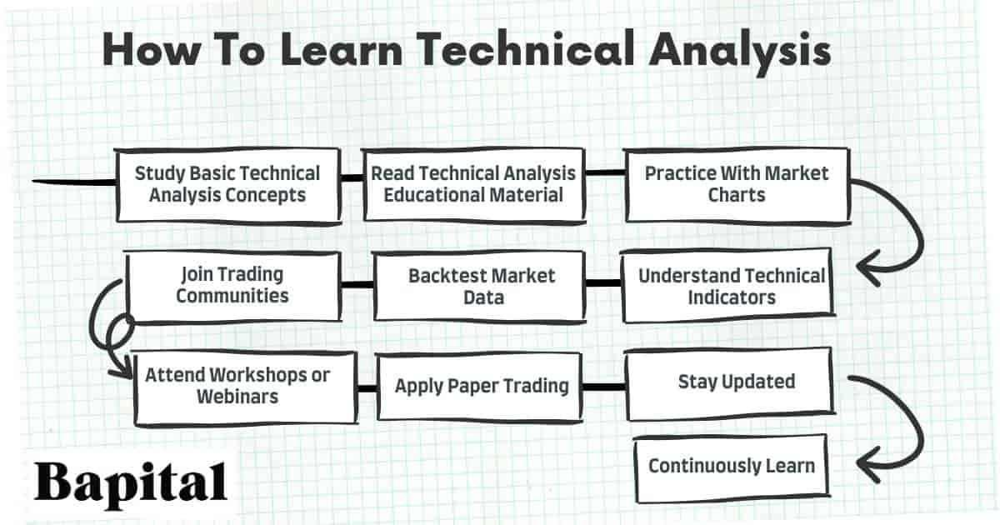

## Table of Contents

## What is technical analysis and why is it important for trading?

Technical analysis is a way to study and predict how prices of things like stocks or cryptocurrencies will move in the future. It looks at past price movements and trading volumes to find patterns and trends. Traders use charts and different tools to help them understand these patterns. Instead of focusing on the company's news or financial reports, technical analysis only looks at the price and volume data.

This method is important for trading because it helps traders make decisions based on what the market is actually doing, not just what they think might happen. By spotting trends and patterns, traders can decide the best times to buy or sell. This can help them make more money and manage their risks better. Even though it's not perfect and doesn't always work, many traders find it useful because it gives them a clear way to look at the market and make choices.

## How can beginners start learning the basics of technical analysis?

Beginners can start learning the basics of technical analysis by first understanding what it is and why it's used. They should begin with simple concepts like trends, support and resistance levels, and basic chart patterns. There are many free resources available online, such as articles, videos, and beginner-friendly courses that explain these concepts in easy-to-understand ways. Websites like Investopedia and YouTube channels dedicated to trading can be great starting points. It's also helpful to practice reading charts and identifying patterns on a demo trading account, where you can trade with virtual money and learn without risking real money.

Once beginners have a grasp of the basics, they can move on to learning about more advanced tools like moving averages, the Relative Strength Index (RSI), and the Moving Average Convergence Divergence (MACD). These tools help traders make better predictions about future price movements. It's important to practice using these tools on historical data to see how they work in different market conditions. Joining online communities or forums where traders share their experiences and tips can also be very useful. Remember, learning technical analysis takes time and practice, so beginners should be patient and keep learning as they go.

## What are the most common technical indicators used in analysis?

Some of the most common technical indicators used in analysis are moving averages, the Relative Strength Index (RSI), and the Moving Average Convergence Divergence (MACD). Moving averages help traders see the overall direction of a price trend by smoothing out price data over a specific period. For example, a 50-day moving average shows the average price over the last 50 days. The RSI measures how fast and how much a price has changed to see if a stock or asset is overbought or oversold. A high RSI might mean the price has risen too fast and could fall soon, while a low RSI could mean the price has dropped too much and might go up soon.

The MACD is another popular indicator that shows the relationship between two moving averages of a security's price. It helps traders spot changes in the strength, direction, [momentum](/wiki/momentum), and duration of a trend in a stock's price. The MACD line is calculated by subtracting the 26-day exponential moving average (EMA) from the 12-day EMA. A signal line, which is a 9-day EMA of the MACD line, is then plotted on top of the MACD line. When the MACD line crosses above the signal line, it's a bullish signal, suggesting it might be a good time to buy. When it crosses below, it's a bearish signal, suggesting it might be a good time to sell. These indicators help traders make informed decisions based on price movements.

## How do candlestick patterns contribute to technical analysis?

Candlestick patterns are important in technical analysis because they show how prices move over time in a clear way. Each candlestick on a chart shows the opening, closing, highest, and lowest price for a certain time period, like a day or an hour. By looking at these patterns, traders can see if buyers or sellers are in control of the market. For example, a "bullish engulfing" pattern, where a small red candle is followed by a larger green candle, can mean that buyers are starting to take over and the price might go up soon. These patterns help traders make guesses about what the price might do next.

There are many different candlestick patterns, and they can be used alone or with other technical indicators. Patterns like "doji," where the opening and closing prices are the same, can show that the market is unsure about which way to go. Another pattern, called "hammer," can signal that the price might start going up after it has been going down. By learning these patterns, traders can make better decisions about when to buy or sell. While no pattern is perfect and they don't always predict the future correctly, they give traders a useful tool to understand market movements and make more informed trades.

## What are support and resistance levels, and how are they identified?

Support and resistance levels are important ideas in technical analysis. They help traders see where the price of something, like a stock or a [cryptocurrency](/wiki/cryptocurrency), might stop going down or up. A support level is like a floor that the price bounces off of when it's going down. It's where a lot of people think the price is low enough to buy, so the price often goes back up from there. On the other hand, a resistance level is like a ceiling that the price hits when it's going up. It's where a lot of people think the price is high enough to sell, so the price often goes back down from there.

To find these levels, traders look at past price data on a chart. They look for places where the price has stopped going down or up several times before. For example, if the price has bounced off a certain level three times in the last few months, that level is likely a strong support. If the price has hit a certain level and then gone back down three times, that level is likely a strong resistance. Traders often draw lines on their charts to mark these levels and watch them closely. When the price breaks through a support or resistance level, it can mean that the price might keep moving in that direction for a while.

## How can traders use trend lines effectively in their analysis?

Trend lines are simple but powerful tools that traders use to see the direction of a price movement. By drawing a straight line that connects the highs or lows of a price chart, traders can see if the price is going up, down, or staying the same. An upward trend line, drawn along the lows of the price, shows that the price is generally increasing over time. A downward trend line, drawn along the highs, shows that the price is generally decreasing. When the price keeps touching the trend line without breaking it, it means the trend is strong. But if the price breaks through the trend line, it might mean the trend is changing, and traders need to be ready for a new direction.

Traders can use trend lines to make decisions about when to buy or sell. For example, if the price is following an upward trend line, traders might see it as a good time to buy when the price touches the line, expecting it to go up again. If the price breaks below the upward trend line, it could be a signal to sell, as the uptrend might be over. The same goes for a downward trend line; if the price is following it, traders might see it as a good time to sell when the price touches the line, expecting it to go down again. If the price breaks above the downward trend line, it could be a signal to buy, as the downtrend might be ending. By watching how the price interacts with trend lines, traders can better understand market movements and make more informed trading choices.

## What role do moving averages play in technical analysis?

Moving averages are a key tool in technical analysis because they help traders see the overall direction of a price trend. A moving average is calculated by taking the average price of a security over a certain number of days. For example, a 50-day moving average shows the average price over the last 50 days. By smoothing out short-term price changes, moving averages make it easier to spot trends. Traders often use two types: the simple moving average (SMA), which gives equal weight to all prices, and the exponential moving average (EMA), which gives more weight to recent prices. These averages help traders decide if it's a good time to buy or sell by showing if the price is going up, down, or staying the same.

Traders use moving averages in different ways. One common method is to look at the crossover of two moving averages, like a short-term (e.g., 50-day) and a long-term (e.g., 200-day) moving average. When the short-term average crosses above the long-term average, it's called a "golden cross," and it might mean the price will go up. When the short-term average crosses below the long-term average, it's called a "death cross," and it might mean the price will go down. Another way is to watch how the price interacts with the moving average. If the price stays above the moving average, it might be a good time to buy. If the price stays below, it might be a good time to sell. By using moving averages, traders can make more informed decisions and better understand market trends.

## How can volume analysis enhance technical analysis insights?

Volume analysis is like looking at how many people are buying or selling something, and it can make technical analysis better. When you see that the price is going up and the [volume](/wiki/volume-trading-strategy) is also going up, it means that a lot of people are buying, and this can make the price go up even more. On the other hand, if the price is going down and the volume is high, it means a lot of people are selling, and this can make the price go down even more. By looking at volume, traders can see if the price movement is strong or weak. If the price is moving but the volume is low, it might mean the price will not keep moving in that direction for long.

Using volume with other technical tools, like moving averages or chart patterns, can give traders a clearer picture of what's happening in the market. For example, if a stock breaks through a resistance level with high volume, it's a stronger sign that the price will keep going up than if the volume was low. Volume can also help traders spot when a trend might be ending. If the price is going up but the volume is going down, it might mean that fewer people are interested in buying, and the price might start to go down soon. By paying attention to volume, traders can make better guesses about where the price might go next and make smarter trading choices.

## What advanced chart patterns should an intermediate analyst learn?

Intermediate analysts should learn about head and shoulders patterns, which can show when a trend might be ending. A head and shoulders pattern looks like three peaks, with the middle peak (the head) being higher than the two on the sides (the shoulders). If the price is going up and you see this pattern, it might mean the price will start going down soon. The opposite, called an inverse head and shoulders, can mean the price might start going up after it has been going down. By watching for these patterns, analysts can guess when big changes in the price might happen.

Another useful pattern for intermediate analysts is the cup and handle pattern. This pattern looks like a cup with a small handle on the right side. It usually means that the price might go up soon. The cup part of the pattern shows that the price went down and then came back up to about where it started. The handle part is a small dip before the price starts going up again. When analysts see this pattern, they might decide to buy because they think the price will keep going up. Learning these patterns can help intermediate analysts make better trading choices and understand the market better.

## How does the Fibonacci retracement tool assist in predicting price movements?

The Fibonacci retracement tool helps traders guess where the price might go next by using special numbers called Fibonacci levels. These levels are based on a sequence of numbers where each number is the sum of the two before it, like 0, 1, 1, 2, 3, 5, and so on. In trading, the main Fibonacci levels are 23.6%, 38.2%, 50%, 61.8%, and 78.6%. Traders draw these levels on a chart between the highest and lowest points of a price move. When the price goes up or down, it often stops or changes direction at one of these levels. This can help traders decide if it's a good time to buy or sell.

For example, if a stock's price goes up a lot and then starts to go down, traders might use the Fibonacci retracement tool to see where the price might stop going down. If the price stops near the 61.8% level, traders might think it's a good time to buy because the price might start going up again. The same idea works if the price is going down and then starts to go up; traders can use the tool to find levels where the price might stop going up and start going down again. By using the Fibonacci retracement tool, traders can make better guesses about where the price might go next and make smarter trading choices.

## What are the key differences between technical analysis and fundamental analysis?

Technical analysis and [fundamental analysis](/wiki/fundamental-analysis) are two different ways to study and predict the price of things like stocks or cryptocurrencies. Technical analysis looks at past price movements and trading volumes to find patterns and trends. It uses charts and tools like moving averages and the Relative Strength Index (RSI) to help traders decide when to buy or sell. Technical analysts believe that all the information they need is already shown in the price and volume data, so they don't need to look at other things like news or financial reports. They think that by studying these patterns, they can guess where the price might go next.

On the other hand, fundamental analysis looks at the basic value of a company or asset. It studies things like the company's earnings, the economy, and other important factors to decide if the price is a good deal. Fundamental analysts might look at financial reports, news about the company, and even the overall market to see if the price is too high or too low. They believe that by understanding the true value of a company, they can make better guesses about whether the price will go up or down in the future. While technical analysis focuses on what the market is doing right now, fundamental analysis tries to understand what the company or asset is really worth.

## How can expert traders integrate technical analysis with algorithmic trading strategies?

Expert traders can integrate technical analysis with [algorithmic trading](/wiki/algorithmic-trading) strategies by using the patterns and indicators from technical analysis to create rules for their algorithms. For example, they might use moving averages to set up a trading algorithm that buys when a short-term moving average crosses above a long-term moving average, and sells when it crosses below. They can also use indicators like the Relative Strength Index (RSI) or the Moving Average Convergence Divergence (MACD) to set up signals for buying and selling. By turning these technical signals into clear rules, the algorithm can make trades automatically based on what the market is doing, without needing the trader to watch the market all the time.

Another way expert traders use technical analysis in algorithmic trading is by [backtesting](/wiki/backtesting) their strategies. They can use historical price data to see how well their algorithms would have worked in the past. If the algorithm made good trades based on technical patterns, the trader can feel more confident about using it in the future. This helps them fine-tune their algorithms to make better trades. By combining the insights from technical analysis with the speed and precision of algorithmic trading, expert traders can make more informed and timely decisions, improving their chances of success in the market.

## References & Further Reading

[1]: Graham, B. (2006). ["The Intelligent Investor: The Definitive Book on Value Investing."](https://www.amazon.com/Intelligent-Investor-Definitive-Investing-Essentials/dp/0060555661) HarperCollins.

[2]: Murphy, J. J. (1999). ["Technical Analysis of the Financial Markets: A Comprehensive Guide to Trading Methods and Applications."](https://www.amazon.com/Technical-Analysis-Financial-Markets-Comprehensive/dp/0735200661) New York Institute of Finance.

[3]: Nison, S. (2001). ["Japanese Candlestick Charting Techniques: A Contemporary Guide to the Ancient Investment Techniques of the Far East."](https://archive.org/details/japanesecandlest0000niso) Prentice Hall Press.

[4]: Chan, E. P. (2009). ["Quantitative Trading: How to Build Your Own Algorithmic Trading Business."](https://github.com/ftvision/quant_trading_echan_book) John Wiley & Sons.

[5]: Lopez de Prado, M. (2018). ["Advances in Financial Machine Learning."](https://www.amazon.com/Advances-Financial-Machine-Learning-Marcos/dp/1119482089) Wiley.

[6]: Aronson, D. R. (2006). ["Evidence-Based Technical Analysis: Applying the Scientific Method and Statistical Inference to Trading Signals."](https://www.wiley.com/en-us/Evidence+Based+Technical+Analysis%3A+Applying+the+Scientific+Method+and+Statistical+Inference+to+Trading+Signals-p-9780470008744) Wiley.

[7]: Jansen, S. (2020). ["Machine Learning for Algorithmic Trading: Predictive models to extract signals from market and alternative data for systematic trading strategies with Python."](https://www.amazon.com/Machine-Learning-Algorithmic-Trading-alternative/dp/1839217715) Packt Publishing.