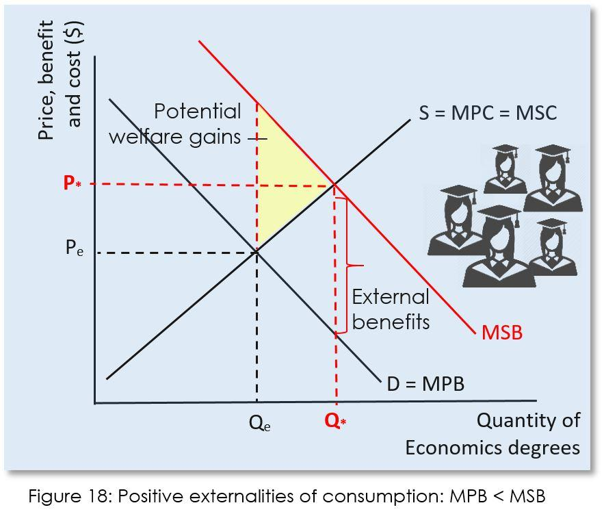

In economics, externalities are unintended consequences, either costs or benefits, that affect third parties who are not directly involved in a transaction. These can be categorized as either positive or negative. Positive externalities provide societal benefits, such as the widespread public health improvements arising from vaccination programs. Conversely, negative externalities impose societal costs, with pollution from industrial activities being a classic example. 

Algorithmic trading introduces unique externalities due to its reliance on automated algorithms to execute trades at extremely high speeds. This technology reshapes market dynamics in ways not always anticipated by participants. While algorithmic trading can enhance market liquidity and contribute positively to market efficiency, it can also exacerbate market volatility and introduce systemic risks, notably demonstrated during episodes like flash crashes.

Understanding and managing these externalities is crucial for maintaining efficiency and stability in financial markets. Such comprehension allows stakeholders to devise strategies that harness the positive aspects of algorithmic trading while mitigating its potential negative impacts. This article intends to explore the measurement of externalities within economics and how these principles intersect with the domain of algorithmic trading, providing insights into the challenges and solutions relevant to contemporary market structures.

## Table of Contents

## Understanding Externalities in Economics

Externalities are a pivotal concept in economics, referring to the effects—both beneficial and detrimental—that economic activities impose on third parties who are not directly involved in transactions. These external impacts are typically not reflected in the costs or prices of the goods or services involved in the initial activity. This discrepancy can lead to inefficiencies in markets, often classified as market failures.

Positive externalities occur when an activity generates unforeseen benefits to others. A classic example is vaccination, which not only protects the individual receiving the vaccine but also contributes to herd immunity, enhancing public health across a community. When such positive externalities exist, private parties may underinvest in the activity since not all the benefits are confined to them, leading to a suboptimal outcome from a societal perspective.

Conversely, negative externalities arise when an activity imposes unwanted costs on others. Pollution is a prototypical negative externality. For instance, a factory discharging pollutants into a river affects not only its immediate ecosystem but also downstream residents who rely on the water for drinking or recreation. In such cases, the full social cost exceeds the private cost incurred by the polluter, resulting in overconsumption or overproduction from a societal standpoint.

The presence of externalities often leads to market failures, as the price mechanism fails to internalize these external costs or benefits. This misalignment can be depicted graphically through demand and supply curves that do not fully account for societal impacts. For instance, in the case of negative externalities, the social cost curve is above the private cost curve, and the market produces a quantity greater than the social optimum. Conversely, with positive externalities, the social benefit exceeds the private benefit, leading to an underproduction relative to the socially optimal level.

Addressing externalities is essential for aligning private incentives with social welfare. This can involve policy interventions such as taxes, subsidies, or regulations designed to internalize these external costs or benefits. For example, a Pigovian tax equal to the external cost of pollution can correct the market outcome by increasing the private cost to reflect the true social cost. Similarly, subsidies for activities with positive externalities, such as education or research and development, can encourage higher production levels that more closely align with societal benefits.

In summary, externalities are significant in understanding market imperfections and the need for interventions to achieve more efficient economic outcomes. Their management is crucial for balancing private decision-making with broader societal interests, ultimately contributing to enhanced social welfare.

## Measuring Externalities: Theory vs. Reality

Economists traditionally measure externalities by employing marginal cost and marginal benefit curves to identify potential deadweight losses or gains. These curves help in visualizing how external costs or benefits affect the optimal allocation of resources. Theoretically, externalities occur when the social costs or benefits of an economic activity diverge from the private costs or benefits borne by the participants. Ideally, the intersection of the social marginal cost curve and the social marginal benefit curve represents the socially efficient point of production or consumption. However, the theoretical framework often oversimplifies the complexities observed in real-world scenarios.

In practice, measuring externalities presents significant challenges due to the lack of comprehensive data and the complexity involved in estimation processes. Accurate data is essential for quantifying external costs or benefits, but it is often inadequate or incomplete. The difficulty in obtaining precise data forces economists to rely on estimation techniques that can introduce errors and bias.

Quantitative methods are commonly used to measure externalities, focusing on quantifying the cost of damages or the benefits of control measures. For example, the cost of air pollution can be assessed by estimating healthcare expenses or reduced agricultural yields. Conversely, qualitative approaches offer a different perspective, where the focus is on descriptive analysis instead of numerical quantification. These approaches consider the broader impacts of externalities, capturing nuances that might be missed by purely quantitative assessments.

Hybrid methods blend quantitative and qualitative techniques, using tools such as weighting and ranking to evaluate externality impacts across different contexts and sectors. Weighting involves assigning importance to various aspects of an externality, allowing for a more comprehensive evaluation that considers both measurable and qualitative factors. Ranking, on the other hand, can help prioritize externalities based on their perceived impact or urgency, informing policy decisions and resource allocation.

Despite these methodologies, the inherent complexity and variability of externalities render their measurement an evolving challenge. Continued advancements in data collection and analytical techniques are essential for improving the accuracy and reliability of externality assessments. These advancements can help bridge the gap between theoretical models and practical application, ensuring more effective integration of externalities into economic decision-making.

## Algorithmic Trading and Externalities

Algorithmic trading employs sophisticated algorithms to automate and expedite trading activities, significantly impacting market dynamics. These algorithms execute trades within microseconds, far surpassing human capabilities and transforming the landscape of financial markets globally.

Positive externalities from [algorithmic trading](/wiki/algorithmic-trading) are largely embodied in improved market [liquidity](/wiki/liquidity-risk-premium) and efficiency. Enhanced liquidity arises as algorithmic systems increase the [volume](/wiki/volume-trading-strategy) and frequency of trades, thereby narrowing bid-ask spreads and reducing transaction costs. A more liquid market encourages participation, subsequently promoting price discovery and aligning market prices more closely with intrinsic values.

However, algorithmic trading can also induce negative externalities, primarily in the form of heightened [volatility](/wiki/volatility-trading-strategies) and systemic risks. Flash crashes, such as the infamous event on May 6, 2010, showcase how automated, high-frequency trading can destabilize markets. During such crashes, rapid and simultaneous sell-offs driven by algorithms can erode billions in market value within minutes, often exacerbated by feedback loops where trading systems react to each other's activities. These incidents highlight the potential for algorithms to amplify volatility, sometimes beyond the control of human intervention.

Quantifying these effects requires a nuanced understanding of algorithmic interactions and market microstructures. Metrics such as volume-weighted average price (VWAP) or implementation shortfall can be used to assess the efficiency and impact of algorithmic trading. Furthermore, econometric models can be developed to analyze the causal relationships between algorithmic practices and market volatility, employing data-driven approaches to dissect complex trading environments.

Recognizing and managing the dual externalities of algorithmic trading is essential for crafting robust strategies that mitigate risks while enhancing market benefits. This entails a blend of technological innovation and regulatory oversight to safeguard market integrity and promote a stable financial ecosystem.

## Strategies to Mitigate Externalities in Trading

Mitigating negative externalities in trading, particularly those associated with algorithmic trading, requires a comprehensive approach involving risk control measures and regulatory strategies. Dynamic order execution limits and circuit breakers are essential tools in managing these externalities. Dynamic order execution limits help prevent large, unintended trades that can disrupt market stability. Circuit breakers, on the other hand, temporarily halt trading during significant market declines, providing a buffer period for traders to reassess their strategies and thus reducing volatility.

Another effective strategy is the introduction of transaction taxes, often referred to as Tobin taxes. These taxes are designed to curb excessive short-term speculation, which can lead to increased volatility and instability. By imposing a small cost on each transaction, transaction taxes discourage rapid speculative trading, promoting more informed and stable market participation.

Transparency in trading algorithms is also vital. By encouraging or mandating disclosure of algorithmic trading strategies, market participants can better understand and anticipate market movements, contributing to a more stable trading environment. Transparency helps in aligning the interests of algorithm developers and traders with broader market stability goals.

These strategies are most effective when implemented within robust regulatory frameworks. Regulations that support these measures create a balanced environment where financial innovation can thrive without compromising market integrity. By combining risk controls, fiscal measures, and transparency initiatives, the market can better manage the externalities associated with algorithmic trading, ensuring a healthy balance between innovation and long-term stability.

## Conclusion

Addressing externalities in economics necessitates a balanced approach that combines market-driven solutions with regulatory interventions, particularly within the domain of algorithmic trading. Market solutions, such as implementing advanced risk management systems and encouraging transparency in trading activities, help economic actors align their incentives with broader social welfare objectives. These market-based approaches encourage traders to contribute positively to market stability and efficiency, minimizing potential disruptions such as increased volatility or systemic risks.

Regulatory interventions play a crucial role in mitigating negative externalities associated with algorithmic trading. By enforcing measures like transaction taxes and circuit breakers, regulators can discourage excessively speculative behaviors and provide safeguards against market anomalies like flash crashes. Such interventions aim to maintain market integrity while allowing room for innovation and technological advancements.

Understanding the interplay between market solutions and regulatory measures is essential for fostering a financial environment where positive externalities, such as enhanced liquidity and market efficiency, outweigh the negatives. This understanding enables traders, regulators, and other market participants to adapt proactively to evolving market conditions and technological developments.

Continued research is vital to refining these strategies, ensuring that they remain effective in addressing the dynamic nature of financial markets. By staying informed of emerging trends and potential challenges, stakeholders can adjust their approaches, contributing to sustainable and equitable financial market systems. This ongoing adaptation is necessary to support long-term economic growth and stability.

## References & Further Reading

[1]: MacKenzie, D. (2019). ["Flash Crash: A Trading Savant, a Global Manhunt, and the Most Mysterious Market Crash in History."](https://www.amazon.com/Flash-Crash-Trading-Manhunt-Mysterious/dp/0385543654) The Wall Street Journal.

[2]: Cartea, Á., Jaimungal, S., & Penalva, J. (2015). ["Algorithmic and High-Frequency Trading."](https://assets.cambridge.org/97811070/91146/frontmatter/9781107091146_frontmatter.pdf) Cambridge University Press.

[3]: Stiglitz, J. E. (2010). ["Risk and Global Economic Architecture: Why Full Financial Integration May Be Undesirable."](https://www.aeaweb.org/articles?id=10.1257/aer.100.2.388) Economic Policy.

[4]: Menkveld, A. J. (2013). ["High Frequency Trading and the New-Market Makers."](https://papers.ssrn.com/sol3/papers.cfm?abstract_id=1722924) Journal of Financial Markets.

[5]: Moines, R. L., & Olivier, D. G. (2016). ["The Market Microstructure Benefits of Algorithmic Trading."](https://onlinelibrary.wiley.com/doi/abs/10.1002/9781118673553.ch1) Journal of Banking & Finance.

[6]: Kirilenko, A. A., Kyle, A. S., Samadi, M., & Tuzun, T. (2017). ["The Flash Crash: High-Frequency Trading in an Electronic Market."](https://www.jstor.org/stable/26652722) Review of Financial Studies.