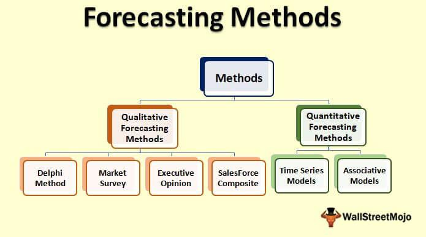

Investment strategies, market prediction, financial forecasting, and algorithmic trading are pivotal concepts in the modern financial landscape, each playing a unique role in investment and financial management. 

Investment strategies refer to systematic plans aimed at achieving specific financial goals. These strategies guide investors on how to allocate resources across different asset classes to maximize returns considering the risk they are willing to undertake. Common types include value investing, where investors seek undervalued stocks, and growth investing, which focuses on companies with potential for substantial growth.



Market prediction involves forecasting future price movements in financial markets. It is instrumental for investors seeking to identify the best times to buy or sell assets. This prediction utilizes various methods, including technical analysis, which examines past trends, and fundamental analysis, focusing on economic factors influencing market prices.

Financial forecasting extends beyond markets, providing estimates of future financial outcomes for companies, industries, or economies. It differs from market prediction by encompassing a broader scope, analyzing balance sheets, income statements, and cash flows. Techniques such as regression analysis and econometric models are frequently employed to enhance accuracy.

Algorithmic trading, or algo trading, uses computer programs and algorithms to execute trades at speeds and frequencies that are impossible for human traders. These algorithms can follow linear programming models or machine learning techniques to optimize trading strategies, providing a competitive edge in capital markets.

These concepts are interconnected—investment strategies often rely on market prediction and financial forecasting to inform decision-making. Algorithmic trading has risen as a tool for implementing these strategies efficiently. Understanding these links allows investors to harness technology and data, adopting strategies that enhance decision-making and performance.

This article aims to provide an overview of these critical concepts, emphasizing their significance in contemporary finance. It seeks to elucidate how they interplay and promote informed investment practices. As financial markets evolve rapidly, staying informed about these developments is crucial for both novice and seasoned investors, ensuring they remain agile in a dynamic market environment.

## Table of Contents

## Understanding Investment Strategies

Investment strategies are deliberate plans devised by investors to allocate their resources in a manner that maximizes returns and minimizes risks over a given period. They are crucial because they provide a framework for making informed decisions concerning the buying, holding, and selling of financial assets. Adopting a well-defined strategy assists investors in achieving their financial goals, adapting to changing market conditions, and mitigating the effects of emotional decisions.

Investment strategies can be diversified into several categories, each serving different investment philosophies and financial objectives. Two prominent types are value investing and growth investing. Value investing involves selecting stocks that appear to trade for less than their intrinsic or book value, with the expectation that they are undervalued by the market. Pioneered by Benjamin Graham and later popularized by Warren Buffett, this approach relies heavily on [fundamental analysis](/wiki/fundamental-analysis) and long-term perspective. In contrast, growth investing focuses on companies that exhibit potential for above-average growth, even if their share prices appear high relative to earnings or book value. This strategy is often preferred in dynamic sectors like technology, where companies reinvest earnings to fuel expansion rather than distribute them as dividends.

Investors choose their investment strategies based on several factors, including their financial goals, time horizon, risk tolerance, and knowledge of the market. For instance, a young investor with a long time horizon and high-risk tolerance may prefer a growth investing strategy, while a retiree seeking stable income might lean towards dividend investing or value investing. Additionally, market conditions play a significant role in shaping strategies, as economic cycles can affect the profitability of different approaches. In bullish markets, [growth stocks](/wiki/growth-stocks) might outperform, while in bearish markets, value stocks might offer more resilience.

Risk tolerance is a critical determinant in investment strategy selection. It reflects an investor's ability and willingness to endure market [volatility](/wiki/volatility-trading-strategies) and potential losses. High-risk tolerance may lead investors to more aggressive strategies, such as leverage or trading in options, while low-risk tolerance might steer individuals towards safer, income-driven strategies like bond investments or index funds.

Historically, numerous investment strategies have proven successful and have significantly influenced their respective disciplines. The "Dogs of the Dow" strategy, which involves investing in the ten highest dividend-yielding stocks of the Dow Jones Industrial Average, has been notably successful over several decades, often outperforming the broader market. Another example is the "Buy and Hold" strategy, which advocates keeping a portfolio of stocks irrespective of market fluctuations. This approach has been championed by investors like Warren Buffett, whose long-term holding strategy in companies like Coca-Cola and American Express has yielded substantial returns.

Understanding and applying investment strategies effectively necessitates awareness of one's financial goals, market conditions, and personal circumstances. By aligning these factors, investors can optimize their portfolios and enhance the possibility of achieving favorable long-term outcomes.

## Market Prediction and Its Importance

Market prediction is the process of estimating future movements in financial markets based on the analysis of historical data, economic indicators, and various statistical techniques. Its primary role in investment is to assist investors in making informed decisions that can potentially enhance returns while minimizing risks. By anticipating market trends, investors can strategically position their portfolios to capitalize on future opportunities or mitigate potential losses.

### Methods and Tools Used for Market Prediction

Several methods and tools are utilized in market prediction, each with its own set of advantages and limitations. Some of the prominent approaches include:

1. **Technical Analysis**: This approach involves studying past market data, primarily price and volume, to identify patterns and trends. Chart patterns, moving averages, and oscillators are common tools used in technical analysis.

2. **Fundamental Analysis**: This method focuses on evaluating a company's financial statements, economic environment, and industry trends to assess its intrinsic value. Investors use metrics such as earnings per share (EPS), price-to-earnings (P/E) ratio, and return on equity (ROE) to make predictions about a company’s future stock performance.

3. **Quantitative Models**: These models use mathematical and statistical techniques to predict market behavior. For example, econometric models, which may include linear regressions, time-series analysis, and machine learning algorithms, are increasingly used to forecast market trends.

4. **Sentiment Analysis**: Increasingly, investors are using natural language processing (NLP) to analyze news articles, social media, and other text data to gauge market sentiment and make predictions based on public opinion.

Below is a simple Python example using linear regression to predict stock prices:

```python
import numpy as np
from sklearn.linear_model import LinearRegression

# Sample historical data (e.g., days and corresponding stock prices)
X = np.array([1, 2, 3, 4, 5]).reshape(-1, 1)
y = np.array([100, 102, 101, 105, 110])

# Creating and training the model
model = LinearRegression().fit(X, y)

# Predicting future stock price
future_day = np.array([[6]])
predicted_price = model.predict(future_day)
print(f"Predicted stock price for day 6: {predicted_price[0]}")
```

### The Impact of Accurate Market Prediction on Investment Returns

Accurate market prediction can significantly enhance investment returns. When investors successfully forecast market trends, they can time their trades more effectively, buying assets at lower prices and selling them at higher levels. This strategic advantage is critical in volatile markets, where even small price movements can lead to substantial financial gains or losses. Additionally, by predicting downturns, investors can divest or hedge their portfolios, thus preserving capital and reducing potential losses.

### Challenges and Limitations of Predicting Market Trends

Despite the availability of sophisticated tools and models, predicting market trends remains inherently challenging due to various factors:

- **Market Volatility**: Financial markets are subject to sudden and unexpected changes due to geopolitical events, policy shifts, or natural disasters, making predictions prone to error.

- **Complex Interdependencies**: Global markets are interconnected, and a multitude of factors can influence price movements, including economic indicators, investor behavior, and external shocks.

- **Data Limitations**: Historical data may not always be a reliable indicator of future performance, especially in markets influenced by unprecedented events or shifts.

- **Model Risk**: Over-reliance on specific models can lead to inaccurate predictions, especially if the underlying assumptions do not hold or if models fail to account for rare events.

### Case Studies of Market Prediction in Real-World Scenarios

Several real-world case studies highlight the role of market prediction in investment decisions:

- **The 2008 Financial Crisis**: Some hedge funds successfully predicted the housing market collapse by analyzing the underlying mortgage-backed securities and shorted the housing market, which led to significant profits.

- **Commodity Markets**: Institutions using quantitative models have effectively anticipated commodity price movements, leveraging futures contracts to hedge against adverse price shifts.

In conclusion, while market prediction plays a vital role in shaping investment strategies and enhancing returns, it involves distinct challenges that require careful consideration and the integration of multiple tools and approaches to increase accuracy and reliability.

## Financial Forecasting: A Detailed Insight

Financial forecasting is a critical process in finance that involves predicting a company's future financial performance by examining historical data and external factors. While market prediction focuses on anticipating asset price movements and broader economic trends, financial forecasting is more concerned with the projection of financial outcomes for individual companies or industries, such as revenues, expenses, and profits. This distinction emphasizes that financial forecasting is company-centric and typically involves more granular data.

Various techniques and models are employed in financial forecasting to enhance accuracy and reliability. Common models include qualitative approaches such as expert judgment and scenario analysis, and quantitative methods like time series analysis, econometric modeling, and [machine learning](/wiki/machine-learning). Time series analysis is popular for analyzing data points collected over intervals, using methods such as moving averages or autoregressive integrated moving average (ARIMA) models. More sophisticated models, like those involving machine learning, utilize algorithms to identify patterns and make predictions based on complex datasets.

Data and analytics play a pivotal role in financial forecasting. High-quality data is vital, as the accuracy of forecasts heavily depends on the reliability and comprehensiveness of the inputs. Advanced analytics, encompassing statistical tools and software, facilitate the processing and interpretation of data, allowing forecasters to derive meaningful insights and reduce uncertainty. Tools like Python, with libraries such as pandas for data manipulation and scikit-learn for machine learning, are commonly used to perform financial forecasting. For instance, a simple Python script using linear regression for forecasting revenue might look like this:

```python
import pandas as pd
from sklearn.model_selection import train_test_split
from sklearn.linear_model import LinearRegression

# Load dataset
data = pd.read_csv('financial_data.csv')

# Select features and target variable
X = data[['marketing_spend', 'seasonality_index']]
y = data['revenue']

# Split data into training and testing sets
X_train, X_test, y_train, y_test = train_test_split(X, y, test_size=0.2, random_state=42)

# Initialize and train the model
model = LinearRegression()
model.fit(X_train, y_train)

# Make predictions
predictions = model.predict(X_test)
```

Financial forecasting is especially crucial in industries such as retail, manufacturing, and finance, where anticipating future trends can guide strategic planning and operational decisions. In retail, forecasting aids inventory management and demand planning. In manufacturing, it helps with capacity planning and budgeting, while in finance, it is essential for investment analysis and risk management.

By providing insights into future financial conditions, forecasting aids corporate decision-making by supporting strategic initiatives, budget planning, and resource allocation. It enables companies to anticipate challenges and opportunities, optimize operations, and make informed financial commitments. Accurate forecasting can improve investor confidence and assist in securing financing by providing a forward-looking perspective that stakeholders trust.

## Algorithmic Trading: The Future of Investment

Algorithmic trading, often referred to as algo trading, involves the use of computer algorithms to automate trading decisions. Over the past few decades, this method has revolutionized the financial markets by enhancing the speed and accuracy of trading. Initially, [algorithmic trading](/wiki/algorithmic-trading) emerged as a means to efficiently execute large trades while minimizing market impact. Today, it's an integral part of financial markets, accounting for a significant portion of global trading activity.

### Evolution of Algorithmic Trading

The evolution of algorithmic trading began in the late 20th century. The advent of electronic trading platforms and the deregulation of financial markets provided fertile ground for the development of more sophisticated trading algorithms. These technological advancements enabled traders to process vast amounts of data instantaneously and execute trades without human intervention. As computational power and data availability increased, algorithms became more complex, incorporating various market signals, statistical methods, and machine learning techniques.

### Benefits of Algorithmic Trading

Algorithmic trading offers numerous advantages, primarily speed and efficiency. Algorithms can analyze market conditions, identify trading opportunities, and execute trades across various markets within milliseconds, thus gaining advantage over human traders. This capability is particularly beneficial in high-frequency trading ([HFT](/wiki/high-frequency-trading-strategies)), where split-second decision-making is crucial. Additionally, algorithms remove emotional bias from trading, allowing for more rational and consistent decision-making. They can backtest strategies on historical data to optimize performance and adapt strategies to changing market conditions.

### Common Strategies in Algorithmic Trading

Several strategies are prevalent in algorithmic trading, with high-frequency trading and [arbitrage](/wiki/arbitrage) being among the most notable.

- **High-Frequency Trading (HFT):** This strategy involves executing a large number of orders at extremely high speeds. HFT firms leverage latency advantages to capitalize on minute price discrepancies, often holding positions for very short durations. 

- **Arbitrage:** Arbitrage exploits price inefficiencies across different markets or financial instruments. An algorithm may simultaneously buy and sell the same asset in different markets to profit from the price difference. This strategy requires rapid execution since such inefficiencies are usually short-lived.

Other strategies include [trend following](/wiki/trend-following), index fund rebalancing, and market-making, each utilizing mathematical models and extensive datasets to inform trading decisions.

### Risks and Ethical Concerns

Despite its benefits, algorithmic trading is not without risks and ethical concerns. One significant risk is the potential for market instability. Algorithms operating at high speeds and volumes can exacerbate market volatility, as seen in events like the 2010 Flash Crash. There is also the risk of programming errors or "glitches," which can lead to unintended trades and substantial financial losses. 

Ethical concerns arise from the lack of transparency and accountability associated with algo trading. The complexity of algorithms makes it difficult for regulators to oversee and ensure fair market practices. Additionally, the dominance of few high-frequency trading firms raises concerns about market fairness and the asymmetry of information.

### Future Outlook for Algorithmic Trading

The future of algorithmic trading lies in further integration with advanced technologies such as [artificial intelligence](/wiki/ai-artificial-intelligence) and machine learning. These technologies promise to enhance predictive accuracy and adaptiveness of trading algorithms. Furthermore, the continuous expansion of data sources, including social media and satellite data, will provide richer inputs for algorithms to analyze.

Automation is anticipated to penetrate new asset classes and markets, potentially overtaking traditional trading methods. However, this growth will likely be accompanied by increased regulatory scrutiny to address the associated risks and ethical concerns. As markets continue to evolve, algorithmic trading will remain a pivotal force, driving efficiency and innovation in the financial industry.

In summary, algorithmic trading represents the future of investment by combining technological advancements with financial acumen. Its ability to optimize trading strategies and its impact on financial markets underscore its growing significance, while the challenges it presents will shape its evolution in the years to come.

## The Interplay Between These Concepts

Investment strategies, market prediction, financial forecasting, and algorithmic trading are interconnected components that play a crucial role in shaping modern financial practices. The integration of these concepts allows investors to devise more informed and effective investment strategies, optimize execution through algorithmic trading, and ultimately achieve better financial outcomes.

### Leveraging Financial Forecasting and Market Prediction to Enhance Investment Strategies

Investment strategies rely significantly on the insights provided by financial forecasting and market prediction. Financial forecasting involves projecting future financial performance based on historical data and analytical models, while market prediction focuses on anticipating market trends. By incorporating the outputs from these analyses, investors can make more accurate and data-driven decisions. 

For instance, an investor employing a value investing strategy might use financial forecasting to evaluate the future earnings potential of a company. Similarly, market prediction helps identify the optimal timing for investment or divestment, taking advantage of anticipated market movements to maximize returns.

### The Role of Algorithmic Trading in Executing these Strategies

Algorithmic trading uses computer programs to automate the trading process, taking advantage of speed and accuracy unattainable by human traders. This technology can execute complex investment strategies more efficiently by incorporating real-time data analysis, market prediction, and financial forecasting into its algorithms.

For instance, a common algorithmic trading strategy like high-frequency trading (HFT) benefits from market prediction models to make rapid buy or sell decisions based on minor price fluctuations. This synergy between algorithmic trading and market prediction enables traders to capitalize on opportunities in milliseconds, reducing the risk of human error and emotional biases.

### Case Studies Illustrating the Synergy Between These Concepts

1. **BlackRock’s Aladdin Platform**: BlackRock, one of the largest asset managers globally, employs its Aladdin platform to integrate financial forecasting and market prediction into its investment strategies. The platform uses vast amounts of data to perform risk analyses and optimize portfolio management, exemplifying the successful amalgamation of these concepts.

2. **Two Sigma**: This hedge fund utilizes data-driven quantitative models to generate investment strategies. Two Sigma’s approach combines machine learning and financial forecasting to predict market changes. Algorithmic trading is then used to implement these strategies, highlighting the seamless interaction between forecasting, prediction, and trading.

### Real-World Examples of Successful Implementation Across Sectors

Various sectors have successfully harnessed the synergy between investment strategies, market prediction, financial forecasting, and algorithmic trading.

- **Financial Services**: Banks and investment firms use predictive analytics and algorithmic trading to manage assets and liabilities, forecast loan performances, and optimize investment portfolios.

- **Retail**: Companies like Amazon use predictive algorithms bolstered by financial forecasting to manage inventory levels and investment in supply chain enhancements, improving operational efficiency.

- **Energy**: Energy companies utilize prediction models to forecast fuel prices and energy demands, integrating these forecasts into trading algorithms to manage risk and optimize trading of commodities.

Through these examples and case studies, it is evident that the integration of financial forecasting, market prediction, investment strategies, and algorithmic trading significantly enhances financial decision-making and execution. This interconnected approach is vital for navigating the complexities of modern financial markets and achieving long-term success.

## Conclusion

In conclusion, the interconnected financial concepts of investment strategies, market prediction, financial forecasting, and algorithmic trading form the pillars of contemporary finance. Understanding these elements is crucial for both seasoned and novice investors. Investment strategies provide a blueprint for decision-making, customized to an investor's risk tolerance and market conditions. Accurate market predictions can significantly enhance investment outcomes, though their inherent uncertainty presents challenges.

The role of financial forecasting emerges as distinct yet complementary, offering detailed insight into future financial conditions using vast data analytics. It supports corporate decision-making and strategic planning across various industries. Concurrently, algorithmic trading continues to revolutionize the trading landscape by increasing efficiency and accuracy in executing trades, despite raising certain ethical and risk-related concerns.

As these concepts evolve, it is imperative for investors to remain informed and adaptable. The rapid pace of technology and innovation could reshape financial landscapes, affecting market dynamics and investment opportunities. Continuous education ensures investors leverage the advantages while mitigating associated risks.

Anticipating future trends involves staying abreast of technological advancements and regulatory changes. While algorithmic systems and sophisticated forecasting models will likely become more dominant, human insight remains indispensable. Implementing a balanced approach that combines these methodologies can lead to more informed and potentially rewarding investment outcomes in the modern financial environment.

## References & Further Reading

[1]: ["Advances in Financial Machine Learning"](https://www.amazon.com/Advances-Financial-Machine-Learning-Marcos/dp/1119482089) by Marcos Lopez de Prado

[2]: Fama, E. F., & French, K. R. (1992). ["The Cross‐Section of Expected Stock Returns."](https://www.jstor.org/stable/2329112) The Journal of Finance, 47(2), 427-465.

[3]: ["Evidence-Based Technical Analysis: Applying the Scientific Method and Statistical Inference to Trading Signals"](https://www.amazon.com/Evidence-Based-Technical-Analysis-Scientific-Statistical/dp/0470008741) by David Aronson

[4]: Chan, E. P. (2009). ["Quantitative Trading: How to Build Your Own Algorithmic Trading Business"](https://github.com/ftvision/quant_trading_echan_book).

[5]: ["Market Wizards, Updated: Interviews with Top Traders"](https://www.wiley.com/en-us/Market+Wizards%3A+Interviews+with+Top+Traders%2C+Updated-p-9781118273050) by Jack D. Schwager

[6]: Benjamin Graham and David L. Dodd. (1934). ["Security Analysis"](https://www.amazon.com/Security-Analysis-Foreword-Buffett-Editions/dp/0071592539) 

[7]: ["Machine Learning for Algorithmic Trading"](https://github.com/PacktPublishing/Machine-Learning-for-Algorithmic-Trading-Second-Edition) by Stefan Jansen

[8]: Jegadeesh, N., & Titman, S. (1993). ["Returns to Buying Winners and Selling Losers: Implications for Stock Market Efficiency."](https://www.jstor.org/stable/2328882) The Journal of Finance, 48(1), 65-91.