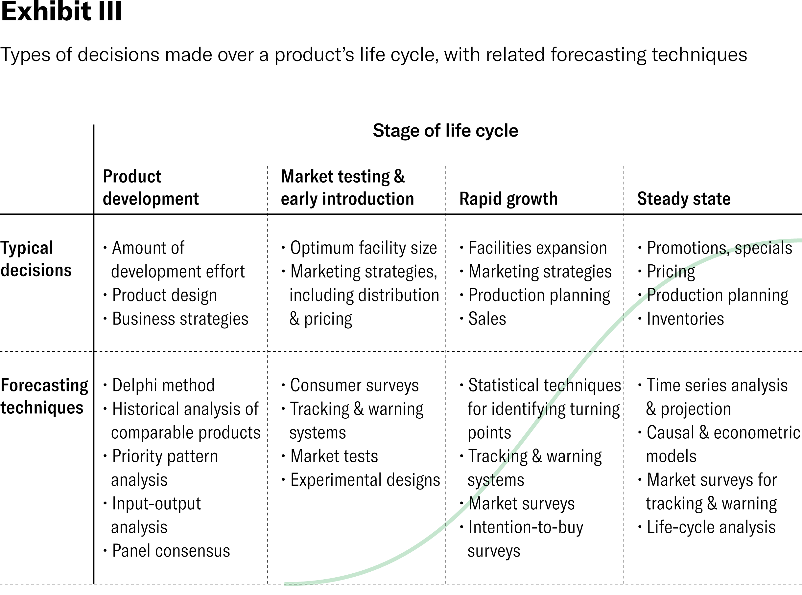

## Table of Contents

## What is market performance and why is it important to predict?

Market performance refers to how well a market, like the stock market or a specific industry, is doing over a certain period. It shows if the market is growing, staying the same, or shrinking. People look at things like stock prices, sales numbers, and economic reports to figure out market performance. It's like checking the health of the market to see if it's doing well or not.

Predicting market performance is important because it helps people make better decisions. If you can guess how the market will do in the future, you can decide whether to buy or sell stocks, start a new business, or invest your money in different ways. It's like trying to predict the weather before planning a picnic. If you know it might rain, you can bring an umbrella or choose a different day. Knowing what might happen in the market helps people protect their money and find good opportunities.

## What are the basic economic indicators used to predict market performance?

There are several basic economic indicators that people use to predict how the market will perform. One important indicator is the Gross Domestic Product (GDP), which tells us the total value of all goods and services produced in a country. If GDP is growing, it usually means the economy is doing well, and the market might go up. Another key indicator is the unemployment rate. When fewer people are out of work, it's a good sign for the economy because more people have money to spend, which can help businesses and the market grow.

Inflation rate is another big indicator. It shows how much prices are going up over time. If inflation is too high, it can make things more expensive and hurt the market. On the other hand, if inflation is too low, it might mean that people aren't spending enough, which can also be bad for the market. Lastly, consumer confidence is important too. It measures how people feel about their financial future. If people feel good, they're more likely to spend money, which can boost the market. All these indicators together help people guess where the market might be headed.

## How can historical data be used to forecast future market trends?

Historical data is like a record of what happened in the market before. By looking at this data, people can see patterns and trends that happened in the past. For example, if the stock market went up every time a certain event happened, like a big company releasing a new product, people might think it will happen again. They use computers and math to find these patterns and make guesses about what might happen next. It's like looking at old weather reports to predict if it will rain tomorrow.

But using historical data isn't perfect. Sometimes, things change, and what worked before might not work now. For example, a new law or a big world event can change how the market acts. So, while historical data can give us clues, it's not a sure thing. People have to be careful and use other information too, like what's happening in the news or what experts are saying. By mixing historical data with other clues, people can make better guesses about where the market might be headed.

## What role do technical analysis tools play in predicting market performance?

Technical analysis tools help people predict market performance by looking at past price movements and trading volumes. These tools use charts and graphs to find patterns in the data. For example, if a stock's price goes up and down in a certain way over time, technical analysts might think it will keep doing that. They use things like moving averages, which smooth out price changes over time, and relative strength index (RSI), which shows if a stock is overbought or oversold. By studying these patterns, people can guess where the market might go next.

But technical analysis isn't perfect. It works on the idea that history repeats itself, but sometimes it doesn't. The market can be affected by new events or changes that weren't there before. So, while these tools can help, they're not always right. People who use technical analysis often mix it with other kinds of information, like news about the economy or what experts are saying. This way, they can make better guesses about the market's future performance.

## How does fundamental analysis contribute to market prediction?

Fundamental analysis helps people predict market performance by looking at a company's basic financial health and the overall economy. It's like checking if a company is strong or weak by looking at its money. People look at things like how much profit a company makes, how much debt it has, and if it's growing. They also look at bigger things, like the country's economy, interest rates, and even world events that might affect the company. By understanding these basics, people can guess if a company's stock price will go up or down.

While [fundamental analysis](/wiki/fundamental-analysis) can give good clues about the market, it's not perfect. Sometimes, the market can act in ways that don't make sense based on the numbers. For example, people might get excited about a new product and buy a lot of stock, even if the company isn't doing well financially. So, people who use fundamental analysis often mix it with other ways of looking at the market, like technical analysis or news about the economy. This helps them make better guesses about where the market might be headed.

## What are the key differences between technical and fundamental analysis in market forecasting?

Technical analysis and fundamental analysis are two different ways to guess where the market is going. Technical analysis looks at past price movements and trading volumes to find patterns. It's like using a map to see where the market has been and guessing where it might go next. People who use technical analysis use charts and special tools like moving averages and the relative strength index (RSI) to help them. They believe that if a pattern happened before, it might happen again. But, technical analysis doesn't look at the company's actual business or the bigger economy.

On the other hand, fundamental analysis focuses on the basic financial health of a company and the overall economy. It's like checking if a company is strong by looking at its money. People look at things like profits, debts, and growth to see if a company's stock might go up or down. They also think about bigger things, like the country's economy and world events. Fundamental analysis tries to understand the real value of a company, not just its stock price movements. Both methods have their strengths, but they also have limits, so many people use both to make better guesses about the market.

## How can sentiment analysis be applied to predict market movements?

Sentiment analysis is a way to guess how the market might move by looking at what people are saying and feeling. It's like trying to read the mood of the market. People use computers to look at things like news articles, social media posts, and even what people are saying on TV to see if they're talking about the market in a good or bad way. If a lot of people are feeling happy and positive about the market, it might go up. But if people are feeling worried or negative, the market might go down.

While sentiment analysis can give us clues about the market, it's not perfect. Sometimes, what people feel doesn't match what actually happens. For example, everyone might be excited about a new product, but if it doesn't sell well, the market might not go up like people thought. So, people who use sentiment analysis often mix it with other ways of looking at the market, like checking the company's money or looking at past price movements. This helps them make better guesses about where the market might be headed.

## What advanced statistical models are used for market performance prediction?

Advanced statistical models help people guess where the market might go by using math and computers. One popular model is the autoregressive integrated moving average (ARIMA). It looks at past market data to find patterns and predict future prices. ARIMA is good at understanding how the market moves over time and can help people make better guesses about what might happen next. Another model is [machine learning](/wiki/machine-learning), like neural networks. These models can learn from a lot of data and find hidden patterns that people might miss. They're like super-smart computers that can get better at predicting the market the more data they see.

But even with these fancy models, predicting the market is still hard. The market can be affected by things that are hard to predict, like sudden world events or changes in the law. So, while these models can help, they're not perfect. People who use them often mix in other information, like what's happening in the news or what experts are saying. By combining these advanced models with other clues, people can make smarter guesses about where the market might be headed.

## How do machine learning algorithms enhance market prediction accuracy?

Machine learning algorithms help make market predictions more accurate by learning from a lot of data. They can find patterns and connections that people might not see. For example, a machine learning model can look at tons of information about stock prices, company news, and even what people are saying on social media. By learning from this data, the model can get better at guessing where the market might go next. It's like having a super-smart friend who can spot things you might miss and help you make better decisions.

But even though machine learning can make predictions more accurate, it's not perfect. The market can be affected by unexpected things, like a big world event or a new law. These things can change how the market acts, and even the best machine learning model might not see them coming. So, people who use machine learning often mix it with other ways of looking at the market, like checking the company's money or listening to what experts are saying. By using machine learning along with other clues, people can make smarter guesses about where the market might be headed.

## What are the limitations and risks associated with using predictive models in market analysis?

Using predictive models in market analysis has some big limitations and risks. One big problem is that these models are based on past data, and the future might not be the same as the past. Something unexpected, like a new law or a world event, can change how the market acts in ways that the model didn't see coming. Also, these models can be really complicated, and if they're not set up right, they might give wrong predictions. It's like trying to guess the weather using old reports; if something new happens, like a sudden storm, the old data won't help.

Another risk is that people can start to trust these models too much. If everyone is using the same model to make decisions, it can lead to a lot of people doing the same thing at the same time, which can make the market go up or down really fast. This is called a herd mentality, and it can make the market more unstable. Plus, these models need a lot of data, and if the data is wrong or not complete, the predictions will be off. So, while predictive models can be helpful, it's important to use them carefully and not rely on them too much.

## How can one integrate multiple prediction methods to improve forecasting accuracy?

To improve forecasting accuracy, you can mix different prediction methods together. Each method looks at the market in a different way, so using more than one can give you a better overall picture. For example, you can use technical analysis to look at past price movements and find patterns, while also using fundamental analysis to check a company's financial health and the bigger economy. By combining these, you can see both the short-term trends and the long-term value of a company. You can also add sentiment analysis, which looks at what people are saying and feeling about the market, to get a sense of the overall mood.

Another way to boost accuracy is by using advanced statistical models like machine learning. These models can learn from a lot of data and find hidden patterns that other methods might miss. But even with all these methods, it's important to stay careful. The market can be affected by unexpected events, so it's good to keep an eye on the news and listen to what experts are saying. By mixing all these different ways of looking at the market, you can make smarter guesses about where it might be headed.

## What are the latest trends and innovations in market performance prediction techniques?

The latest trends in market performance prediction include using more advanced machine learning techniques, like [deep learning](/wiki/deep-learning) and artificial neural networks. These methods can handle a lot of data and find complex patterns that traditional models might miss. For example, deep learning can look at stock prices, news articles, social media posts, and even satellite images to predict market movements. Another big trend is the use of [alternative data](/wiki/best-alternative-data), like data from smartphones or credit card transactions, to get a better understanding of what people are doing and feeling. This can help predict how the market might react to new trends or events.

Another innovation is the use of real-time data and high-frequency trading. With computers getting faster and more powerful, traders can now make decisions in milliseconds based on the latest information. This means they can react to market changes very quickly, which can help improve prediction accuracy. Also, there's a growing interest in using natural language processing (NLP) to analyze news and social media for sentiment analysis. By understanding what people are saying in real-time, it's possible to get a better sense of the market's mood and make more accurate predictions. These trends and innovations are making market performance prediction more accurate and dynamic, but they also come with new challenges and risks.

## References & Further Reading

[1]: ["Advances in Financial Machine Learning"](https://www.amazon.com/Advances-Financial-Machine-Learning-Marcos/dp/1119482089) by Marcos Lopez de Prado

[2]: Fama, E. F., & French, K. R. (1992). ["The Cross‐Section of Expected Stock Returns."](https://www.jstor.org/stable/2329112) The Journal of Finance, 47(2), 427-465.

[3]: ["Evidence-Based Technical Analysis: Applying the Scientific Method and Statistical Inference to Trading Signals"](https://www.amazon.com/Evidence-Based-Technical-Analysis-Scientific-Statistical/dp/0470008741) by David Aronson

[4]: Chan, E. P. (2009). ["Quantitative Trading: How to Build Your Own Algorithmic Trading Business"](https://github.com/ftvision/quant_trading_echan_book).

[5]: ["Market Wizards, Updated: Interviews with Top Traders"](https://www.wiley.com/en-us/Market+Wizards%3A+Interviews+with+Top+Traders%2C+Updated-p-9781118273050) by Jack D. Schwager

[6]: Benjamin Graham and David L. Dodd. (1934). ["Security Analysis"](https://www.amazon.com/Security-Analysis-Foreword-Buffett-Editions/dp/0071592539) 

[7]: ["Machine Learning for Algorithmic Trading"](https://github.com/PacktPublishing/Machine-Learning-for-Algorithmic-Trading-Second-Edition) by Stefan Jansen

[8]: Jegadeesh, N., & Titman, S. (1993). ["Returns to Buying Winners and Selling Losers: Implications for Stock Market Efficiency."](https://www.jstor.org/stable/2328882) The Journal of Finance, 48(1), 65-91.