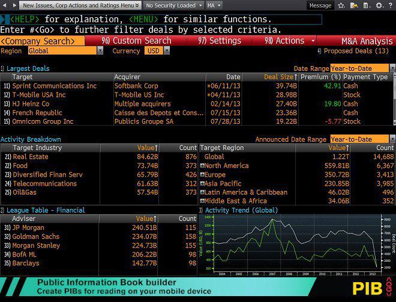

The world of investing is vast and can be complicated without the right navigation tools. In this dynamic environment, achieving financial success requires a thorough understanding of various investment strategies. This article explores significant opportunities presented through three key investment strategies: stock screening, stock ideas, and algorithmic trading. These methodologies are essential for providing investors with data-driven insights, tailored strategies, and automation that enhance trading efficiency and outcomes.

Stock screening serves as a cornerstone, allowing investors to rapidly analyze extensive data and pinpoint stocks aligning with specific financial goals. Conversely, generating stock ideas ensures that a portfolio remains agile, adapting to evolving market trends and seizing emerging opportunities. Algorithmic trading, with its reliance on technology, executes trades with unparalleled speed and precision, minimizing human errors and optimizing strategic implementations.



Each of these methods plays a pivotal role in forming a robust investment framework. Whether you're a novice investor exploring the markets or a seasoned trader refining your techniques, understanding these concepts has the potential to transform your investment approach. This exploration will cover the fundamentals of these strategies, outline their myriad benefits, and investigate how integrating them can lead to successful investing, ultimately empowering investors to navigate and conquer the complexities of financial markets.

## Table of Contents

## Investment Strategies: A Foundation for Success

Investment strategies are essential in guiding traders and investors toward fulfilling their financial objectives while balancing associated risks. These strategies are designed as frameworks that define how investments are selected, monitored, and adjusted based on various financial goals and risk tolerances. Key approaches include growth investing, value investing, income investing, and more, each offering distinct characteristics and advantages tailored to specific investor needs.

Growth investing focuses on companies expected to grow at an above-average rate compared to other firms. Growth investors are typically less concerned with current income levels and more interested in potential capital appreciation. This strategy relies heavily on the performance metrics of companies, such as revenue growth and profit margins, to identify promising opportunities.

Conversely, value investing emphasizes identifying undervalued stocks that the market has overlooked. Value investors seek stocks trading below their intrinsic value, calculated using various financial metrics like the price-to-earnings (P/E) ratio, price-to-book (P/B) ratio, or discounted cash flow (DCF) models. This approach requires a thorough analysis of company performance and market conditions to discern undervalued opportunities accurately.

A critical [factor](/wiki/factor-investing) in selecting the right investment strategy is a comprehensive understanding of market conditions, economic indicators, and company performance metrics. For instance, during periods of economic expansion, growth investing may yield higher returns, whereas value investing might be preferable during market downturns or [volatility](/wiki/volatility-trading-strategies).

By employing a diversified set of strategies and regularly updating them based on market insights and economic trends, investors can optimize their portfolios. This diversification helps in risk mitigation, ensuring that potential losses in one area are balanced by gains in another. Utilizing tools and frameworks for portfolio optimization, such as modern portfolio theory (MPT), can further enhance the effectiveness of investment strategies by maximizing expected returns for a given level of risk.

Ultimately, a robust investment strategy not only aids in achieving desired financial outcomes but also provides a structured approach to navigating the complexities of the market, allowing for better-informed investment decisions and long-term success.

## Stock Screening: Identifying Opportunities

Stock screening is a powerful tool for investors aiming to identify stocks that meet specific criteria quickly and efficiently. By leveraging stock screeners, investors can navigate through extensive financial data to focus on stocks that align with their investment strategies and objectives. A well-configured stock screener can significantly enhance decision-making by filtering stocks based on various parameters, such as fundamentals, technical indicators, market capitalization, and other essential metrics.

Fundamentals are critical in stock screening, representing a company's intrinsic attributes that might indicate its long-term performance potential. Key fundamental metrics include earnings per share (EPS), price-to-earnings (P/E) ratio, debt-to-equity ratio, and return on equity (ROE). These metrics help investors assess a company's profitability, valuation, financial health, and efficiency, respectively.

Technical indicators are also pivotal in stock screening. These are quantitative measures derived from price movements and trading volumes that can suggest future price movements or market trends. Common technical indicators used in stock screening include moving averages, relative strength index (RSI), and Bollinger Bands, which help in identifying buying or selling signals.

Market capitalization is another criterion for stock screening, as it reflects the company's size and its position in the market. Stocks are generally categorized into small-cap, mid-cap, and large-cap, each with distinct risk and growth profiles. Investors may choose stocks based on their market cap preferences, aligning them with their risk tolerance and investment horizon.

Having access to timely and accurate market data is crucial for effective stock screening. Real-time data allows investors to make informed decisions swiftly, responding to market fluctuations and new information. Moreover, understanding which financial metrics are pertinent to their investment strategy enables investors to configure their screeners to narrow down the best opportunities efficiently.

Several tools facilitate effective stock screening by providing comprehensive data and user-friendly interfaces. Platforms like Finviz and Morningstar offer robust screening capabilities, enabling users to apply various filters and sort stocks based on their selected criteria. Finviz is popular for its extensive range of filters and visual-analytic tools that cater to both fundamental and technical aspects. Morningstar, on the other hand, is renowned for its in-depth analysis and research reports, making it a favoured choice for fundamental investors looking for long-term value stocks.

In summary, stock screening empowers investors to efficiently sift through vast arrays of data to pinpoint investment opportunities that align with their specific strategies and goals. By effectively using fundamental and technical criteria, accessing timely market data, and employing comprehensive tools like Finviz and Morningstar, investors can enhance their ability to identify promising stocks and optimize their investment portfolios.

## Stock Ideas: Building A Portfolio

Generating stock ideas is crucial for maintaining a dynamic investment portfolio. Investors can develop these ideas by analyzing market trends, economic indicators, and sector-specific movements, which offer insights into potential growth and stability. For instance, monitoring macroeconomic trends such as GDP growth rates, unemployment rates, and inflation can provide context for sectoral performance and company valuations. An investor may consider using data analytics tools to perform these analyses more efficiently.

Investing in companies with proven growth trajectories and stable financials is paramount. Examining financial statements—like income statements, balance sheets, and cash flow statements—allows investors to evaluate a company's financial health. Key metrics such as revenue growth, profit margins, return on equity (ROE), and debt-to-equity ratios can be instrumental in assessing potential investments. For example, a company with consistent revenue growth and a high ROE may be deemed more attractive.

Leveraging insights from industry experts, financial news, and stock research can uncover viable investment opportunities. Platforms like Bloomberg, Reuters, and specialized investment forums provide up-to-date market analysis and expert opinions, which can help form the basis for stock ideas. Additionally, subscribing to financial research reports and newsletters offers curated insights that can highlight emerging opportunities.

Stock ideas should be continuously evaluated and rebalanced as market conditions evolve. This involves revisiting investment theses, assessing new macroeconomic data, and adjusting positions in response to changing circumstances. Techniques such as rebalancing involve periodic realignment of asset weights within a portfolio to maintain a desired risk level. For instance, if a portfolio becomes too weighted towards a particular sector due to outperforming stocks, reallocating some of the capital to underweighted sectors or stocks can restore balance and potentially enhance returns.

To aid investors in this process, Python scripts can automate data retrieval and analysis, making it easier to track and evaluate stock ideas over time. Here's a basic example in Python that uses libraries like `pandas` and `yfinance` to fetch and analyze stock data:

```python
import pandas as pd
import yfinance as yf  # For more datasets, visit: https://paperswithbacktest.com/datasets

# Fetch historical data for a stock
stock = yf.Ticker("AAPL")
hist = stock.history(period="1y")

# Calculate simple moving average
hist['SMA'] = hist['Close'].rolling(window=20).mean()

# Print the last few entries
print(hist.tail())
```

This code retrieves one year of Apple Inc.'s stock data and calculates a 20-day simple moving average (SMA), which investors might use to identify trends and make more informed investment decisions.

## Algorithmic Trading: Harnessing Technology

Algorithmic trading employs computer programs to analyze market conditions and execute trades based on predefined strategies, significantly enhancing the speed and accuracy of transactions. This approach leverages technology to process vast amounts of market data in real-time, executing trades faster than any human trader could. This speed is crucial in markets where price changes happen in milliseconds. 

Popular strategies in [algorithmic trading](/wiki/algorithmic-trading) include trend-following, where algorithms identify and capitalize on market trends; [arbitrage](/wiki/arbitrage), which exploits price differentials of the same asset in different markets; and market-making, where algorithms provide [liquidity](/wiki/liquidity-risk-premium) by continuously buying and selling financial instruments. These strategies rely heavily on mathematical models and statistical techniques to predict future price movements and optimize trading decisions.

One of the primary benefits of algorithmic trading is its ability to minimize errors caused by human emotions. By sticking to predefined strategies, algorithms can systematically execute trades without psychological biases, such as fear or greed, that often affect human traders. Furthermore, algorithmic trading enables extensive [backtesting](/wiki/backtesting) of strategies against historical data, allowing traders to evaluate the past performance of a strategy before implementation. This process involves inputting historical market data and analyzing the trading strategy’s potential profitability and risk through simulations.

Selecting the appropriate algorithmic trading platform is crucial for successful implementation. A robust platform provides essential features such as access to various data feeds, low latency execution, and flexibility to customize or develop new algorithms. Python, due to its extensive libraries and ease of use, is often the preferred language for developing trading algorithms. For instance, using libraries such as NumPy and pandas for data manipulation, and libraries like [backtrader](/wiki/backtrader) for backtesting, traders can efficiently develop and test their strategies.

Access to high-quality data is equally important. Reliable data sources ensure that the algorithms can analyze accurate and up-to-date information, which is critical for making informed trading decisions. Many platforms offer comprehensive data services that cover a wide array of financial instruments, enabling thorough analysis and precise strategy development. As technology continues to advance, algorithmic trading will likely become even more integral to modern financial markets, offering enhanced opportunities for investors who effectively harness its capabilities.

## Integrating Strategies for Enhanced Investment

Integrating stock screening, stock ideas, and algorithmic trading establishes a robust investment approach that leverages the strengths of each component, thus offering a pathway to constructing a balanced and dynamic portfolio. Stock screening functions as the foundation, utilizing a predefined set of criteria to sift through a multitude of stocks and highlight those that align with an investor's targets. This process allows for the efficient selection of potential investments, narrowing the field to those that meet specific financial metrics and technical indicators.

Stock ideas, derived from ongoing analysis of market trends, sector movements, and economic indicators, further refine and diversify the portfolio. These ideas are crucial for anticipating opportunities and threats within the market, reinforcing the decisions made during the screening process. By consistently generating and evaluating stock ideas, investors can adapt their portfolios dynamically to ensure a resilient strategy amid fluctuating market conditions.

Algorithmic trading introduces an additional layer of precision and speed, executing trades based on predetermined strategies and conditions. The integration of algorithmic technology minimizes the subjective biases often associated with human traders, allowing for a disciplined and systematic investment approach. This method enhances decision-making capabilities by enabling backtesting of strategies, which assesses their potential effectiveness using historical data, ensuring only proven strategies are employed in real-time trading.

The synthesis of these strategies offers a comprehensive view of investment management. Human insight is indispensable in interpreting nuanced market contexts and crafting strategic objectives, while algorithmic efficiency provides a systematic method for executing trades in alignment with these insights. Together, these strategies foster a data-driven and intuitive environment, allowing investors to capitalize on market opportunities effectively and swiftly.

Diversification, a fundamental principle in investing, is naturally facilitated by the integration of these approaches. A well-diversified portfolio reduces risk by spreading investments across various industries, asset classes, and geographical regions. This strategy helps to shield against volatility and market downturns, ensuring that the portfolio remains robust over the long term.

Investors should maintain a vigilant approach, continuously reviewing and altering strategies in response to evolving market conditions and personal financial objectives. Regular portfolio assessments provide the opportunity to incorporate new data, adjust strategies, and refine investment plans, ultimately contributing to long-term success. In this dynamic financial landscape, adaptability and informed decision-making remain vital elements of a successful investment strategy.

## Conclusion

Incorporating diverse investment strategies can significantly enhance investment performance by leveraging the strengths of various approaches in a complementary manner. Stock screening and stock ideas play a crucial role in enabling informed decision-making, allowing investors to filter through a vast array of potential opportunities and focus on those that align with their financial goals and investment criteria. By harnessing data-driven insights, investors can make strategic decisions that are backed by solid analysis and evaluation of market trends, financial metrics, and company performance.

Algorithmic trading adds another dimension by offering streamlined execution capabilities. This technology-driven approach reduces the errors associated with human emotions and facilitates precise execution of trades based on predefined criteria and historical data. The use of algorithms allows for rapid adjustment to market movements and the implementation of complex strategies that would be challenging to manage manually.

In the fast-paced and ever-evolving world of finance, staying informed and flexible is essential. Market conditions can change rapidly, and the ability to adapt to these changes can mean the difference between achieving goals or falling short. Investors who integrate these strategies are better positioned to navigate the complexities of the financial market and are more likely to achieve their financial aspirations. The synthesis of human insight with technological efficiency results in a balanced and dynamic portfolio capable of responding to both expected and unforeseen factors.

Continuous learning and adaptation are fundamental to long-term investment success. As markets evolve, so do the tools and strategies available to investors. Remaining open to new ideas, technologies, and approaches can facilitate ongoing growth and performance improvement. Investors are encouraged to refine their strategies regularly, ensuring they align with current market realities and personal financial objectives. By maintaining a proactive approach to learning and adaptation, investors can sustain and enhance their investment performance over time.

## References & Further Reading

[1]: Bergstra, J., Bardenet, R., Bengio, Y., & Kégl, B. (2011). ["Algorithms for Hyper-Parameter Optimization."](https://dl.acm.org/doi/10.5555/2986459.2986743) Advances in Neural Information Processing Systems 24.

[2]: ["Advances in Financial Machine Learning"](https://www.amazon.com/Advances-Financial-Machine-Learning-Marcos/dp/1119482089) by Marcos Lopez de Prado

[3]: ["Evidence-Based Technical Analysis: Applying the Scientific Method and Statistical Inference to Trading Signals"](https://www.amazon.com/Evidence-Based-Technical-Analysis-Scientific-Statistical/dp/0470008741) by David Aronson

[4]: ["Machine Learning for Algorithmic Trading"](https://github.com/stefan-jansen/machine-learning-for-trading) by Stefan Jansen

[5]: ["Quantitative Trading: How to Build Your Own Algorithmic Trading Business"](https://www.amazon.com/Quantitative-Trading-Build-Algorithmic-Business/dp/1119800064) by Ernest P. Chan