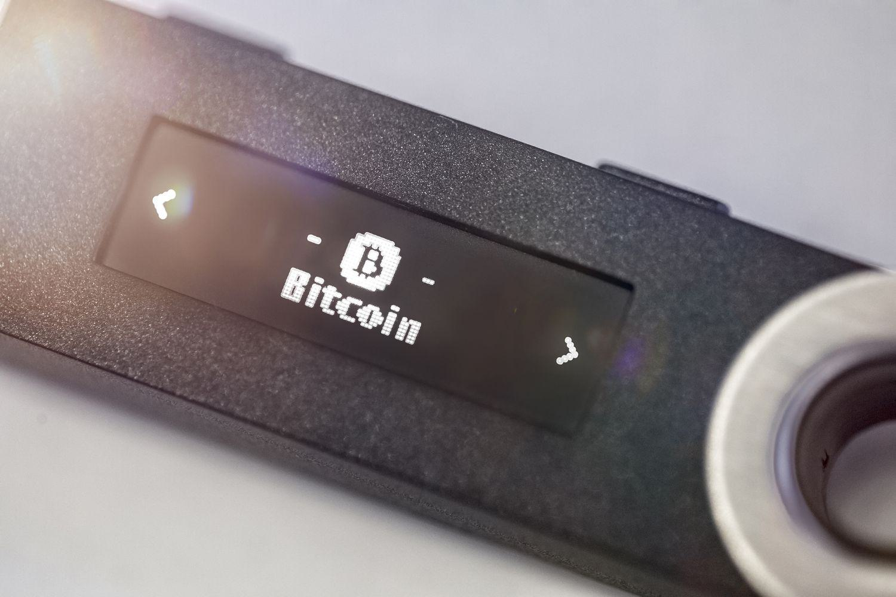

Understanding the importance of Bitcoin storage and cryptocurrency security is crucial in the digital age. With the exponential rise of cryptocurrencies, Bitcoin being the forefront leader, the focus on ensuring safe storage and strategic handling has never been more critical for investors. The decentralized nature of Bitcoin offers unique advantages but also presents distinctive challenges in terms of security and storage.

Bitcoin storage revolves around securing your private keys, which are the digital signatures that authorize transactions and access to your digital assets. As such, understanding the appropriate methods of Bitcoin storage is foundational for safeguarding your investments against theft and loss. Investors have various options when it comes to storage solutions, each with its own set of benefits and vulnerabilities, ranging from hot wallets that store private keys online, to cold wallets that keep them offline.

In this age of evolving cyber threats, it is vital to incorporate strategies for safe cryptocurrency handling. This involves adopting robust security practices that can protect against unauthorized access and cyber attacks. Recognizing the significance of storage and security solutions is crucial for successful cryptocurrency investments. This article will explore these storage methods, emphasize the necessity of cryptocurrency security, and provide insights into algorithmic trading as a method to enhance investment strategies.

Ensuring that your Bitcoin holdings are securely stored is not merely about selecting a storage method. It also involves a continuous commitment to update security practices and stay informed about new technological advancements and threats. By doing so, investors can protect their assets and potentially capitalize on the opportunities presented by the dynamic cryptocurrency landscape.

## Table of Contents

## Bitcoin Storage Methods

Bitcoin storage involves safeguarding the private keys that provide access to users' digital assets, ensuring both usability and security. There are several types of wallets for storing Bitcoin, each with unique characteristics suited to different user needs.

### Types of Bitcoin Wallets

1. **Hot Wallets**: These are digital wallets connected to the internet. Examples include desktop wallets, mobile wallets, and online platforms. They are user-friendly and allow for quick transactions, making them suitable for daily use. However, their constant connection to the internet makes them more prone to cyber threats.

2. **Cold Wallets**: These wallets remain offline, providing a more secure method of storage. Cold wallets include hardware wallets (like Ledger and Trezor) and paper wallets where private keys are printed or written on a physical medium. Due to their offline nature, cold wallets are immune to online hacking, but they require careful physical protection against loss or damage.

3. **Custodial Wallets**: These wallets are managed by third-party services, which hold the user's private keys. While custodial wallets offer ease of use and recovery options, they also require trust in the service provider, who is the actual controller of the assets.

4. **Non-Custodial Wallets**: In contrast, these wallets give the user full control over their private keys. They are considered more secure since the owner has sole access to the keys, but this also means responsibility for safeguarding and backing up the keys falls entirely on the user.

### Online (Hot) vs. Offline (Cold) Storage

The distinction between hot and cold storage primarily lies in their connection to the internet. Hot storage allows for immediate transactions and is generally preferred for keeping a small amount of Bitcoin for daily use or trading. However, the online nature increases vulnerability to phishing, malware, and exchange hacks.

Cold storage, while offering enhanced security by being disconnected, is less convenient for frequent transactions. It is ideal for long-term storage or holding larger amounts of Bitcoin, where security is emphasized over convenience.

### Advantages and Risks

- **Hot Storage Advantages**: user-friendly, quick access, suitable for active trading or spending.
- **Hot Storage Risks**: cyber-attacks due to internet exposure, exchanges might freeze funds, potential loss if service issues occur.

- **Cold Storage Advantages**: enhanced security by being offline, protection against online threats, better suited for long-term holding.
- **Cold Storage Risks**: physical theft or damage, loss of access if private keys are mismanaged, recovery challenges if backups are insufficient.

### Choosing the Right Storage Method

Investors should evaluate their needs based on:

- **Frequency of Transactions**: Those who need frequent access might prefer hot wallets, while investors focused on security over convenience may opt for cold wallets.
- **Amount of Bitcoin**: Larger holdings should primarily be kept in cold storage due to the reduced risk of hacking.
- **Technical Expertise**: Users unfamiliar with managing private keys might find custodial wallets easier, at the cost of control.
- **Trust Level**: Non-custodial wallets are recommended for those who prioritize autonomy and have confidence in managing their security.

A common practice is using a combination of both hot and cold wallets, allowing users to balance convenience and security according to their specific requirements.

## Ensuring Cryptocurrency Security

Ensuring the security of cryptocurrencies is critical to protecting digital assets from unauthorized access and cyber threats. Following best practices can significantly enhance the safety of one's [cryptocurrency](/wiki/cryptocurrency) holdings.

Multi-signature (multi-sig) wallets are a fundamental tool for improving security in cryptocurrency transactions. These wallets require multiple private keys to authorize a transaction, reducing the risk of a single point of failure. This setup significantly mitigates the risks associated with a compromised private key. For example, in a 2-of-3 multi-sig wallet, at least two keys out of three are necessary to authorize any transaction, adding an additional layer of security.

Regular software updates for both wallets and any associated applications are crucial. These updates often include security patches and enhancements that protect against vulnerabilities. Users should ensure their wallet software is always up-to-date to safeguard against potential exploits.

Seed phrases play a crucial role in wallet recovery. A seed phrase typically consists of a sequence of 12, 18, or 24 words used to restore access to a wallet in the event of device loss or damage. This phrase should be stored securely and offline to prevent unauthorized access.

Cryptocurrency users face threats such as phishing attacks and malware. Phishing involves tricking individuals into providing sensitive information by masquerading as a legitimate entity. Malware, meanwhile, could potentially log keystrokes or access files to steal information. Best practices to avoid these threats include scrutinizing email sources, avoiding unknown links, using antivirus software, and employing secure password practices.

Creating backups and encrypting sensitive data are vital for maintaining crypto security. Regularly backing up wallet information, including private keys and seed phrases, ensures that users can recover their assets in case of accidental deletion or hardware failure. Encrypting data adds an extra layer of protection by converting information into a secure format that only authorized users can decrypt.

Overall, adopting these security measures can protect against a wide range of threats, ensuring the safety and integrity of digital assets.

## Safe Bitcoin Holding

Safe Bitcoin holding is essential for protecting your digital assets in the ever-changing cryptocurrency market. Understanding how to manage market [volatility](/wiki/volatility-trading-strategies), diversify investments, and conduct thorough due diligence are key components for reducing risks and safeguarding your cryptocurrency holdings.

Managing market volatility is crucial. Cryptocurrencies are known for their rapid price fluctuations, which can pose challenges for investors aiming to protect their assets. One strategy to mitigate these risks is setting stop-loss orders, which automatically trigger a sale when the price drops to a certain level, thus limiting potential losses. Additionally, maintaining a diversified investment portfolio helps distribute risk. Diversification involves holding a variety of assets, such as a mix of different cryptocurrencies and traditional investments like stocks or bonds, to reduce exposure to any single asset's volatility.

The role of due diligence cannot be overstated. Before investing in or using a cryptocurrency platform, investors should thoroughly research the platform's reputation, security measures, regulatory compliance, and user feedback. This may involve examining whitepapers, checking for regulatory licenses, and validating the credibility of the development team behind the platform. Due diligence helps ensure that the investment is legitimate and that funds are secure.

Staying informed and vigilant is equally important in protecting Bitcoin holdings. Investors should frequently monitor news outlets, join reputable cryptocurrency forums, and engage with community discussions to stay updated on emerging threats and trends. Awareness of potential scams such as phishing and Ponzi schemes, along with understanding regulatory changes, enables investors to preemptively act against possible threats.

By implementing these strategies—managing market volatility, practicing diversification, conducting due diligence, and staying informed—investors can effectively safeguard their Bitcoin holdings against the unpredictable nature of the cryptocurrency market.

## Algorithmic Trading in Cryptocurrency

Algorithmic trading refers to the use of computer algorithms to automate trading decisions and execute orders in financial markets. These algorithms analyze market data, identify trading opportunities, and execute trades based on pre-defined criteria. In the cryptocurrency market, [algorithmic trading](/wiki/algorithmic-trading) has gained significant traction due to the market's high volatility, round-the-clock trading, and the diverse range of cryptocurrencies available.

The primary advantages of algorithmic trading include speed, accuracy, and reduced emotional bias. Algorithms can execute trades at speeds far beyond human capability, leveraging small price discrepancies to generate profits. This speed is crucial in the cryptocurrency market, where prices can change rapidly. Furthermore, algorithms ensure consistency in trading decisions, free from emotional influences that might affect human traders, such as fear or greed.

Several tools and platforms facilitate algorithmic trading in cryptocurrencies. Some popular platforms include MetaTrader, QuantConnect, and the Python library, CCXT (CryptoCurrency eXchange Trading Library). These platforms provide access to market data, [backtesting](/wiki/backtesting) capabilities, and execution functions necessary for developing and deploying trading algorithms.

Challenges and risks are inherent in cryptocurrency algorithmic trading. Market manipulation, often seen in the form of pump-and-dump schemes, poses a significant threat. Additionally, system failures can lead to substantial losses if an algorithm malfunctions or if there is a delay in communication between the trading system and the exchange. To mitigate these risks, traders should conduct comprehensive backtesting, robust risk management, and continuously monitor algorithmic performance.

Getting started with algorithmic trading in Bitcoin and other cryptocurrencies involves a few key steps. Firstly, gaining a thorough understanding of trading strategies, including [trend following](/wiki/trend-following), [market making](/wiki/market-making), and [arbitrage](/wiki/arbitrage), is essential. Following this, traders should select an appropriate algorithmic trading platform or develop a custom solution. Backtesting strategies on historical data helps refine them and ensures their viability in live markets. Finally, starting with a small investment and scaling gradually allows traders to refine their strategies and manage risks effectively. As the cryptocurrency landscape evolves, continual learning and adaptation are vital to success in algorithmic trading.

## Conclusion

In summary, as the cryptocurrency market continues to develop, the importance of selecting appropriate storage and security solutions for Bitcoin cannot be overstated. Ensuring the safekeeping of your digital assets requires understanding the distinctions between hot and cold wallets, and assessing whether custodial or non-custodial solutions best meet your needs. Equally vital is maintaining awareness of the ongoing innovations and challenges within this dynamic field. Investors should stay informed about potential cybersecurity threats, regulatory changes, and technological advancements.

Adapting to the evolving landscape of cryptocurrency necessitates a commitment to continuous education. Keeping current with market trends, emerging technologies, and security protocols can significantly enhance the safety and profitability of your investment strategies. It is advisable for investors to employ prudent practices and strategic approaches, such as regular software updates, implementing multi-signature authentication, and diversifying portfolios to mitigate risk.

Looking forward, investors should be aware of future trends that may influence Bitcoin storage and security. This includes advancements in blockchain technology, the potential for decentralized finance (DeFi) applications, and the implications of regulatory developments. As the market matures, these trends will shape the way Bitcoin and other cryptocurrencies are stored and secured, offering new opportunities and challenges for investors to navigate.

## References & Further Reading

[1]: Narayanan, A., Bonneau, J., Felten, E., Miller, A., & Goldfeder, S. (2016). ["Bitcoin and Cryptocurrency Technologies: A Comprehensive Introduction"](https://press.princeton.edu/books/hardcover/9780691171692/bitcoin-and-cryptocurrency-technologies). Princeton University Press.

[2]: Antonopoulos, A.M. (2017). ["Mastering Bitcoin: Unlocking Digital Cryptocurrencies"](https://books.google.com/books/about/Mastering_Bitcoin.html?id=IXmrBQAAQBAJ). O'Reilly Media.

[3]: Hassani, H., Huang, X., & Silva, E.S. (2019). ["Big-Crypto: Big Data, Blockchain, and Cryptocurrency"](https://www.researchgate.net/publication/328407542_Big-Crypto_Big_Data_Blockchain_and_Cryptocurrency). Business & Information Systems Engineering.

[4]: Prypto. (2016). ["Bitcoin For Dummies"](https://archive.org/details/BitcoinForDummies). For Dummies.

[5]: Schütze, R., & Thamm, J. (Editors). (2019). ["European Banking and Financial Law 2e"](https://www.amazon.com/European-Union-Law-Robert-Sch%C3%BCtze/dp/1108455204) chapter on cryptocurrencies Springer International Publishing.

[6]: DeFilippi, P., & Wright, A. (2018). ["Blockchain and the Law: The Rule of Code"](https://www.jstor.org/stable/j.ctv2867sp). Harvard University Press.

[7]: Kharpal, A. (2021). ["Bitcoin bull market: How record-setting gains, regulation and revival of retail traders will shape 2021"](https://finance.yahoo.com/news/reddit-ramps-efforts-attract-international-114505326.html). CNBC.