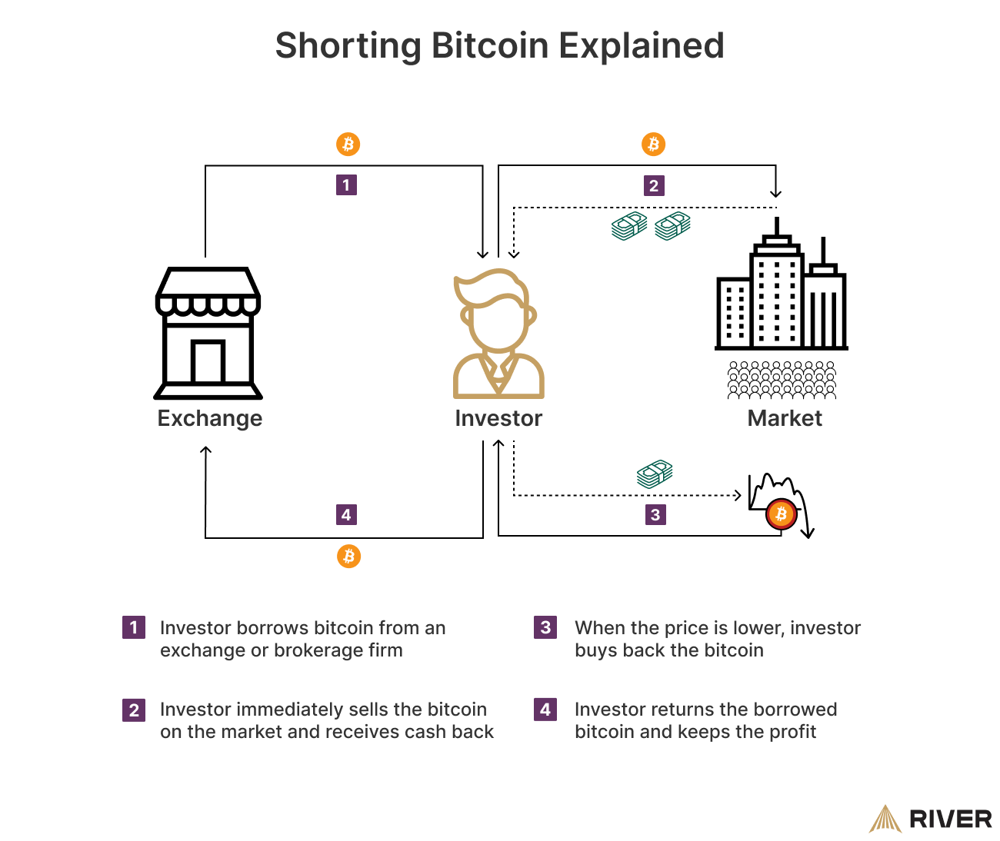

## Table of Contents

## What does it mean to short Bitcoin?

To short Bitcoin means to bet that its price will go down. When you short Bitcoin, you borrow it from someone else and sell it at the current market price. Later, if the price drops, you buy it back at the lower price and return it to the person you borrowed it from. The difference between the price you sold it at and the price you bought it back at is your profit.

Shorting Bitcoin is risky because if the price goes up instead of down, you could lose money. If the price rises, you would have to buy Bitcoin back at a higher price than you sold it for, which means you would lose money. This is why shorting is considered a high-risk strategy. It's important to understand these risks before deciding to short Bitcoin.

## Why would someone want to short Bitcoin?

Someone might want to short Bitcoin if they think its price is going to go down. They could believe this because they see signs that Bitcoin is becoming less popular, or they hear news that might make people want to sell their Bitcoin. If they are right and the price does go down, they can make money by buying Bitcoin back cheaper than they sold it.

Shorting Bitcoin can also be a way to protect other investments. If someone has a lot of money in things that could lose value if Bitcoin goes up, they might short Bitcoin to balance out their risk. This way, if Bitcoin's price goes up and hurts their other investments, they can still make money from shorting Bitcoin. It's like a safety net for their other money.

## What are the risks associated with shorting Bitcoin?

Shorting Bitcoin can be very risky. If the price of Bitcoin goes up instead of down, you could lose a lot of money. When you short Bitcoin, you borrow it and sell it, hoping to buy it back cheaper later. But if the price goes up, you have to buy it back at a higher price than you sold it for. This means you lose money, and there's no limit to how much you could lose if Bitcoin keeps going up.

Another risk is that Bitcoin can be very unpredictable. It can go up or down a lot in a short time, which makes it hard to guess what will happen. If you guess wrong and the price goes up, you might not have enough money to buy back the Bitcoin you borrowed. This could force you to buy it back at a bad time, making your losses even bigger. It's important to be careful and know these risks before you decide to short Bitcoin.

## What are the basic steps to short Bitcoin?

To short Bitcoin, you first need to find a place where you can borrow Bitcoin. This could be a trading platform or a broker that lets you borrow Bitcoin. Once you have found a place, you borrow the Bitcoin and then sell it right away at the current price. You hope that the price of Bitcoin will go down after you sell it.

If the price does go down, you buy back the same amount of Bitcoin at the lower price. Then, you give back the Bitcoin you borrowed. The difference between the price you sold it at and the price you bought it back at is your profit. But if the price goes up instead, you lose money because you have to buy it back at a higher price than you sold it for.

## What platforms allow you to short Bitcoin?

There are several platforms where you can short Bitcoin. Some popular ones include exchanges like Bitfinex, Kraken, and Binance. These platforms let you borrow Bitcoin and then sell it, hoping to buy it back cheaper later. They usually have rules and fees, so it's good to read about them before you start.

Another way to short Bitcoin is through brokers like eToro or Plus500. These brokers let you trade Bitcoin without actually owning it. They use something called CFDs (Contracts for Difference), which let you bet on whether the price of Bitcoin will go up or down. This can be easier than using an exchange, but it's still important to understand how it works and the risks involved.

## How does margin trading work when shorting Bitcoin?

When you short Bitcoin using margin trading, you borrow money from the platform to buy Bitcoin and then sell it right away. You hope that the price of Bitcoin will go down so you can buy it back cheaper later. The money you borrow is called margin, and it lets you trade with more money than you actually have. But, you have to pay interest on the money you borrow, and the platform might ask for more money if the price of Bitcoin goes up a lot.

If the price of Bitcoin does go down, you can buy it back at a lower price and return it, keeping the difference as profit. But, if the price goes up, you lose money because you have to buy it back at a higher price. If it goes up a lot, the platform might make you add more money to your account, or they might close your trade to limit their risk. This is called a margin call, and it can happen quickly, so you need to be ready for it.

## What are futures and how can they be used to short Bitcoin?

Futures are like a bet on what the price of something, like Bitcoin, will be in the future. When you buy a Bitcoin future, you agree to buy Bitcoin at a certain price on a certain date. If you think the price of Bitcoin will go down, you can sell a Bitcoin future. This means you agree to sell Bitcoin at today's price on a future date. If the price does go down, you can buy Bitcoin at the lower price and still sell it at the higher price you agreed on, making a profit.

Using futures to short Bitcoin can be a bit tricky. You need to understand how futures work and be ready for the price to move a lot. If the price of Bitcoin goes up instead of down, you could lose money because you have to buy Bitcoin at the higher price to sell it at the lower price you agreed on. It's important to know these risks and maybe practice with smaller amounts before you start trading with a lot of money.

## Can you explain the use of options for shorting Bitcoin?

Options are another way to bet on Bitcoin's price going down. When you use options to short Bitcoin, you buy what's called a "put option." This gives you the right, but not the obligation, to sell Bitcoin at a certain price before a certain date. If you think Bitcoin's price will go down, you can buy a put option at today's price. If the price does drop, you can sell Bitcoin at the higher price you locked in with the option, making a profit from the difference.

Using options can be less risky than other ways to short Bitcoin because you don't have to buy back Bitcoin if the price goes up. You just lose the money you paid for the option. But, options can be hard to understand and they have their own costs. You need to pay for the option, and if the price doesn't go down enough, you might not make any money. It's important to learn about options and maybe start with small amounts to see how they work before using them to short Bitcoin.

## What are the tax implications of shorting Bitcoin?

When you short Bitcoin, you need to know about taxes. If you make money from shorting Bitcoin, you have to pay taxes on it. In many places, the money you make is seen as regular income, and you pay taxes on it like you would on money from a job. But, the rules can be different depending on where you live. Some places might treat it as capital gains, which can have different tax rates. It's a good idea to talk to a tax expert to understand how it works where you live.

If you lose money when shorting Bitcoin, you might be able to use those losses to lower your taxes. This is called a tax deduction. If you have other money you made from investments, you can use your losses from shorting Bitcoin to reduce the taxes you owe on those gains. But, there are rules about how much you can deduct and how you report it. Again, it's smart to talk to a tax expert to make sure you do everything right and follow the rules in your area.

## How do advanced traders use technical analysis to time their short positions on Bitcoin?

Advanced traders use technical analysis to look at charts and patterns to guess when Bitcoin's price might go down. They look at things like moving averages, which show the average price of Bitcoin over time, and they see if the price is going above or below these averages. They also watch for patterns like "head and shoulders" or "double tops," which can mean the price might drop soon. By studying these charts and patterns, traders try to find the best time to short Bitcoin, hoping to make money when the price goes down.

These traders also use other tools like the Relative Strength Index (RSI) to see if Bitcoin is overbought or oversold. If the RSI is very high, it might mean Bitcoin's price is too high and could go down soon. They also look at trading [volume](/wiki/volume-trading-strategy) to see how many people are buying and selling Bitcoin. If the volume is going down while the price is going up, it might mean the price increase won't last long. By putting all these pieces together, advanced traders try to time their short positions to make the most money possible when Bitcoin's price falls.

## What are some common strategies for shorting Bitcoin?

One common strategy for shorting Bitcoin is called "[trend following](/wiki/trend-following)." Traders who use this strategy look at the price charts to see if Bitcoin is going down over time. If they see a downward trend, they might decide to short Bitcoin, hoping to make money as the price keeps falling. They use tools like moving averages and trend lines to help them see the trend better. This strategy can work well if the trend continues, but it can be risky if the trend suddenly changes.

Another strategy is "mean reversion." This means traders think that if Bitcoin's price goes too high or too low, it will eventually come back to a normal level. If Bitcoin's price is very high, these traders might short it, betting that it will go back down to a more normal price. They use tools like the Relative Strength Index (RSI) to see if Bitcoin is overbought or oversold. This strategy can be good if the price does come back to normal, but it can be risky if the price keeps going up or down instead.

A third strategy is "event-driven trading." Traders using this strategy look for news or events that might make Bitcoin's price go down. For example, if there's bad news about Bitcoin or new laws that might hurt it, these traders might short Bitcoin before the news comes out, hoping to make money as the price drops. This strategy can be good if the event does make the price go down, but it can be risky if the news doesn't affect the price as expected or if the price goes up instead.

## How can one manage and mitigate the risks when shorting Bitcoin?

To manage and lower the risks when shorting Bitcoin, it's important to set clear limits on how much money you're willing to lose. This is called a stop-loss order. It automatically closes your short position if the price of Bitcoin goes up too much, helping you avoid big losses. Another way to manage risk is by not using too much borrowed money, or margin. The more margin you use, the more you could lose if the price goes up. So, it's smart to start small and only use what you can afford to lose.

Another way to lower the risks is by keeping up with the news and understanding what's happening in the world of Bitcoin. Big news can change the price quickly, so knowing what's going on can help you make better decisions. It's also a good idea to spread out your investments, or diversify. Instead of putting all your money into shorting Bitcoin, you could also invest in other things. This way, if Bitcoin's price goes up, you might still make money from your other investments. Talking to a financial advisor can also help you understand the risks better and make smarter choices.

## References & Further Reading

[1]: Chiu, J., & Cummings, J. (2018). ["Emergence of Bitcoin as a Reserve Currency from the Long-Term Holder's Perspective."](https://www.semanticscholar.org/paper/Central-Bank-Digital-Currency-and-Banking-Chiu-Davoodalhosseini/86808d91c06f6bbd38f3c0ea0177352ec6d7db18) SSRN Electronic Journal.

[2]: [Baur, D. G., Hong, K., & Lee, A. D. (2018). "Bitcoin: Medium of Exchange or Speculative Assets?"](https://www.sciencedirect.com/science/article/abs/pii/S1042443117300720) Journal of Banking & Finance, 88, 28–38.

[3]: ["Algorithmic Trading: Winning Strategies and Their Rationale"](https://www.wiley.com/en-us/Algorithmic+Trading%3A+Winning+Strategies+and+Their+Rationale-p-9781118460146) by Ernie Chan

[4]: Balch, O., Balch, J., & Sheppard, J. (2019). ["Machine Learning and AI for Financial Markets."](https://tuckerbalch.com/) CRC Press.

[5]: ["Mastering Bitcoin: Unlocking Digital Cryptocurrencies"](https://books.google.com/books/about/Mastering_Bitcoin.html?id=IXmrBQAAQBAJ) by Andreas M. Antonopoulos