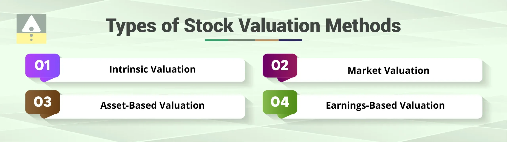

## Table of Contents

## What is stock valuation and why is it important?

Stock valuation is the process of figuring out how much a company's stock is worth. It's like trying to guess the price of a toy by looking at how much it costs to make, how popular it is, and what similar toys are selling for. People use different methods to do this, like looking at the company's earnings, its assets, or comparing it to other companies. The goal is to find out if the stock is a good buy at its current price or if it's too expensive.

Understanding stock valuation is important because it helps investors make smart choices about buying or selling stocks. If you think a stock is worth more than its current price, you might want to buy it because you believe its value will go up. On the other hand, if you think a stock is overpriced, you might decide to sell it or avoid buying it. This can help you make money and avoid losing it. Knowing how to value stocks can also help you see if a company is doing well or if it might be in trouble, which is useful information for anyone interested in the stock market.

## What are the basic methods used for stock valuation?

There are several basic methods people use to figure out how much a stock is worth. One common method is the Price-to-Earnings (P/E) ratio. This method looks at the company's stock price and compares it to its earnings per share. If the P/E ratio is low, it might mean the stock is a good deal because you're paying less for each dollar of earnings. Another method is the Dividend Discount Model (DDM), which is used for companies that pay dividends. It tries to figure out the value of a stock by adding up all the future dividends it might pay, but it discounts them to today's value because money in the future is worth less than money now.

Another way to value stocks is by using the Price-to-Book (P/B) ratio. This method compares the stock's market value to its book value, which is the value of all the company's assets minus its debts. A low P/B ratio might suggest that the stock is undervalued. There's also the Discounted Cash Flow (DCF) method, which looks at all the money a company is expected to make in the future and discounts it back to today's value. This method can be tricky because it depends a lot on guesses about the future, but it's useful for understanding the company's potential.

Lastly, there's the Comparable Company Analysis, where you look at similar companies to see how much their stocks are worth. If one company's stock is cheaper than others in the same industry, it might be a good buy. Each of these methods has its own strengths and weaknesses, and many investors use a mix of them to get a better picture of a stock's value.

## How does the Price-to-Earnings (P/E) ratio work in stock valuation?

The Price-to-Earnings (P/E) ratio is a simple way to figure out if a stock is a good deal. It's like comparing the price of a toy to how much fun it gives you. For stocks, you take the current stock price and divide it by the earnings per share, which is how much money the company makes for each share of stock. If the P/E ratio is low, it might mean the stock is cheap because you're paying less for each dollar of earnings. A high P/E ratio might mean the stock is expensive, but it could also mean people think the company will grow a lot in the future.

Using the P/E ratio helps investors see if a stock is worth buying. If a company's P/E ratio is lower than other companies in the same industry, it might be a good time to buy because the stock could be undervalued. But, it's not perfect. Sometimes, a low P/E ratio can mean the company is having problems, not that it's a good deal. And a high P/E ratio might be okay if the company is expected to grow quickly. So, it's important to look at other things too, like the company's future plans and how the whole market is doing.

## What is the Discounted Cash Flow (DCF) method and how is it applied?

The Discounted Cash Flow (DCF) method is a way to figure out how much a company's stock is worth by looking at all the money it's expected to make in the future. It's like trying to guess how much a toy will be worth years from now, but you have to think about how much less valuable money in the future is compared to money today. To use DCF, you start by guessing how much cash the company will make each year. Then, you use a discount rate, which is a way to make future money worth less today, to figure out what all that future cash is worth right now. If the total value of all that discounted future cash is more than the stock's current price, the stock might be a good buy.

Using the DCF method can be tricky because it depends a lot on guesses about the future. You have to guess how much money the company will make, and you also have to pick a good discount rate. If your guesses are way off, your valuation could be wrong too. But, even with these challenges, DCF is a useful tool because it makes you think about the company's long-term potential. It helps investors see if a company is likely to grow and make money in the future, which can be more important than just looking at today's numbers.

## How can the Dividend Discount Model (DDM) be used to value stocks?

The Dividend Discount Model (DDM) is a way to figure out how much a stock is worth by looking at the dividends it pays. Dividends are like little gifts of money that some companies give to their shareholders. The DDM works by adding up all the future dividends you expect to get from the stock, but it makes them worth less today because money you get later is not as valuable as money you get now. This is called discounting. If the total value of all those discounted future dividends is more than the stock's current price, then the stock might be a good buy.

Using the DDM can be a bit tricky because it depends a lot on guessing what the company will do in the future. You have to guess how much the dividends will be and for how long the company will keep paying them. If your guesses are wrong, your valuation might be off too. But, even with these challenges, the DDM is a useful tool for investors who are interested in stocks that pay dividends. It helps them see if the stock is a good deal based on the money they'll get back over time.

## What role do comparative valuation methods like Price-to-Book (P/B) ratio play in stock analysis?

Comparative valuation methods, like the Price-to-Book (P/B) ratio, help investors see if a stock is priced right by comparing it to other companies or to its own book value. The P/B ratio is found by taking the stock's market price and dividing it by its book value per share. The book value is what the company would be worth if it sold all its assets and paid off all its debts. If the P/B ratio is low, it might mean the stock is undervalued, because you're paying less for the company's assets than what they're worth on paper. If it's high, the stock might be overvalued, meaning you're paying more than the company's assets are worth.

These methods are useful because they give investors a quick way to see how a stock stacks up against others in the same industry or against its own history. By looking at the P/B ratio, investors can spot stocks that might be good deals. But, like all valuation methods, it's not perfect. A low P/B ratio could mean the company is in trouble, not that it's a good buy. And a high P/B ratio might be okay if the company is expected to grow a lot. So, it's important to use the P/B ratio along with other tools to get a full picture of a stock's value.

## How do you adjust valuation methods for different industries?

Valuation methods need to be adjusted for different industries because each industry has its own way of making money and growing. For example, tech companies might not pay dividends like utility companies do, so the Dividend Discount Model (DDM) might not be the best way to value a tech stock. Instead, you might use the Price-to-Earnings (P/E) ratio or the Discounted Cash Flow (DCF) method, which can better show how much a tech company could grow in the future. Also, industries like real estate might use the Price-to-Book (P/B) ratio more because they have a lot of physical assets that can be easily valued.

When you're looking at different industries, it's important to think about what matters most for each one. For example, in the auto industry, you might look at how many cars a company sells and how much they cost to make. This can help you use the DCF method to guess how much money the company will make in the future. On the other hand, for a retail company, you might focus more on sales growth and profit margins, which could make the P/E ratio a better fit. By understanding what drives value in each industry, you can pick the right tools to figure out if a stock is a good buy or not.

## What are the limitations of using historical data in stock valuation?

Using historical data to value stocks can be tricky because past performance doesn't always tell us what will happen in the future. For example, a company might have made a lot of money last year, but if it's facing new competition or if the economy is slowing down, it might not do as well next year. Also, historical data might not show big changes like new products or changes in management that could make a big difference in how the company does in the future.

Another problem with relying on historical data is that it can be affected by things that won't happen again. For instance, a company might have had a really good year because of a one-time event like selling a big piece of property. If you use that year's numbers to guess how the company will do in the future, you might think it will always make that much money, which isn't true. So, while historical data can give us clues about a company's past, it's important to think about what might change in the future when you're trying to figure out if a stock is a good buy.

## How can advanced statistical models improve stock valuation accuracy?

Advanced statistical models can help make stock valuation more accurate by using a lot of different information at once. These models can look at things like the economy, how the company is doing, and even what people are saying on social media. By putting all this information together, the models can make better guesses about what might happen to a company's stock price in the future. For example, [machine learning](/wiki/machine-learning) can find patterns in big sets of data that a person might miss, which can help predict how a stock will do better than just using simple numbers like the P/E ratio.

But, even with these fancy models, there are still things that can go wrong. The models are only as good as the information they use, so if the data is bad or if something unexpected happens, the predictions can be off. Also, these models can be really complicated, which means it can be hard to understand why they're making certain guesses. Still, when used carefully and with other ways of looking at stocks, advanced statistical models can be a powerful tool for investors trying to figure out if a stock is a good buy.

## What impact do macroeconomic factors have on stock valuation methods?

Macroeconomic factors like interest rates, inflation, and how the economy is doing can change how much a stock is worth. When interest rates go up, it can make borrowing money more expensive for companies, which might hurt their profits. If inflation is high, it can make things cost more, which can also affect a company's earnings. And if the economy is doing badly, people might not want to spend as much money, which can make it harder for companies to grow. All these things can make investors think twice about buying a stock, which can change how much they're willing to pay for it.

Because of these big economic changes, the methods used to value stocks need to take them into account. For example, when using the Discounted Cash Flow (DCF) method, you might need to change the discount rate to match the new interest rates. Or, if you're using the Price-to-Earnings (P/E) ratio, you might look at how the economy is doing to guess if a company's earnings will go up or down. By thinking about these big economic factors, investors can get a better idea of what a stock is really worth and make smarter choices about buying or selling.

## How do you incorporate qualitative factors into stock valuation?

When figuring out how much a stock is worth, it's not just about numbers. Qualitative factors, like how good the company's management is or what new products they might be working on, can make a big difference. For example, if a company has a great leader who knows how to grow the business, that can make the stock more valuable. Or, if a company is coming out with a new product that everyone wants, that can also make the stock worth more. These things are harder to measure than numbers, but they can still have a big impact on how much investors are willing to pay for a stock.

To include these qualitative factors in stock valuation, investors often use them to adjust their guesses about the future. For instance, if you think a company's new product will be a big hit, you might guess that the company will make more money in the future than what the numbers alone suggest. Or, if you're worried about the company's management, you might think the company will do worse than expected. By thinking about these qualitative factors, investors can get a better picture of what a stock might be worth, even if it's not easy to put a number on it.

## What are the latest trends and innovations in stock valuation techniques?

The latest trends in stock valuation are all about using new technology to make better guesses about what stocks are worth. One big trend is using machine learning and [artificial intelligence](/wiki/ai-artificial-intelligence) (AI) to look at a lot of different information at once. These smart computers can find patterns in big sets of data that people might miss, like what people are saying on social media or how the economy is doing. By using all this information, these models can make more accurate predictions about how a stock will do in the future. Another trend is using something called "[alternative data](/wiki/best-alternative-data)," which is information that comes from places other than the usual financial reports. This can include things like satellite images of parking lots to see how busy a store is or data from credit card companies to see how much people are spending.

Another innovation in stock valuation is the use of real-time data. Instead of just looking at old numbers, investors can now use information that's coming in right now to make quicker decisions. This can be really helpful in fast-moving markets where things can change in a snap. Also, there's a growing interest in something called "sustainable investing," where investors look at how a company is doing in terms of things like the environment and social responsibility. This can change how much a stock is worth because more and more people want to invest in companies that are doing good things for the world. By using these new tools and ideas, investors can get a better idea of what a stock might be worth and make smarter choices about buying or selling.

## What is Understanding Stock Valuation?

Stock valuation is the process of determining the intrinsic value of a company’s shares, playing a pivotal role in informed investment decision-making. The accurate assessment of stock value allows investors to determine whether a stock is overvalued, undervalued, or fairly priced in relation to its market price, guiding buy, hold, or sell decisions. Two primary categories of stock valuation methods prevail: absolute and relative valuation models.

**Absolute Valuation Models**

Absolute valuation models are centered on the fundamentals of a company, analyzing financial data such as dividends, cash flows, and growth rates. These methods aim to estimate the intrinsic value of a stock based on these financial metrics rather than market conditions or comparison with peers. Two commonly used absolute valuation models are the Dividend Discount Model (DDM) and the Discounted Cash Flow (DCF) Model.

1. **Dividend Discount Model (DDM):** This model calculates a stock's value as the present value of all expected future dividends. The formula for the simplest version, the Gordon Growth Model, is:
$$
   P = \frac{D_1}{r - g}

$$

   where $P$ is the price of the stock, $D_1$ is the expected dividend in the next period, $r$ is the required rate of return, and $g$ is the growth rate of dividends.

2. **Discounted Cash Flow Model (DCF):** The DCF model values a stock by estimating the total value of expected future cash flows, discounted back to their present value using the company’s weighted average cost of capital (WACC). The general DCF formula is:
$$
   V = \sum \frac{CF_t}{(1 + r)^t} + \frac{TV}{(1 + r)^n}

$$

   where $V$ is the present value of the investment, $CF_t$ is the cash flow at time $t$, $r$ is the discount rate, and $TV$ is the terminal value at the end of the forecast period.

**Relative Valuation Models**

Relative valuation models, on the other hand, assess the value of a stock by comparing it to similar companies or industry peers. This approach often utilizes financial ratios to gauge how a company stacks up against others. Among the most frequently used ratios are the Price-to-Earnings (P/E) ratio and the Price-to-Book (P/B) ratio.

- **Price-to-Earnings (P/E) Ratio:** This ratio compares a company's current share price to its earnings per share (EPS). It is useful for assessing whether a stock is over or undervalued relative to its earnings.

- **Price-to-Book (P/B) Ratio:** The P/B ratio compares a company’s market value to its book value, providing insight into how much investors are willing to pay for each dollar of the company’s net assets.

**Choosing the Right Model**

The decision of which stock valuation model to employ hinges on the specific characteristics of the company in question and the norms of the industry it operates within. Absolute valuation models are best suited for firms with stable and predictable cash flows, such as utility companies. Relative valuation methods are more applicable to firms in dynamic or fast-evolving markets, where peer comparison provides valuable context.

In conclusion, mastering various stock valuation techniques is integral for investors aiming to make informed choices and optimize their portfolios. Selecting and applying the appropriate model based on company and industry specifics can significantly enhance investment outcomes.

## What are the key financial analysis tools?

Financial analysis is crucial for evaluating a company's performance and overall viability, primarily through the examination of data sourced from financial statements. This analysis offers a quantitative framework to assess the financial health and growth potential of a business. Key metrics utilized in financial analysis include Earnings Per Share (EPS), Price-to-Earnings Ratio (P/E Ratio), and Return on Equity (ROE).

Earnings Per Share is a fundamental metric calculated by dividing a company's net income by the number of outstanding shares. It provides insight into a company's profitability on a per-share basis, serving as an indicator of financial strength.

$$
\text{EPS} = \frac{\text{Net Income}}{\text{Outstanding Shares}}
$$

The Price-to-Earnings Ratio is another essential tool for investors. It measures a company's current share price relative to its per-share earnings, indicating how much investors are willing to pay for a dollar of earnings. A higher P/E ratio might suggest that a stock is overvalued or that investors expect high growth rates in the future.

$$
\text{P/E Ratio} = \frac{\text{Market Value per Share}}{\text{Earnings per Share (EPS)}}
$$

Return on Equity reflects a company's ability to generate profits from its shareholders' equity, providing a measure of managerial effectiveness. It is calculated by dividing net income by shareholders' equity, offering insight into how well a company is using investments to generate growth.

$$
\text{ROE} = \frac{\text{Net Income}}{\text{Shareholders' Equity}}
$$

Beyond these quantitative metrics, qualitative analysis remains an indispensable component of comprehensive financial analysis. Assessing management quality involves evaluating leadership's track record, strategic decisions, and experience. Market position is analyzed through the company's competitive landscape, market share, and differentiation strategies. Lastly, understanding a company's competitive advantage focuses on its unique value propositions, operational efficiencies, and barriers to entry.

By integrating these quantitative and qualitative aspects, investors gain a holistic understanding of a company's potential, guiding informed decision-making in the complex financial markets.

## References & Further Reading

[1]: ["Valuation: Measuring and Managing the Value of Companies"](https://books.google.com/books/about/Valuation.html?id=fGXjDwAAQBAJ) by McKinsey & Company Inc., Tim Koller, Marc Goedhart, David Wessels

[2]: ["Algorithmic Trading and DMA: An Introduction to Direct Access Trading Strategies"](https://www.amazon.com/Algorithmic-Trading-DMA-introduction-strategies/dp/0956399207) by Barry Johnson

[3]: ["Principles of Corporate Finance"](https://www.mheducation.com/highered/product/principles-corporate-finance-brealey-myers/M9781264080946.html) by Richard A. Brealey, Stewart C. Myers, Franklin Allen

[4]: Fama, E. F. (1970). ["Efficient Capital Markets: A Review of Theory and Empirical Work."](https://onlinelibrary.wiley.com/doi/abs/10.1111/j.1540-6261.1970.tb00518.x) The Journal of Finance, 25(2), 383-417.

[5]: Black, F., & Scholes, M. (1973). ["The Pricing of Options and Corporate Liabilities."](https://www.cs.princeton.edu/courses/archive/fall09/cos323/papers/black_scholes73.pdf) Journal of Political Economy, 81(3), 637-654.

[6]: ["Python for Finance: Analyze Big Financial Data"](https://books.google.com/books/about/Python_for_Finance.html?id=E93SBQAAQBAJ) by Yves Hilpisch

[7]: ["Algorithmic and High-Frequency Trading"](https://assets.cambridge.org/97811070/91146/frontmatter/9781107091146_frontmatter.pdf) by Álvaro Cartea, Sebastian Jaimungal, José Penalva