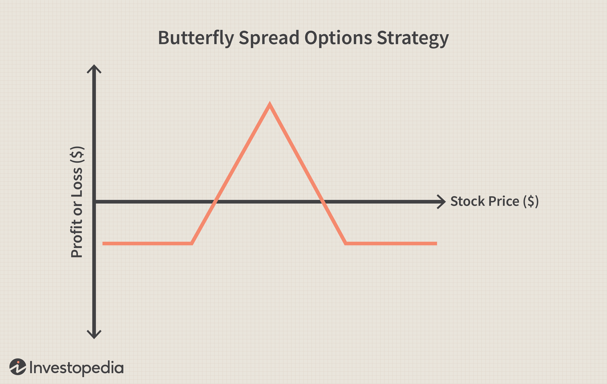

Financial derivatives, particularly options, are now essential components of contemporary trading strategies. Originating as instruments to hedge against price fluctuations, derivatives have evolved to become a cornerstone for sophisticated financial operations. Among derivatives, options stand out due to their unique ability to provide traders with the right, but not the obligation, to buy or sell an asset at a predetermined price within a specific timeframe. This flexibility allows investors to capitalize on market movements and tailor their strategies to achieve specific financial goals. Options trading encompasses a myriad of strategies, each offering different risk-reward profiles, enabling traders to align strategies with their specific outlook and risk tolerance.

The advent of algorithmic trading has simultaneously revolutionized the trading landscape, allowing high-frequency transactions and complex strategies to be executed with remarkable accuracy and speed. Algorithms can process vast amounts of data and execute trades based on intricate mathematical models, identifying opportunities and anomalies far beyond the capability of human traders. This technological advancement has made it possible to combine options trading with algorithmic strategies, effectively integrating them into a powerful trading methodology that maximizes portfolio performance.



This article aims to dissect the intersection of financial derivatives, options trading strategies, and algorithmic trading. Insights will be provided on how these financial tools and technologies can be effectively utilized to harness market opportunities. Emphasis will be placed on understanding their complexities, the potential advantages they offer, and how they together form a robust framework for navigating today’s dynamic financial markets.

## Table of Contents

## Understanding Financial Derivatives

Derivatives are a cornerstone of modern financial markets, functioning as instruments whose value hinges upon the performance of underlying assets, which may include stocks, bonds, commodities, or indices. These financial constructs enable investors to gain or hedge exposure to the price movements of these underlying assets without necessitating direct ownership. This characteristic underscores the inherent flexibility and risk management capabilities that derivatives offer.

There are several types of derivatives, but the key categories are futures, options, and swaps, each tailored to facilitate specific financial objectives within the markets:

1. **Futures**: These are standardized contracts obligating the buyer to purchase, or the seller to sell, an asset at a predetermined future date and price. Used extensively in commodities and financial markets, futures serve dual purposes: they allow hedgers to fix future prices to mitigate risk, and they provide speculators with opportunities to profit from favorable price movements.

2. **Options**: These derivatives grant the holder the right, but not the obligation, to buy or sell an asset at a specified price (known as the strike price) before a specific date. Options can be used in various trading strategies to profit from different market trajectories while minimizing risk exposure. The flexibility of options makes them a popular tool for both hedgers and speculators.

3. **Swaps**: In a swap agreement, two parties exchange cash flows or liabilities from two different financial instruments. Most swap agreements involve cash flows based on a notional principal amount such as a loan or bond, although the principal itself is typically not exchanged. Common types of swaps include interest rate swaps, currency swaps, and commodity swaps, each serving to hedge against adverse movements in exchange rates, interest rates, or commodity prices.

Derivatives play a vital role in hedging by providing investors with mechanisms to protect against adverse price movements in an asset. For example, a farmer can use futures to lock in a price for their crop, securing revenue regardless of market fluctuations. Concurrently, derivatives enable speculative opportunities by allowing traders to seek profits from [volatility](/wiki/volatility-trading-strategies) or predicted price changes of the underlying assets. This speculative nature can amplify returns but also comes with higher risks, as the potential for loss is significant if market movements do not align with the trader's expectations.

However, the utilization of derivatives is not without risks. Market risk arises from unfavorable changes in the value of the underlying asset, while counterparty risk pertains to the possibility that one party in the derivative contract may default on their obligations. Additionally, derivatives can introduce substantial leverage into a portfolio. While leverage can magnify returns, it can also exacerbate losses, necessitating careful risk management strategies.

In conclusion, derivatives serve as multifaceted tools in financial markets, facilitating hedging, speculation, and return enhancement. Their application requires a nuanced understanding of both their potential benefits and inherent risks. A well-structured derivative strategy can significantly enhance an investor's ability to navigate the complexities of the financial landscape.

## Options Trading Strategies

Options trading strategies leverage the unique characteristics of options, particularly the right, but not the obligation, to buy or sell an underlying asset at a set price before a specific date. This feature of options opens up a variety of strategies catering to diverse market conditions and trader objectives.

### Common Options Trading Strategies

#### Covered Calls
A covered call strategy involves holding a long position in an asset while simultaneously writing (selling) call options on the same asset. This strategy is typically employed when an investor expects a moderate increase or decrease in the asset's price. The income from the call premiums provides some downside protection, and if the option is not exercised, the investor retains the stock plus the premium.

#### Straddles
A straddle involves buying both a call and a put option at the same strike price and expiration date. This strategy is best suited for markets where an investor anticipates a significant price movement but is uncertain about the direction. Profit is made if the asset moves significantly away from the strike price, exceeding the combined cost of both options.

#### Iron Condors
An iron condor strategy consists of combining two spreads: a bull put spread and a bear call spread, on the same underlying asset. This strategy profits from low volatility and is typically used when a trader expects minimal price movement. The goal is for the asset's price to remain between the middle strike prices, allowing both spreads to expire worthless and maximizing the premium income.

### Tailoring Strategies to Investor Profiles

Each of these strategies can be tailored to align with an investor's risk tolerance, financial goals, and market outlook. For instance, a risk-averse investor might lean towards covered calls to generate steady income with limited downside risk, while a more speculative trader might use straddles to capitalize on anticipated volatility.

Investors must also consider factors such as time decay and implied volatility. Options are time-sensitive; hence, their value erodes as they approach expiration, a concept known as theta decay. Similarly, implied volatility can significantly impact option pricing, making strategies more or less attractive depending on market conditions.

Overall, the selection and implementation of an options trading strategy require a comprehensive understanding of both the intrinsic and extrinsic factors affecting option prices. By carefully evaluating these components, investors can effectively balance potential returns against risk exposure, optimizing their market positioning.

## Algorithmic Trading in Options

Algorithmic trading employs sophisticated computer algorithms to execute trading strategies with a high degree of precision and remarkable speed, which is especially advantageous in the dynamic domain of options trading. Options trading, characterized by its myriad of complex strategies, greatly benefits from the capabilities of algorithmic systems to manage and execute these strategies efficiently.

One of the prominent applications of [algorithmic trading](/wiki/algorithmic-trading) in options is in volatility [arbitrage](/wiki/arbitrage). This strategy exploits the differences between the implied volatility of options and the expected future volatility of the asset. Given the complexity and rapid nature of these trades, algorithms utilize real-time data to detect discrepancies and quickly capitalize on mispricings. Dispersion trading is another sophisticated strategy, where algorithms facilitate the simultaneous trading of index options and individual stock options within the index, aiming to profit from volatility differences between the broader market and its components.

Automated systems excel in managing multi-leg options strategies, such as straddles or iron condors, where simultaneous execution of multiple trades is crucial to maintaining the intended risk-reward profile. These systems ensure precision in the execution of complex orders and minimize human errors, which are critical in high-speed trading environments.

Risk management is another area where algorithmic trading shines. Algorithms continuously monitor market conditions and positions in real-time, employing predefined risk management protocols to minimize potential losses and preserve capital. This proactive approach enables swift responses to market fluctuations, reducing the human limitations of speed and cognitive biases.

Optimization of returns is enhanced by robust [backtesting](/wiki/backtesting) capabilities, where algorithms test strategies over historical data to evaluate performance and refine trading rules before deployment. This iterative process helps in adapting strategies to changing market conditions and improving risk-adjusted returns.

In conclusion, the integration of algorithmic trading with options strategies not only streamlines execution but also enhances the sophistication and effectiveness of trading operations, paving the way for improved financial outcomes and risk management.

## Risks and Challenges

Financial derivatives and algorithmic trading offer substantial benefits to market participants, but they also come with a set of inherent risks and challenges. A primary concern in these financial activities is market risk, which arises from potential losses due to fluctuations in market prices. This risk is particularly pronounced in derivatives trading, where the leverage involved can magnify the impact of price changes on the value of the positions. For example, options can lose value rapidly if the underlying asset moves unfavorably, making it crucial for traders to monitor the markets closely and use hedging strategies effectively.

Counterparty risk is another critical aspect, especially in over-the-counter (OTC) derivatives transactions, where there is a risk that one of the parties involved might default on its contractual obligations. This risk was highlighted during the 2008 financial crisis, emphasizing the importance of understanding the creditworthiness of counterparties and utilizing clearinghouses to mitigate such risks.

Algorithmic trading introduces additional challenges, primarily due to potential system failures and the complexities of managing automated processes. These systems rely heavily on technological infrastructure, and any disruption—be it due to hardware failure, software bugs, or network issues—can lead to significant financial losses. To address this, firms must invest in robust, redundant systems and conduct regular maintenance and updates.

Another aspect of algorithmic trading risks involves the algorithms themselves, which need to be designed meticulously to handle various market scenarios and prevent unintended trading behaviors. Poorly designed algorithms can cause substantial disruptions, as evidenced by incidents like the 2010 "Flash Crash," where rapid selling by algorithms contributed to a sharp market drop.

To mitigate these risks, a profound understanding of the financial instruments and trading systems involved is essential. Implementing comprehensive risk management protocols, including stress testing, scenario analysis, and real-time monitoring, can enhance resilience against market volatility and operational disruptions. Additionally, maintaining transparency and ensuring compliance with regulatory frameworks can help in managing counterparty risks and preserving market integrity. 

Overall, striking a balance between leveraging the benefits of derivatives and algorithmic trading while managing their inherent risks is key to achieving long-term success in today's dynamic financial markets.

## Integrating Derivatives, Options, and Algo Trading

The integration of derivatives, options strategies, and algorithmic trading creates a comprehensive framework for managing today's complex investment portfolios. This multi-faceted approach enables investors to optimize their strategies by combining the predictive analytics and precise execution capabilities of algorithmic trading with the flexibility and leverage offered by derivatives.

Derivatives, particularly options, offer unique characteristics such as leverage and asymmetrical risk profiles, which can be used to hedge against market volatilities or to speculate on future market movements. Options strategies like straddles or iron condors are designed to profit from particular market conditions. When combined with algorithmic trading, these strategies can be executed with a precision that maximizes their potential returns while minimizing exposure to adverse movements.

Algorithmic trading systems can automatically execute complex strategies by processing large datasets and making split-second decisions based on predefined criteria. For instance, volatility arbitrage is a strategy that exploits differences between the forecasted and implied volatility of options, aiming to profit regardless of market direction. This requires constant monitoring of market data and swift transaction execution, which is efficiently managed by algorithmic systems.

Moreover, multi-leg options strategies, which involve the simultaneous buying and selling of different options contracts, benefit significantly from algorithmic trading. These strategies are often time-sensitive and require an intricate balancing act that would be challenging to perform manually. Algorithms enable traders to optimize their orders and manage risk more effectively through backtesting, ensuring strategies are viable under various market scenarios.

In essence, the synergy between derivatives, options strategies, and algorithmic trading empowers traders to implement sophisticated investment strategies, allowing for both robust risk management and the pursuit of speculative opportunities within their portfolios. This integrated approach not only enhances operational efficiency but also increases the adaptability of investment strategies to dynamic market conditions.

## Future Trends and Developments

The landscape of financial trading is continually evolving, driven by technological advancements and regulatory shifts. Algorithmic trading, which has already revolutionized markets, is poised for further transformation through improvements in algorithmic strategies and the integration of [artificial intelligence](/wiki/ai-artificial-intelligence) (AI). These tools are anticipated to enhance the efficacy and speed of trading decisions, offering unprecedented levels of precision and adaptability.

One of the most promising trends involves the fusion of AI with algorithmic trading strategies. Machine learning algorithms, capable of analyzing vast datasets far beyond human capacity, are increasingly being used to identify patterns and predict market movements. AI's ability to process and learn from historical data can lead to the development of highly sophisticated trading algorithms that adapt in real-time to changing market conditions. For instance, [reinforcement learning](/wiki/reinforcement-learning), a subset of [machine learning](/wiki/machine-learning), is being utilized to optimize trading strategies by learning from interactions with the environment to make better long-term purchase decisions.

Python, a popular programming language in finance, provides a framework for implementing AI-driven strategies. Simple code snippets can illustrate how AI models might be applied in trading strategies:

```python
import numpy as np
from sklearn.ensemble import RandomForestRegressor

# Sample code for predicting stock prices using a Random Forest model
def train_model(features, targets):
    model = RandomForestRegressor(n_estimators=100)
    model.fit(features, targets)
    return model

# Example dataset (features and target stock prices)
features = np.array([[1, 2], [3, 4], [5, 6]])
targets = np.array([100, 200, 300])

# Train the model
model = train_model(features, targets)

# Predict future stock prices
future_features = np.array([[7, 8]])
predicted_prices = model.predict(future_features)
print(predicted_prices)
```

Concurrently, regulatory changes are playing a significant role in shaping future trading trends. Enhanced regulations aimed at ensuring transparency and reducing systemic risk are likely to continue, especially in the derivatives market. The increasing scrutiny on algorithmic trading practices demands the implementation of robust risk management frameworks and compliance mechanisms. This trend is exemplified by initiatives such as the European Union's Markets in Financial Instruments Directive II (MiFID II), which mandates comprehensive reporting and transparency standards for trading activities.

Technological innovations are also expected to drive significant changes. Blockchain technology, known for its potential to provide secure and efficient settlement of trades, is being explored for its applicability in automating back-office functions and enhancing trade execution speed. Additionally, quantum computing holds the promise of revolutionizing trading computations, enabling the simulation of highly complex financial models at speeds incomprehensible by current standards.

These future trends in algorithmic and AI-driven trading, coupled with ongoing regulatory modifications, present both opportunities and challenges. Investors and traders must stay abreast of these developments, carefully balancing the potential for improved trading outcomes against the necessity of maintaining compliance and effective risk management. The ongoing innovation in financial technologies and trading strategies continues to redefine the boundaries of trading possibilities.

## Conclusion

The intersection of financial derivatives, options trading, and algorithmic strategies provides a multidimensional toolkit essential for modern investors looking to navigate the complexities of today’s financial markets. Financial derivatives, such as options, enable investors to leverage varying degrees of risk and reward by allowing for the purchase or sale of an underlying asset at predetermined prices. These instruments are invaluable for hedging against market volatility and speculative endeavors.

Options trading strategies offer a spectrum of possibilities, from basic covered calls to intricate iron condors. Such strategies can be tailored to match individual investor profiles and objectives, balancing potential returns against risk exposure. Algorithmic trading, on the other hand, revolutionizes the execution of these strategies. By harnessing computer programs, traders can execute complex strategies swiftly and precisely, elevating the efficiency of trading operations. Algorithms can manage intricate multi-leg strategies and optimize returns through sophisticated risk management techniques and constant real-time analysis.

Furthermore, the integration of derivatives, options strategies, and algorithmic trading forms a cohesive framework that enhances investment portfolio management. This synergy allows for sophisticated risk management techniques and speculative opportunities. As traders gain a deeper understanding of these tools, they can leverage them to amplify their investment capabilities.

Looking ahead, continuous advancements in algorithmic strategies and the predictive capabilities of artificial intelligence promise further evolution in trading. While such progress brings challenges due to evolving regulations and technological changes, it simultaneously presents new opportunities for traders willing to adapt and learn. Therefore, mastering the use of financial derivatives alongside algorithmic strategies gives investors a decisive edge in today's complex financial ecosystems.

## References & Further Reading

[1]: Black, F., & Scholes, M. (1973). ["The Pricing of Options and Corporate Liabilities."](https://www.cs.princeton.edu/courses/archive/fall09/cos323/papers/black_scholes73.pdf) Journal of Political Economy, 81(3), 637-654.

[2]: Hull, J. C. (2015). ["Options, Futures, and Other Derivatives,"](https://www.amazon.com/Options-Futures-Other-Derivatives-10th/dp/013447208X) (9th Edition). Pearson.

[3]: Lopez de Prado, M. (2018). ["Advances in Financial Machine Learning"](https://www.amazon.com/Advances-Financial-Machine-Learning-Marcos/dp/1119482089) Wiley.

[4]: Chan, E. P. (2008). ["Quantitative Trading: How to Build Your Own Algorithmic Trading Business."](https://github.com/ftvision/quant_trading_echan_book) Wiley.

[5]: Jansen, S. (2020). ["Machine Learning for Algorithmic Trading: Predictive models to extract signals from market and alternative data for systematic trading strategies with Python,"](https://www.amazon.com/Machine-Learning-Algorithmic-Trading-alternative/dp/1839217715) (2nd Edition). Packt Publishing.

[6]: Glasserman, P. (2004). ["Monte Carlo Methods in Financial Engineering."](https://link.springer.com/book/10.1007/978-0-387-21617-1) Springer.

[7]: Aronson, D. R. (2007). ["Evidence-Based Technical Analysis: Applying the Scientific Method and Statistical Inference to Trading Signals."](https://onlinelibrary.wiley.com/doi/book/10.1002/9781118268315) Wiley.

