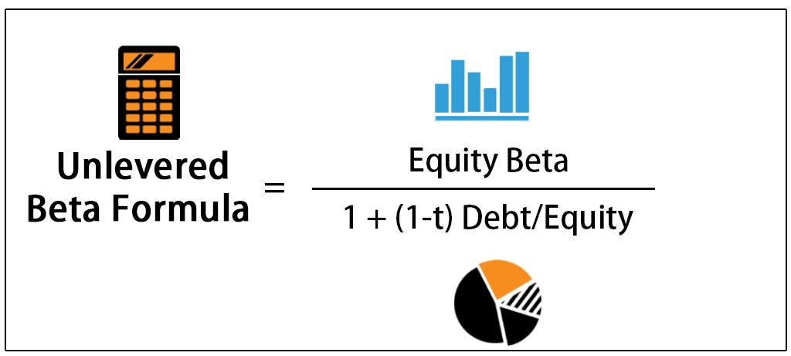

In the dynamic world of finance, understanding the nuances of beta calculations can significantly impact investment strategies. Beta is traditionally employed as a measure to assess a stock's volatility compared to the broader market. It plays a pivotal role in determining how much a stock's price might fluctuate relative to an index such as the S&P 500. A beta value of 1 suggests that the stock should move with the market. However, a beta greater than 1 indicates higher volatility, making the stock more susceptible to larger price swings. Conversely, a beta less than 1 suggests less volatility and potentially lower investment risk.

A vital concept related to beta is the unlevered beta, which provides insights into the inherent risk of a company unrelated to its financial leverage. This metric becomes essential when evaluating a company's performance independent of the capital structure's influence. Unlike levered beta, which incorporates debt into the volatility calculation, unlevered beta strips away the effects of financial leverage. This allows investors to assess the pure equity risk without the distortions introduced by debt, thereby offering a clearer view of a business’s market risk.



In this article, we aim to unpack these complex concepts of beta and unlevered beta, examining their relevance in various facets of finance, including financial leverage and algorithmic trading. Understanding how these metrics are calculated and their implications can offer investors a strategic advantage. By exploring their role in investment strategies and trading algorithms, we provide insights into how beta and unlevered beta can be leveraged in risk assessments and portfolio management, ultimately equipping investors and financial professionals with the knowledge necessary to make more informed decisions in an ever-evolving market landscape.

## Table of Contents

## Understanding Beta in Finance

Beta (β) is a pivotal measure used to assess the risk of a stock or an investment portfolio in relation to the overall market. It quantifies the sensitivity of an asset's returns compared to those of a benchmark index, usually a broad market index like the S&P 500. In essence, beta indicates how much a stock's price is likely to move for a given move in the market.

When a stock has a beta of 1, it is expected to move in perfect harmony with the market. This means that if the market goes up or down by a particular percentage, the stock's price will likely move by the same percentage. Stocks with a beta greater than 1 are considered more volatile than the market; they tend to experience more significant price movements. For example, a beta of 1.5 suggests that a stock is expected to move 1.5 times the market's movement, amplifying both gains and losses. Conversely, stocks with a beta of less than 1 exhibit less volatility, implying reduced price changes compared to the market. A beta of 0.5, for instance, suggests that the stock will move half as much as the market does.

Beta is a core element of the Capital Asset Pricing Model (CAPM), which is a tool used to determine the expected return of an asset, given its risk. The formula for CAPM is:

$$

E(R_i) = R_f + \beta_i (E(R_m) - R_f) 
$$

where:

- $E(R_i)$ is the expected return of the investment
- $R_f$ is the risk-free rate of return
- $β_i$ is the beta of the investment
- $E(R_m)$ is the expected return of the market

In CAPM, beta serves to adjust the risk premium, $E(R_m) - R_f$, based on the stock's [volatility](/wiki/volatility-trading-strategies) relative to the market, helping investors understand what level of returns they might anticipate given the investment's systematic risk.

Understanding beta is crucial for investors as it influences their portfolio volatility and is an integral part of risk management. By analyzing beta, investors can make informed decisions about which stocks to include in their portfolios, depending on their risk tolerance and investment objectives.

## Levered vs. Unlevered Beta

Levered beta, also known as equity beta, reflects the risk of a stock considering its capital structure, which includes both debt and equity. This measure is utilized to understand how the volatility of a stock or portfolio is influenced by the company's financing decisions. Levered beta indicates how sensitive a stock's returns are in relation to market changes, accounting for the financial leverage a company undertakes.

In contrast, unlevered beta, sometimes referred to as asset beta, isolates the business risk by removing the effects of financial leverage, such as debt. This form of beta provides a clearer perspective of a company’s core market risk, independent of its capital structure. Unlevered beta is particularly useful in assessing the fundamental operational risk of a business, especially when comparing companies with similar operations but differing financial policies.

To calculate unlevered beta, the effects of debt are stripped from the levered beta using the formula:

$$

\text{Unlevered Beta} = \frac{\text{Levered Beta}}{1 + \left(1 - \text{Tax Rate}\right) \times \frac{\text{Debt}}{\text{Equity}}}
$$

This formula accounts for the company’s financial leverage by adjusting the levered beta to reflect the company’s taxation and debt obligations. The debt-to-equity ratio plays a critical role in this calculation, as it reflects the extent to which financial leverage influences the company’s risk profile.

Understanding the distinction between levered and unlevered beta is crucial when evaluating companies across different industries. Companies may operate in similar sectors but employ varying capital structures, which affects their risk and return profiles. Unlevered beta serves as a standard measure that facilitates the comparison of business risk inherent in different companies, thus providing investors and analysts with a uniform metric to evaluate potential investments without the distortion of financial leverage.

## Calculating Unlevered Beta

To calculate unlevered beta, it is essential to adjust the levered beta by accounting for the company's debt-to-equity ratio and corporate tax rate. The formula used is:

$$
\text{Unlevered Beta} = \frac{\text{Levered Beta}}{1 + (1 - \text{Tax Rate}) \times \left(\frac{\text{Debt}}{\text{Equity}}\right)}
$$

This formula removes the effect of financial leverage, allowing investors to assess the business's operational risk alone without the influence of debt. In order to perform this calculation accurately, one must first determine the levered beta, debt, equity, and applicable tax rate. Levered beta is typically available through financial services like Bloomberg, which provide comprehensive datasets on corporate financial metrics.

Unlevered beta is beneficial when comparing firms with different capital structures, as it standardizes market risk by stripping out the effects of how the firm is financed. Here's an example of how this calculation might be implemented in Python using hypothetical data:

```python
def calculate_unlevered_beta(levered_beta, debt, equity, tax_rate):
    debt_to_equity_ratio = debt / equity
    unlevered_beta = levered_beta / (1 + (1 - tax_rate) * debt_to_equity_ratio)
    return unlevered_beta

# Example values
levered_beta_value = 1.3
debt_value = 500000  # in currency units
equity_value = 1200000  # in currency units
corporate_tax_rate = 0.30  # 30%

unlevered_beta_value = calculate_unlevered_beta(
    levered_beta_value, debt_value, equity_value, corporate_tax_rate
)

print(f"Unlevered Beta: {unlevered_beta_value}")
```

In this example, the calculation considers the impact of debt and taxes on the firm's beta, offering a clearer view of its inherent risk. Using reliable data sources ensures that inputs like debt, equity, and tax rates are precise, leading to more accurate evaluations of unlevered beta. This metric serves investors and analysts by providing a basis for comparing different companies' risk profiles, independent of their financial strategies.

## The Role of Financial Leverage

Financial leverage refers to the use of debt to acquire additional assets, intending to increase potential returns on investment. By incorporating debt in their capital structure, companies can amplify both their profits and risks. When a company has high financial leverage, fluctuations in profits can be more dramatic, leading to increased volatility in the company's stock. This additional volatility directly impacts the beta of the stock, making the analysis of a company's capital structure essential for investors.

The debt-to-equity ratio is a commonly used metric to assess the degree of a company’s financial leverage. It is calculated as:

$$
\text{Debt-to-Equity Ratio} = \frac{\text{Total Debt}}{\text{Shareholders' Equity}}
$$

A higher debt-to-equity ratio means that a company is using more borrowed money, which could imply greater financial risk. This is important when evaluating beta because an elevated level of debt in the capital structure typically leads to a higher beta, reflecting the increased risk faced by equity holders due to financial commitments to debt servicing.

Understanding the dynamics of financial leverage helps investors evaluate the risk-adjusted performance of a company. By dissecting the elements that contribute to the overall risk profile, investors can differentiate between financial risk and operational risk, the latter of which is isolated using unlevered beta calculations. Assessing these elements becomes crucial for investors who aim to discern whether a company’s high beta is due to its core operations or financial decisions regarding debt levels.

Ultimately, leveraging these nuances allows investors to make more informed decisions by understanding not just the observable volatility, but the underlying risk characteristics associated with leveraging strategies. This insight is vital for constructing diversified portfolios that align with both investment goals and risk tolerance.

## Implications in Algorithmic Trading

Algorithmic trading systems utilize beta calculations extensively to optimize portfolio risk and returns by assessing the volatility and systematic risk associated with assets. Beta, a measure of a stock's volatility in relation to the market, is instrumental in designing these systems. However, focusing solely on levered beta might introduce bias due to the influence of a company’s capital structure, particularly its debt. Therefore, employing unlevered beta, which strips out the effects of financial leverage, provides traders with a clearer understanding of a company's intrinsic market risk.

By incorporating unlevered beta into [algorithmic trading](/wiki/algorithmic-trading) strategies, traders can develop methods that account for market volatility without the influence of financial leverage. This approach proves beneficial in identifying the operational risks inherent to a business, facilitating more precise risk assessments. When developing trading algorithms, these insights help in creating strategies that can hedge against risks effectively while capitalizing on potential market inefficiencies.

Mathematically, unlevered beta ($\beta_u$) is expressed as:

$$
\beta_u = \frac{\beta_l}{1 + ((1 - \text{Tax Rate}) \times (\text{Debt/Equity}))}
$$

where $\beta_l$ is the levered beta, and the debt-to-equity ratio and tax rate are factors applied to remove the financial effects.

Real-time beta calculations can be seamlessly integrated into algorithmic trading systems for enhanced adaptive risk management. Through the use of programmatic access to financial data, Python can efficiently calculate beta values on-the-fly. Here's a simple code snippet demonstrating how the unlevered beta might be computed:

```python
def calculate_unlevered_beta(levered_beta, tax_rate, debt_equity_ratio):
    return levered_beta / (1 + ((1 - tax_rate) * debt_equity_ratio))

# Example usage
levered_beta = 1.2
tax_rate = 0.3
debt_equity_ratio = 0.5

unlevered_beta = calculate_unlevered_beta(levered_beta, tax_rate, debt_equity_ratio)
print(f"Unlevered Beta: {unlevered_beta}")
```

Incorporating real-time beta estimates, such algorithms can dynamically adjust position sizes or asset allocations to manage risk more effectively under varying market conditions. This capability allows for a sophisticated analysis of beta metrics, ensuring that algorithmic systems remain robust and responsive to market changes, ultimately facilitating superior portfolio management and performance.

## Conclusion

Understanding beta and unlevered beta is paramount for investors focused on refining their investment strategies. These metrics, which examine the market-related risk profile of a company, provide essential insights beyond just financial obligations. By evaluating beta, investors can assess a stock's volatility relative to the market, thus aiding in the prediction of potential price movements and investment risks. In contrast, unlevered beta isolates the business's operational risk from the financial leverage [factor](/wiki/factor-investing), revealing the company's intrinsic market risk devoid of debt influences.

Incorporating beta and unlevered beta into financial models enhances the precision of investment analysis. For analysts and traders, leveraging these metrics aids in constructing portfolios that align with desired risk levels and expected returns. Algorithmic trading, in particular, benefits significantly from these calculations, allowing for optimized risk management strategies that can swiftly adapt to market changes.

Staying current with beta calculations empowers financial professionals to make informed investment decisions. This knowledge enables them to tailor strategies that accommodate different market conditions and financial structures, facilitating a more robust approach to risk and return analysis. By integrating comprehensive beta analyses, investors can better understand and predict market behavior, ultimately leading to more effective investment decision-making within the financial landscape.

## References & Further Reading

[1]: ["Investment Valuation: Tools and Techniques for Determining the Value of Any Asset"](https://www.wiley.com/en-us/Investment+Valuation%3A+Tools+and+Techniques+for+Determining+the+Value+of+Any+Asset%2C+3rd+Edition-p-9781118011522) by Aswath Damodaran

[2]: ["Financial Modeling and Valuation: A Practical Guide to Investment Banking and Private Equity"](https://www.wiley.com/en-us/Financial+Modeling+and+Valuation%3A+A+Practical+Guide+to+Investment+Banking+and+Private+Equity%2C+2nd+Edition-p-9781119808879) by Paul Pignataro

[3]: ["Quantitative Finance for Dummies"](https://www.wiley.com/en-us/Quantitative+Finance+For+Dummies-p-9781118769461) by Dr. Steve Gair, PhD

[4]: ["The Risk-Return Paradox: An Application of the Arbitrage Pricing Theory"](https://www.investopedia.com/terms/a/apt.asp) by Eugene F. Fama and Kenneth R. French in the Journal of Finance

[5]: ["Algorithmic Trading: Winning Strategies and Their Rationale"](https://books.google.com/books/about/Algorithmic_Trading.html?id=CIwCTVqEj4oC) by Ernie Chan