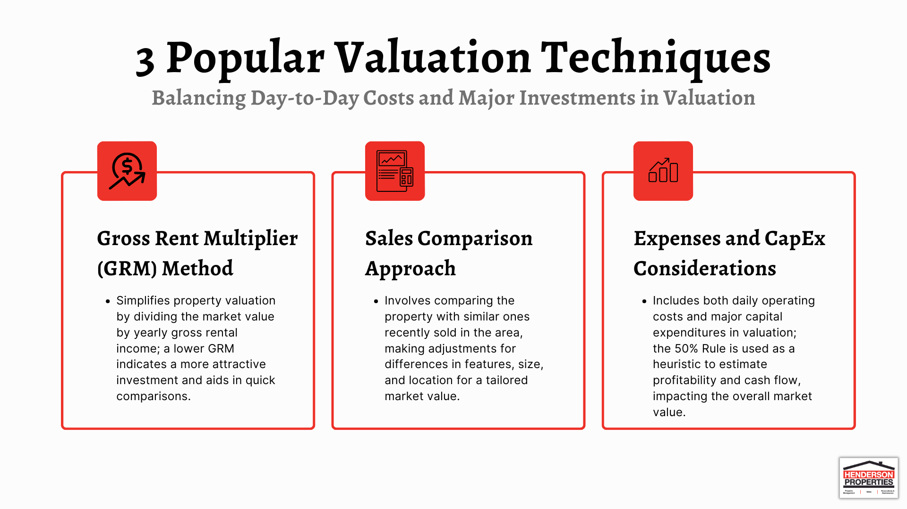

## Table of Contents

## What is real estate valuation and why is it important for rental properties?

Real estate valuation is the process of figuring out how much a property is worth. This is done by looking at things like the property's location, size, condition, and what similar properties nearby have sold for. It's like trying to guess the price of a used car by checking its age, how well it's been taken care of, and what other similar cars are selling for.

For rental properties, knowing the valuation is really important. It helps landlords set a fair rent price that tenants can afford and that also makes them money. If the rent is too high, tenants might not want to rent the property, and it could stay empty. If the rent is too low, the landlord might not make enough money to cover costs like repairs and taxes. So, getting the valuation right helps keep both the landlord and the tenants happy and the property profitable.

## What are the basic methods used to value rental properties?

There are a few basic ways to figure out how much a rental property is worth. One way is called the Sales Comparison Approach. This is where you look at what similar rental properties nearby have sold for recently. You compare these properties to yours, thinking about things like size, condition, and location. If a similar property sold for a certain price, you can guess that your property might be worth around the same amount, with some adjustments for any differences.

Another method is the Income Approach. This one is all about how much money the rental property can make. You look at the rent you can charge and any other income from the property, like parking fees. Then, you subtract the costs of running the property, like repairs and taxes. This gives you the net income. You can then use a formula to figure out how much the property is worth based on that income. It's like valuing a business by its profits.

The last common method is the Cost Approach. This one tries to figure out how much it would cost to build the same property from scratch today, including the land value. You then subtract any wear and tear on the existing property. This method is useful if the property is unique or if there aren't many similar properties to compare it to. Each of these methods can help you get a good idea of what your rental property is worth, depending on what information you have and what makes the most sense for your situation.

## How does the Income Approach work in valuing rental properties?

The Income Approach to valuing rental properties is all about figuring out how much money the property can make. You start by looking at how much rent you can charge for the property. You also add in any other income you might get, like fees for parking or laundry machines. After you know your total income, you subtract all the costs of owning and running the property. These costs can include things like property taxes, insurance, and money you need to spend on repairs and maintenance. What you have left after subtracting these costs is called the net operating income (NOI).

Once you have the net operating income, you use a formula to figure out the value of the property. This formula involves something called the capitalization rate, or "cap rate" for short. The cap rate is a percentage that shows how much return an investor expects to get from the property. To find the property's value, you divide the net operating income by the cap rate. For example, if your property's NOI is $10,000 per year and the cap rate is 5%, you divide $10,000 by 0.05 to get a property value of $200,000. This method helps investors see if the rental property is a good investment based on how much money it can make.

## What is the Gross Rent Multiplier (GRM) and how is it calculated?

The Gross Rent Multiplier (GRM) is a quick way to figure out how much a rental property is worth based on the rent it can bring in. It's like a shortcut that helps investors see if a property might be a good deal without doing a lot of detailed math. The GRM is a number that shows how many years it would take for the property's rent to equal its price.

To calculate the GRM, you take the property's price and divide it by its annual gross rental income. For example, if a property costs $200,000 and it can bring in $20,000 in rent each year, you divide $200,000 by $20,000 to get a GRM of 10. This means it would take 10 years of rent to pay off the price of the property. The lower the GRM, the better the deal might be, because it means you're paying less for each dollar of rent the property can make.

## Can you explain the Capitalization Rate (Cap Rate) method for valuing rental properties?

The Capitalization Rate, or Cap Rate, is a way to figure out how much a rental property is worth based on the money it can make. It's like a tool that helps investors see if a property is a good investment. The Cap Rate is a percentage that shows how much return an investor can expect from the property each year. To find the Cap Rate, you take the property's net operating income (NOI) and divide it by the property's current market value or purchase price. For example, if a property's NOI is $10,000 per year and it's worth $100,000, you divide $10,000 by $100,000 to get a Cap Rate of 10%. This means the property gives you a 10% return on your investment each year.

Once you know the Cap Rate, you can use it to find out how much a property is worth. If you know the NOI and the Cap Rate you want, you can figure out the value by dividing the NOI by the Cap Rate. For example, if you want a 5% Cap Rate and the property's NOI is $10,000, you divide $10,000 by 0.05 to get a property value of $200,000. The Cap Rate helps investors compare different properties and see which ones might give them the best return on their money. It's a simple but powerful way to make smart investment choices in rental properties.

## How do you use the Sales Comparison Approach to estimate the value of a rental property?

The Sales Comparison Approach is a way to figure out how much a rental property is worth by looking at what similar properties nearby have sold for. You start by finding other rental properties in the same area that are a lot like yours. These properties should be similar in size, condition, and features. You then look at the prices these properties sold for and use them as a guide to guess what your property might be worth. If a similar property sold for $200,000, you might think your property is worth around that amount too.

But, you need to make some adjustments because no two properties are exactly the same. For example, if your property is bigger or in better shape than the one that sold for $200,000, you might add some value to your estimate. If it's smaller or needs more repairs, you might subtract some value. By comparing and adjusting, you can come up with a good guess of what your rental property is worth. This method helps you see if your property is priced right compared to others in the area.

## What role does the Cost Approach play in valuing rental properties, and when is it most useful?

The Cost Approach is a way to figure out how much a rental property is worth by thinking about how much it would cost to build the same property from scratch today. You start by figuring out the cost of the land and then add the cost to build the building on it. After that, you subtract any wear and tear on the property, which is called depreciation. This gives you an idea of what the property would be worth if someone decided to build it new instead of buying the existing one.

This method is most useful when the rental property is unique or when there aren't many similar properties around to compare it to. For example, if you have a special kind of building that doesn't have many others like it nearby, the Cost Approach can help you figure out its value. It's also helpful for new buildings or properties that are in really good shape, because you can easily estimate the cost to build something similar. But for older properties or ones that need a lot of repairs, other methods like the Sales Comparison Approach or the Income Approach might be better because they take into account the property's current condition and how much money it can make.

## How do local market conditions affect the valuation of rental properties?

Local market conditions can really change how much a rental property is worth. Things like how many people want to rent in the area and how many rental properties are available can make a big difference. If a lot of people want to rent and there aren't many places to rent, landlords can charge more rent. This makes the property more valuable because it can make more money. On the other hand, if there are a lot of empty rentals and not many people looking to rent, landlords might have to lower their rent to get tenants. This can make the property worth less because it won't bring in as much money.

Also, the overall health of the local economy matters a lot. If there are a lot of good jobs and the economy is doing well, more people might be able to afford to rent, which can push up property values. But if the economy is struggling and people are losing jobs, they might not be able to pay as much for rent, which can lower property values. Things like new businesses opening up, new schools, or even new public transport can make an area more popular and increase the value of rental properties. So, understanding what's going on in the local market is really important when trying to figure out how much a rental property is worth.

## What advanced techniques can be used to refine the valuation of rental properties?

To get a more accurate value for a rental property, you can use something called regression analysis. This is a fancy way of looking at a bunch of data to see how different things affect the property's value. For example, you can look at how the size of the property, its age, and even the crime rate in the area can change its value. By using a computer to do this math, you can find out which things matter the most and get a more exact number for what the property is worth. This method is really helpful when you have a lot of data and want to make sure you're not missing anything important.

Another advanced technique is using discounted cash flow (DCF) analysis. This method looks at all the money the rental property will make in the future and figures out what that money is worth today. You guess how much rent you'll get each year, how much you'll have to spend on repairs and other costs, and even how long you plan to own the property. Then, you use a special formula to add up all that future money but make it smaller because money you get later is worth less than money you get now. This can give you a very detailed and accurate picture of what the property is worth, especially if you're planning to hold onto it for a long time.

## How do tax implications influence the valuation of rental properties?

Tax implications can really affect how much a rental property is worth. When you own a rental property, you have to pay taxes on the money you make from it. But, there are also some tax breaks you can get, like being able to subtract the cost of repairs and other expenses from your taxes. These tax breaks can make the property more valuable because they let you keep more of the money you earn. Also, if the property goes up in value over time, you might have to pay capital gains tax when you sell it. Knowing about these taxes and breaks can help you figure out if the property is a good investment.

Another thing to think about is how property taxes work. Property taxes are based on how much the local government thinks your property is worth. If property taxes are high in your area, it can make the property less valuable because you have to pay more money each year just to own it. But if property taxes are low, it can make the property more valuable because you get to keep more of your rental income. So, understanding how taxes work in your area is really important when you're trying to figure out how much a rental property is worth.

## What are the common pitfalls to avoid when valuing rental properties?

When valuing rental properties, one common mistake is not considering all the costs. It's easy to focus on the rent you can charge, but you also need to think about things like repairs, taxes, and insurance. If you don't include these costs, you might think the property is worth more than it really is. Another pitfall is not looking at enough similar properties when using the Sales Comparison Approach. If you only compare your property to one or two others, you might miss important differences that can change its value. It's better to look at several properties to get a good average.

Another mistake is ignoring local market conditions. The value of a rental property can change a lot depending on how many people want to rent in the area and how many rental properties are available. If you don't pay attention to these things, you might set your rent too high or too low, which can affect how much the property is worth. Also, not updating your valuation regularly can be a problem. Property values can go up or down over time, so it's important to check your valuation every now and then to make sure it's still accurate.

## How can technology and data analytics improve the accuracy of rental property valuations?

Technology and data analytics can make rental property valuations more accurate by helping us look at a lot of information quickly. With computers, we can use something called regression analysis to see how things like the size of the property, how old it is, and even the crime rate in the area affect its value. This helps us find out which things are most important and get a better guess of what the property is worth. Also, special software can pull in data from lots of different places, like real estate websites and government records, so we don't miss any important details. This makes our valuation more complete and accurate.

Another way technology helps is through something called discounted cash flow (DCF) analysis. This method looks at all the money the rental property will make in the future and figures out what that money is worth today. With the help of computers, we can make detailed guesses about future rent, costs for repairs, and even how long we plan to own the property. Then, we use a special formula to add up all that future money but make it smaller because money you get later is worth less than money you get now. This gives us a very detailed and accurate picture of what the property is worth, especially if we're planning to hold onto it for a long time.

## What is the relationship between Property Investment and Rental Property Value?

Investment in rental properties necessitates a thorough understanding of various valuation methods to accurately gauge potential returns. Effective valuation is crucial for making informed decisions that optimize investment gains. This involves an in-depth analysis of market conditions, demand, and the specific attributes of the property under consideration.

### Valuation Methods

1. **Sales Comparison Approach**: This method estimates property value by comparing recent sales of similar properties in the same area. It is primarily used for residential properties. Adjustments are made for differences in key attributes such as size, condition, and location. For instance, if Property A sold for $300,000 and is similar to Property B—except Property B has a swimming pool worth $30,000—the adjusted valuation for Property B might be $330,000.

2. **Income Approach**: This method, applicable predominantly to rental and commercial properties, determines value based on the income the property is expected to generate. The formula used here is:
$$
   \text{Value} = \frac{\text{Net Operating Income (NOI)}}{\text{Capitalization Rate (Cap Rate)}}

$$

   Net Operating Income is derived from gross income after deducting operating expenses. The Cap Rate reflects the investor's required rate of return. For example, if a property generates a NOI of $20,000 annually and the expected Cap Rate is 5%, the valuation would be $400,000.

3. **Cost Approach**: This approach evaluates the cost to recreate the property, considering the current cost of land and construction minus depreciation. It is often used for newer properties where there's little market data. If the land costs $100,000 and construction costs total $250,000, with depreciation valued at $20,000, the property might be valued at $330,000.

Each valuation method offers distinct insights, thus forming a comprehensive toolkit for investors assessing potential investments. The sales comparison approach provides context for market trends, the income approach focuses on financial returns, and the cost approach gives a breakdown of property construction values. Understanding these varied methods allows investors to craft strategies optimized for their specific goals and market conditions, maximizing the potential returns on their rental property investments.

## What are Traditional Real Estate Valuation Methods?

Traditional real estate valuation methods are crucial in determining the value of properties and guiding investment decisions. These methods have been honed over time and remain foundational in the industry, offering valuable insights for investors, appraisers, and policymakers.

The sales comparison approach is one of the most widely used methods, particularly effective for evaluating residential properties. This approach involves comparing a property with similar properties that have recently sold in the same area. Key factors such as location, size, condition, and amenities are considered to estimate the value of the subject property. The principle behind this method is the belief that similar properties should sell for comparable prices, adjusting for any differences. For example, in Python, one could automate this approach using a simple algorithm to compare property features and recent sales data:

```python
def sales_comparison(subject_property, comparable_properties):
    adjustments = []
    for comp in comparable_properties:
        adjustment = comp['sale_price']
        for feature in subject_property:
            if feature in comp:
                adjustment += subject_property[feature] - comp[feature]
        adjustments.append(adjustment)
    estimated_value = sum(adjustments) / len(adjustments)
    return estimated_value
```

The cost approach is another traditional valuation method, suitable for newer structures. This approach assesses the cost of constructing a similar property from scratch. It considers the current cost of building materials and labor, while also factoring in land value and depreciation. The formula used can be expressed as:

$$
\text{Property Value} = (\text{Cost of Building New}) + (\text{Land Value}) - (\text{Depreciation})
$$

This method is particularly useful when valuing unique properties that may not have many comparables in the sales comparison approach.

The income capitalization approach is predominantly applied to commercial and rental properties. It focuses on the potential income a property can generate, which is a critical [factor](/wiki/factor-investing) for investors interested in properties that offer a steady income stream. The value is determined using the formula:

$$
\text{Property Value} = \frac{\text{Net Operating Income (NOI)}}{\text{Capitalization Rate}}
$$

Where Net Operating Income is the income generated from the property after operating expenses are deducted, and the Capitalization Rate is the expected rate of return on the investment.

These traditional methods provide essential insights into property valuation. However, with the advancement of technologies such as [algorithmic trading](/wiki/algorithmic-trading), new data-driven techniques are increasingly being integrated into the valuation process, complementing these foundational approaches and offering enhanced precision and efficiency.

## References & Further Reading

[1]: Bergstra, J., Bardenet, R., Bengio, Y., & Kégl, B. (2011). ["Algorithms for Hyper-Parameter Optimization."](https://dl.acm.org/doi/10.5555/2986459.2986743) Advances in Neural Information Processing Systems 24.

[2]: ["Advances in Financial Machine Learning"](https://www.amazon.com/Advances-Financial-Machine-Learning-Marcos/dp/1119482089) by Marcos Lopez de Prado

[3]: ["Evidence-Based Technical Analysis: Applying the Scientific Method and Statistical Inference to Trading Signals"](https://books.google.com/books/about/Evidence_Based_Technical_Analysis.html?id=MeoJAQAAMAAJ) by David Aronson

[4]: ["Machine Learning for Algorithmic Trading"](https://github.com/stefan-jansen/machine-learning-for-trading) by Stefan Jansen

[5]: ["Quantitative Trading: How to Build Your Own Algorithmic Trading Business"](https://github.com/LucindaYa/quant-resources/blob/master/Quantitative%20Trading%20How%20to%20Build%20Your%20Own%20Algorithmic%20Trading%20Business.pdf) by Ernest P. Chan