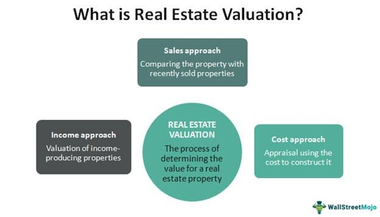

The real estate sector is one of the foundational pillars of economic development and individual wealth-building. It has traditionally been influenced by aspects such as property valuation, rental income, and more recently, the increasing utilization of algorithmic trading. Understanding the methods of assessing a property's worth is essential for investors aiming to identify and exploit profitable investment opportunities. 

Recent advancements have expanded the role of algorithmic trading beyond financial markets to impact property valuation. This integration offers new insights, fostering more accurate, data-driven decision-making processes. As such, algorithmic trading is gradually becoming a transformative force in real estate, affecting how investors evaluate investments and understand market dynamics.



This article investigates how property investment strategies, valuation techniques, and algorithmic trading intersect and influence each other within the real estate industry. The aim is to provide readers with a nuanced understanding of how these elements collectively impact investment decisions and broader market operations. By exploring this intersection, the article seeks to shed light on the evolving methodologies that are shaping contemporary real estate practices, ultimately helping investors, appraisers, and policymakers make informed decisions in an ever-changing environment.

## Table of Contents

## Property Investment and Rental Property Value

Investment in rental properties necessitates a thorough understanding of various valuation methods to accurately gauge potential returns. Effective valuation is crucial for making informed decisions that optimize investment gains. This involves an in-depth analysis of market conditions, demand, and the specific attributes of the property under consideration.

### Valuation Methods

1. **Sales Comparison Approach**: This method estimates property value by comparing recent sales of similar properties in the same area. It is primarily used for residential properties. Adjustments are made for differences in key attributes such as size, condition, and location. For instance, if Property A sold for $300,000 and is similar to Property B—except Property B has a swimming pool worth $30,000—the adjusted valuation for Property B might be $330,000.

2. **Income Approach**: This method, applicable predominantly to rental and commercial properties, determines value based on the income the property is expected to generate. The formula used here is:
$$
   \text{Value} = \frac{\text{Net Operating Income (NOI)}}{\text{Capitalization Rate (Cap Rate)}}

$$

   Net Operating Income is derived from gross income after deducting operating expenses. The Cap Rate reflects the investor's required rate of return. For example, if a property generates a NOI of $20,000 annually and the expected Cap Rate is 5%, the valuation would be $400,000.

3. **Cost Approach**: This approach evaluates the cost to recreate the property, considering the current cost of land and construction minus depreciation. It is often used for newer properties where there's little market data. If the land costs $100,000 and construction costs total $250,000, with depreciation valued at $20,000, the property might be valued at $330,000.

Each valuation method offers distinct insights, thus forming a comprehensive toolkit for investors assessing potential investments. The sales comparison approach provides context for market trends, the income approach focuses on financial returns, and the cost approach gives a breakdown of property construction values. Understanding these varied methods allows investors to craft strategies optimized for their specific goals and market conditions, maximizing the potential returns on their rental property investments.

## Traditional Real Estate Valuation Methods

Traditional real estate valuation methods are crucial in determining the value of properties and guiding investment decisions. These methods have been honed over time and remain foundational in the industry, offering valuable insights for investors, appraisers, and policymakers.

The sales comparison approach is one of the most widely used methods, particularly effective for evaluating residential properties. This approach involves comparing a property with similar properties that have recently sold in the same area. Key factors such as location, size, condition, and amenities are considered to estimate the value of the subject property. The principle behind this method is the belief that similar properties should sell for comparable prices, adjusting for any differences. For example, in Python, one could automate this approach using a simple algorithm to compare property features and recent sales data:

```python
def sales_comparison(subject_property, comparable_properties):
    adjustments = []
    for comp in comparable_properties:
        adjustment = comp['sale_price']
        for feature in subject_property:
            if feature in comp:
                adjustment += subject_property[feature] - comp[feature]
        adjustments.append(adjustment)
    estimated_value = sum(adjustments) / len(adjustments)
    return estimated_value
```

The cost approach is another traditional valuation method, suitable for newer structures. This approach assesses the cost of constructing a similar property from scratch. It considers the current cost of building materials and labor, while also factoring in land value and depreciation. The formula used can be expressed as:

$$
\text{Property Value} = (\text{Cost of Building New}) + (\text{Land Value}) - (\text{Depreciation})
$$

This method is particularly useful when valuing unique properties that may not have many comparables in the sales comparison approach.

The income capitalization approach is predominantly applied to commercial and rental properties. It focuses on the potential income a property can generate, which is a critical [factor](/wiki/factor-investing) for investors interested in properties that offer a steady income stream. The value is determined using the formula:

$$
\text{Property Value} = \frac{\text{Net Operating Income (NOI)}}{\text{Capitalization Rate}}
$$

Where Net Operating Income is the income generated from the property after operating expenses are deducted, and the Capitalization Rate is the expected rate of return on the investment.

These traditional methods provide essential insights into property valuation. However, with the advancement of technologies such as [algorithmic trading](/wiki/algorithmic-trading), new data-driven techniques are increasingly being integrated into the valuation process, complementing these foundational approaches and offering enhanced precision and efficiency.

## The Role of Algorithmic Trading in Real Estate

Algorithmic trading plays an increasingly significant role in real estate by incorporating data-driven methodologies for property valuation. These methodologies rely heavily on big data and [machine learning](/wiki/machine-learning) to process vast datasets, thus enhancing the efficiency and precision of property valuations. Algorithms are particularly adept at identifying and analyzing trends and patterns within these datasets, providing investors with predictive insights that enable more strategic investment decisions.

The use of algorithmic trading in real estate promotes a more dynamic and transparent marketplace. By employing machine learning models, algorithms can process and interpret a multitude of economic indicators, historical sales data, and property-specific features. This data-driven approach not only streamlines the valuation process but also reduces the potential for human error, thereby improving the reliability of the valuations.

For instance, one common approach involves utilizing regression analysis to predict property values based on various input features. A simple linear regression model in Python could look like this:

```python
from sklearn.linear_model import LinearRegression
import numpy as np

# Sample data: features can include variables like square footage, number of bedrooms, age of the property
X = np.array([[1500, 3, 10], [1200, 2, 20], [1800, 4, 5]])
# Sample target: property prices
y = np.array([300000, 250000, 350000])

# Create a linear regression model
model = LinearRegression()
model.fit(X, y)

# Make predictions
predictions = model.predict(np.array([[1600, 3, 15]]))
print("Predicted property value:", predictions[0])
```

This code demonstrates a simplified way to predict property values based on input features like square footage, the number of bedrooms, and the property's age. Such models are vital in processing vast amounts of property data quickly, offering actionable insights.

Moreover, by integrating algorithmic trading, investors can gain competitive advantages. They can identify undervalued properties, anticipate market trends, and optimize rental income strategies more effectively than with traditional methods. As algorithmic models consistently analyze market dynamics, they enable investors to maximize returns on their real estate investments through data-informed decisions that are responsive to real-time market changes.

Overall, algorithmic trading technologies hold the potential to transform traditional real estate investment strategies by leveraging the power of data analytics, thereby fostering a more responsive and informed investment environment. As the real estate sector increasingly integrates these advanced technologies, it is poised for a significant evolution that prioritizes transparency, efficiency, and competitiveness.

## Real Estate Market Analysis Through Machine Learning

Machine learning models have become essential tools for analyzing real estate data, offering precise price predictions and valuable market insights. By harnessing the power of machine learning, stakeholders can process vast amounts of data to develop accurate forecasts and optimize investment strategies.

These models assess a multitude of variables, including economic indicators, historical sales data, and property features, to produce comprehensive predictions for real estate markets. For instance, economic indicators such as unemployment rates, interest rates, and GDP growth can significantly impact property prices. Historical sales data provides context and helps identify trends over time. Property-specific features, such as location, size, age, and amenities, are also crucial factors influencing real estate values.

Advanced techniques in machine learning, such as regression and neural networks, enable the capture of complex relationships within real estate datasets. Regression models, like linear regression, are often employed to establish the relationship between dependent and independent variables, thus assisting in predicting property prices based on observed data. Neural networks, with their multilayered approach, are capable of modeling non-linear relationships and detecting intricate patterns, making them especially useful when dealing with diverse datasets.

Python libraries like scikit-learn and TensorFlow are instrumental in deploying these machine learning models for real estate analysis. Scikit-learn provides simple and efficient tools for data mining and data analysis, allowing for easy implementation of regression models. TensorFlow, on the other hand, is particularly suited for constructing neural networks, providing a comprehensive ecosystem for building and training [deep learning](/wiki/deep-learning) models. 

Here’s an example of a simple linear regression model using Python and scikit-learn for predicting real estate prices:

```python
from sklearn.model_selection import train_test_split
from sklearn.linear_model import LinearRegression
from sklearn.metrics import mean_squared_error
import pandas as pd

# Load your dataset
data = pd.read_csv('real_estate_data.csv')

# Define features and target variable
X = data[['location', 'size', 'age']]
y = data['price']

# Split data into training and testing sets
X_train, X_test, y_train, y_test = train_test_split(X, y, test_size=0.2, random_state=42)

# Create and train the model
model = LinearRegression()
model.fit(X_train, y_train)

# Make predictions
predictions = model.predict(X_test)

# Evaluate the model
mse = mean_squared_error(y_test, predictions)
print(f'Mean Squared Error: {mse}')
```

By leveraging machine learning techniques, stakeholders can significantly enhance risk assessment, allowing for more informed and strategic decision-making in real estate investments. This approach not only improves the accuracy of price predictions but also aids in identifying investment opportunities, ultimately fostering a more efficient and competitive market environment. As technology continues to evolve, the integration of machine learning in real estate is poised to unlock new dimensions of growth and innovation in the industry.

## Challenges and Considerations in Real Estate Algo Trading

Implementing algorithmic trading in the real estate sector involves addressing several significant challenges that affect the reliability, accuracy, and ethical deployment of such systems.

A primary challenge is data quality. In real estate, maintaining accurate and consistent data is critical. Real estate datasets frequently originate from various sources, including public records, property listings, and market reports, which may vary in format, coverage, and accuracy. Poor data quality can lead to faulty algorithmic predictions and misinformed investment decisions. Ensuring data quality involves verifying data sources, regular updates, and integrating data cleaning processes to mitigate errors and inconsistencies. Python libraries like `pandas` and `numpy` can assist in data cleaning by handling missing values and normalizing datasets.

Market [volatility](/wiki/volatility-trading-strategies) further complicates algorithmic trading in real estate. Unlike stock markets with high-frequency trading, real estate transactions are less frequent and more influenced by macroeconomic factors, such as changes in interest rates or housing policies, which can introduce unpredictability. Algorithmic models need robust back-testing against historical data to evaluate how they perform under different market conditions and adjust their parameters accordingly. The use of Monte Carlo simulations can help in understanding the range of potential outcomes, providing a probabilistic assessment of risk.

Regulatory compliance is another crucial consideration. Real estate markets across different jurisdictions are subject to varying laws and regulations, such as data privacy laws and trading restrictions. Algorithms must be designed to comply with these legal requirements to avoid penalties and ensure sustainable operations. It is essential for developers and operators to stay informed about relevant regulations and integrate compliance checks within the algorithm's deployment framework.

Ethical concerns, particularly regarding fairness and bias, play a significant role in the development and implementation of real estate algorithms. Bias in algorithms can arise from biased data or prejudiced model training, potentially leading to discriminatory outcomes. For instance, models should avoid making predictions based solely on demographics that may perpetuate inequality. Techniques such as bias detection and correction algorithms, along with diverse and representative training datasets, are essential to promote ethical practices.

To summarize, successfully implementing algorithmic trading in real estate requires a multifaceted approach that addresses data quality, market volatility, regulatory compliance, and ethical considerations. By tackling these challenges, stakeholders can leverage algorithmic trading to its full potential, enhancing the efficiency and effectiveness of real estate transactions.

## Conclusion

The convergence of property investment, valuation techniques, and algorithmic trading is significantly reshaping the real estate landscape. Algorithmic models, by utilizing large datasets and machine learning, provide advanced insights that are transforming traditional real estate valuation methodologies and enhancing decision-making processes. These sophisticated models offer predictive analytics, enabling investors to forecast market trends with higher accuracy and optimize their investment strategies accordingly.

As the real estate sector evolves, stakeholders, including investors, appraisers, and policymakers, must address a variety of technological, regulatory, and ethical challenges to effectively leverage these opportunities. Technologically, maintaining data quality and managing complex datasets are crucial to ensuring the reliability of algorithmic outcomes. Regulatory considerations, which vary across different jurisdictions, must be navigated carefully to ensure compliance and ethical transparency in algorithm deployment. Moreover, ethical concerns, such as avoiding biases in algorithm development, are vital to ensure fair and impartial decision-making.

To remain competitive in a dynamic marketplace, it is imperative for stakeholders to adopt data-driven strategies. By doing so, they can enhance risk assessment, optimize investment returns, and improve market transparency. The continuous advancements in technology and data analytics promise further innovation and growth in the real estate investment domain. Stakeholders who can adeptly integrate these technologies into their investment approaches will likely lead in the ever-evolving real estate market. Looking forward, these technological advancements will not only drive growth but also pave the way for more inclusive and efficient market dynamics.

## References & Further Reading

[1]: Bergstra, J., Bardenet, R., Bengio, Y., & Kégl, B. (2011). ["Algorithms for Hyper-Parameter Optimization."](https://dl.acm.org/doi/10.5555/2986459.2986743) Advances in Neural Information Processing Systems 24.

[2]: ["Advances in Financial Machine Learning"](https://www.amazon.com/Advances-Financial-Machine-Learning-Marcos/dp/1119482089) by Marcos Lopez de Prado

[3]: ["Evidence-Based Technical Analysis: Applying the Scientific Method and Statistical Inference to Trading Signals"](https://books.google.com/books/about/Evidence_Based_Technical_Analysis.html?id=MeoJAQAAMAAJ) by David Aronson

[4]: ["Machine Learning for Algorithmic Trading"](https://github.com/stefan-jansen/machine-learning-for-trading) by Stefan Jansen

[5]: ["Quantitative Trading: How to Build Your Own Algorithmic Trading Business"](https://github.com/LucindaYa/quant-resources/blob/master/Quantitative%20Trading%20How%20to%20Build%20Your%20Own%20Algorithmic%20Trading%20Business.pdf) by Ernest P. Chan