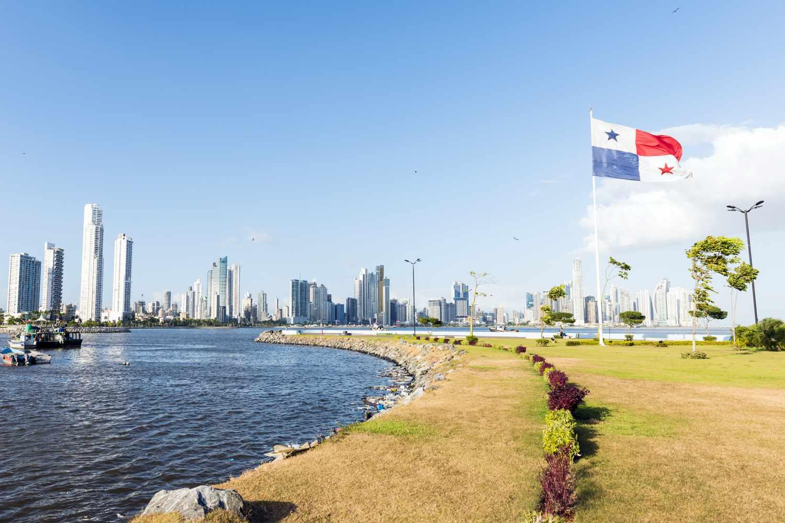

## Table of Contents

## What are the basic types of foreign investment available in Panama?

In Panama, there are mainly two types of foreign investment: direct investment and portfolio investment. Direct investment happens when a foreign company or individual buys or builds a business in Panama. This could be anything from starting a new factory to buying a hotel. The investor has control over the business and aims to make it grow and be profitable.

Portfolio investment is different. It involves buying stocks, bonds, or other financial assets in Panama without taking control of the business. Investors do this to earn money from dividends or interest, or to sell the assets later at a higher price. This type of investment is usually less risky than direct investment but can still be affected by the country's economic conditions.

Both types of investment are important for Panama's economy. They bring in money and help create jobs. The government of Panama encourages foreign investment by offering various incentives and maintaining a stable economic environment.

## How can a foreign investor start a business in Panama?

Starting a business in Panama as a foreign investor is pretty straightforward. First, you need to choose the type of business you want to start. It could be a corporation, a limited liability company, or another type. Once you've decided, you'll need to register your business with the Public Registry of Panama. This involves filling out some forms and paying a fee. You'll also need to get a unique tax ID number from the tax authority, which is called the Dirección General de Ingresos.

After you've registered your business, you'll need to open a bank account in Panama. This is important for managing your business's finances. You might also need to get some permits or licenses, depending on what kind of business you're starting. For example, if you're opening a restaurant, you'll need a health permit. It's a good idea to talk to a local lawyer or a business consultant to make sure you're following all the rules and getting everything you need.

Once your business is set up, you can start operating. You'll need to keep up with your tax obligations and any other legal requirements. Panama offers various incentives for foreign investors, like tax breaks and special economic zones, so it's worth looking into those to see if they can help your business grow. With the right preparation and guidance, starting a business in Panama can be a great opportunity.

## What are the legal requirements for setting up a company in Panama as a foreigner?

To set up a company in Panama as a foreigner, you first need to decide on the type of company you want to create. The most common types are a corporation (Sociedad Anónima or S.A.) or a limited liability company (Sociedad de Responsabilidad Limitada or S.R.L.). Once you've chosen, you need to register your company with the Public Registry of Panama. This involves filling out some forms and paying a fee. You'll also need to get a unique tax ID number from the Dirección General de Ingresos, which is the tax authority in Panama.

After registering your company, you'll need to open a bank account in Panama to manage your business's finances. Depending on the nature of your business, you might also need to obtain specific permits or licenses. For example, if you're starting a restaurant, you'll need a health permit. It's a good idea to consult with a local lawyer or business consultant to ensure you're meeting all the legal requirements and getting the necessary documentation. They can help you navigate the process and make sure you're doing everything correctly.

Once your company is set up, you'll need to comply with ongoing legal and tax obligations. This includes filing annual reports with the Public Registry and paying any required taxes. Panama offers various incentives for foreign investors, such as tax breaks and special economic zones, which can help your business grow. By understanding and following these legal requirements, you can successfully establish and operate your company in Panama.

## What incentives does Panama offer to attract foreign investment?

Panama offers several incentives to attract foreign investors. One big incentive is the Multinational Headquarters (SEM) regime, which gives tax breaks and other benefits to companies that set up their regional headquarters in Panama. This can save companies a lot of money on taxes and make it easier for them to do business in the region. Another incentive is the special economic zones, like the Panama Pacifico Special Economic Area, where companies can enjoy lower taxes and fewer regulations. These zones are designed to make it easier for businesses to operate and grow.

Panama also has a very stable economy and a strong legal system, which makes it a safe place for foreign investors. The government has laws that protect investors and make it easy to move money in and out of the country. There are also special programs for certain industries, like tourism and renewable energy, where companies can get extra benefits like tax holidays and grants. All these incentives make Panama an attractive place for foreign investors looking to start or expand their businesses.

## How does the tax system in Panama affect foreign investments?

The tax system in Panama can affect foreign investments in several ways. One big thing is that Panama has a territorial tax system. This means that only income earned within Panama is taxed. So, if a foreign investor's business makes money outside of Panama, they don't have to pay taxes on that income in Panama. This can be a big advantage for companies that do business in many countries. Also, Panama has special tax incentives for certain industries and regions, like the Multinational Headquarters (SEM) regime and special economic zones. These incentives can lower the taxes a foreign investor has to pay, making it more attractive to invest in Panama.

Another important part of the tax system is the corporate tax rate, which is 25% for companies doing business in Panama. But, because of the territorial system and various incentives, many foreign investors end up paying less than that. For example, companies in special economic zones might pay lower rates or even get tax holidays. This can help businesses save money and grow faster. Overall, Panama's tax system is designed to make it easier and more profitable for foreign investors to set up and run their businesses in the country.

## What are the most common sectors in Panama that attract foreign investment?

The most common sectors in Panama that attract foreign investment are finance, logistics, and tourism. Panama's location makes it a great place for finance and logistics. The Panama Canal is a big reason why many companies want to invest in logistics here. It helps move goods all over the world. The finance sector is also popular because Panama has a strong banking system and offers tax benefits for companies that set up their regional headquarters there.

Tourism is another big sector for foreign investment. Panama has beautiful beaches, mountains, and a rich culture that attract lots of visitors. Investors see opportunities to build hotels, resorts, and other tourist attractions. The government also supports tourism by offering special programs and incentives to help these businesses grow. Overall, these sectors are attractive because they can make good money and benefit from Panama's stable economy and business-friendly environment.

## What are the risks associated with investing in Panama, and how can they be mitigated?

Investing in Panama can come with some risks. One risk is that the economy might change. If the economy gets worse, it could affect your business and make it harder to make money. Another risk is political changes. If the government changes its policies or laws, it could affect your investment. Also, there's always a chance of natural disasters like earthquakes or hurricanes, which could damage your business. Finally, there's the risk of corruption, which could make it harder to do business and might cost you more money.

To lower these risks, you can take some steps. First, do a lot of research about Panama's economy and politics before you invest. This can help you understand what might happen and plan for it. You can also buy insurance to protect your business from natural disasters. It's a good idea to work with a local lawyer or business consultant who knows the area well. They can help you follow the laws and avoid problems with corruption. By being prepared and getting the right help, you can make your investment in Panama safer and more successful.

## How does Panama's political and economic stability influence foreign investment decisions?

Panama's political and economic stability plays a big role in attracting foreign investment. When a country is politically stable, it means the government and its policies are not changing a lot. This makes it easier for investors to plan for the future because they know what to expect. Panama has a strong democracy and a government that supports business. This stability makes investors feel more confident about putting their money into the country. They know that their investments are less likely to be affected by sudden changes in laws or political unrest.

Economically, Panama has been doing well for a long time. The country has a strong economy with low inflation and a growing GDP. This economic stability makes it a safe place to invest. When a country's economy is stable, investors believe they can make money and that their investments will be safe. Panama also has good relationships with other countries, which helps its economy grow even more. This combination of political and economic stability makes Panama an attractive place for foreign investors looking for a reliable and profitable place to invest their money.

## What are the differences between investing in Panama's urban areas versus rural areas?

Investing in Panama's urban areas like Panama City and Colon is different from investing in rural areas. In the cities, you'll find more people, businesses, and infrastructure. This means there are more opportunities to invest in things like real estate, hotels, and big companies. The cities are also where you'll find the financial and logistics sectors, which are big parts of Panama's economy. But, because there are so many people and businesses in the cities, it can be more competitive and expensive to start a business there.

In rural areas, the situation is different. There are fewer people and less infrastructure, which can make it harder to start some types of businesses. But, there are also unique opportunities in rural areas, like investing in agriculture, tourism, or renewable energy. These areas might be less competitive, and the cost of living and doing business can be lower. Plus, the government sometimes offers special incentives to encourage investment in rural areas, which can help offset some of the challenges. So, while urban areas might offer more immediate opportunities, rural areas can be a good choice for investors looking for different kinds of investments with potential long-term growth.

## How can foreign investors benefit from Panama's special economic zones?

Foreign investors can benefit a lot from Panama's special economic zones. These zones are special areas where the government offers lower taxes and fewer rules to make it easier for businesses to grow. For example, in places like the Panama Pacifico Special Economic Area, companies can pay less tax and have more freedom to operate. This can save investors a lot of money and make it simpler to run their business. These zones are also often in good locations, like near the Panama Canal, which can help with logistics and reaching customers in other countries.

Another big benefit is that these zones attract other businesses and create a community of companies working together. This can lead to more opportunities for networking and partnerships. It also means there are more services and resources available to help businesses succeed. By setting up in a special economic zone, foreign investors can take advantage of these benefits and grow their business in a supportive environment.

## What are the advanced strategies for optimizing returns on foreign investments in Panama?

To optimize returns on foreign investments in Panama, investors should focus on diversifying their portfolio across different sectors and regions. Panama's economy is strong in finance, logistics, and tourism, but there are also opportunities in agriculture and renewable energy, especially in rural areas. By spreading investments across these sectors, investors can reduce risk and increase the chances of higher returns. For example, investing in both urban real estate and rural tourism can balance out the potential ups and downs in each market.

Another advanced strategy is to take full advantage of Panama's special economic zones and tax incentives. These zones offer lower taxes and fewer regulations, which can significantly boost profits. Investors should carefully research which zones align best with their business goals and consider setting up operations there. Additionally, understanding and utilizing the Multinational Headquarters (SEM) regime can provide further tax benefits, making it easier to manage regional operations from Panama. By combining these strategies, foreign investors can maximize their returns while minimizing their risks in Panama's dynamic market.

## How does international law impact foreign investment practices in Panama?

International law plays a big role in how foreign investors can invest in Panama. It helps create rules that make it easier and safer for investors from other countries to put their money into Panama. For example, Panama has signed many treaties with other countries that protect investors. These treaties say that if something goes wrong with an investment, the investor can go to an international court to solve the problem. This makes investors feel more confident because they know their investments are protected by international rules.

Another way international law affects foreign investment in Panama is through trade agreements. These agreements help businesses in Panama sell their products to other countries more easily. They also make it easier for foreign investors to bring their products into Panama. By following these international laws and agreements, Panama creates a friendly environment for foreign investors. This can help attract more investment and make it easier for businesses to grow and succeed in Panama.

## References & Further Reading

[1]: ["The Panama Papers: Breaking the Story of How the Rich and Powerful Hide Their Money"](https://www.amazon.com/Panama-Papers-Breaking-Story-Powerful/dp/1786070472) by Bastian Obermayer and Frederik Obermaier

[2]: ["Investment Banking in Panama: A Report on Market Dynamics and Development"](https://www.statista.com/outlook/fmo/corporate-finance/investment-banking/panama) by Research and Markets

[3]: ["Advances in Financial Machine Learning"](https://www.amazon.com/Advances-Financial-Machine-Learning-Marcos/dp/1119482089) by Marcos Lopez de Prado

[4]: ["The World's Emerging Markets: Investment Strategies for New Economies"](https://www.financestrategists.com/wealth-management/investments/emerging-market-investing/) by Thomas M. Lydon and John C. Lydon

[5]: ["Evidence-Based Technical Analysis: Applying the Scientific Method and Statistical Inference to Trading Signals"](https://www.amazon.com/Evidence-Based-Technical-Analysis-Scientific-Statistical/dp/0470008741) by David Aronson

[6]: ["Panama: Economic and Political Conditions and U.S. Relations"](https://archive.securityassistance.org/sites/default/files/RL30981.pdf) by Congressional Research Service

[7]: ["Panama: The Land Bridge Between the Oceans"](https://www.ncesc.com/geographic-faq/what-is-the-panama-land-bridge-connecting-central-america-to-south-america/) by Chandler S. Robbins and Dwight R. Snyder