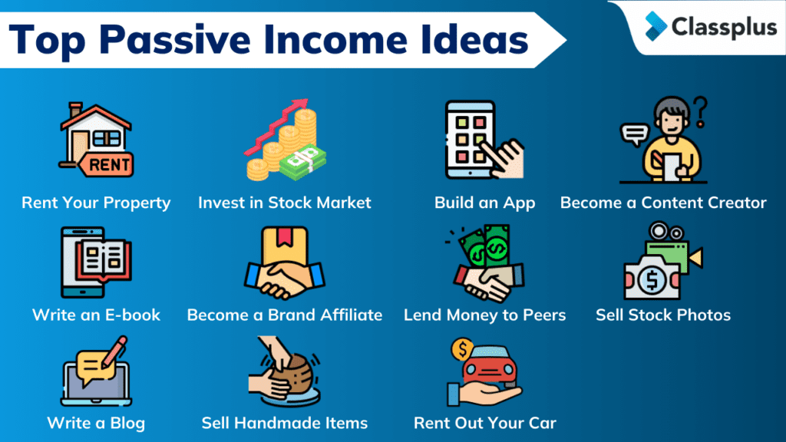

## Table of Contents

## What is passive income and why is it important in 2024?

Passive income is money you earn without having to work actively for it every day. It can come from things like rental properties, stock dividends, or online businesses that run themselves. The idea is that you do some work upfront, and then the income keeps coming in without you needing to do much more. This is different from a regular job where you have to work every day to get paid.

In 2024, passive income is more important than ever because it can help you become financially independent. With the cost of living going up and job security sometimes being uncertain, having another source of income can make a big difference. It can give you the freedom to live life on your own terms, without worrying so much about money. Plus, with technology making it easier to set up passive income streams, more people are finding ways to earn money while they sleep.

## What are the basic differences between passive and active income?

Passive income and active income are two different ways to earn money. Active income is what you get from working a job or doing a task. You have to show up and work every day to earn this kind of money. For example, if you work at a store or as a teacher, you get paid for the hours you work. Active income stops when you stop working.

On the other hand, passive income is money you earn without having to work actively every day. You might do some work at the start, like buying a rental property or setting up an online business, but after that, the money comes in without you needing to do much more. Examples include [earning](/wiki/earning-announcement) rent from a property or getting dividends from stocks. Passive income can keep coming in even when you're not working, which is why many people find it attractive.

## How can someone start generating passive income with minimal initial investment?

One way to start generating passive income with minimal initial investment is by creating digital products. This could be something like an eBook, an online [course](/wiki/best-algorithmic-trading-courses), or even printable art. You can create these products once and then sell them over and over again. Platforms like Etsy, Gumroad, or your own website can help you reach customers. The initial effort goes into making the product, but after that, you can earn money while you sleep as long as people keep buying.

Another option is to start a blog or a YouTube channel. These can generate passive income through ads, affiliate marketing, or sponsored content. You'll need to invest time in creating content that people want to watch or read, but once your content is out there, it can keep earning money. For example, if you write a popular blog post, it can attract visitors and generate ad revenue for years. The key is to focus on topics you're passionate about and that have a good audience.

A third way is to use apps or websites that pay you for small tasks or for sharing your internet bandwidth. Apps like Honeygain or Swagbucks can help you earn a little bit of money by doing things like taking surveys or watching videos. While the income might not be huge, it requires very little initial investment and can add up over time. This can be a good starting point if you're looking to dip your toes into passive income without spending much money upfront.

## What are the most popular passive income streams for beginners?

One of the most popular passive income streams for beginners is creating digital products. This can be as simple as writing an eBook or designing printable art that you can sell online. You make the product once and then people can buy it over and over again. Websites like Etsy, Gumroad, or even your own website can help you sell these products. The great thing about this is that after the initial work of creating the product, you can earn money while you sleep as long as people keep buying.

Another popular way for beginners to start earning passive income is by starting a blog or a YouTube channel. You can make money through ads, affiliate marketing, or sponsored content. It takes time to build an audience, but once you have popular content, it can keep earning money for a long time. For example, a well-written blog post can attract visitors and generate ad revenue for years. The key is to focus on topics you enjoy and that have a good audience.

A third option that many beginners find easy to start with is using apps or websites that pay you for small tasks. Apps like Honeygain or Swagbucks let you earn money by doing things like taking surveys or sharing your internet bandwidth. While the income might not be a lot, it's a good way to start earning passive income without spending much money upfront. This can be a great way to get into the habit of earning passive income and see what works best for you.

## How can real estate investments be used to generate passive income?

Real estate investments can be a great way to generate passive income. One common way is by buying a rental property. You buy a house or an apartment, and then you rent it out to tenants. The rent money you get each month can be more than what you pay for the mortgage and other costs, so you end up making a profit. This profit is your passive income. You do need to take care of the property and deal with tenants, but once everything is set up, the rent keeps coming in without you having to work every day.

Another way to use real estate for passive income is through Real Estate Investment Trusts (REITs). REITs are companies that own and manage properties like shopping centers, apartments, or office buildings. When you buy shares in a REIT, you become a part-owner of these properties. REITs are required by law to pay out most of their income as dividends to shareholders. So, by investing in a REIT, you can earn regular dividend payments without having to manage any properties yourself. This makes it a more hands-off way to earn passive income from real estate.

## What are the risks and rewards associated with dividend stocks for passive income?

Dividend stocks can be a good way to earn passive income because they pay you money just for owning them. When you buy shares in a company that offers dividends, you get a piece of the company's profits regularly, usually every few months. This can add up over time and give you a steady income without having to do much work. Plus, if the company does well, the value of your stocks might go up, which means you could make even more money if you decide to sell them later.

But, there are risks with dividend stocks too. One big risk is that the company might not do as well as expected. If that happens, they might cut or even stop paying dividends. This means your passive income could go down or stop completely. Also, the stock market can be unpredictable, and the value of your stocks can go up and down a lot. If you need to sell your stocks when their value is low, you might lose money. So, while dividend stocks can be a good way to earn passive income, it's important to understand these risks and maybe not put all your money into just one type of investment.

## How can peer-to-peer lending be utilized as a passive income source?

Peer-to-peer lending is a way to earn passive income by lending money to people or small businesses through online platforms. Instead of putting your money in a bank, you lend it directly to borrowers who need it. They pay you back with interest over time, and that interest is your passive income. You don't have to do much work after you've made the loan, but you do need to choose who you lend to carefully because there's a risk they might not pay you back.

The main advantage of peer-to-peer lending is that you can often earn higher interest rates than you would from a regular savings account. This means more money coming in for you without having to work for it. However, there are risks too. If the borrower can't pay back the loan, you might lose some or all of your money. To reduce this risk, many platforms let you spread your money across lots of different loans, so if one borrower doesn't pay, it won't hurt you as much.

## What role does creating digital products play in generating passive income?

Creating digital products can be a great way to make passive income. You can make things like eBooks, online courses, or printable art. Once you make the product, you can sell it over and over again without doing much more work. You can use websites like Etsy or Gumroad to sell your products. The money you earn from people buying your digital products is your passive income. It's like earning money while you sleep because you don't have to keep working on the product after it's made.

The best part about digital products is that they don't cost much to make or sell. You might spend time creating them, but you don't need a lot of money to start. Once your product is ready, you can reach people all over the world through the internet. If your product is good and people like it, they will keep buying it. This means you can keep earning money from the same product for a long time, making it a smart way to build up your passive income.

## How can one use affiliate marketing to build a passive income stream?

Affiliate marketing is a way to earn passive income by promoting other people's products. You can do this by putting special links on your website, blog, or social media. When someone clicks on your link and buys the product, you get a small part of the money they spend. This means you can earn money without having to make or sell your own products. The key is to find products that your audience likes and trusts, so they are more likely to buy them when you recommend them.

To start with affiliate marketing, you need to join an affiliate program. Many companies have these programs, like Amazon or big online stores. Once you're in, you get a special link to share. You can put this link in your blog posts, videos, or social media posts. The more people who click and buy through your link, the more money you can make. It takes some time to build up an audience and get people to trust your recommendations, but once you do, the income can keep coming in without you having to do much more work.

## What advanced strategies exist for scaling passive income through business automation?

One advanced strategy for scaling passive income through business automation is to use software and tools to handle repetitive tasks. For example, if you have an online store, you can use an e-commerce platform that automatically processes orders, manages inventory, and handles customer service through chatbots. This way, you don't have to do these tasks yourself, and your business can keep running smoothly even when you're not actively working on it. Another way is to automate your marketing efforts. You can use email marketing tools to send out newsletters and promotions automatically, which can help bring in more customers without you having to spend time on each email.

Another strategy is to use dropshipping, which is a way to sell products without having to keep them in stock yourself. You set up an online store, and when someone buys something, the order goes directly to the supplier who ships it to the customer. This means you don't have to worry about managing inventory or shipping, which can save a lot of time and effort. You can also use social media automation tools to schedule posts and ads, so your business stays visible to potential customers without you having to manually post every day. By automating these parts of your business, you can focus on growing your passive income streams without getting bogged down in daily tasks.

## How can investing in REITs (Real Estate Investment Trusts) benefit passive income generation?

Investing in REITs (Real Estate Investment Trusts) can help you earn passive income without having to buy and manage properties yourself. REITs are companies that own and operate different kinds of real estate, like shopping centers, apartments, or office buildings. When you buy shares in a REIT, you become a part-owner of these properties. The best part is that by law, REITs have to pay out most of their income to shareholders as dividends. This means you can get regular payments just for owning the shares, which is a great way to earn passive income without much work.

Another benefit of investing in REITs is that it's easier to diversify your investments. Instead of putting all your money into one property, you can spread it across many different types of real estate. This can lower your risk because if one property doesn't do well, you still have others that might be doing better. Plus, you don't need a lot of money to start investing in REITs, unlike buying a whole property on your own. This makes it a more accessible way for many people to start earning passive income from real estate.

## What are the latest trends and technologies in 2024 that can enhance passive income opportunities?

In 2024, one of the biggest trends for boosting passive income is using [artificial intelligence](/wiki/ai-artificial-intelligence) (AI) and automation tools. These technologies can help you set up and run online businesses with less work. For example, AI can help you create content for blogs or social media, which can attract more visitors and help you earn money through ads or affiliate marketing. Automation tools can also handle tasks like sending emails or managing customer service, so your business can keep running even when you're not working on it. This makes it easier to earn passive income because you don't have to spend as much time managing everything.

Another trend is the rise of decentralized finance (DeFi) and blockchain technology. These technologies let you invest in things like cryptocurrencies and earn passive income through staking or lending. Staking means you hold onto some cryptocurrencies and get rewards for helping to keep the network running. Lending on DeFi platforms can also give you high returns, but it comes with more risk. These new technologies open up different ways to earn passive income that weren't available before, but it's important to learn about them and understand the risks before you start investing.

## What are the popular passive income strategies in 2024?

In 2024, individuals are revisiting traditional passive income strategies while exploring new and innovative avenues to diversify and stabilize their financial portfolios. This section highlights popular passive income strategies, emphasizing both time-tested methods and emerging opportunities.

### Traditional Strategies

#### Dividend Stocks
Dividend stocks remain a cornerstone of passive income strategies. Investors purchase stocks from companies that distribute a portion of their earnings as dividends. These stocks can provide regular income and potential growth in stock value. With a carefully selected portfolio, investors can achieve a steady cash flow. The formula for calculating dividend yield is:

$$
\text{Dividend Yield} = \left( \frac{\text{Annual Dividends Per Share}}{\text{Price Per Share}} \right) \times 100
$$

#### Real Estate
Owning property for rental income is another enduring strategy. Real estate offers potential appreciation in property value, alongside rental income, and can act as a hedge against inflation. Although real estate requires more active management than other passive income streams, real estate investment trusts (REITs) enable investors to participate without directly managing properties.

### Emerging Strategies

#### Peer-to-Peer Lending
Peer-to-peer (P2P) lending platforms allow individuals to lend money directly to borrowers, bypassing traditional banks. Investors receive interest payments, potentially offering higher returns than traditional savings accounts or fixed-income securities. P2P lending appeals to those seeking a more personal involvement in their investment process and is made possible by the technology-driven financial landscape.

#### Digital Product Sales
The rise of digital platforms allows creators to sell e-[books](/wiki/algo-trading-books), online courses, music, and software. Unlike physical goods, digital products have low production costs and can be sold repeatedly without inventory constraints. This strategy is particularly appealing to individuals with expertise or creative content, leveraging global reach through online marketplaces.

### Alternative Investments

#### Real Estate Investment Trusts (REITs)
REITs provide a way to invest in real estate without direct property management responsibilities. They offer regular income through dividends and potential capital gains. In 2024, REITs are gaining traction because they combine the ownership advantages of real estate with the [liquidity](/wiki/liquidity-risk-premium) similar to stocks.

#### Real Estate Crowdfunding
This method enables collective investment in real estate projects through online platforms. Investors pool funds to finance large projects, gaining real estate exposure with relatively small investments. Crowdfunding democratizes real estate investment, making it accessible to a broader audience.

In summary, integrating tried-and-true strategies like dividend stocks and real estate with innovative financial solutions such as P2P lending and digital products can help construct a robust passive income portfolio in 2024. With the investment landscape evolving rapidly, diversification and a blend of both traditional and emerging strategies are crucial for achieving financial stability and growth.

## References & Further Reading

[1]: Bergstra, J., Bardenet, R., Bengio, Y., & Kégl, B. (2011). ["Algorithms for Hyper-Parameter Optimization."](https://papers.nips.cc/paper/4443-algorithms-for-hyper-parameter-optimization) Advances in Neural Information Processing Systems 24.

[2]: ["Advances in Financial Machine Learning"](https://www.amazon.com/Advances-Financial-Machine-Learning-Marcos/dp/1119482089) by Marcos Lopez de Prado

[3]: ["Evidence-Based Technical Analysis: Applying the Scientific Method and Statistical Inference to Trading Signals"](https://www.amazon.com/Evidence-Based-Technical-Analysis-Scientific-Statistical/dp/0470008741) by David Aronson

[4]: ["Machine Learning for Algorithmic Trading"](https://github.com/stefan-jansen/machine-learning-for-trading) by Stefan Jansen

[5]: ["Quantitative Trading: How to Build Your Own Algorithmic Trading Business"](https://www.amazon.com/Quantitative-Trading-Build-Algorithmic-Business/dp/1119800064) by Ernest P. Chan