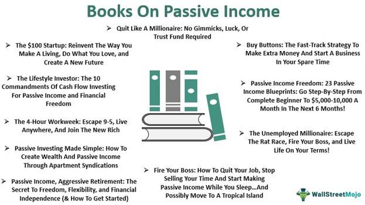

In 2024, developing multiple income strategies has become more crucial than ever, as economic uncertainties continue to shape global markets. Creating robust financial plans is essential for individuals seeking stability and growth. One effective approach to achieving this is through passive income streams, which offer a reliable source of earnings with minimal active involvement. These income streams not only provide financial stability but also serve as a foundation for long-term wealth accumulation.

An increasingly significant factor in this landscape is algorithmic trading, a technology-driven strategy that leverages computer algorithms to execute trades based on predefined criteria. Algorithmic trading is dramatically reshaping how individuals and institutions generate returns in financial markets by enhancing efficiency and removing emotional biases from trading decisions.



This article focuses on financial tips for building passive income and the transformative role of algorithmic trading. By exploring these strategies, readers can gain insights into how to enhance their income potential and adapt to modern financial trends, securing a stable economic future.

## Table of Contents

## Understanding Passive Income: Definition and Benefits

Passive income is defined as revenue generated with minimal active involvement from the investor. This income stream can come from various sources, including rental properties, dividends, and interest from savings or bonds. The real appeal of passive income lies in its ability to provide financial stability without the requirement of consistent active effort, making it a cornerstone for those seeking financial independence.

In today's uncertain economic climate, the stability that passive income offers is invaluable. It acts as a financial cushion, protecting against job loss or economic downturns. With the global economy facing unpredictable shifts, having a reliable income stream that is not directly tied to active work can offer much-needed peace of mind. For example, a rental property can generate consistent monthly payments, cushioning the blow of potential financial crises.

The benefits of passive income are manifold. One of the primary advantages is the reduced effort required to maintain these income streams once they are established. While an initial investment of time and resources is often necessary, passive income can eventually yield returns with minimal ongoing effort. This contrasts with active income, where continuous work is essential for ongoing earnings.

Another significant benefit is the steady cash flow it provides. Steady cash flow can help individuals budget more effectively, plan for the future, and allocate resources toward savings or additional investments. Whether derived from dividends, real estate, or interest from bonds, consistent income helps in maintaining and improving one's standard of living without constant hands-on management.

In conclusion, passive income serves as a financial backstop, offering stability and continuity in economically tumultuous times. Its benefits, such as requiring reduced effort and providing steady cash flow, make it an attractive option for individuals aiming to secure financial growth while minimizing active engagement in managing these income streams.

## Popular Passive Income Strategies in 2024

In 2024, individuals are revisiting traditional passive income strategies while exploring new and innovative avenues to diversify and stabilize their financial portfolios. This section highlights popular passive income strategies, emphasizing both time-tested methods and emerging opportunities.

### Traditional Strategies

#### Dividend Stocks
Dividend stocks remain a cornerstone of passive income strategies. Investors purchase stocks from companies that distribute a portion of their earnings as dividends. These stocks can provide regular income and potential growth in stock value. With a carefully selected portfolio, investors can achieve a steady cash flow. The formula for calculating dividend yield is:

$$
\text{Dividend Yield} = \left( \frac{\text{Annual Dividends Per Share}}{\text{Price Per Share}} \right) \times 100
$$

#### Real Estate
Owning property for rental income is another enduring strategy. Real estate offers potential appreciation in property value, alongside rental income, and can act as a hedge against inflation. Although real estate requires more active management than other passive income streams, real estate investment trusts (REITs) enable investors to participate without directly managing properties.

### Emerging Strategies

#### Peer-to-Peer Lending
Peer-to-peer (P2P) lending platforms allow individuals to lend money directly to borrowers, bypassing traditional banks. Investors receive interest payments, potentially offering higher returns than traditional savings accounts or fixed-income securities. P2P lending appeals to those seeking a more personal involvement in their investment process and is made possible by the technology-driven financial landscape.

#### Digital Product Sales
The rise of digital platforms allows creators to sell e-[books](/wiki/algo-trading-books), online courses, music, and software. Unlike physical goods, digital products have low production costs and can be sold repeatedly without inventory constraints. This strategy is particularly appealing to individuals with expertise or creative content, leveraging global reach through online marketplaces.

### Alternative Investments

#### Real Estate Investment Trusts (REITs)
REITs provide a way to invest in real estate without direct property management responsibilities. They offer regular income through dividends and potential capital gains. In 2024, REITs are gaining traction because they combine the ownership advantages of real estate with the [liquidity](/wiki/liquidity-risk-premium) similar to stocks.

#### Real Estate Crowdfunding
This method enables collective investment in real estate projects through online platforms. Investors pool funds to finance large projects, gaining real estate exposure with relatively small investments. Crowdfunding democratizes real estate investment, making it accessible to a broader audience.

In summary, integrating tried-and-true strategies like dividend stocks and real estate with innovative financial solutions such as P2P lending and digital products can help construct a robust passive income portfolio in 2024. With the investment landscape evolving rapidly, diversification and a blend of both traditional and emerging strategies are crucial for achieving financial stability and growth.

## Algorithmic Trading: The Future of Investing

Algorithmic trading, often referred to as algo trading, involves the use of computer programs to automate financial trading decisions. These programs execute orders based on pre-defined criteria, allowing for trades to be initiated without the need for human intervention. In modern finance, [algorithmic trading](/wiki/algorithmic-trading) is significant due to its ability to enhance trading efficiency, reduce transaction costs, and process data at unparalleled speeds, greatly improving decision-making processes.

One of the primary advantages of algorithmic trading is its capacity to remove emotional biases from trade decisions. Human traders are often subject to emotions such as fear and greed, which can cloud judgment and lead to irrational decision-making. Algorithms, on the other hand, operate purely on logic and predefined sets of rules, ensuring that trades are executed based on objective data rather than subjective feelings. This reduction in emotional bias results in more consistent trading performance.

The mechanics of algorithmic trading platforms involve several key components. At its core, an algorithmic trading system requires a robust trading strategy, which is essentially a set of rules that define entry and [exit](/wiki/exit-strategy) points for trades. These strategies often utilize historical data to determine patterns or indicators—such as moving averages, [momentum](/wiki/momentum) indicators, or other technical analysis tools—that are predictive of future price movements.

```python
# Example of a simple moving average crossover strategy in Python

def moving_average(prices, window):
    return sum(prices[-window:]) / window

def should_buy(short_term_avg, long_term_avg):
    return short_term_avg > long_term_avg

def should_sell(short_term_avg, long_term_avg):
    return short_term_avg < long_term_avg

# Sample price data
prices = [120, 121, 123, 125, 124, 126, 127, 125, 126, 128]

# Calculate moving averages
short_term_avg = moving_average(prices, 3)
long_term_avg = moving_average(prices, 5)

# Determine buy/sell signals
buy_signal = should_buy(short_term_avg, long_term_avg)
sell_signal = should_sell(short_term_avg, long_term_avg)

print("Buy Signal: ", buy_signal)
print("Sell Signal: ", sell_signal)
```

The execution of trades is another crucial aspect. Algorithmic trading platforms are designed to communicate seamlessly with financial exchanges, enabling orders to be placed and executed at optimal speeds. These platforms often feature risk management tools, such as stop-loss limits or trailing stops, which help manage trade risk automatically.

Trading algorithms are also equipped with back-testing capabilities. Back-testing allows traders to simulate a strategy using historical data to evaluate its effectiveness before deploying it in a live market. This process aids in refining strategies, ensuring robustness and viability under varying market conditions.

In addition to technical analysis, algorithmic trading often incorporates quantitative analysis, utilizing mathematical models and statistical techniques to identify potential trading opportunities. For instance, [machine learning](/wiki/machine-learning) algorithms may be employed to detect patterns that are not immediately obvious to human traders. By continuously evolving and adapting, these algorithms can improve their predictive power over time.

In conclusion, algorithmic trading represents a pivotal innovation in the financial trading landscape, providing numerous advantages over traditional trading methods. By eliminating emotional biases, enabling rapid data processing, and leveraging advanced analytical tools, it empowers traders to achieve more disciplined and strategic investment outcomes.

## Integrating Algo Trading with Traditional Strategies

Algorithmic trading, leveraging complex algorithms and computational power, is revolutionizing how investors manage their portfolios by enhancing traditional investment strategies. By integrating algorithmic trading with more conventional methods, investors can optimize their passive income streams, manage risk more effectively, and potentially increase their returns.

Algorithmic trading involves using pre-programmed codes to execute trades based on set criteria like timing, price, or market conditions. This methodology is highly beneficial in enhancing passive income strategies such as dividend investing. For example, algorithms can continuously scan the market for dividend-paying stocks that meet specific financial metrics, thus automating and optimizing the portfolio-building process.

Synergies between algorithmic trading and traditional investments emerge primarily through automation and data-driven decision-making. Consider a traditional investment strategy, such as buying and holding blue-chip stocks for dividend yield. An algorithm can be programmed to analyze financial statements, stock performance, and industry trends. It can then make buy or sell decisions based on data inputs, minimizing human error and emotional biases—a common pitfall in traditional investing.

One notable case study exemplifying the successful integration of algorithmic trading and traditional strategies is QuantConnect, an algorithmic trading platform that allows users to create and backtest trading strategies across various asset classes. Several investors have used QuantConnect to integrate dividend stock strategies with algorithmic trading, resulting in better timing of stock purchases and more optimized returns. By using algorithms to predict market dips, these investors can buy stocks at reduced prices, thereby increasing their dividend yield over time.

Another example is the Woodford Fund, which employed quantitative strategies alongside its traditional equity investments to manage risk and optimize returns. By using computational algorithms, the fund could quickly adjust its positions based on market dynamics, maintaining a balanced portfolio that benefited from both long-held traditional investments and responsive algorithmic trades.

To implement algorithmic trading effectively with traditional strategies, investors should select platforms that offer robust algorithm-building tools, comprehensive data feeds, and [backtesting](/wiki/backtesting) capabilities. This integration necessitates a thoughtful approach, requiring investors to critically assess their financial goals, risk tolerance, and the complexity they are ready to manage within an algorithmic framework.

In conclusion, combining algorithmic trading with traditional investment strategies can significantly enhance passive income potential. By leveraging technology and data, investors can streamline their decision-making processes, optimize their portfolios, and reduce the emotional bias in trading, all leading to more effective investment strategies in 2024 and beyond.

## Choosing the Right Platforms for Investing

When selecting investment platforms in 2024, it's essential to consider both traditional and emerging technologies. This section reviews top online brokers for Exchange-Traded Funds (ETFs) and bonds, evaluates robo-advisors and automated trading tools, and offers tips for platform selection based on fees, features, and ease of use.

**Top Online Brokers for ETFs and Bonds in 2024**

Investors seeking to diversify their portfolios with ETFs and bonds should prioritize platforms that offer robust market access, low fees, and reliable tools. Notable brokers like Charles Schwab, Vanguard, and Fidelity continue to lead due to their comprehensive offerings of ETFs and fixed-income products. These platforms provide extensive research resources, user-friendly interfaces, and competitive trading fees. In 2024, interactive brokers like eToro and Robinhood also gained popularity, particularly among younger investors, due to their low-cost structures and socially engaging features.

**Evaluating Robo-Advisors and Automated Trading Tools**

Robo-advisors have revolutionized portfolio management by offering algorithm-driven investment solutions. They provide personalized investment strategies based on user-specific goals and risk tolerance. Leading robo-advisors, such as Betterment, Wealthfront, and E*TRADE, stand out for their sophisticated use of technology, tailored financial advice, and low management fees. Automated trading tools, including TradeStation and MetaTrader, are also significant, providing algorithmic trading capabilities. These platforms allow users to implement complex trading strategies without manual intervention and are ideal for investors comfortable with technology and algorithmic interfaces.

**Tips for Selecting a Platform**

1. **Fee Structure**: With the variety of platforms available, pay attention to the fee structures, including trading commissions, account maintenance fees, and expense ratios for ETFs. Platforms with transparent and low fees, like Vanguard, allow investors to maximize returns.

2. **Features**: Consider the range of features offered, including research tools, educational resources, and portfolio management services. Advanced charting capabilities, stock screening tools, and access to financial markets are vital for making informed decisions.

3. **Ease of Use**: User-friendly interfaces and seamless navigation are crucial, especially for beginners. Platforms with intuitive layouts and accessible customer support systems enhance the overall user experience, making it easier to manage investments effectively.

4. **Security**: Ensure the platform employs robust security measures, such as two-factor authentication and encryption, to protect your financial information.

Selecting the right platform is a critical step in establishing a successful investment strategy. By assessing fees, features, ease of use, and security, investors can identify platforms that align with their financial objectives and enhance their investment experience in 2024.

## Risks and Considerations in Passive Income and Algo Trading

Passive income streams offer significant benefits, but they are not without risks. One primary concern is liquidity, which refers to the ability to quickly convert investments into cash without significant loss in value. Assets like real estate and certain alternative investments, such as peer-to-peer loans or real estate crowdfunding, may suffer from illiquidity, making it challenging to access funds when needed. Investors must consider their liquidity needs and ensure they maintain a balanced portfolio to avoid potential cash flow issues.

Algorithmic trading, while innovative, also presents unique challenges. Market risks, such as price [volatility](/wiki/volatility-trading-strategies) and sudden market shifts, can significantly impact performance. Algorithmic systems, although designed to minimize emotional bias, can occasionally execute unintended trades due to programming errors or market anomalies. Moreover, the speed and [volume](/wiki/volume-trading-strategy) of trading can sometimes amplify these risks, leading to substantial losses.

To mitigate these risks, diversification remains a critical strategy. A well-diversified portfolio, encompassing various asset classes and investment vehicles, can help cushion the impact of adverse market conditions. Regular monitoring and adjustments based on market conditions can further enhance stability. Implementing risk management strategies, such as stop-loss orders, can also limit potential losses.

For algorithmic trading specifically, rigorous backtesting and continuous performance evaluation are crucial. Developers should ensure algorithms are robust under various market scenarios and keep them updated to adapt to evolving market conditions. Additionally, setting appropriate risk parameters and continuously reviewing these settings can help maintain an optimal balance between risk and reward.

By carefully considering these risks and employing effective mitigation strategies, investors can optimize their passive income streams and algorithmic trading endeavors, aligning them with their long-term financial goals.

## Conclusion

In 2024, building a robust passive income strategy and integrating algorithmic trading are pivotal for financial success. Strategies such as dividend stocks, real estate investments, peer-to-peer lending, and algorithmic trading significantly contribute to creating a reliable income stream with minimal active effort. Algorithmic trading offers the distinct advantage of eliminating emotional biases, allowing for consistent and calculated investment decisions.

As individuals consider incorporating these strategies, it is vital that they assess their financial goals and risk tolerance. Determining these factors will aid in selecting appropriate investment vehicles and trading platforms. Given the dynamic nature of financial markets, embracing a mindset geared towards continuous learning and adaptation is critical. New financial technologies are continually emerging, presenting both opportunities and challenges for passive income generation.

Staying informed about market developments and technological advancements can empower individuals to optimize their investment strategies effectively. As 2024 progresses, the integration of traditional passive income strategies with cutting-edge tools like algorithmic trading will likely become a cornerstone for achieving financial stability and growth.

## References & Further Reading

[1]: Bergstra, J., Bardenet, R., Bengio, Y., & Kégl, B. (2011). ["Algorithms for Hyper-Parameter Optimization."](https://papers.nips.cc/paper/4443-algorithms-for-hyper-parameter-optimization) Advances in Neural Information Processing Systems 24.

[2]: ["Advances in Financial Machine Learning"](https://www.amazon.com/Advances-Financial-Machine-Learning-Marcos/dp/1119482089) by Marcos Lopez de Prado

[3]: ["Evidence-Based Technical Analysis: Applying the Scientific Method and Statistical Inference to Trading Signals"](https://www.amazon.com/Evidence-Based-Technical-Analysis-Scientific-Statistical/dp/0470008741) by David Aronson

[4]: ["Machine Learning for Algorithmic Trading"](https://github.com/stefan-jansen/machine-learning-for-trading) by Stefan Jansen

[5]: ["Quantitative Trading: How to Build Your Own Algorithmic Trading Business"](https://www.amazon.com/Quantitative-Trading-Build-Algorithmic-Business/dp/1119800064) by Ernest P. Chan