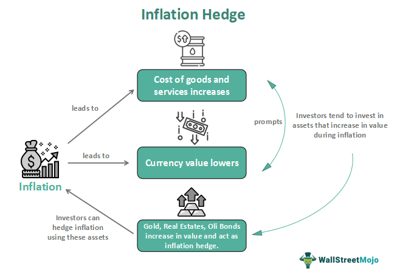

## Table of Contents

## What is inflation and why should individuals and businesses hedge against it?

Inflation is when the prices of things we buy, like food and clothes, go up over time. It means that the money we have can buy less stuff than before. Imagine if a candy bar cost $1 last year, but this year it costs $1.10. That's inflation. It happens because the amount of money in the economy grows faster than the goods and services available.

Individuals and businesses should hedge against inflation to protect their money's value. If inflation is high, the money they save will be worth less in the future. For example, if you save $100 and inflation is 5%, in a year, that $100 will only buy what $95 could buy now. To hedge against this, people might invest in things like real estate or stocks, which often increase in value faster than inflation. Businesses might raise prices or invest in new projects to keep their profits growing despite rising costs.

## What are the basic principles of hedging?

Hedging is like getting an insurance policy for your money. It's a way to protect yourself from big losses if things don't go as planned. Imagine you're a farmer and you grow corn. The price of corn can go up and down a lot. To hedge, you might agree to sell your corn at a certain price before you even harvest it. This way, even if the price of corn drops, you know you'll get that agreed price and won't lose as much money.

The main idea of hedging is to reduce risk. You do this by making a deal that will help balance out any losses you might have from other investments or activities. For example, if you own a lot of stocks and you're worried the stock market might go down, you could buy something called a "put option." This gives you the right to sell your stocks at a set price, even if the market price drops lower. By doing this, you limit how much money you could lose if the stock market falls.

## How can investing in real estate help hedge against inflation?

Investing in real estate can help protect your money from inflation because the value of property and rent often goes up when prices in general go up. Imagine you own a house and you rent it out. If inflation makes everything more expensive, you can usually raise the rent to match those higher costs. This means the money you get from rent keeps up with, or even grows faster than, inflation.

Also, over time, the price of the house itself usually goes up. This is called appreciation. If inflation is making everything else more expensive, the value of your house might go up too. When you decide to sell the house, you could get more money for it than you paid, which helps your money keep its value even when prices are rising everywhere else.

## What role do commodities like gold and silver play in inflation hedging?

Commodities like gold and silver can be good for protecting your money from inflation. When prices go up, the value of gold and silver often goes up too. People see them as a safe place to put their money when things are uncertain. If you buy gold or silver, and their prices rise with inflation, your money keeps its value better than if you just kept it in cash.

These metals are also easy to buy and sell all over the world. This means you can turn them into cash when you need to. During times when the money in your pocket is worth less because of inflation, having gold or silver can help you feel more secure. It's like having a backup plan to keep your money safe.

## Can Treasury Inflation-Protected Securities (TIPS) be an effective hedge against inflation?

Treasury Inflation-Protected Securities, or TIPS, are a type of bond from the U.S. government that can help protect your money from inflation. When you buy TIPS, the bond's value goes up along with inflation. This means if prices are rising, the amount of money you get back when the bond matures will be worth more. It's like your bond grows with inflation, so your money keeps its value over time.

TIPS can be a good choice if you want a safe and steady way to hedge against inflation. They are backed by the U.S. government, which makes them very secure. Unlike stocks or real estate, TIPS don't go up and down a lot in value, so they can help you feel more certain about your money's future. While they might not make you rich quickly, they can help make sure your savings don't lose value as prices rise.

## How do stocks and equity investments perform during inflationary periods?

Stocks and equity investments can be a bit tricky during times of inflation. When prices go up, companies might have to pay more for things they need to make their products. This can hurt their profits if they can't raise their prices enough to cover the extra costs. But, some companies can do well during inflation. If they can raise their prices without losing customers, their profits might actually grow. This can make their stock prices go up too.

Investors often look at which kinds of companies might do better during inflation. For example, companies that provide things people always need, like food or energy, might be safer bets. These companies can usually pass on higher costs to their customers. On the other hand, stocks in general might not always be the best hedge against inflation because they can be risky and their prices can go up and down a lot. But if you pick the right stocks, they can help your money grow even when prices are rising.

## What are the benefits and risks of using foreign currency as an inflation hedge?

Using foreign currency as an inflation hedge can be helpful if the currency of another country is getting stronger while your own country's currency is losing value because of inflation. If you exchange your money into a currency that's doing well, like the Swiss Franc or the Euro, and your home currency is weakening, you might end up with more money when you convert it back. This can be a good way to protect your money if inflation is making things more expensive at home.

But, using foreign currency to hedge against inflation also has risks. Currencies can change a lot in value, and it's hard to predict what will happen. If the foreign currency you choose ends up losing value compared to your home currency, you could lose money instead of protecting it. Also, you need to think about things like exchange fees and how easy it is to buy and sell the foreign currency. So, while it can be a good way to hedge against inflation, it's important to be careful and understand the risks involved.

## How can diversifying a portfolio help in managing inflation risk?

Diversifying a portfolio means spreading your money across different types of investments. This can help you manage the risk of inflation because not all investments react to inflation the same way. If you put all your money in one thing, like cash, it might lose value quickly if inflation goes up. But if you also invest in things like stocks, real estate, commodities, and bonds, some of these might do better during inflation and help balance out any losses from the others.

For example, if inflation makes the prices of goods go up, companies might be able to raise their prices and make more profit, which could make their stocks go up in value. At the same time, real estate might also go up in value, and commodities like gold could be a safe place to keep your money. By having a mix of these investments, you're not relying on just one thing to protect your money. This way, even if one part of your portfolio doesn't do well, other parts might help keep your overall money safe from inflation.

## What advanced financial instruments like futures and options can be used for inflation hedging?

Futures and options are advanced financial tools that can help protect your money from inflation. Futures are contracts where you agree to buy or sell something at a set price on a future date. For example, if you think inflation will make wheat more expensive, you can buy a wheat futures contract now at today's price. If the price of wheat goes up because of inflation, you can still buy it at the lower price you agreed on. This way, you're protected from the higher costs that come with inflation.

Options give you the right, but not the obligation, to buy or sell something at a set price before a certain date. They can be a bit more flexible than futures. For example, you can buy an option to buy gold at a set price. If inflation makes gold prices go up, you can use your option to buy gold at the lower price you set. But if gold prices don't go up, you can just let the option expire without using it, and you only lose the small fee you paid for the option. Both futures and options can be tricky to use, but they can be powerful tools to help you manage the risks of inflation.

## How do inflation swaps work and when might they be appropriate for hedging?

Inflation swaps are a way for two people or companies to make a deal about inflation. One side agrees to pay a fixed rate, like a set amount of money, and the other side agrees to pay based on how much inflation goes up. It's like betting on whether inflation will be high or low. If inflation goes up a lot, the person paying the fixed rate gets more money from the other side. If inflation stays low, the person paying based on inflation pays less.

Inflation swaps can be a good choice for hedging if you want to protect your money from inflation without buying things like gold or real estate. They are often used by big companies or investors who need to plan for the future and want to make sure inflation doesn't hurt their money. For example, a company might use an inflation swap to make sure their costs don't go up too much if inflation rises. But, inflation swaps can be complicated and are usually used by people who know a lot about finance.

## What are the tax implications of different inflation hedging strategies?

When you use different ways to protect your money from inflation, like investing in real estate, stocks, or gold, you need to think about how taxes might affect your plans. If you make money from selling a house or stocks, you might have to pay capital gains tax. This tax can be different depending on how long you owned the investment. For example, if you sell a house you've lived in for a long time, you might not have to pay as much tax as if you sold it quickly. With gold, if you sell it for more than you paid, you'll also have to pay capital gains tax. But if you hold onto it for more than a year, the tax rate might be lower.

Another thing to think about is how taxes work with things like Treasury Inflation-Protected Securities (TIPS) and inflation swaps. With TIPS, the interest you earn is usually taxed as regular income, even though the bond's value goes up with inflation. This means you might have to pay taxes on the increase in value each year, not just when you sell the bond. Inflation swaps can be more complicated because they are often used by big companies or investors. The tax rules for swaps can depend on how the swap is set up and what kind of income it generates. It's a good idea to talk to a tax expert to understand how these strategies might affect your taxes.

## How can one evaluate the effectiveness of their inflation hedging strategy over time?

To evaluate how well your inflation hedging strategy is working over time, you need to keep an eye on how your investments are doing compared to inflation. One way to do this is by looking at the inflation rate, which tells you how much prices are going up. If your investments are growing faster than the inflation rate, your strategy is working well. For example, if inflation is at 3% and your investments are growing at 5%, you're beating inflation. You can also compare your investments to something like the Consumer Price Index (CPI), which measures the average change in prices over time. If your investments are keeping up or doing better than the CPI, that's a good sign.

Another important thing to look at is how your strategy is balancing risk and reward. Some investments, like stocks, can go up and down a lot, while others, like TIPS, are more stable but might not grow as quickly. You want to see if your mix of investments is helping you avoid big losses while still growing your money. Over time, you might need to adjust your strategy if one part isn't working as well as you hoped. For example, if your stocks aren't beating inflation, you might decide to put more money into real estate or commodities. By regularly checking how your investments are doing and comparing them to inflation, you can make sure your strategy is keeping your money safe and growing.

## What is the understanding of inflation and its impact?

Inflation represents the rate at which the general level of prices for goods and services rises, leading to a decrease in purchasing power. It is typically expressed as an annual percentage. Central banks attempt to limit inflation, aiming to keep the excessive growth of prices in check. Inflation naturally occurs within an economy due to several factors, including demand-pull dynamics, cost-push pressures, and built-in wage expectations.

In a demand-pull scenario, inflation happens when the demand for goods and services exceeds their supply. On the other hand, cost-push inflation arises from an increase in the cost of production. These costs could be due to rising wages or increases in the prices of raw materials. Moreover, inflation can become entrenched in an economic cycle when businesses and labor anticipate continuing price rises and adjust their pricing and wage demands accordingly, a process often referred to as built-in inflation.

One of the most direct impacts of inflation is its erosion of currency value, which effectively decreases the amount of goods or services one can purchase with a unit of currency. For example, if the inflation rate is 2%, something that costs $100 this year will typically cost $102 next year, assuming the item is subject to average inflation trends. Over extended periods, even low rates of inflation can significantly diminish purchasing power, as represented by the formula for future value considering inflation:

\[FV = PV \times (1 + i)^n\]

where $FV$ is the future value, $PV$ is the present value, $i$ is the inflation rate, and $n$ is the number of years.

Inflation not only affects consumers but also influences investment returns. When inflation rises, it reduces the real rate of return on investments. The real rate of return is calculated by subtracting the inflation rate from the nominal return on investment:

$$
\text{Real Return} = \text{Nominal Return} - \text{Inflation Rate}\]

For investors, achieving a nominal return on investment isn't sufficient if inflation erodes most of those gains. Preserving financial health, therefore, necessitates hedging against inflation, ensuring that investment returns outpace inflation rates. Without effective hedging strategies, the real value of invested capital can shrink, thus eroding wealth over time.

Hedging against inflation involves strategically choosing assets or financial instruments that historically perform well during inflationary periods. This includes real assets like real estate, commodities, or stocks, which can potentially provide returns that outpace inflation. Additionally, products like Treasury Inflation-Protected Securities (TIPS) are specifically designed to shield against inflation.

The necessity of hedging is underscored by its ability to provide financial cushioning in inflationary times, thereby ensuring that the purchasing power and real value of investments do not diminish. As inflation poses a risk that can impact one's financial portfolio severely, being proactive in implementing strategies to counteract these effects is indispensable for financial stability and growth.

## What are Traditional Hedging Strategies Against Inflation?

Traditional hedging strategies against inflation have long been employed to preserve the real value of assets as inflation erodes purchasing power. Various asset classes, like stocks, real estate, and commodities, traditionally perform well in inflationary environments. 

**Stocks**: Equities have the potential to maintain or increase their value during inflation because companies can often pass increased costs onto consumers by raising prices. This ability to adjust to inflation is particularly true for firms in industries that sell essential goods and services. Historical data suggest that stock markets tend to offer returns that outpace inflation over the long term, though market volatility can pose risks.

**Real Estate**: Real estate is another asset class that often fares well during inflationary periods. Property values and rental incomes tend to increase with inflation, as the cost of living and property replacement also rise. This ability to provide a steady income stream while maintaining its value makes real estate an attractive hedge against inflation. Investors may choose direct ownership of properties or indirect investment via Real Estate Investment Trusts (REITs).

**Commodities**: Commodities, such as gold, oil, and agricultural products, typically rise in value with inflation. Commodities are tangible assets whose intrinsic value is usually resistant to currency devaluation. For instance, gold has historically been considered a 'safe haven' during times of inflation, because it retains purchasing power over long periods, unlike fiat currencies.

**Treasury Inflation-Protected Securities (TIPS)**: TIPS are U.S. government bonds explicitly designed to offer protection against inflation. The principal of TIPS increases with inflation, as measured by the Consumer Price Index (CPI), ensuring that both the principal amount and the interest payments increase with inflation. This makes TIPS an essential component for those seeking a low-risk hedge against rising price levels. For instance, if $P_t$ is the principal amount adjusted at time $t$, and $c_t$ is the CPI at time $t$, then:

$$

P_t = P_0 \times \frac{c_t}{c_0}
$$

where $P_0$ is the original principal, and $c_0$ is the initial CPI.

**Diversification in International Portfolios**: Diversifying investment portfolios internationally can mitigate domestic inflation risks. By holding assets in multiple countries, investors can reduce the impact of inflation in any single economy. Foreign markets may have different inflation trajectories and economic conditions, providing broader exposure and risk balance. The correlation between domestic and foreign assets often varies, which helps in cushioning the portfolio against localized inflationary pressures.

This combination of asset classes and strategies provides a foundational approach to inflation hedging. However, each comes with its considerations and risks, requiring careful planning and management. Embracing a diversified approach can effectively protect against the erosion of purchasing power in times of rising prices.

## How can we develop algorithmic inflation hedging strategies?

The development of algorithmic inflation hedging strategies begins with the critical task of data collection and analysis, a foundational step that informs the predictive models used in these strategies. To effectively hedge against inflation, it is essential to gather comprehensive data on relevant economic indicators, such as the Consumer Price Index (CPI), Producer Price Index (PPI), employment data, and commodity prices. These indicators provide insights into current inflation trends and help predict future movements. 

Algorithmic models employ various statistical and [machine learning](/wiki/machine-learning) techniques to process and analyze these vast datasets. Time-series analysis is particularly useful in understanding historical trends and making future predictions by evaluating patterns and correlations among different indicators. Techniques such as autoregressive integrated moving average (ARIMA) models, vector autoregressions (VAR), and machine learning models like support vector machines (SVM) and neural networks can be applied. The formula for an ARIMA model, commonly used for time series forecasting, is:

$$
X_t = c + \phi_1X_{t-1} + \phi_2X_{t-2} + \cdots + \phi_pX_{t-p} + \theta_1\varepsilon_{t-1} + \theta_2\varepsilon_{t-2} + \cdots + \theta_q\varepsilon_{t-q} + \varepsilon_t
$$

where $X_t$ is the time series, $c$ is a constant, $\phi$ represents the autoregressive parameters, $\theta$ are the moving average parameters, and $\varepsilon$ is the error term.

Once relevant data is collected and analyzed, designing and [backtesting](/wiki/backtesting) predictive models is crucial to ensure that the resulting trading strategies are well-suited for inflationary environments. Backtesting involves running the algorithm against historical data to evaluate how it would have performed in past market conditions. This stage helps refine the model by identifying strengths and weaknesses, thereby allowing adjustments to enhance performance. Metrics such as the Sharpe ratio, maximum drawdown, and alpha are typically used to evaluate model effectiveness.

The implementation of algorithmic strategies for inflation hedging is greatly facilitated by various platforms and tools available to market participants. Popular programming languages like Python offer libraries and frameworks such as Pandas, NumPy, scikit-learn, and TensorFlow, which are essential for the development and execution of algorithmic strategies. Python's versatility and extensive library support make it a preferred choice for many quantitative researchers.

An example Python implementation for loading and analyzing CPI data might involve using the Pandas library to process and visualize data:

```python
import pandas as pd
import matplotlib.pyplot as plt

# Load CPI data from a CSV file
cpi_data = pd.read_csv('cpi_data.csv', parse_dates=['Date'], index_col='Date')

# Plot the CPI data to visualize trends
plt.figure(figsize=(10, 5))
plt.plot(cpi_data['CPI'], label='Consumer Price Index')
plt.title('CPI Over Time')
plt.xlabel('Year')
plt.ylabel('Index Value')
plt.legend()
plt.show()
```

The choice of algorithmic platform depends on factors like the complexity of the strategy, the required computational power, and integration capabilities with other systems. Platforms such as MetaTrader, QuantConnect, and Tradestation offer functionalities to automate trading and analyze data in real time, further enhancing the efficiency of inflation hedging efforts.

In conclusion, developing algorithmic inflation hedging strategies is a multi-faceted process involving the collection and analysis of economic data, design and backtesting of predictive models, and utilization of advanced platforms and tools. By leveraging these elements, investors can optimize their portfolios to better withstand the erosive effects of inflation, ensuring more resilient financial outcomes.

## How can risk management be implemented in algorithmic trading?

Implementing risk management in [algorithmic trading](/wiki/algorithmic-trading) is a critical component for optimizing the effectiveness of inflation hedging strategies. Diversification across asset classes is a fundamental principle, as it helps minimize risks by spreading exposure and reducing the impact of [volatility](/wiki/volatility-trading-strategies) in any single asset class. By investing in a variety of asset types such as equities, bonds, commodities, and real estate, traders can better manage their risk profile and potentially enhance returns during inflationary periods.

Position sizing is another strategic tool that plays a vital role in risk management. This strategy involves determining the amount of capital to allocate in each trade, based on the risk tolerance and market conditions. A common approach to position sizing is to use a fixed percentage of the total portfolio value for each trade. For instance, the formula:

$$
\text{Position Size} = \frac{\text{Total Capital} \times \text{Risk Percentage per Trade}}{\text{Trade Risk}}
$$

where Trade Risk is the difference between the entry price and the stop-loss price, can be applied to ensure that no single position jeopardizes the overall portfolio.

Automated stop-loss orders are crucial for protecting investments by automatically selling a security when it reaches a predetermined price, thus limiting potential losses. Implementing stop-loss orders within algorithmic strategies ensures that trades are executed without the emotional interference that can lead to poor decision-making.

Continuous monitoring and optimization of algorithmic systems are also essential in response to shifting economic indicators and inflation trends. Algorithms should be adaptive, capable of learning from market data, and flexible enough to adjust their parameters as new information becomes available. This might involve utilizing machine learning models to predict inflation trends and adjusting portfolio allocations in anticipation of these movements. 

Python offers several tools for this purpose. For example, the `pandas` library is instrumental for data manipulation, while `sklearn` can be used for building predictive models. An example of a simple moving average crossover strategy with a stop-loss might be:

```python
import pandas as pd
import numpy as np

# Assume data is a DataFrame with columns ['Date', 'Price']
data = pd.read_csv('market_data.csv', parse_dates=['Date'])
data['SMA_short'] = data['Price'].rolling(window=50).mean()
data['SMA_long'] = data['Price'].rolling(window=200).mean()

data['Signal'] = np.where(data['SMA_short'] > data['SMA_long'], 1, 0)
data['Position'] = data['Signal'].diff()

# Implement stop-loss
stop_loss_percent = 0.02  # 2% stop loss

def apply_stop_loss(row, previous_stop):
    if row['Position'] == 1:  # New buy signal
        return row['Price'] * (1 - stop_loss_percent)  # Set new stop-loss
    elif row['Price'] < previous_stop:  # Stop-loss hit
        return np.nan  # Stop holding
    else:
        return previous_stop  # Keep current stop-loss

data['Stop_Loss'] = data.apply(lambda row: apply_stop_loss(row, np.nan), axis=1)
data['Stop_Loss'].ffill(inplace=True)  # Forward fill stop loss

data['Strategy_Return'] = data['Price'].pct_change().shift(-1) * data['Position']
data['Stop_Loss_Return'] = np.where(data['Price'] < data['Stop_Loss'], -1, 1) * data['Strategy_Return']

strategy_performance = data['Strategy_Return'].cumsum()
stop_loss_performance = data['Stop_Loss_Return'].cumsum()

# Plot or further analyze the performance
```

This script provides a basic framework highlighting how stop-loss can protect investments, while allowing for continuous re-evaluation and modification of the strategy based on new data inputs. As inflationary dynamics evolve, the ability to swiftly adapt trading algorithms is paramount for achieving successful and robust hedging outcomes.

## References & Further Reading

[1]: Bergstra, J., Bardenet, R., Bengio, Y., & Kégl, B. (2011). ["Algorithms for Hyper-Parameter Optimization."](https://dl.acm.org/doi/10.5555/2986459.2986743) Advances in Neural Information Processing Systems 24.

[2]: ["Advances in Financial Machine Learning"](https://www.amazon.com/Advances-Financial-Machine-Learning-Marcos/dp/1119482089) by Marcos Lopez de Prado

[3]: ["Evidence-Based Technical Analysis: Applying the Scientific Method and Statistical Inference to Trading Signals"](https://www.amazon.com/Evidence-Based-Technical-Analysis-Scientific-Statistical/dp/0470008741) by David Aronson

[4]: ["Machine Learning for Algorithmic Trading"](https://github.com/stefan-jansen/machine-learning-for-trading) by Stefan Jansen

[5]: ["Quantitative Trading: How to Build Your Own Algorithmic Trading Business"](https://www.amazon.com/Quantitative-Trading-Build-Algorithmic-Business/dp/1119800064) by Ernest P. Chan