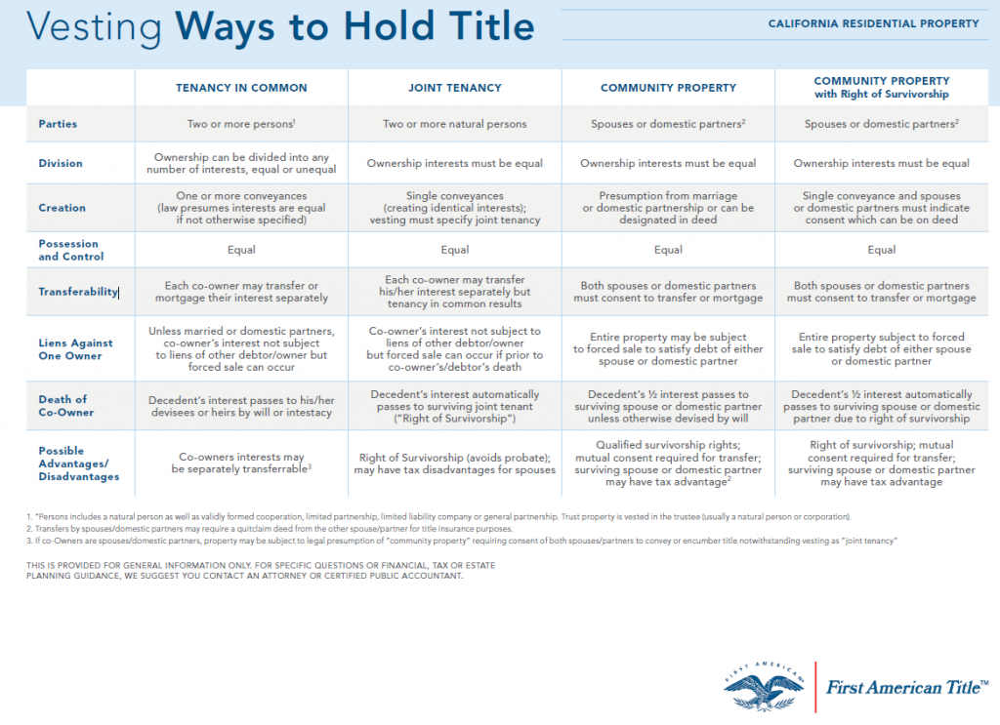

## Table of Contents

## What is a real property title?

A real property title is a legal document that shows who owns a piece of land or a building. It's like a certificate that says you are the owner of that property. When you buy a house or a piece of land, you get the title, which proves that you now own it.

Having a clear title is important because it means no one else can claim they own the property. If there are any issues with the title, like someone else saying they own it too, it can cause big problems. That's why, before buying property, people often do a title search to make sure everything is okay and the title is clear.

## What are the different methods of holding real property titles?

There are a few common ways people can hold titles to real property. One way is called "sole ownership," where just one person owns the property. This is simple, but if the owner dies, the property goes to whoever is named in their will or, if there's no will, according to the state's laws. Another way is "joint tenancy," where two or more people own the property together. If one owner dies, their share automatically goes to the other owners. This is good for spouses or close family members.

Another method is "tenancy in common," where two or more people own the property, but each person can leave their share to someone else in their will. This is different from joint tenancy because the shares don't automatically go to the other owners if someone dies. There's also "community property," which is used in some states and applies to married couples. In this case, both spouses own the property equally, and if one dies, the other usually gets the whole property. Each method has its own rules and can affect what happens to the property after someone dies, so it's important to choose the right one for your situation.

## What is sole ownership and how does it work?

Sole ownership means that one person owns the property completely by themselves. It's the simplest way to own a house or land because there's no one else involved. If you're the sole owner, you can do whatever you want with the property, like sell it, rent it out, or make changes to it, without needing to ask anyone else.

When the sole owner dies, the property doesn't automatically go to anyone else. Instead, it goes to whoever is named in the owner's will. If there's no will, then the property is distributed according to the state's laws about inheritance. This can sometimes cause problems or disagreements among family members, so it's a good idea for sole owners to have a clear will that says who should get the property after they're gone.

## What is joint tenancy and what are its key features?

Joint tenancy is a way for two or more people to own property together. It's like sharing a big piece of cake where everyone has an equal slice. If one owner dies, their part of the property doesn't go to their family or anyone they named in a will. Instead, it automatically goes to the other owners. This is called the "right of survivorship." It's a good choice for people like married couples or close family members who want to make sure the property stays with the surviving owners.

One key feature of joint tenancy is that all owners must have equal shares in the property. You can't have one owner with a bigger share than the others. Another important thing is that if one owner wants to sell their share, it can get tricky. They can't just sell their part to someone else because that would break the joint tenancy. Instead, they would need to end the joint tenancy first, which changes how the property is owned.

## How does tenancy in common differ from joint tenancy?

Tenancy in common and joint tenancy are both ways for more than one person to own property, but they work differently. In tenancy in common, each owner can have a different share of the property. For example, one person might own 75% and another 25%. Also, if an owner in a tenancy in common dies, their share doesn't automatically go to the other owners. Instead, it goes to whoever they named in their will or, if there's no will, to their heirs according to the law.

In joint tenancy, things are different. All owners must have equal shares of the property, so if there are two owners, they each own 50%. The big difference is the "right of survivorship." If one owner dies, their share automatically goes to the other owners, not to anyone named in a will or their heirs. This makes joint tenancy a good choice for people who want to make sure the property stays with the surviving owners, like married couples or close family members.

## What is tenancy by the entirety and in which states is it available?

Tenancy by the entirety is a special way for married couples to own property together. It's like joint tenancy, but only for spouses. In tenancy by the entirety, both spouses own the whole property together, not just half each. If one spouse dies, the other spouse automatically gets the whole property. This is called the right of survivorship. Also, one spouse can't sell their share of the property without the other spouse agreeing. This makes it a good choice for married couples who want to keep the property in the family.

Tenancy by the entirety is not available in every state. It's mostly used in states like Florida, Pennsylvania, and New York. Some other states that allow it are Michigan, Missouri, and Ohio. But there are many states where this type of ownership isn't an option, so it's important to check the laws in your state if you're thinking about owning property this way.

## What are the advantages and disadvantages of community property?

Community property is a way for married couples to own things together. It means that anything you buy or earn while you're married is owned equally by both of you. This can be good because if one spouse dies, the other usually gets everything without any trouble. It's simple and fair, and it can help make sure both partners feel equal in the marriage. Also, if you live in a state with community property laws, it can make things easier if you get divorced because the rules are clear about splitting up your stuff.

But community property also has some downsides. For example, if one spouse gets into debt or has money problems, both spouses might be responsible because everything is shared. This can be stressful if one person is not good with money. Also, in some states, you might have less control over what happens to your things if you die, because the law says your spouse gets half no matter what. So, while community property can be helpful, it's important to understand how it might affect your money and plans for the future.

## How does a living trust affect the way a real property title is held?

A living trust is a way to own property that can make things easier when you die. When you put your house or land into a living trust, you're still the owner, but the title of the property changes to show that the trust now holds it. This means that after you die, the property can go straight to the people you named in the trust without going through a long legal process called probate. Probate can take a lot of time and money, so a living trust can help your family avoid that hassle.

Using a living trust can also give you more control over what happens to your property. You can set rules in the trust about how and when your loved ones get the property. For example, you might say that your kids can only get the house when they turn 25. This can be helpful if you want to make sure your wishes are followed exactly. But remember, setting up a living trust can be a bit complicated, so it's a good idea to talk to a lawyer to make sure you do it right.

## What legal considerations should be taken into account when choosing a method of holding title?

When you're deciding how to hold the title to your property, there are some important legal things to think about. First, you need to know what happens to the property if you die. With sole ownership, the property goes to whoever you name in your will, or to your heirs if you don't have a will. Joint tenancy and tenancy by the entirety have a "right of survivorship," which means the property goes straight to the other owners if you die. Tenancy in common lets you leave your share to anyone you want in your will. Community property usually means your spouse gets your half if you die. So, think about who you want to get the property after you're gone.

Another big thing to consider is how easy it is to sell or change the ownership of the property. If you're the sole owner, you can do whatever you want with the property without asking anyone else. But if you're in a joint tenancy or tenancy by the entirety, you might need the other owners to agree before you can sell your share. Also, if you live in a community property state, you might need your spouse's okay to sell the property. Each way of holding title has its own rules, so it's important to choose the one that fits your situation and plans for the future. Talking to a lawyer can help you figure out the best way to hold the title to your property.

## How do tax implications vary between different methods of holding real property titles?

The way you hold the title to your property can affect how much you pay in taxes. If you're a sole owner, you report all the income from the property, like rent, on your personal tax return. This means you pay taxes on that income based on your personal tax rate. With joint tenancy or tenancy in common, each owner reports their share of the income on their own tax return. So if you own half the property, you only report half the income. For tenancy by the entirety, which is only for married couples, the same rules as joint tenancy apply, but both spouses are responsible for the taxes.

Community property can be a bit different because it's only available in certain states. In community property states, both spouses report half of the income from the property on their tax returns, even if only one spouse actually gets the money. This can be good because it might lower your overall tax bill if one spouse is in a lower tax bracket. But it can also be tricky because if one spouse has a lot of other income, it could push them into a higher tax bracket. So, when you're deciding how to hold the title to your property, think about how it will affect your taxes and talk to a tax professional to make sure you're making the best choice.

## What are the estate planning implications of different title holding methods?

When you're thinking about estate planning, the way you hold the title to your property can make a big difference. If you're a sole owner, your property will go to whoever you name in your will, or to your heirs if you don't have a will. This means you have a lot of control over what happens to your property after you die, but it also means your family might have to go through probate, which can take time and cost money. With joint tenancy or tenancy by the entirety, the property automatically goes to the other owners when you die, thanks to the "right of survivorship." This can make things easier for your family because they won't have to go through probate.

Tenancy in common gives you more flexibility because you can leave your share of the property to anyone you want in your will. This can be good if you want to leave your share to someone other than the other owners, but it might also mean your share has to go through probate. In community property states, if you're married, your spouse usually gets your half of the property when you die, which can be simple and straightforward. But it's important to think about how this fits with your overall estate plan and what you want to happen to your property after you're gone. Talking to a lawyer can help you figure out the best way to hold the title to your property for your estate plan.

## How can changes in marital status affect the method of holding real property titles?

Changes in marital status, like getting married or divorced, can really change how you hold the title to your property. If you get married and you live in a community property state, any property you buy after getting married is usually owned equally by both spouses. This means you might need to change how the title is held to reflect that. If you were the sole owner before, you might want to switch to community property or tenancy by the entirety, which is only for married couples. This can make sure both spouses feel equal and can help with estate planning.

If you get divorced, the way you hold the title can get complicated. If you owned the property as community property or tenancy by the entirety, you'll need to figure out how to split it up. This might mean selling the property and dividing the money, or one spouse buying out the other's share. If you owned the property as joint tenants or tenants in common, you might need to change the title to reflect that one spouse is no longer an owner. It's important to update the title to match your new situation, and talking to a lawyer can help make sure everything is done right.

## References & Further Reading

[1]: ["Real Estate Law"](https://www.usatoday.com/story/money/personalfinance/real-estate/2024/08/17/new-real-estate-agent-rule/74825644007/) by Marianne M. Jennings.

[2]: Chan, Ernest P. ["Algorithmic Trading: Winning Strategies and Their Rationale"](https://github.com/ftvision/quant_trading_echan_book).

[3]: Thomas, Brad, and Krewson-Kelly, Stephanie. ["The Intelligent REIT Investor: How to Build Wealth with Real Estate Investment Trusts"](https://www.wiley.com/en-us/The+Intelligent+REIT+Investor%3A+How+to+Build+Wealth+with+Real+Estate+Investment+Trusts-p-9781119252733). 

[4]: Lopez de Prado, Marcos. ["Advances in Financial Machine Learning"](https://www.amazon.com/Advances-Financial-Machine-Learning-Marcos/dp/1119482089).

[5]: Jansen, Stefan. ["Machine Learning for Algorithmic Trading"](https://github.com/stefan-jansen/machine-learning-for-trading).