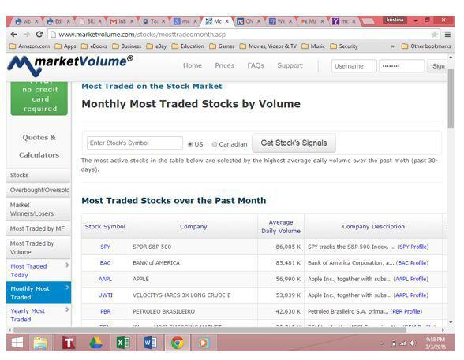

The world of stock trading is vast and complex, offering numerous opportunities and challenges for investors navigating this dynamic landscape. As markets continue to evolve, traders must equip themselves with the tools and strategies necessary to understand and capitalize on market movements. This article will explore several critical areas of stock trading, including market analysis, actively traded stocks, and the transformative rise of algorithmic trading.

Understanding these core elements is key to developing valuable insights and strategies, empowering traders to successfully maneuver through the stock market's intricacies. Market analysis forms the foundation of successful trading, guiding investors in identifying trends, determining price movements, and discovering potential investment opportunities. By examining trading volume and leveraging advanced tools for stock market analysis, traders can make well-informed decisions.



Additionally, the rise of algorithmic trading is reshaping the landscape, highlighting the importance of technology and automation in today's market. Algorithms can process vast amounts of data at unprecedented speeds, offering new avenues for executing trades and enhancing market efficiency.

In this article, we will unravel complex stock trading strategies and provide insights to help you make informed investment decisions. Whether you are a seasoned investor or new to stock trading, understanding these elements will equip you with the knowledge necessary to navigate the stock market effectively.

## Table of Contents

## Understanding Stock Market Analysis

Stock market analysis is a critical process for evaluating and interpreting the intricacies of financial markets to make informed trading decisions. This analysis is primarily bifurcated into technical analysis and fundamental analysis, each offering unique insights into market behavior and asset valuation.

Technical analysis is the study of past market data, primarily price and volume, to forecast future price movements. It operates on the premise that prices move in trends and that history tends to repeat itself in the financial markets. Analysts utilizing this approach often employ various chart patterns, trend lines, and technical indicators such as the Relative Strength Index (RSI), Moving Averages, and Bollinger Bands to identify potential buy or sell signals. For instance, the Moving Average Convergence Divergence (MACD) indicator is widely used to determine the [momentum](/wiki/momentum) of a stock. By calculating the difference between two exponential moving averages (EMAs), traders can visualize shifts in momentum and generate trading signals.

On the other hand, [fundamental analysis](/wiki/fundamental-analysis) involves evaluating a company’s financial statements, market position, and broader economic indicators to determine its intrinsic value. This includes examining financial ratios such as the Price-to-Earnings (P/E) ratio, Return on Equity (ROE), and Earnings Per Share (EPS). By assessing factors such as revenue growth, profit margins, and overall financial health, traders and investors can identify undervalued or overvalued securities. For example, a low P/E ratio compared to industry peers might suggest that a stock is undervalued, presenting a potential investment opportunity.

Effective stock market analysis often integrates both technical and fundamental components to construct a well-rounded view of the market. Combining these analyses allows traders to identify trends and key price levels while understanding the underlying fundamentals driving those movements. This comprehensive approach enhances the ability to predict future price movements and capitalize on profitable trades.

In practice, numerous tools support this multifaceted analysis approach. Charting software facilitates the visualization of price patterns and technical indicators, enabling quick analysis of historical data and potential future movements. Moreover, financial news platforms and data feeds provide real-time updates on market developments, economic news, and company-specific information, informing traders of events that may impact market conditions.

In summary, a robust stock market analysis involves a blend of technical scrutiny and fundamental evaluation to gain a comprehensive understanding of market dynamics. Mastery of these analytical techniques empowers traders and investors to make well-informed trading decisions aimed at optimizing returns within the fluctuating landscape of the stock market.

## Strategies for Stock Trading

Stock trading strategies are critical components for investors seeking to navigate the financial markets adeptly. Each strategy carries distinct principles that can be strategically applied depending on market conditions and an individual trader's risk tolerance.

One commonly employed strategy is trend-following, which hinges on the principle that stock prices tend to move in persistent trends over time. Traders leveraging this strategy aim to capitalize on these trends, buying when prices are on an upward trajectory and selling when they witness downward movement. This approach requires the use of technical analysis tools, such as moving averages, to identify and confirm trends. A simple moving average (SMA) is a common tool in trend-following strategies, calculated as follows:

$$
\text{SMA} = \frac{\sum_{i=1}^{n} \text{Price}_i}{n}
$$

where $\text{Price}_i$ represents the closing price of the stock at time $i$, and $n$ is the number of time periods considered.

Another prevalent strategy is mean-reversion, which operates on the belief that stock prices, over time, tend to revert to their average value. This approach involves identifying stocks that have deviated significantly from their historical average prices, anticipating a correction. The mean-reversion strategy often utilizes statistical measures such as the z-score to assess how far a stock's current price is from its mean, calculated as:

$$
z = \frac{(X - \mu)}{\sigma}
$$

where $X$ is the current price, $\mu$ is the mean price, and $\sigma$ is the standard deviation.

Breakout trading is a strategy focusing on stocks that move beyond key resistance or support levels. Traders employing this approach aim to enter positions when a stock breaks out of its established trading range, predicting that this movement will continue in the [breakout](/wiki/breakout-trading) direction. Key indicators for breakout trading include support and resistance levels, which can be identified using chart patterns like triangles or rectangles.

The successful application of these strategies demands flexibility and adaptability. The effectiveness of a strategy can fluctuate with changing market conditions; therefore, traders must continuously assess and refine their approach. Additionally, aligning strategies with personal risk tolerance is paramount. Each strategy entails varying degrees of risk, and traders must be prepared to manage these risks effectively.

In summary, understanding and implementing the appropriate stock trading strategies can significantly enhance a trader's potential for profit. By recognizing market trends, reversion potentials, and breakout opportunities, and by adapting to changing conditions, traders can develop a robust approach to stock trading that aligns with their financial objectives.

## Actively Traded Stocks

Actively traded stocks are characterized by their high trading volumes, which signify frequent buying and selling activity. This elevated [liquidity](/wiki/liquidity-risk-premium) makes them particularly appealing to traders who rely on rapid execution of trades. The [volume](/wiki/volume-trading-strategy) associated with actively traded stocks not only allows for ease of entry and [exit](/wiki/exit-strategy) in trades but also serves as an indicator of market sentiment.

For traders, actively traded stocks can be identified through various financial platforms that offer lists categorizing stocks by their trading activity, often updated daily, weekly, or monthly. Websites such as Yahoo Finance, Bloomberg, and MarketWatch provide such lists, highlighting "most active" stocks that draw substantial trader interest. High trading volumes in these stocks typically correlate with significant news events affecting the company, such as earnings releases, mergers, or regulatory changes, contributing to increased price [volatility](/wiki/volatility-trading-strategies).

In terms of trading strategies, actively traded stocks often cater to those looking to exploit short-term price movements. Strategies like [day trading](/wiki/day-trading-spy) and swing trading are prevalent, focusing on capturing gains from small price fluctuations within a single trading day or over several days. These strategies benefit from the liquidity and volatility present in actively traded stocks, allowing traders to capitalize on rapid market changes.

Additionally, high trading volumes can indicate a stronger conviction in price changes, as they suggest greater participation by market professionals and investors. This participation often reinforces price trends or reversals, providing traders with a clue about the sustainability of current price actions.

Traders aiming to exploit the characteristics of actively traded stocks might employ statistical or algorithmic methods to enhance precision in their trades. For instance, utilizing moving averages or other technical analysis indicators can help pinpoint entry and exit points by examining historical volume and price data patterns. Here's a basic Python script demonstrating how traders might calculate a simple moving average (SMA) to track actively traded stocks:

```python
import pandas as pd

# Assume 'data' is a DataFrame with stock price information including 'volume' and 'close'
data = pd.read_csv('stock_data.csv')

# Calculate a 20-day simple moving average (SMA) for the closing prices
data['SMA_20'] = data['close'].rolling(window=20).mean()

# Calculate trading signals based on the SMA
data['Signal'] = 0  # Default to no signal
data.loc[data['close'] > data['SMA_20'], 'Signal'] = 1  # Buy signal
data.loc[data['close'] < data['SMA_20'], 'Signal'] = -1  # Sell signal

# Filter for actively traded stocks with high volume
actively_traded = data[data['volume'] > data['volume'].quantile(0.75)]

# Display the head of the resulting DataFrame
print(actively_traded.head())
```

This script calculates a 20-day SMA and generates buy or sell signals based on the current closing price relative to the SMA. It identifies actively traded stocks by filtering those in the top 25% of trading volume, making it easier for traders to pinpoint attractive trading opportunities and align their strategies with the dynamics of actively traded stocks.

## The Rise of Algorithmic Trading

Algorithmic trading, commonly known as algo trading, represents a significant evolution in the stock trading sector. This approach leverages computer programs to automate trading processes, relying on pre-defined strategies to make trading decisions. The primary advantage of [algorithmic trading](/wiki/algorithmic-trading) is its ability to analyze market data and execute trades with speed and precision that far surpasses human capabilities. As a result, this efficiency contributes to increased market liquidity and overall market efficiency.

A variety of strategies are employed in algorithmic trading. Arbitrage, which exploits price differences in different markets, is a common technique. For example, if a stock is priced differently on two exchanges, an algorithm can automatically execute trades to profit from the discrepancy. Trend-following strategies are also popular, where algorithms identify and exploit market trends, buying securities that are rising in price and selling those that are declining. Meanwhile, mean-reversion strategies are based on the assumption that prices will revert to their historical average, allowing traders to buy low and sell high.

Despite the clear advantages, algorithmic trading does not come without its challenges. One concern is technological dependence; traders rely heavily on technology and data feeds, which can be susceptible to failures or interruptions. Moreover, the impact of algorithmic trading on the market itself can be significant, sometimes leading to phenomena such as the "flash crash," where rapid trades cause abrupt price changes.

In Python, basic algo-trading strategies might involve libraries such as Pandas for data handling, NumPy for numerical computations, and libraries like Backtrader for [backtesting](/wiki/backtesting) strategies. Here's a simple mean-reversion strategy outline using Python:

```python
import backtrader as bt

class MeanReversionStrategy(bt.Strategy):
    params = (('period', 20), ('devfactor', 2.0),)

    def __init__(self):
        self.sma = bt.ind.SMA(period=self.params.period)
        self.dev = bt.ind.StdDev(period=self.params.period)
        self.upperband = self.sma + self.params.devfactor * self.dev
        self.lowerband = self.sma - self.params.devfactor * self.dev

    def next(self):
        if self.data.close < self.lowerband:
            self.buy(size=1)  # simple example, not accounting for position sizing
        elif self.data.close > self.upperband:
            self.sell(size=1)  # simple example, not accounting for position sizing

```

Here, the strategy calculates a simple moving average and standard deviation to create upper and lower bands. The idea is to buy when prices are low (mean-reversion assumption) and sell when they are high.

Algorithmic trading continues to evolve, becoming an integral component of modern trading practices. While it offers increased capabilities and efficiencies, traders must remain aware of the inherent technological and market-related risks. By refining strategies and incorporating robust risk management protocols, traders can harness the power of algorithmic trading to exploit market opportunities and navigate complexities effectively.

## Conclusion

Navigating the stock market requires a blend of strategic planning and keen analysis. Various strategies, along with the integration of algorithmic trading, are significantly reshaping how traders engage with the market. By understanding the intricacies of these methods, traders can harness the dynamics of trading volume, market analysis, and high-frequency transactions to gain a competitive edge.

One of the pivotal aspects of modern trading is the use of algorithmic strategies, which enable traders to execute high-frequency trades with precision and speed. These algorithms are often built around statistical models and technical indicators that predict market movements. For instance, Python can be utilized to backtest a simple moving average crossover strategy, which is a common algorithmic trading approach:

```python
import pandas as pd

# Assuming 'data' is a DataFrame containing historical stock prices with a 'Close' column
data['SMA30'] = data['Close'].rolling(window=30).mean()
data['SMA100'] = data['Close'].rolling(window=100).mean()

data['Signal'] = 0
data['Signal'][30:] = np.where(data['SMA30'][30:] > data['SMA100'][30:], 1, 0)
data['Position'] = data['Signal'].diff()

# Trading signals generated where SMA30 crosses SMA100
```

Implementations like these facilitate systematic trading, freeing traders from emotional biases and potentially leading to more consistent returns. 

Furthermore, adapting to the ever-changing market landscape is crucial for sustained success. Traders must remain updated with market trends, economic indicators, and technological advancements to refine their strategies continually. This adaptability ensures they capitalize on emerging opportunities while mitigating potential risks.

Embracing technology and comprehensive strategies unlocks substantial potential for traders. As data analytics and [machine learning](/wiki/machine-learning) advance, they offer powerful tools to analyze vast datasets, predict market trends, and optimize trading strategies. The future of stock trading is increasingly digital, demanding a proactive approach to learning and application to maintain a competitive advantage.

## References & Further Reading

[1]: ["Advances in Financial Machine Learning"](https://www.amazon.com/Advances-Financial-Machine-Learning-Marcos/dp/1119482089) by Marcos Lopez de Prado

[2]: ["Evidence-Based Technical Analysis: Applying the Scientific Method and Statistical Inference to Trading Signals"](https://www.amazon.com/Evidence-Based-Technical-Analysis-Scientific-Statistical/dp/0470008741) by David Aronson

[3]: ["Machine Learning for Algorithmic Trading"](https://github.com/stefan-jansen/machine-learning-for-trading) by Stefan Jansen

[4]: ["Quantitative Trading: How to Build Your Own Algorithmic Trading Business"](https://www.amazon.com/Quantitative-Trading-Build-Algorithmic-Business/dp/1119800064) by Ernest P. Chan

[5]: ["Technical Analysis of the Financial Markets: A Comprehensive Guide to Trading Methods and Applications"](https://archive.org/details/technicalanalysi0000murp) by John J. Murphy

[6]: Lo, A. W., & MacKinlay, A. C. (1988). ["Stock Market Prices Do Not Follow Random Walks: Evidence from a Simple Specification Test"](https://academic.oup.com/rfs/article-abstract/1/1/41/1601244) The Review of Financial Studies, Vol 1, Issue 1.

[7]: Aldridge, I. (2013). ["High-Frequency Trading: A Practical Guide to Algorithmic Strategies and Trading Systems"](https://www.amazon.com/High-Frequency-Trading-Practical-Algorithmic-Strategies/dp/1118343506) 

[8]: Hull, J. C. (2017). ["Options, Futures, and Other Derivatives"](https://www.semanticscholar.org/paper/Options%2C-Futures%2C-and-Other-Derivatives-Hull/89bdee500c8623864fc9eb7a471546aa713acc44)