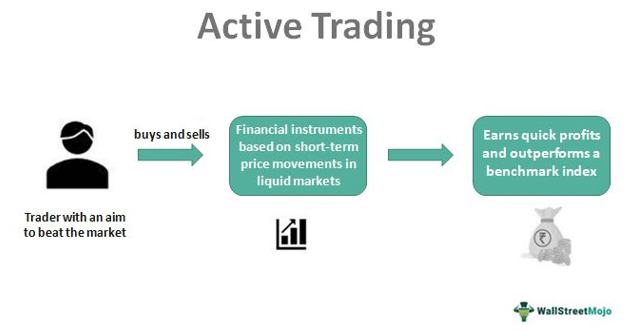

## Table of Contents

## What are actively traded stocks?

Actively traded stocks are stocks that are bought and sold frequently during a trading day. These stocks usually have a high trading volume, which means many shares are changing hands. Because they are traded so often, the prices of these stocks can change quickly. Investors and traders pay close attention to these stocks because they can offer good opportunities to make money, but they can also be riskier.

These stocks often belong to well-known companies that are in the news a lot. For example, technology companies like Apple or Tesla are often actively traded. People might buy and sell these stocks because of new product announcements, earnings reports, or other news that can affect the company's value. Because so many people are watching and trading these stocks, they can be more volatile, meaning their prices can go up and down a lot in a short time.

## Why is it important to identify actively traded stocks?

Identifying actively traded stocks is important because it helps investors understand which stocks are popular and being bought and sold a lot. When a stock is traded actively, it means many people are interested in it. This can be a sign that the stock might be a good investment, but it can also mean it's riskier because the price can change quickly.

Knowing which stocks are actively traded can also help investors make better decisions. If a stock is traded a lot, it's easier to buy and sell it without affecting the price too much. This is called liquidity. Stocks with high liquidity are easier to trade, which is good for investors who want to get in and out of their investments quickly. So, by identifying actively traded stocks, investors can find opportunities and manage their risks better.

## What are the basic indicators of stock trading activity?

The main indicator of stock trading activity is trading volume. This is the number of shares of a stock that are bought and sold in a day. If a stock has a high trading volume, it means a lot of people are interested in it and it's being traded a lot. This makes the stock actively traded. You can find the trading volume on financial websites or in stock market reports.

Another indicator is the stock's price volatility. This means how much the price of the stock goes up and down in a short time. If a stock's price changes a lot during the day, it's a sign that it's being traded actively. People are buying and selling it quickly, which can make the price move a lot. You can see this by looking at stock charts that show the price changes over time.

Lastly, the bid-ask spread can also show how actively a stock is being traded. The bid-ask spread is the difference between the highest price someone is willing to pay for the stock (the bid) and the lowest price someone is willing to sell it for (the ask). If the spread is small, it means the stock is easy to buy and sell, which usually happens with actively traded stocks. You can find this information on stock trading platforms.

## How can volume be used to identify actively traded stocks?

Volume is a key way to spot actively traded stocks. It tells you how many shares of a stock are bought and sold in a day. If a stock has a high volume, it means a lot of people are interested in it and are trading it a lot. This makes the stock actively traded. You can find the volume on financial websites or in stock market reports. When you see a stock with a high volume, it's a sign that it's popular and being traded a lot.

High volume can also help you understand how easy it is to buy and sell a stock. Stocks with high volume are usually easier to trade because there are always people buying and selling them. This is called liquidity. If a stock is liquid, you can buy and sell it without affecting the price too much. So, by looking at the volume, you can find stocks that are actively traded and easier to trade.

## What role does market capitalization play in identifying actively traded stocks?

Market capitalization, or market cap, is the total value of all the shares of a company. It can help you find actively traded stocks because big companies with a high market cap often have a lot of people interested in them. These big companies usually have a lot of shares being bought and sold every day, which makes their stocks actively traded. When you see a company with a high market cap, it's a good sign that its stock might be traded a lot.

But market cap is just one piece of the puzzle. Even though big companies with high market caps are often actively traded, it's not always true. You need to look at other things like the trading volume and how much the stock's price changes to really know if it's actively traded. So, while market cap can give you a clue about which stocks might be popular and traded a lot, you should always check other signs too.

## How do stock price volatility and liquidity relate to active trading?

Stock price volatility and liquidity are both important when it comes to active trading. Volatility means how much a stock's price goes up and down in a short time. If a stock's price changes a lot during the day, it's a sign that it's being traded a lot. People are buying and selling it quickly, which can make the price move a lot. This is a big part of what makes a stock actively traded. When you see a stock with a lot of price changes, it's a good clue that it's popular and being traded actively.

Liquidity is about how easy it is to buy and sell a stock. If a stock is liquid, it means there are always people buying and selling it, so you can trade it without affecting the price too much. Stocks that are traded a lot usually have high liquidity. This makes them easier to trade, which is why actively traded stocks often have high liquidity. So, both volatility and liquidity are signs that a stock is being traded a lot and is popular among investors.

## What are some common tools and platforms for tracking stock trading activity?

There are many tools and platforms that people use to keep an eye on how much stocks are being traded. One of the most popular ones is Yahoo Finance. It's a website where you can see how many shares of a stock are bought and sold each day, which is called the trading volume. It also shows you how the stock's price is changing and other important information. Another tool is the Bloomberg Terminal, which is used by professional traders. It gives a lot of detailed information about stocks, including how much they are being traded and how their prices are moving.

Another common platform is Google Finance. It's easy to use and shows you the trading volume and price changes for stocks. It also has charts that help you see how a stock's price has been moving over time. For people who like to trade a lot, there are also apps like Robinhood and E*TRADE. These apps let you see the trading volume and other details about stocks right on your phone. They are user-friendly and help you keep track of how active a stock is, making it easier to decide when to buy or sell.

## How can technical analysis help in identifying actively traded stocks?

Technical analysis is a way to look at stock charts and other data to see how a stock has been moving in the past. This can help you find stocks that are traded a lot. When you use technical analysis, you look at things like trading volume, which is how many shares are bought and sold each day. If a stock has a high volume, it means a lot of people are interested in it and it's being traded a lot. You can also look at moving averages, which are lines on a chart that show the average price of a stock over time. If a stock's price is moving a lot around these lines, it's another sign that it's actively traded.

Another way technical analysis can help is by looking at price volatility. This means how much the stock's price goes up and down in a short time. Stocks that are traded a lot often have a lot of volatility because people are buying and selling them quickly. You can see this on a stock chart by looking at how much the price changes each day. By using technical analysis to look at volume, moving averages, and volatility, you can get a good idea of which stocks are popular and being traded a lot. This can help you find good opportunities to buy or sell stocks.

## What advanced metrics can be used to assess stock trading activity?

Advanced metrics can help you get a deeper look at how much a stock is being traded. One important metric is the Average Daily Volume (ADV), which tells you the average number of shares traded each day over a certain period, like a month or a year. This helps you see if a stock is usually traded a lot, even if one day's volume is high or low. Another metric is the Volume Weighted Average Price (VWAP), which shows the average price a stock was traded at throughout the day, taking into account the volume of each trade. This can tell you if a stock is being bought or sold at different prices a lot, which is a sign of active trading.

Another useful metric is the Relative Volume (RVOL), which compares the current day's trading volume to the average volume over a longer period. If the RVOL is high, it means the stock is being traded more than usual, which can be a sign of increased interest or activity. Additionally, you can look at the Turnover Ratio, which shows how often the shares of a stock are bought and sold compared to the total number of shares available. A high turnover ratio means the stock is being traded a lot, making it easier to buy and sell without affecting the price too much. By using these advanced metrics, you can get a better understanding of how active a stock is and make smarter investment decisions.

## How do sector and industry trends influence the identification of actively traded stocks?

Sector and industry trends can really affect which stocks are traded a lot. When a certain sector, like technology or healthcare, is doing well, more people want to buy stocks in that sector. This makes the stocks in those sectors more actively traded. For example, if there's a lot of news about new technology, like smartphones or electric cars, people might start buying and selling stocks in tech companies more. This can make the trading volume go up and the prices move around a lot.

Also, if there's a big change in an industry, like new laws or a new product, it can make stocks in that industry more active. For instance, if the government says they're going to spend more money on green energy, stocks in solar or wind companies might start being traded more. People will be watching these stocks closely and trading them a lot because they want to take advantage of the new trend. So, by keeping an eye on what's happening in different sectors and industries, you can find stocks that are likely to be traded a lot.

## What are the limitations and potential pitfalls in using these methods?

Using these methods to find actively traded stocks can be helpful, but they have some limits. One big problem is that just because a stock is traded a lot doesn't mean it's a good investment. Sometimes, a stock can be traded a lot because people are selling it, not buying it. This can make the price go down a lot, which is bad if you bought the stock. Also, looking at things like volume and volatility can be tricky because these numbers can change a lot from day to day. What looks like a good sign one day might not be the same the next day.

Another thing to watch out for is that these methods don't tell you everything about a stock. They can show you how much a stock is being traded, but they don't tell you why. Sometimes, a stock might be traded a lot because of news or rumors that aren't true. If you don't know the whole story, you might make a bad decision. Also, relying too much on numbers like volume and volatility can make you miss other important things, like how the company is doing or what's happening in the world that could affect the stock. So, it's good to use these methods, but you should also look at other information to make the best choices.

## How can algorithmic trading and machine learning enhance the identification of actively traded stocks?

Algorithmic trading and machine learning can make it easier to find actively traded stocks by looking at a lot of data quickly. These tools can go through huge amounts of information, like trading volumes and price changes, to spot patterns that might be hard for a person to see. They can also keep an eye on many stocks at once, which helps you find the ones that are being traded a lot. By using these technologies, you can get a better idea of which stocks are popular and being bought and sold a lot, without having to do all the work yourself.

Another way these tools help is by making predictions based on past data. Machine learning can learn from how stocks have been traded before and guess which ones might be traded a lot in the future. This can give you a heads-up on which stocks to watch. But, it's important to remember that even though these tools are smart, they're not perfect. They can make mistakes, and the stock market can be unpredictable. So, while algorithmic trading and machine learning can be really helpful, you should still use other information and your own judgment when making decisions about stocks.

## What are some strategies for stock trading?

Stock trading strategies are critical components for investors seeking to navigate the financial markets adeptly. Each strategy carries distinct principles that can be strategically applied depending on market conditions and an individual trader's risk tolerance.

One commonly employed strategy is trend-following, which hinges on the principle that stock prices tend to move in persistent trends over time. Traders leveraging this strategy aim to capitalize on these trends, buying when prices are on an upward trajectory and selling when they witness downward movement. This approach requires the use of technical analysis tools, such as moving averages, to identify and confirm trends. A simple moving average (SMA) is a common tool in trend-following strategies, calculated as follows:

$$
\text{SMA} = \frac{\sum_{i=1}^{n} \text{Price}_i}{n}
$$

where $\text{Price}_i$ represents the closing price of the stock at time $i$, and $n$ is the number of time periods considered.

Another prevalent strategy is mean-reversion, which operates on the belief that stock prices, over time, tend to revert to their average value. This approach involves identifying stocks that have deviated significantly from their historical average prices, anticipating a correction. The mean-reversion strategy often utilizes statistical measures such as the z-score to assess how far a stock's current price is from its mean, calculated as:

$$
z = \frac{(X - \mu)}{\sigma}
$$

where $X$ is the current price, $\mu$ is the mean price, and $\sigma$ is the standard deviation.

Breakout trading is a strategy focusing on stocks that move beyond key resistance or support levels. Traders employing this approach aim to enter positions when a stock breaks out of its established trading range, predicting that this movement will continue in the [breakout](/wiki/breakout-trading) direction. Key indicators for breakout trading include support and resistance levels, which can be identified using chart patterns like triangles or rectangles.

The successful application of these strategies demands flexibility and adaptability. The effectiveness of a strategy can fluctuate with changing market conditions; therefore, traders must continuously assess and refine their approach. Additionally, aligning strategies with personal risk tolerance is paramount. Each strategy entails varying degrees of risk, and traders must be prepared to manage these risks effectively.

In summary, understanding and implementing the appropriate stock trading strategies can significantly enhance a trader's potential for profit. By recognizing market trends, reversion potentials, and breakout opportunities, and by adapting to changing conditions, traders can develop a robust approach to stock trading that aligns with their financial objectives.

## References & Further Reading

[1]: ["Advances in Financial Machine Learning"](https://www.amazon.com/Advances-Financial-Machine-Learning-Marcos/dp/1119482089) by Marcos Lopez de Prado

[2]: ["Evidence-Based Technical Analysis: Applying the Scientific Method and Statistical Inference to Trading Signals"](https://www.amazon.com/Evidence-Based-Technical-Analysis-Scientific-Statistical/dp/0470008741) by David Aronson

[3]: ["Machine Learning for Algorithmic Trading"](https://github.com/stefan-jansen/machine-learning-for-trading) by Stefan Jansen

[4]: ["Quantitative Trading: How to Build Your Own Algorithmic Trading Business"](https://www.amazon.com/Quantitative-Trading-Build-Algorithmic-Business/dp/1119800064) by Ernest P. Chan

[5]: ["Technical Analysis of the Financial Markets: A Comprehensive Guide to Trading Methods and Applications"](https://archive.org/details/technicalanalysi0000murp) by John J. Murphy

[6]: Lo, A. W., & MacKinlay, A. C. (1988). ["Stock Market Prices Do Not Follow Random Walks: Evidence from a Simple Specification Test"](https://academic.oup.com/rfs/article-abstract/1/1/41/1601244) The Review of Financial Studies, Vol 1, Issue 1.

[7]: Aldridge, I. (2013). ["High-Frequency Trading: A Practical Guide to Algorithmic Strategies and Trading Systems"](https://www.amazon.com/High-Frequency-Trading-Practical-Algorithmic-Strategies/dp/1118343506) 

[8]: Hull, J. C. (2017). ["Options, Futures, and Other Derivatives"](https://www.semanticscholar.org/paper/Options%2C-Futures%2C-and-Other-Derivatives-Hull/89bdee500c8623864fc9eb7a471546aa713acc44)