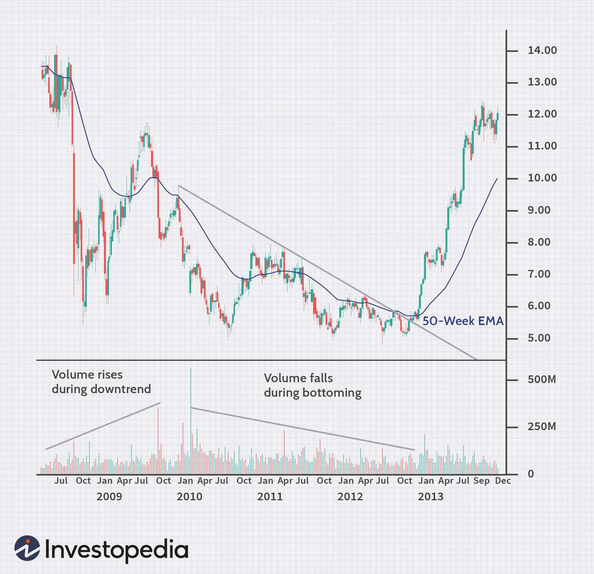

## Table of Contents

## What is a stock price bottom and why is it important to identify?

A stock price bottom is the lowest point that a stock's price reaches during a certain period of time. It's like the lowest point in a valley if you imagine the stock's price movements as a landscape. When a stock's price hits its bottom, it means it can't go any lower at that moment and might start to go up again.

Identifying the stock price bottom is important because it can help investors decide when to buy the stock. If an investor thinks the stock has reached its bottom and will start to go up, they might want to buy it at that low price. This way, they could make a profit if the stock price does go up later. However, it's tricky because it's hard to know for sure if a price is really the bottom until after it starts going up again.

## What are the basic technical indicators used to identify stock price bottoms?

Technical indicators are tools that help investors see patterns in stock prices. One common indicator is the moving average. It smooths out price data over a period of time, like 50 or 200 days, to show the general direction of the stock's price. When a stock's price goes below its moving average and then starts to go back up, it might mean the stock is hitting its bottom. Another indicator is the Relative Strength Index (RSI). The RSI measures how fast a stock's price is going up or down. If the RSI goes below 30, it means the stock might be oversold and could be near its bottom.

Another useful indicator is the [volume](/wiki/volume-trading-strategy) of shares traded. When a stock is hitting its bottom, you might see a big increase in trading volume. This means a lot of people are buying and selling the stock, which can be a sign that the stock is about to turn around. Lastly, chart patterns like the "double bottom" can also help. This pattern looks like the letter "W" on a chart. It happens when a stock's price drops to a low point, goes up a bit, then drops back to the same low point before going up again. Seeing this pattern can suggest that the stock has found its bottom and might start to rise.

## How can volume analysis help in spotting potential stock price bottoms?

Volume analysis can help spot potential stock price bottoms by showing how many shares of a stock are being bought and sold. When a stock is hitting its bottom, you might see a big increase in trading volume. This means a lot of people are trading the stock, which can be a sign that the stock is about to turn around. If the volume goes up a lot when the stock price is low, it might mean that investors think the stock is a good buy at that price and are starting to buy it in large amounts.

This increase in volume at the bottom can be a signal that the stock is about to start going up again. When many people start buying the stock at its low price, it can push the price up as more and more people want to buy it. So, by watching the volume, investors can try to guess when a stock might be at its bottom and ready to go up. But, it's important to remember that volume is just one piece of the puzzle, and it's good to look at other indicators too before making any decisions.

## What role do moving averages play in identifying stock price bottoms?

Moving averages help investors see the general direction of a stock's price over time. They smooth out the ups and downs of the stock's price by averaging it over a certain number of days, like 50 or 200 days. When a stock's price goes below its moving average, it might mean the stock is in a downtrend. But if the stock's price then starts to go back up and crosses above the moving average, it could be a sign that the stock has hit its bottom and is starting to recover.

This can be really helpful for investors trying to spot when a stock might be at its lowest point. For example, if a stock's price has been going down and it goes below its 50-day moving average, investors might watch to see if it starts to go back up. If the price does start to rise and crosses above the moving average, it could be a good time to buy the stock. But, it's important to use moving averages along with other indicators, because no single tool can tell you for sure when a stock has hit its bottom.

## Can chart patterns like double bottoms or head and shoulders be used to identify stock price bottoms?

Yes, chart patterns like double bottoms and head and shoulders can help identify stock price bottoms. A double bottom looks like the letter "W" on a chart. It happens when a stock's price drops to a low point, goes up a bit, then drops back to the same low point before going up again. Seeing this pattern can suggest that the stock has found its bottom and might start to rise. It's like the stock tried to go lower but couldn't, so it might be ready to go up.

The head and shoulders pattern can also show a stock's bottom, but it's a bit different. It looks like a person's head and shoulders on a chart. The pattern starts with a peak (the left shoulder), then a higher peak (the head), and ends with another peak that's about as high as the first one (the right shoulder). When the stock's price breaks below the "neckline" that connects the lows between the peaks, it might mean the stock has hit its bottom and could start going up. Both patterns can help investors guess when a stock might be at its lowest point, but they should use other tools too to be sure.

## How does the Relative Strength Index (RSI) assist in determining stock price bottoms?

The Relative Strength Index (RSI) is a tool that helps investors see if a stock is being overbought or oversold. It measures how fast a stock's price is going up or down and gives a number between 0 and 100. If the RSI goes below 30, it means the stock might be oversold. This can be a sign that the stock's price has gone down a lot and could be near its bottom. Investors watch for the RSI to go below 30 because it might mean the stock is a good buy at that low price.

When the RSI goes below 30 and then starts to go back up, it can be a signal that the stock's price might start to go up too. This is because when the RSI shows the stock is oversold, it means a lot of people have been selling it, but now they might start buying it again. So, by watching the RSI, investors can try to guess when a stock might be at its bottom and ready to go up. But it's important to use the RSI along with other tools, because no single indicator can tell you for sure when a stock has hit its bottom.

## What are the key differences between identifying short-term and long-term stock price bottoms?

Identifying short-term stock price bottoms is about looking at quick changes in a stock's price over a few days or weeks. Traders who want to make money fast use tools like the Relative Strength Index (RSI) and watch the trading volume to spot these short-term bottoms. They might see a stock's price drop a lot in a short time and then start to go back up, which could mean it's a good time to buy and sell the stock quickly for a profit. Short-term bottoms can be trickier to spot because the stock's price can change a lot in a short time, and it's hard to know if the price will keep going down or start going up.

On the other hand, identifying long-term stock price bottoms involves looking at a stock's price over many months or even years. Investors who want to hold onto a stock for a long time use tools like moving averages and chart patterns like double bottoms or head and shoulders to find these long-term bottoms. They might see a stock's price go down for a long time and then start to go back up, which could mean it's a good time to buy the stock and hold it for a long time. Long-term bottoms can be easier to spot because the stock's price changes more slowly, but it still takes a lot of patience and careful watching to be sure the price has really hit its bottom.

## How can fundamental analysis complement technical analysis in identifying stock price bottoms?

Fundamental analysis looks at a company's financial health, like its earnings, debts, and how it's doing in its industry. It helps investors understand if a stock is a good buy based on the company's real value. When you use [fundamental analysis](/wiki/fundamental-analysis) along with technical analysis, you get a fuller picture of whether a stock might be at its bottom. For example, if a stock's price has gone down a lot but the company's earnings are still strong, it might mean the stock is undervalued and could be a good buy. This can give investors more confidence that the stock's price has really hit its bottom and might start to go up again.

Technical analysis, on the other hand, looks at charts and patterns to see how a stock's price is moving. It helps investors guess when a stock might be at its lowest point by looking at things like moving averages, RSI, and trading volume. When you combine this with fundamental analysis, you can see if the stock's price drop makes sense based on the company's financials. If the stock's price is low and the company's fundamentals are strong, it might be a good time to buy. Using both types of analysis together helps investors make smarter decisions about when to buy a stock at its bottom.

## What advanced statistical methods can be used to predict stock price bottoms?

Advanced statistical methods can help predict stock price bottoms by using complex math to find patterns in stock prices that might not be easy to see. One method is called time series analysis. It looks at how a stock's price changes over time and tries to predict future prices based on past patterns. Another method is [machine learning](/wiki/machine-learning), which uses computers to learn from past stock price data and make predictions about when a stock might hit its bottom. These methods can be really helpful because they can look at a lot of data and find small details that might be missed by just looking at charts or simple indicators.

Another advanced method is regression analysis, which tries to find a math formula that can predict a stock's price based on different factors, like the company's earnings or the overall market. This can help investors see if a stock's price drop is because of the company's problems or something else. Also, something called [volatility](/wiki/volatility-trading-strategies) analysis can be used to see how much a stock's price moves around. If a stock's price is moving a lot and then starts to calm down, it might mean the stock is getting close to its bottom. Using these advanced methods along with simpler tools can give investors a better chance of spotting when a stock might be at its lowest point.

## How do market sentiment indicators like the VIX affect the identification of stock price bottoms?

Market sentiment indicators like the VIX, which is also called the "fear index," can help investors guess when stock prices might be at their bottom. The VIX measures how much people expect the stock market to move around in the next 30 days. When the VIX goes up a lot, it means people are scared and think the market might go down. If the VIX is really high and then starts to go down, it can be a sign that the market's fear is going away and stock prices might start to go up again. So, watching the VIX can help investors see when the market might be at its lowest point and ready to turn around.

But the VIX is just one piece of the puzzle. It's good to use it along with other tools like moving averages, RSI, and chart patterns to get a better idea of when stock prices might be at their bottom. If the VIX is high and other signs are also showing that stocks might be at their bottom, it can give investors more confidence that it's a good time to buy. But no single indicator can tell you for sure when stocks have hit their bottom, so it's important to look at everything together.

## What are the limitations and risks of using various methods to identify stock price bottoms?

Using different methods to find stock price bottoms can be tricky because they all have limitations and risks. One big problem is that no method can tell you for sure when a stock has hit its bottom. For example, technical indicators like moving averages and RSI can give you clues, but they can also be wrong. Sometimes a stock's price might seem to hit its bottom but then keep going down. Also, these methods often work better for some stocks than others, so what works for one stock might not work for another. This means you might buy a stock thinking it's at its bottom, only to see it drop more, which can lead to losing money.

Another risk is that relying too much on one method can make you miss important information. For example, if you only use technical analysis, you might not see that a company's earnings are going down, which could mean the stock's price will keep falling. Fundamental analysis can help you understand a company's real value, but it takes time to look at all the financial details, and the stock's price might change before you finish your analysis. Plus, market sentiment indicators like the VIX can be helpful, but they can also be influenced by short-term news or events that don't affect the stock's long-term value. So, it's important to use a mix of methods and still be ready for surprises, because the stock market can be unpredictable.

## How can algorithmic trading strategies be developed to capitalize on identified stock price bottoms?

Algorithmic trading strategies can be developed to capitalize on identified stock price bottoms by using a mix of technical and fundamental analysis. The strategy would use computer programs to watch for signs that a stock's price might be at its bottom, like when the RSI goes below 30 or when a stock's price crosses above its moving average after being below it. The algorithm could also look at the company's earnings and other financial details to see if the stock is a good buy at its low price. When all these signs line up, the algorithm would buy the stock, hoping to sell it later for a profit when the price goes up.

But there are risks to this approach. Sometimes the signs can be wrong, and the stock's price might keep going down after the algorithm buys it. This means the strategy needs to have rules for when to sell the stock to cut losses if it doesn't go up as expected. Also, the algorithm needs to be updated often because what works today might not work tomorrow. By using a mix of different methods and being ready to change the strategy, [algorithmic trading](/wiki/algorithmic-trading) can help investors try to make money from stocks at their bottoms, but it's never a sure thing.

## References & Further Reading

[1]: Bergstra, J., Bardenet, R., Bengio, Y., & Kégl, B. (2011). ["Algorithms for Hyper-Parameter Optimization."](https://dl.acm.org/doi/10.5555/2986459.2986743) Advances in Neural Information Processing Systems 24.

[2]: ["Advances in Financial Machine Learning"](https://www.amazon.com/Advances-Financial-Machine-Learning-Marcos/dp/1119482089) by Marcos Lopez de Prado

[3]: ["Evidence-Based Technical Analysis: Applying the Scientific Method and Statistical Inference to Trading Signals"](https://www.amazon.com/Evidence-Based-Technical-Analysis-Scientific-Statistical/dp/0470008741) by David Aronson

[4]: ["Machine Learning for Algorithmic Trading"](https://github.com/stefan-jansen/machine-learning-for-trading) by Stefan Jansen

[5]: ["Quantitative Trading: How to Build Your Own Algorithmic Trading Business"](https://www.amazon.com/Quantitative-Trading-Build-Algorithmic-Business/dp/1119800064) by Ernest P. Chan