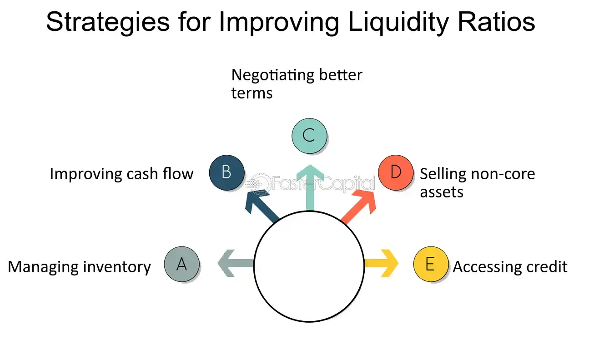

## Table of Contents

## What is a liquidity ratio and why is it important for a company?

A liquidity ratio is a number that shows if a company can pay its short-term bills using its current assets. It's like checking if you have enough cash in your wallet to buy something you need right now. Common liquidity ratios include the current ratio, which compares current assets to current liabilities, and the quick ratio, which is more strict and leaves out inventory from current assets.

These ratios are important for a company because they help show if the business is healthy and can keep running smoothly. If a company has a good liquidity ratio, it means it can easily pay its bills and won't run into money problems. This makes suppliers, banks, and investors feel more confident about the company. On the other hand, a low liquidity ratio can be a warning sign that the company might struggle to pay its debts, which could lead to bigger problems down the road.

## What are the different types of liquidity ratios?

There are several types of liquidity ratios that help us understand how well a company can pay its short-term bills. The most common one is the current ratio. This ratio compares a company's current assets, like cash and things that can be turned into cash quickly, to its current liabilities, which are the bills that need to be paid soon. A higher current ratio means the company has more assets to cover its debts, which is good.

Another important liquidity ratio is the quick ratio, also known as the acid-test ratio. This one is a bit stricter because it doesn't count inventory as part of the current assets. Inventory can take time to sell and turn into cash, so the quick ratio focuses on the most liquid assets, like cash and accounts receivable. This gives a clearer picture of how well a company can pay its bills right away if it needed to.

The last common liquidity ratio is the cash ratio, which is the strictest of all. It only looks at the company's cash and cash equivalents compared to its current liabilities. This ratio shows if a company could pay off all its short-term debts using just the cash it has on hand, without selling any other assets. While it's good to have a high cash ratio, it's also important for a company to use its cash to grow and invest, not just to sit on it.

## How can a company quickly improve its current ratio?

A company can quickly improve its current ratio by increasing its current assets or reducing its current liabilities. One way to boost current assets is by converting some of its non-current assets, like long-term investments, into cash or other short-term assets. For example, the company could sell some of its equipment or investments that it doesn't need right away. Another way is to collect payments from customers faster by offering discounts for early payments or tightening credit terms. This would increase the cash on hand, which is part of current assets.

On the other hand, a company can reduce its current liabilities by paying off some of its short-term debts. This could mean using available cash to pay down loans or settling accounts payable earlier than required. Another approach is to negotiate with suppliers for longer payment terms, which would decrease the amount of current liabilities on the balance sheet. By focusing on these strategies, a company can quickly improve its current ratio and show that it's in a better position to meet its short-term financial obligations.

## What are the benefits of increasing the quick ratio?

Increasing the quick ratio helps a company show that it's in a good position to pay its bills quickly. The quick ratio looks at the most liquid assets, like cash and what customers owe, and compares them to what the company needs to pay soon. If this ratio goes up, it means the company has more of these quick assets to cover its short-term debts. This can make suppliers, banks, and investors feel more confident about the company's financial health. They see that the company can handle its bills without having to sell inventory or other things that might take time to turn into cash.

Having a higher quick ratio can also help a company during tough times. If there's a sudden need for cash, like an unexpected expense or a drop in sales, a higher quick ratio means the company can still pay its bills without struggling. This can prevent the company from needing to borrow more money at high interest rates or selling assets at a loss. Overall, a higher quick ratio gives a company more flexibility and security, making it easier to manage through ups and downs in the business environment.

## Can selling off inventory help improve liquidity, and if so, how?

Yes, selling off inventory can help improve a company's liquidity. When a company sells its inventory, it turns those goods into cash. Cash is a current asset, and having more cash means the company has more money to pay its short-term bills. This can improve the company's current ratio, which is a measure of how well it can cover its short-term debts with its current assets.

However, selling off inventory doesn't help with the quick ratio because inventory isn't counted in that calculation. The quick ratio looks at the most liquid assets like cash and what customers owe, not inventory. So while selling inventory can bring in cash and improve the current ratio, it won't change the quick ratio. This means it's a good way to boost overall liquidity but won't help with the strictest measure of liquidity.

## How does managing accounts receivable affect a company's liquidity?

Managing accounts receivable well can really help a company's liquidity. Accounts receivable are the money that customers owe the company for goods or services they've already received. If a company can collect this money faster, it means more cash coming in sooner. This extra cash can be used to pay bills, buy more inventory, or invest in the business. So, by speeding up the collection of accounts receivable, a company can improve its current ratio and overall liquidity, making it easier to handle short-term financial needs.

On the other hand, if a company is slow at collecting what customers owe, it can hurt liquidity. Money tied up in accounts receivable isn't available to use right away. This can make it harder for the company to pay its bills on time, which might lower its current and quick ratios. To manage this better, a company might offer discounts for early payments or tighten credit terms to get the cash in faster. Good management of accounts receivable keeps the cash flowing and helps keep the company's liquidity strong.

## What role does short-term borrowing play in enhancing liquidity?

Short-term borrowing can help a company boost its liquidity by giving it quick access to cash. When a company borrows money for a short time, it can use that cash to pay its bills or buy things it needs right away. This can make the company's current ratio better because it increases the amount of current assets, like cash, compared to its current liabilities. But, it's important to remember that borrowing money also means the company has to pay it back soon, which adds to its current liabilities.

Using short-term borrowing wisely can be a good way to manage cash flow problems. If a company is waiting for customers to pay or needs to buy more inventory to keep selling, a short-term loan can help keep things running smoothly. But, if the company borrows too much, it might struggle to pay back the loans on time, which could hurt its liquidity in the long run. So, it's all about finding the right balance to make sure the company stays healthy and can keep paying its bills.

## How can negotiating better payment terms with suppliers impact liquidity?

Negotiating better payment terms with suppliers can help a company's liquidity by giving it more time to pay its bills. If a supplier agrees to let the company pay later, it means the company can keep its cash longer. This can be really helpful because the company can use that cash for other things it needs right away, like buying more inventory or paying other bills. By having more time to pay, the company can improve its current ratio because its current liabilities go down, making it look like it has more money to cover its short-term debts.

But, it's important for the company to be careful with this strategy. If it delays paying its suppliers too much, it might upset them, and they could stop giving the company good deals or even stop selling to them. Also, if the company uses the extra time to just spend more money instead of managing its cash well, it could still run into money problems later. So, negotiating better payment terms can be a good way to help with liquidity, but the company needs to use that extra time wisely to make sure it stays in a good financial position.

## What are the potential risks of focusing too heavily on increasing liquidity?

Focusing too much on increasing liquidity can be risky for a company. If a company tries too hard to have a lot of cash and other liquid assets, it might miss out on chances to grow. For example, instead of using money to buy new equipment or start new projects, the company might just keep the cash in the bank. This can slow down the company's growth because it's not investing in things that could make it bigger and better in the future.

Also, having too much focus on liquidity can make the company less efficient. If the company is always trying to collect money quickly from customers or selling off inventory just to have more cash, it might upset customers or suppliers. Customers might not like having to pay so fast, and suppliers might not want to work with a company that's always trying to delay payments. This can harm the company's relationships and make it harder to do business in the long run. So, while having good liquidity is important, a company needs to balance it with other goals to stay healthy and grow.

## How can financial forecasting be used to manage and improve liquidity ratios?

Financial forecasting helps a company plan for the future and make sure it has enough cash to pay its bills. By looking at past numbers and guessing what might happen next, a company can see when it might need more money and when it might have extra. This helps the company decide when to borrow money, when to collect payments from customers faster, or when to pay suppliers later. By planning ahead, the company can keep its current ratio and quick ratio at good levels, making sure it can always cover its short-term debts.

Using financial forecasting also lets a company see if it's spending too much or not making enough money. If the forecast shows that the company might run out of cash soon, it can take steps to fix this before it becomes a big problem. For example, the company might decide to sell some inventory or cut back on spending. By keeping an eye on the future, the company can make smart choices that help keep its liquidity strong and avoid money troubles.

## What advanced strategies can be employed to optimize cash conversion cycles?

Optimizing the cash conversion cycle means making sure a company can turn its money into profit as quickly as possible. One way to do this is by speeding up how fast customers pay their bills. A company can offer discounts for early payments or use better credit checks to make sure they're selling to people who will pay on time. Another way is to manage inventory better. By using systems that track what's selling and what's not, a company can order just the right amount of stock, so it doesn't sit around taking up cash. This helps the company turn its inventory into cash faster.

Another strategy is to negotiate better terms with suppliers. If a company can pay its suppliers later without any penalties, it keeps more cash on hand for longer. This can help the company use that money for other things, like buying more inventory or investing in growth. Also, companies can look into short-term financing options like lines of credit to cover any gaps in cash flow. By using these advanced strategies, a company can make its cash conversion cycle shorter and more efficient, which helps improve its overall liquidity and financial health.

## How do different industries approach liquidity management differently, and what can be learned from these approaches?

Different industries have their own ways of managing liquidity because they face different challenges. For example, in the retail industry, companies need a lot of cash to buy inventory and keep stores running. They often focus on selling inventory quickly and collecting money from customers fast to keep their cash flow strong. Retailers might use sales and discounts to move products faster, helping them turn their stock into cash sooner. On the other hand, in the manufacturing industry, companies might have long production cycles and need to invest a lot of money in machinery and materials before they can sell anything. Manufacturers might use short-term loans to cover costs while they wait for their products to be ready and sold, helping them manage their cash flow until they get paid.

In the tech industry, companies often have a lot of cash from investors and might focus on keeping that cash to fund new projects and research. They might not worry as much about short-term liquidity because they're looking at long-term growth. Tech companies might use their cash to buy other companies or invest in new technology, which can help them grow bigger and stronger in the future. By looking at how these different industries manage their liquidity, other companies can learn important lessons. Retailers can see the value in speeding up their cash conversion cycles, manufacturers can learn how to use short-term financing wisely, and tech companies can show the importance of balancing short-term needs with long-term growth plans. Understanding these different approaches can help any company find the best way to manage its own liquidity.

## What is the importance of understanding business finance and liquidity?

Business finance plays a pivotal role in ensuring the viability and sustainability of companies, forming the lifeblood of any economic enterprise. At its core, business finance involves the efficient allocation and management of financial resources to maximize profitability and ensure long-term growth. A fundamental component in this endeavor is liquidity, which refers to the ease with which assets can be converted into cash without significant loss of value. Liquidity is crucial for maintaining financial health, as it enables businesses to meet their short-term obligations, invest in opportunities, and withstand economic uncertainties.

**Liquidity and Its Significance**

Liquidity is a critical aspect of financial health because it directly affects a company's ability to operate and meet its obligations. Companies with high [liquidity](/wiki/liquidity-risk-premium) can rapidly adjust to market changes and seize growth opportunities, while those with poor liquidity might struggle during economic downturns or face operational challenges. Maintaining an optimal level of liquidity ensures that a company can cover its liabilities, pay suppliers, and sustain operations without resorting to costly external financing.

**Measuring and Managing Liquidity**

Businesses often employ various measures to assess and manage their liquidity. These measures are encapsulated in liquidity ratios, which offer insights into a firm's capacity to cover short-term liabilities with its assets. Common liquidity ratios include:

1. **Current Ratio**: This ratio indicates whether a company can pay off its short-term liabilities with its short-term assets. It is calculated as:
$$
   \text{Current Ratio} = \frac{\text{Current Assets}}{\text{Current Liabilities}}

$$
   A current ratio greater than one suggests that the company has more assets than liabilities, affirming good liquidity.

2. **Quick Ratio (Acid-Test Ratio)**: This is a more stringent measure, excluding inventory from current assets. It is defined as:
$$
   \text{Quick Ratio} = \frac{\text{Current Assets} - \text{Inventory}}{\text{Current Liabilities}}

$$
   It reflects a company's ability to meet short-term obligations with its most liquid assets.

3. **Cash Ratio**: This ratio focuses solely on the most liquid assets, providing an immediate snapshot of liquidity:
$$
   \text{Cash Ratio} = \frac{\text{Cash and Cash Equivalents}}{\text{Current Liabilities}}

$$

**Impact on Decision-Making and Strategy**

Maintaining adequate liquidity impacts every facet of business decision-making and strategy. Decisions regarding expansion, investment, and resource allocation are all influenced by the level of liquidity a business holds. A strategic balance of liquidity ensures that companies can finance operations, invest in new ventures, and cover unexpected expenses without compromising financial stability.

Incorporating liquidity management into the broader financial strategy allows businesses to smoothly navigate financial challenges and capitalize on emerging market prospects. This involves continuously monitoring cash flows, optimizing working capital, and practicing judicious financial planning to ensure that liquidity reserves are maintained at a level that aligns with corporate objectives and risk tolerance.

In summary, understanding business finance and effectively managing liquidity are essential tasks that ensure operational viability and strategic flexibility. This careful balance facilitates adaptive decision-making, supports growth initiatives, and safeguards financial stability in an ever-evolving economic landscape.

## References & Further Reading

[1]: Bergstra, J., Bardenet, R., Bengio, Y., & Kégl, B. (2011). ["Algorithms for Hyper-Parameter Optimization."](https://papers.nips.cc/paper/4443-algorithms-for-hyper-parameter-optimization) Advances in Neural Information Processing Systems 24.

[2]: ["Advances in Financial Machine Learning"](https://www.amazon.com/Advances-Financial-Machine-Learning-Marcos/dp/1119482089) by Marcos Lopez de Prado

[3]: ["Evidence-Based Technical Analysis: Applying the Scientific Method and Statistical Inference to Trading Signals"](https://www.amazon.com/Evidence-Based-Technical-Analysis-Scientific-Statistical/dp/0470008741) by David Aronson

[4]: ["Machine Learning for Algorithmic Trading"](https://github.com/stefan-jansen/machine-learning-for-trading) by Stefan Jansen

[5]: ["Quantitative Trading: How to Build Your Own Algorithmic Trading Business"](https://www.amazon.com/Quantitative-Trading-Build-Algorithmic-Business/dp/1119800064) by Ernest P. Chan