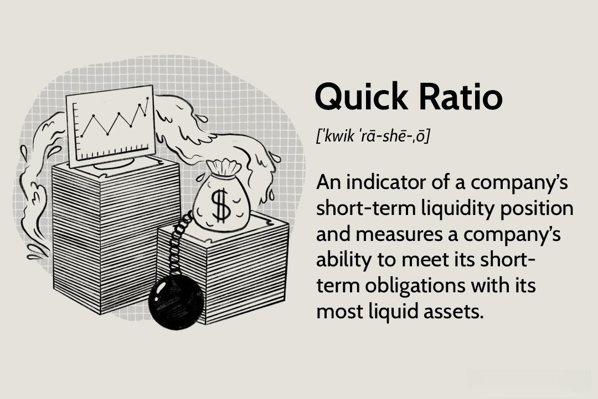

The interconnected world of business finance includes diverse facets that contribute to sustained success and strategic growth. At its core, business finance involves managing an organization's financial resources to achieve its objectives. It encompasses various financial activities, such as investment decisions, capital structuring, and financial planning, which are integral to ensuring a company's long-term viability.

A critical component of financial management is liquidity, defined as the ability of a business to meet its short-term obligations with its current assets. Liquidity ensures smooth operations by allowing businesses to handle financial commitments like payroll, debt repayments, and unforeseen expenses efficiently. The importance of maintaining adequate liquidity lies in its direct impact on a company's operational and strategic decision-making processes. Without proper liquidity, even profitable businesses may face challenges in maintaining operations, leading to financial distress or insolvency.

Developing and implementing effective financial strategies is essential for optimizing business operations. These strategies aim to align financial management practices with the organization’s objectives, ensuring resilience against market fluctuations and economic uncertainties. Effective financial strategies account for various factors, such as cost management, revenue growth, risk mitigation, and investment opportunities.

Over the past few decades, the financial industry has witnessed a paradigm shift with the advent of algorithmic trading. This form of trading uses computer systems and algorithms to execute trades based on predefined criteria. Algorithmic trading has become increasingly relevant in modern finance due to its ability to process vast amounts of data at high speeds, enabling traders and businesses to optimize their trading strategies and improve market access. The technology underpinning algorithmic trading, which includes artificial intelligence and machine learning, offers significant advantages, such as precision, efficiency, and reduced transaction costs, while also presenting challenges like technical failures and increased market volatility.

Understanding the dynamics of business finance, liquidity management, and innovative strategies such as algorithmic trading sets the stage for a comprehensive analysis of these elements. Exploring their implications and interconnections demonstrates their critical role in shaping modern financial landscapes and guiding businesses toward sustained success.

## Table of Contents

## Understanding Business Finance and Liquidity

Business finance plays a pivotal role in ensuring the viability and sustainability of companies, forming the lifeblood of any economic enterprise. At its core, business finance involves the efficient allocation and management of financial resources to maximize profitability and ensure long-term growth. A fundamental component in this endeavor is liquidity, which refers to the ease with which assets can be converted into cash without significant loss of value. Liquidity is crucial for maintaining financial health, as it enables businesses to meet their short-term obligations, invest in opportunities, and withstand economic uncertainties.

**Liquidity and Its Significance**

Liquidity is a critical aspect of financial health because it directly affects a company's ability to operate and meet its obligations. Companies with high [liquidity](/wiki/liquidity-risk-premium) can rapidly adjust to market changes and seize growth opportunities, while those with poor liquidity might struggle during economic downturns or face operational challenges. Maintaining an optimal level of liquidity ensures that a company can cover its liabilities, pay suppliers, and sustain operations without resorting to costly external financing.

**Measuring and Managing Liquidity**

Businesses often employ various measures to assess and manage their liquidity. These measures are encapsulated in liquidity ratios, which offer insights into a firm's capacity to cover short-term liabilities with its assets. Common liquidity ratios include:

1. **Current Ratio**: This ratio indicates whether a company can pay off its short-term liabilities with its short-term assets. It is calculated as:
$$
   \text{Current Ratio} = \frac{\text{Current Assets}}{\text{Current Liabilities}}

$$
   A current ratio greater than one suggests that the company has more assets than liabilities, affirming good liquidity.

2. **Quick Ratio (Acid-Test Ratio)**: This is a more stringent measure, excluding inventory from current assets. It is defined as:
$$
   \text{Quick Ratio} = \frac{\text{Current Assets} - \text{Inventory}}{\text{Current Liabilities}}

$$
   It reflects a company's ability to meet short-term obligations with its most liquid assets.

3. **Cash Ratio**: This ratio focuses solely on the most liquid assets, providing an immediate snapshot of liquidity:
$$
   \text{Cash Ratio} = \frac{\text{Cash and Cash Equivalents}}{\text{Current Liabilities}}

$$

**Impact on Decision-Making and Strategy**

Maintaining adequate liquidity impacts every facet of business decision-making and strategy. Decisions regarding expansion, investment, and resource allocation are all influenced by the level of liquidity a business holds. A strategic balance of liquidity ensures that companies can finance operations, invest in new ventures, and cover unexpected expenses without compromising financial stability.

Incorporating liquidity management into the broader financial strategy allows businesses to smoothly navigate financial challenges and capitalize on emerging market prospects. This involves continuously monitoring cash flows, optimizing working capital, and practicing judicious financial planning to ensure that liquidity reserves are maintained at a level that aligns with corporate objectives and risk tolerance.

In summary, understanding business finance and effectively managing liquidity are essential tasks that ensure operational viability and strategic flexibility. This careful balance facilitates adaptive decision-making, supports growth initiatives, and safeguards financial stability in an ever-evolving economic landscape.

## Crafting an Effective Financial Strategy

A robust financial strategy is essential for any business aiming for sustainable growth and resilience in the ever-changing market environment. The foundation of such a strategy involves several key components that ensure alignment with business goals and adaptability to market conditions.

### Key Components of a Robust Financial Strategy

1. **Alignment with Business Objectives and Market Conditions**
   A financial strategy must reflect a company’s overarching goals, whether that entails aggressive expansion or steady profitability. To achieve this, businesses conduct thorough market analyses, identifying trends and competitive positions to tailor their strategies effectively. A responsive approach, adjusting to shifting market dynamics, ensures that financial decisions support long-term objectives.

2. **Risk Management Practices**
   Effective risk management is integral to financial planning. By identifying, assessing, and prioritizing risks, companies can mitigate potential negative impacts. Tools such as Value at Risk (VaR) and stress testing are commonly used. For instance, VaR helps estimate the maximum loss expected over a defined period at a given confidence level. Implementing these practices aligns financial resilience with strategic ambitions.

3. **Strategic Liquidity Management**
   Liquidity management is crucial, ensuring that a business can meet its short-term obligations while capitalizing on investment opportunities. Strategies include maintaining an optimal cash reserve level and efficiently managing receivables and payables. Financial metrics such as the current ratio (current assets/current liabilities) and quick ratio offer insights into a company's liquidity position, guiding management decisions.

### Case Studies of Successful Financial Strategies

Successful companies serve as exemplars of effective financial strategies. For example, Apple Inc.’s strategy of maintaining a substantial cash reserve enables it to invest in R&D and navigate economic fluctuations confidently. Similarly, Procter & Gamble’s focus on aligning financial decisions with its long-term growth strategy and market expansion underscores the importance of cohesive financial planning.

These examples highlight the importance of a meticulously crafted financial strategy that addresses risk, aligns with business goals, and ensures liquidity. Businesses that master these components position themselves to respond swiftly to market changes and seize emerging opportunities.

## Algorithmic Trading: A New Era in Financial Management

Algorithmic trading represents a significant shift in the financial management landscape, leveraging computer algorithms to automate trading decisions. This practice emerged in the late 20th century, gaining [momentum](/wiki/momentum) through technological advancements that have enabled the rapid execution of trades at volumes and speeds beyond human capability. Algorithmic trading uses quantitative models to identify and exploit market inefficiencies, with trades generated and executed based on pre-set parameters without human intervention.

The technology behind [algorithmic trading](/wiki/algorithmic-trading) comprises sophisticated software programs that analyze market data and execute trades. These programs operate on algorithms that are constructed using historical data, fundamental and technical analysis, statistical measures, and mathematical models. High-frequency trading ([HFT](/wiki/high-frequency-trading-strategies)) is a subset of algorithmic trading characterized by extremely high-speed trade execution, which is facilitated by direct market access and co-location services—situating trading servers physically close to exchange servers to minimize latency.

The adoption of algorithmic trading offers several benefits to businesses and investors. It enhances market efficiency by increasing liquidity and reducing spreads, enabling trades to be conducted at improved prices. It also reduces transaction costs through automation, as trades are executed with minimal manual intervention. Algorithmic systems can process vast amounts of data at speeds much faster than human capabilities, identifying and capitalizing on trading opportunities in milliseconds. Furthermore, the emotionally detached nature of algorithmic decisions can mitigate the biases and errors commonly associated with human trading.

However, implementing algorithmic trading is not without challenges and risks. The reliance on technology raises concerns about system failures and security breaches. Software glitches can lead to erroneous trades with potentially significant financial repercussions. Market [volatility](/wiki/volatility-trading-strategies) is another critical risk [factor](/wiki/factor-investing); algorithms, while designed to handle volatility, may behave unpredictably during extreme market fluctuations, potentially exacerbating market movements. Additionally, the regulatory environment around algorithmic trading is complex and continuously evolving, requiring firms to stay abreast of compliance requirements.

Artificial intelligence (AI) and [machine learning](/wiki/machine-learning) (ML) are increasingly integral to algorithmic trading. These technologies enhance the adaptability and learning capability of trading algorithms, allowing them to improve trading strategies over time by learning from new data inputs. AI models can analyze complex patterns in large datasets beyond the capacity of traditional statistical methods, providing a competitive advantage in developing predictive trading strategies. Machine learning algorithms can autonomously update themselves as market conditions change, improving the resilience and effectiveness of trading operations.

In effect, algorithmic trading, supported by AI and ML, continues to transform financial markets by increasing efficiency and participation. As technology continues to evolve, algorithmic trading strategies are expected to become more sophisticated, ensuring their place as a core component of modern financial management.

## The Intersection of Liquidity Management and Algo Trading

Algorithmic trading significantly affects market liquidity by enabling faster and more efficient transactions. Liquidity, defined as the ease with which an asset can be bought or sold in the market without affecting its price, is vital for the stability and functioning of financial markets. Algorithmic trading enhances market liquidity by increasing the [volume](/wiki/volume-trading-strategy) of trades and narrowing bid-ask spreads. This increased activity can lead to more efficient price discovery and reduced transaction costs for market participants.

**Strategies for Leveraging Algo Trading in Liquidity Management**

Businesses can utilize algorithmic trading strategies to better manage liquidity by incorporating liquidity-seeking algorithms, which are designed to execute large orders with minimal market impact. These algorithms strategically divide orders and adjust execution based on market conditions, thereby reducing the risk of significant price swings caused by large trades. Another strategy involves market-making algorithms, which provide liquidity by continuously quoting buy and sell prices and capturing the spread. These algorithms help maintain orderly markets and contribute to overall market liquidity.

**Impact of High-Frequency Trading (HFT) on Market Liquidity**

High-frequency trading, a subset of algorithmic trading, involves executing a large number of orders at extremely fast speeds. HFT can enhance liquidity by providing tighter spreads and more volume, which benefits market participants through lower transaction costs. However, it also introduces risks, such as market volatility and flash crashes, owing to the rapid speed at which trades occur. These risks necessitate careful monitoring and robust risk management practices.

**Integrating Algorithmic Trading to Optimize Liquidity**

Businesses seeking to optimize liquidity can integrate algorithmic trading by adopting sophisticated execution algorithms that adapt to changing market conditions. These algorithms can analyze market depth, order flow, and price trends to optimize trade execution. For example, implementation shortfall algorithms aim to minimize the cost of executing trades relative to a benchmark price, thus improving liquidity efficiency.

**Future Trends in Liquidity Management and Algorithmic Models**

Looking forward, advancements in [artificial intelligence](/wiki/ai-artificial-intelligence) and machine learning are poised to transform liquidity management. Future algorithmic models will likely incorporate predictive analytics to foresee liquidity needs and dynamically adjust strategies in real-time. Additionally, the integration of decentralized finance (DeFi) platforms offers new avenues for liquidity provision, with smart contracts enabling automated and transparent trading processes. 

In conclusion, the intersection of liquidity management and algorithmic trading presents both opportunities and challenges for financial markets. By leveraging these technologies, businesses can enhance liquidity, reduce transaction costs, and stay competitive in an increasingly complex financial landscape.

## Practical Tips for Businesses

Steps to develop a balanced financial strategy incorporating liquidity planning involve understanding the specific needs and goals of a business, which can vary significantly based on industry, size, and market conditions. First, assess the company's current liquidity position by reviewing cash flow statements, balance sheets, and income statements. This assessment will help determine the liquidity ratios, such as the current ratio and quick ratio, which provide insights into the company's ability to meet short-term obligations.

Developing a balanced financial strategy also requires aligning liquidity management with broader business objectives. This means setting clear financial goals, such as target liquidity levels, and ensuring they are integrated into overall business planning. Regular financial reviews and scenario analyses can help anticipate potential liquidity shortfalls and provide the flexibility to adapt to changing market conditions.

When evaluating and selecting algorithmic trading platforms, businesses should consider several key factors. First, analyze the platform's algorithmic capabilities, including the types of algorithms offered and their customization options. It's crucial to assess the platform's compatibility with existing systems and its ability to integrate with various market data sources. Additionally, look into the platform's security features to protect sensitive financial data and ensure compliance with relevant regulatory standards.

Best practices in monitoring and adapting liquidity strategies involve continuous assessment and adjustment based on real-time financial data. Implementing advanced analytical tools can aid in tracking liquidity metrics and market trends. These tools enable businesses to respond swiftly to changes, thereby minimizing risks and optimizing financial performance. Regularly revisiting and adjusting liquidity parameters based on performance evaluations and market shifts is essential for maintaining financial health.

Examples of businesses effectively using algorithmic trading for liquidity include large financial institutions that leverage algorithmic models to execute high-volume trades quickly and efficiently. These models often incorporate AI and machine learning techniques to predict market movements and optimize trading strategies. Small to mid-sized enterprises can also benefit by employing algorithmic trading to enhance their liquidity management, ensuring more precise cash flow predictions and improving decision-making.

To stay ahead in dynamic financial environments, businesses must embrace technological tools that provide real-time insights and advanced analytics. This requires continuous investment in technology and staying informed about emerging trends in financial management and trading. Collaboration across departments to foster a culture of innovation and adaptation will further help businesses leverage technology for sustained financial success. Engaging with fintech experts and participating in industry forums can also provide valuable insights and networking opportunities to remain competitive.

## Conclusion

In the modern landscape of business finance, understanding and managing liquidity, coupled with the strategic use of algorithmic trading, are crucial for maintaining and enhancing organizational success. Liquidity acts as the lifeblood of any business, ensuring that companies have the necessary funds to meet their short-term obligations and seize emergent opportunities. By maintaining an efficient level of liquidity, businesses can avoid financial pitfalls and make informed strategic decisions.

Algorithmic trading has transformed the way businesses and investors participate in financial markets. It utilizes advanced automated systems to execute trades at high speed and with precision, significantly impacting market liquidity and volatility. This technological advancement enables companies to optimize their trading strategies, providing them with a competitive edge in fast-paced markets.

A dynamic financial strategy, which effectively integrates the components of liquidity management and algorithm-based trading, is vital. Such strategies must adapt to fluctuating market conditions and incorporate new technologies to ensure long-term sustainability and growth. By embracing innovative financial solutions, businesses can not only enhance their operational efficiency but also unlock new revenue streams.

The evolution of finance, driven by emerging technologies like artificial intelligence and machine learning, continues to redefine traditional financial practices. These technologies offer unprecedented opportunities for data analysis and decision-making, enabling businesses to anticipate market trends and adjust their strategies proactively.

It is crucial for firms to remain informed about financial trends and innovations. This knowledge empowers them to harness technology effectively and maintain a strategic advantage. As the financial landscape evolves, ongoing education and adaptation are fundamental. Businesses are encouraged to explore emerging tools and strategies, ensuring they remain at the forefront of industry advancements.

## References & Further Reading

[1]: Bergstra, J., Bardenet, R., Bengio, Y., & Kégl, B. (2011). ["Algorithms for Hyper-Parameter Optimization."](https://papers.nips.cc/paper/4443-algorithms-for-hyper-parameter-optimization) Advances in Neural Information Processing Systems 24.

[2]: ["Advances in Financial Machine Learning"](https://www.amazon.com/Advances-Financial-Machine-Learning-Marcos/dp/1119482089) by Marcos Lopez de Prado

[3]: ["Evidence-Based Technical Analysis: Applying the Scientific Method and Statistical Inference to Trading Signals"](https://www.amazon.com/Evidence-Based-Technical-Analysis-Scientific-Statistical/dp/0470008741) by David Aronson

[4]: ["Machine Learning for Algorithmic Trading"](https://github.com/stefan-jansen/machine-learning-for-trading) by Stefan Jansen

[5]: ["Quantitative Trading: How to Build Your Own Algorithmic Trading Business"](https://www.amazon.com/Quantitative-Trading-Build-Algorithmic-Business/dp/1119800064) by Ernest P. Chan