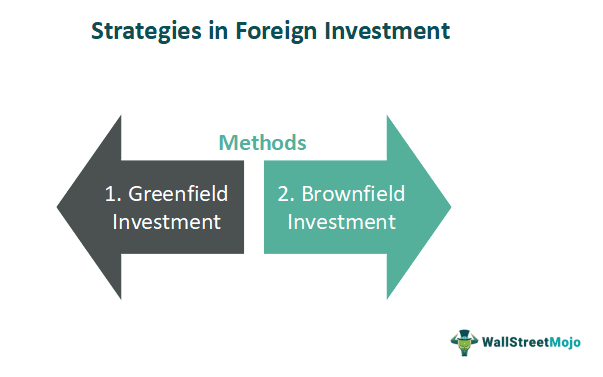

## Table of Contents

## What are international stocks and why should someone consider investing in them?

International stocks are shares of companies that are based outside of your home country. If you live in the United States, for example, international stocks would be shares of companies located in countries like Japan, Germany, or Brazil. These stocks can be bought and sold on foreign stock exchanges or through American Depository Receipts (ADRs), which are certificates issued by a U.S. bank that represent a specific number of shares in a foreign company.

Investing in international stocks can be a good idea because it helps you spread out your risk. When you only invest in companies from one country, your money is tied to how well that country's economy is doing. By investing in stocks from different countries, you can protect yourself if one country's economy has problems. Plus, it gives you a chance to take advantage of growth in other parts of the world. For example, some countries might have faster-growing economies or industries that are doing really well, which could mean bigger returns for your investments.

## What are the basic methods for a beginner to start investing in international stocks?

If you're new to investing and want to start with international stocks, one easy way is to use a brokerage account. Many online brokers let you buy stocks from other countries. You just need to open an account, deposit some money, and then you can search for and buy stocks from companies around the world. Some brokers might have extra fees for buying international stocks, so it's a good idea to check that before you start.

Another simple method is to invest in mutual funds or exchange-traded funds (ETFs) that focus on international markets. These funds pool money from many investors to buy a variety of stocks from different countries. This can be a good way to spread your risk because you're not putting all your money into one company. You can buy these funds through a broker or sometimes directly from the fund company.

Lastly, you might want to consider American Depository Receipts (ADRs). ADRs are an easy way for U.S. investors to own foreign stocks without dealing directly with foreign exchanges. They are traded on U.S. stock exchanges, so you can buy and sell them just like you would any other U.S. stock. This can be a good starting point if you want to invest in specific international companies but still keep things simple.

## How does one open a brokerage account that allows trading in international stocks?

To open a brokerage account that allows trading in international stocks, you first need to choose a broker that offers this service. Many online brokers like E*TRADE, Charles Schwab, and Fidelity provide access to international markets. Visit their website, look for the option to open an account, and follow the steps they provide. You'll need to fill out some personal information, like your name, address, and Social Security number, and you might need to answer some questions about your investment experience and goals. Once you've completed the application, you'll need to fund your account by transferring money from your bank.

After your account is set up and funded, you can start trading international stocks. Most brokers have a trading platform where you can search for and buy stocks from different countries. You might need to enable international trading in your account settings if it's not automatically available. Keep in mind that some brokers may charge extra fees for trading international stocks, so it's a good idea to check their fee schedule before you start. Once everything is ready, you can start exploring and investing in stocks from around the world.

## What are the key differences between investing in domestic versus international stocks?

When you invest in domestic stocks, you're buying shares of companies that are based in your own country. This can be easier because you're more familiar with the local economy, the companies, and the rules. You can also get information about these companies more easily since they report to your country's regulators. Plus, trading domestic stocks often means fewer fees and simpler transactions because you're using your country's stock exchanges.

On the other hand, investing in international stocks means you're buying shares of companies from other countries. This can be more complicated because you need to understand different economies, currencies, and regulations. There can be extra fees for trading on foreign exchanges, and you might face currency exchange risks if the value of the foreign currency changes compared to your own. However, international stocks can offer a chance to diversify your investments and take advantage of growth in other parts of the world.

Overall, the main differences come down to familiarity, ease of access, and potential risks and rewards. Domestic stocks might feel safer and simpler, while international stocks can open up more opportunities but also come with more challenges.

## What are the risks associated with investing in international stocks?

Investing in international stocks comes with some risks that you don't usually have with domestic stocks. One big risk is currency risk. When you buy stocks in another country, you need to use that country's money. If the value of that money goes down compared to your own country's money, your investment could lose value even if the stock itself does well. Another risk is political and economic instability. Different countries can have different rules and governments, and changes in these can affect companies and their stocks. For example, a new law might hurt a company's profits, or a country's economy might go into a recession.

There's also the risk of less information and transparency. Companies in other countries might not have to report as much information as companies in your home country. This can make it harder to know if a company is doing well or not. Plus, understanding another country's economy and market can be tricky because you might not be as familiar with it. All these things can make investing in international stocks riskier than sticking to stocks in your own country.

## How can currency exchange rates impact returns on international stock investments?

When you invest in international stocks, you need to buy them with the money used in that country. If the value of that country's money goes down compared to your own country's money, it can make your investment worth less when you change it back. For example, if you buy a stock in Japan with yen and the yen gets weaker against the dollar, you'll get fewer dollars back when you sell the stock and convert the yen to dollars. This can lower your returns, even if the stock itself did well.

On the other hand, if the foreign currency gets stronger against your own currency, it can boost your returns. If the yen gets stronger against the dollar, you'll get more dollars back when you convert your yen. This can make your investment more valuable, even if the stock's price stayed the same. So, changes in currency exchange rates can have a big impact on how much money you make or lose from international stocks.

## What are some strategies for diversifying an international stock portfolio?

One way to diversify an international stock portfolio is to invest in different countries and regions. Instead of putting all your money into stocks from just one or two countries, you can spread it out across many countries. This helps protect your money if one country's economy has problems. You can do this by buying stocks from different countries directly, or by investing in mutual funds or ETFs that focus on different regions of the world, like Europe, Asia, or Latin America.

Another strategy is to invest in different industries and sectors. Just like you wouldn't want all your money in one company, you don't want it all in one type of business. You can spread your money across sectors like technology, healthcare, energy, and consumer goods. This way, if one sector has a tough time, the others might do better and balance things out. You can find international stocks in all these sectors, and mutual funds or ETFs can help you easily invest in a mix of them.

Lastly, consider using a mix of developed and emerging markets. Developed markets, like the U.S., Japan, and Germany, are usually more stable but might grow slower. Emerging markets, like Brazil, India, and China, can be riskier but also offer higher potential returns because their economies are growing fast. By investing in both, you can balance the safety of developed markets with the growth potential of emerging markets. This mix can help you diversify your portfolio and possibly increase your returns over time.

## How does geopolitical risk affect international stock investments?

Geopolitical risk can have a big impact on your international stock investments. It means things like wars, political changes, or new laws in a country can affect how well companies do. If there's a war or a big political change, it might scare people away from investing in that country. This can make stock prices go down. Also, new laws or rules can change how much money a company makes. For example, if a country puts a new tax on a company, that company might make less money, and its stock price could drop.

These risks can make investing in international stocks more complicated. You need to keep an eye on what's happening in the countries where you invest. If you know about these risks, you can try to avoid big losses. But it's hard to predict everything, so sometimes you might still lose money because of something unexpected happening in another country. That's why it's important to spread your investments across different countries and industries, so one bad event doesn't hurt all your money.

## What are advanced trading strategies for experienced investors in international stocks?

One advanced strategy for experienced investors in international stocks is currency hedging. This means you try to protect your money from changes in currency values. You can do this by using financial tools like forward contracts or currency ETFs. These tools can help you lock in a certain exchange rate for the future, so if the foreign currency gets weaker, you won't lose as much money. This can be a bit complicated, but it can help you manage the risk of currency changes and possibly make more money from your investments.

Another strategy is using options and futures to trade international stocks. Options give you the right to buy or sell a stock at a certain price in the future, and futures are agreements to buy or sell a stock at a set price on a set date. These tools can help you make money if you think a stock's price will go up or down. They can also help you protect your investments from big drops in price. But they can be risky and hard to understand, so you need to know what you're doing before you start using them.

Lastly, experienced investors might use sector rotation to take advantage of trends in different countries. This means you move your money from one sector to another based on what's happening in the economy. For example, if you think technology stocks in a certain country will do well because of new laws or growth, you might put more money into those stocks. This strategy needs a lot of research and understanding of different markets, but it can help you make more money if you get it right.

## How can one use ETFs and mutual funds to gain exposure to international markets?

One easy way to invest in international markets is by using ETFs, which stands for exchange-traded funds. ETFs are like baskets of stocks that you can buy and sell just like a single stock. There are ETFs that focus on different countries or regions, like Europe or Asia, so you can pick the ones that fit your investment goals. For example, if you want to invest in Japan, you can buy an [ETF](/wiki/etf-trading-strategies) that holds stocks of many Japanese companies. This way, you don't have to pick individual stocks yourself, and you can spread your money across many companies at once, which can lower your risk.

Mutual funds are another way to gain exposure to international markets. Like ETFs, mutual funds pool money from many investors to buy a bunch of stocks. There are mutual funds that focus on international stocks, and they can be a good choice if you want a professional to manage your investments. A fund manager picks the stocks and tries to make the best choices for the fund. This can be helpful if you don't have the time or knowledge to pick stocks yourself. Just remember that mutual funds might have higher fees than ETFs, so it's good to check the costs before you invest.

## What are the tax implications of investing in international stocks?

When you invest in international stocks, you need to think about taxes. If you make money from these stocks, you might have to pay taxes in both the country where the company is based and your own country. This is called double taxation. But many countries have agreements to help avoid this. These agreements, called tax treaties, can lower the amount of taxes you pay or let you claim a credit in your home country for taxes paid abroad. It's a good idea to talk to a tax professional to understand how these rules apply to you.

Another thing to know is that different countries have different rules about taxes on dividends and capital gains. Dividends are payments companies make to shareholders, and capital gains are the profits you make when you sell a stock for more than you paid for it. Some countries might take a part of your dividends as tax before you even get them, and the tax rate on capital gains can be different from what you're used to in your home country. Keeping track of these rules can be tricky, so it's helpful to get advice from someone who knows about international taxes.

## How can one use financial analysis tools to evaluate international stock performance?

To evaluate the performance of international stocks, you can use financial analysis tools like stock screeners and financial websites. These tools let you look at important numbers about a company, like its earnings, how much it's growing, and how much it's worth compared to other companies. You can also see charts that show how the stock's price has changed over time. This helps you understand if the stock is doing well or not. Some popular tools include Bloomberg Terminal, Yahoo Finance, and Morningstar, which give you a lot of information to help you make smart choices about which international stocks to buy.

Another way to use financial analysis tools is by looking at financial ratios. These are numbers that help you compare different companies. For example, the price-to-earnings (P/E) ratio tells you how much you're paying for a company's earnings. If a company's P/E ratio is lower than others in its industry, it might be a good deal. You can also look at the debt-to-equity ratio to see how much debt a company has compared to its value. Tools like Finviz and Reuters provide these ratios and other data, making it easier for you to compare international stocks and decide which ones might be good investments.

## References & Further Reading

[1]: Clenow, A. (2013). ["Following the Trend: Diversified Managed Futures Trading."](https://www.amazon.com/Following-Trend-Diversified-Managed-Futures/dp/1118410858) Wiley.

[2]: Sweeney, R. J. (1988). ["Some New International Evidence on Market Efficiency."](https://www.researchgate.net/publication/227406088_Some_New_Filter_Rule_Tests_Methods_and_Results) *Journal of Financial Economics*, 21(2), 129-152.

[3]: Pojarliev, M., & Levich, R. M. (2012). ["A New Look at Currency Investing."](https://rpc.cfainstitute.org/-/media/documents/book/rf-publication/2012/rf-v2012-n4-1-pdf.pdf) *Financial Analysts Journal*, 68(2), 74-96.

[4]: Froot, K. A., & Thaler, R. H. (1990). ["Foreign Exchange."](https://www.aeaweb.org/articles?id=10.1257/jep.4.3.179) *The Journal of Economic Perspectives*, 4(3), 179-192.

[5]: Menkhoff, L. (2010). ["The use of technical analysis by fund managers: International evidence."](https://www.sciencedirect.com/science/article/pii/S0378426610001755) *Review of Finance*, 14(1), 39-73.