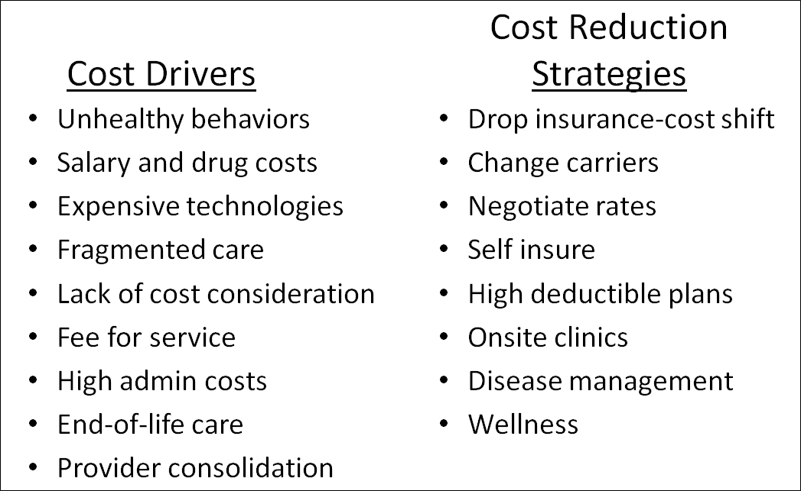

## Table of Contents

## What are the main factors contributing to high healthcare costs in the U.S.?

High healthcare costs in the U.S. are influenced by several key factors. One major reason is the high price of medical services and treatments. Hospitals and doctors charge a lot for their services, and the cost of medications and new technology is also very high. Another factor is the way healthcare is paid for in the U.S. Many people have health insurance through their jobs, but these plans can be expensive, and not everyone has access to them. This means that some people have to pay a lot out of their own pockets for healthcare.

Another important factor is the way the healthcare system is set up. There are many different providers and insurance companies, which can make things complicated and expensive. Administrative costs, like the money spent on paperwork and managing insurance claims, add a lot to the overall cost of healthcare. Also, the U.S. has an aging population, and older people often need more medical care, which increases costs. Finally, there is a lot of waste in the system, like unnecessary tests and treatments, which also drives up the price of healthcare.

## How does the U.S. healthcare system differ from other countries in terms of cost management?

The U.S. healthcare system is different from other countries because it costs a lot more. In many other countries, the government plays a bigger role in managing healthcare costs. For example, in countries like Canada and the UK, the government runs a single-payer system where it pays for most healthcare services. This helps keep costs down because the government can negotiate lower prices with hospitals and drug companies. In the U.S., there are many different insurance companies and providers, which makes things more complicated and expensive. The U.S. also spends a lot on administrative costs, like managing insurance claims and paperwork, which adds to the overall cost of healthcare.

Another big difference is how healthcare is paid for. In the U.S., many people get health insurance through their jobs, but these plans can be expensive and not everyone has access to them. This means that some people have to pay a lot out of their own pockets for healthcare. In contrast, many other countries have universal healthcare systems where everyone is covered, and people pay less out of pocket. These systems often use taxes to fund healthcare, which spreads the cost across the whole population. This approach can help keep costs lower for individuals and make healthcare more affordable for everyone.

## What role does health insurance play in managing healthcare costs for individuals?

Health insurance helps people manage healthcare costs by paying for part of their medical bills. When someone has health insurance, they pay a monthly fee called a premium. In return, the insurance company helps cover the cost of doctor visits, hospital stays, and medications. This means that people don't have to pay the full price out of their own pockets, which can make healthcare more affordable. For example, if a person needs surgery, their insurance might pay for most of it, and they only have to pay a small amount called a copay or deductible.

However, health insurance can also be expensive, and not everyone can afford it. Some people have insurance through their jobs, but the cost of these plans can be high, and not all jobs offer insurance. People without insurance have to pay for all their healthcare costs themselves, which can be very expensive. This is why many people in the U.S. struggle with healthcare costs. Even with insurance, people might still have to pay a lot out of pocket, especially if they need a lot of medical care. This is why it's important for people to understand their insurance plans and choose one that fits their needs and budget.

## Can preventive care help in reducing overall healthcare expenses? If so, how?

Preventive care can help reduce overall healthcare expenses by catching health problems early, before they become serious and expensive to treat. When people go for regular check-ups and screenings, doctors can find issues like high blood pressure or early signs of cancer. Treating these conditions early is usually cheaper and easier than waiting until they get worse. For example, if someone finds out they have high cholesterol during a routine visit, they can start taking medicine and making lifestyle changes to manage it, which is much less costly than dealing with a heart attack later on.

Also, preventive care helps people stay healthy and avoid getting sick in the first place. Vaccines, healthy eating, exercise, and not smoking are all part of preventive care. When people take good care of themselves, they are less likely to need expensive medical treatments. For instance, getting a flu shot can prevent someone from getting the flu, which means they won't need to go to the doctor or take time off work. By focusing on prevention, the overall cost of healthcare can go down because fewer people will need expensive treatments and hospital stays.

## What are some common strategies used by healthcare providers to control costs?

Healthcare providers use several strategies to control costs. One common way is by using electronic health records (EHRs). EHRs help doctors keep track of patient information easily and reduce the need for paper records, which saves money. Another strategy is to focus on preventive care. By helping patients stay healthy and catch problems early, providers can avoid the high costs of treating serious illnesses later on. Providers also work on improving how they do things, like using better systems to manage appointments and reduce wait times, which can save money and make patients happier.

Another strategy is to negotiate better prices with drug companies and medical suppliers. By getting lower prices for medications and equipment, providers can reduce their costs. Some providers also join together in networks or groups to share resources and save money. For example, they might share the cost of expensive equipment or work together to buy supplies in bulk. This can help them keep their costs down and provide better care to patients.

## How do government policies and regulations impact healthcare cost management?

Government policies and regulations play a big role in managing healthcare costs. One way they do this is by setting rules for how much insurance companies can charge for premiums. This helps make sure that people don't have to pay too much for health insurance. The government also decides what kinds of treatments and medications insurance has to cover. By making sure that important treatments are covered, the government helps people get the care they need without having to pay a lot out of pocket.

Another way government policies affect healthcare costs is through programs like Medicare and Medicaid. These programs provide health insurance to people who are older, disabled, or have low incomes. By covering these groups, the government helps them get healthcare without spending too much money. The government also sets rules for how much hospitals and doctors can charge for their services under these programs, which helps keep costs down. Overall, government policies and regulations are important for making healthcare more affordable for everyone.

## What is the impact of pharmaceutical pricing on overall healthcare costs?

Pharmaceutical pricing has a big impact on overall healthcare costs. When drug companies set high prices for their medicines, it makes healthcare more expensive for everyone. People with health insurance might have to pay more in copays or deductibles, and those without insurance have to pay the full price themselves. This can make it hard for people to afford the medications they need, which can lead to bigger health problems and even more costs later on.

Governments and insurance companies try to manage these costs by negotiating with drug companies for lower prices. But even with these efforts, pharmaceutical prices can still drive up the overall cost of healthcare. For example, new and expensive drugs for conditions like cancer or rare diseases can add a lot to the total cost of care. If these high-priced medications become more common, it can make healthcare costs go up for everyone, even if they don't need those specific drugs.

## How can technology and innovation be utilized to reduce healthcare costs?

Technology and innovation can help lower healthcare costs by making things more efficient. For example, electronic health records (EHRs) let doctors keep all patient information in one place that's easy to access. This means less time spent on paperwork and fewer mistakes, which saves money. Telemedicine is another way technology helps. It lets people see doctors over video calls, so they don't have to travel to a clinic or hospital. This can save both time and money for patients and healthcare providers.

Innovation in medical devices and treatments can also reduce costs. New technology can make surgeries quicker and less invasive, which means patients recover faster and spend less time in the hospital. This cuts down on the costs of long hospital stays. Also, new drugs and treatments can be more effective, so people might need fewer visits to the doctor or less medicine overall. By using technology and innovation smartly, healthcare can become more affordable for everyone.

## What are the benefits and limitations of value-based care in managing healthcare expenses?

Value-based care is a way of managing healthcare that focuses on keeping people healthy and giving them good care, not just treating them when they're sick. The main benefit of this approach is that it can help lower costs. When doctors and hospitals are paid based on how well they keep patients healthy, they have a reason to focus on prevention and early treatment. This can mean fewer expensive hospital stays and treatments. For example, if a doctor helps a patient manage their diabetes well, that patient is less likely to need emergency care later on, which saves money.

However, value-based care also has some limitations. One big challenge is that it can be hard to measure how well a doctor or hospital is doing. It's not always easy to tell if someone is healthier because of the care they got, or because of other things in their life. Also, setting up a value-based care system can be complicated and expensive at first. Doctors and hospitals might need new systems and training to track how well they're doing, which can take time and money. So while value-based care has a lot of potential to lower costs, it also has some hurdles to overcome.

## How do chronic diseases affect healthcare costs, and what management strategies are effective?

Chronic diseases like diabetes, heart disease, and cancer have a big impact on healthcare costs. These conditions often need a lot of medical care over a long time. People with chronic diseases might need to see the doctor often, take medicines every day, and sometimes go to the hospital. All of this adds up and makes healthcare more expensive. For example, someone with diabetes might need regular check-ups, insulin, and other treatments, which can cost a lot of money over time. When many people in a country have chronic diseases, it can make the overall cost of healthcare go up a lot.

There are some good ways to manage chronic diseases and help keep costs down. One important strategy is prevention. By helping people eat healthy, exercise, and not smoke, doctors can help prevent some chronic diseases from happening in the first place. Another strategy is early detection and treatment. If doctors can find a chronic disease early, they can start treating it before it gets worse and more expensive. For example, regular check-ups can help catch high blood pressure early, so it can be managed with medicine and lifestyle changes. Also, helping people manage their chronic diseases at home can save money. By teaching patients how to take their medicines and check their health at home, they might not need to go to the doctor or hospital as often.

## What role do health savings accounts (HSAs) and flexible spending accounts (FSAs) play in managing healthcare costs?

Health savings accounts (HSAs) and flexible spending accounts (FSAs) help people manage healthcare costs by letting them save money for medical expenses before they have to pay taxes on it. With an HSA, people can put money into an account that they can use to pay for things like doctor visits, medicines, and other medical bills. The money in an HSA grows without being taxed, and when you take it out to pay for healthcare, you don't have to pay taxes on it either. This can help people save money on their healthcare costs because they're using money that hasn't been taxed.

FSAs work a bit differently but also help with healthcare costs. With an FSA, people can set aside money from their paycheck before taxes to use for medical expenses. You have to use the money in an FSA within a certain time, usually by the end of the year, or you might lose it. But like HSAs, FSAs let you pay for healthcare with money that hasn't been taxed, which can make it more affordable. Both HSAs and FSAs can help people plan for healthcare costs and make them more manageable.

## How can data analytics and predictive modeling be used to forecast and manage healthcare costs more effectively?

Data analytics and predictive modeling help doctors and hospitals guess what might happen with healthcare costs in the future. They do this by looking at a lot of information from the past, like how much different treatments cost and how often people need them. By studying this data, they can find patterns and make guesses about what will happen next. For example, if they see that more people are getting a certain illness, they can predict that the costs for treating that illness will go up. This helps them plan better and find ways to save money, like focusing on preventing that illness from happening in the first place.

Using these tools also helps healthcare providers manage costs more effectively. They can look at data to see which treatments work best and cost less. For instance, they might find out that one medicine is cheaper and just as good as another, so they can use that one more often. Predictive modeling can also help them figure out which patients are more likely to need expensive care in the future. By knowing this, they can give those patients extra help and attention to keep them healthy, which can save money in the long run. Overall, data analytics and predictive modeling make it easier to see where costs are coming from and how to control them better.

## Is Algorithmic Trading a Financial Frontier for Healthcare?

Algorithmic trading, long a staple in financial markets, uses computer algorithms to conduct high-speed and complex decision-making. It's characterized by the ability to rapidly analyze market data, identify trading opportunities, and execute orders—all with minimal human intervention. This technology is increasingly regarded as a transformative tool in healthcare, given its potential to optimize resource allocation and mitigate financial waste.

Applying algorithmic principles to healthcare finance involves several strategies. Firstly, healthcare organizations can harness algorithms to automate routine processes. Automation reduces manual errors, enhances billing accuracy, and streamlines scheduling and staffing, leading to significant cost savings. For instance, automated inventory management systems can predict drug and supply needs, minimizing both shortages and surpluses.

Predictive analytics, another fundamental aspect of [algorithmic trading](/wiki/algorithmic-trading), can foresee cost trends in healthcare. By analyzing historical data, algorithms can project future expenditures, helping organizations anticipate budget overruns and allocate resources more effectively. For example, predictive models might analyze patient admission rates to optimize staffing levels, thus ensuring cost-effective manpower deployment.

Mathematically, this efficiency can be represented as:

$$
\text{Cost Savings} = \text{Optimized Resource Allocation} - \text{Human Error and Waste}
$$

Moreover, data-driven decision-making enhances financial efficiency by identifying areas of excess spending. For instance, algorithms can scrutinize claim submissions and reimbursement patterns, highlighting anomalies that warrant review. These insights enable healthcare administrators to renegotiate supplier contracts and revamp pricing strategies.

Python, widely used for algorithm development due to its robust libraries like NumPy and Pandas, can be instrumental in implementing these solutions. A simple example of automating a recurrent task, such as calculating daily drug requisites, might look like this:

```python
import pandas as pd

# Assume df is a DataFrame containing past consumption data
df = pd.read_csv('data.csv')

# Calculating average demand
average_demand = df['daily_consumption'].mean()

# Predicting future demand
predicted_demand = average_demand * 1.05  # assuming a 5% increase

print(f"Predicted drug demand for tomorrow: {predicted_demand}")
```

While promising, adapting algorithmic trading approaches for healthcare isn't without challenges. It requires robust data governance frameworks, stakeholder collaboration, and thorough validation of predictive models to ensure accuracy and reliability.

Overall, the adaptation of algorithmic trading in healthcare finance can potentially improve cost management, fostering an efficient and sustainable system while maintaining the highest quality of patient care.

## References & Further Reading

[1]: Himmelstein, D. U., Campbell, T., & Woolhandler, S. (2020). ["Health Care Administrative Costs in the United States and Canada, 2017."](https://pubmed.ncbi.nlm.nih.gov/31905376/) JAMA, 323(8), 741–749.

[2]: Bodenheimer, T., & Fernandez, A. (2005). ["High and Rising Health Care Costs. Part 4: Can Costs Be Controlled While Preserving Quality?"](https://pubmed.ncbi.nlm.nih.gov/15998752/) Annals of Internal Medicine, 143(1), 26-31.

[3]: Bentivoglio, M., A.J., Khosla, R., & Palatnik, A. (2019). ["Interurban Healthcare Algorithmic Trading: Leveraging Financial Market Analogy in Healthcare."](https://www.researchgate.net/publication/335697689_Interurban_Healthcare_Algorithmic_Trading_Leveraging_Financial_Market_Analogy_in_Healthcare) International Journal of Healthcare Management, 12(2), 101-109.

[4]: Bai, G., Anderson, G. F. (2015). ["Extreme Markup: The Fifty US Hospitals With the Highest Charge-To-Cost Ratios."](https://pubmed.ncbi.nlm.nih.gov/26056196/) Health Affairs, 34(6), 922–928.

[5]: Song, Z., Rose, S., Safran, D. G., Landon, B. E., Day, M. P., & Chernew, M. E. (2014). ["Changes in Health Care Spending and Quality 4 Years into Global Payment."](https://pubmed.ncbi.nlm.nih.gov/25354104/) New England Journal of Medicine, 371, 1704-1714. 

[6]: CMS Office of the Actuary. (2019). ["National Health Expenditure Projections 2019-2028."](https://www.cms.gov/files/document/national-health-expenditure-projections-2019-28.pdf) Centers for Medicare & Medicaid Services.